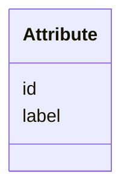

# Class: Attribute 


_A domain, measurement, attribute, property, or any descriptor for additional properties to be added to an entity. Where available, please use OBO Foundry ontologies or other controlled vocabularies for attributes; the label should be the term name from the ontology and the id should be the fully-qualified CURIE._


URI: [lambdaber:Attribute](https://w3id.org/lambda-ber-schema/Attribute)





<!-- no inheritance hierarchy -->


## Slots

| Name | Cardinality and Range | Description | Inheritance |
| ---  | --- | --- | --- |
| [id](id.md) | 0..1 _recommended_ <br/> [String](String.md) | A CURIE for the attribute, should one exist | direct |
| [label](label.md) | 1 <br/> [String](String.md) | Text string to describe the attribute | direct |


## Usages

| used by | used in | type | used |
| ---  | --- | --- | --- |
| [AttributeValue](AttributeValue.md) | [attribute](attribute.md) | range | [Attribute](Attribute.md) |
| [QuantityValue](QuantityValue.md) | [attribute](attribute.md) | range | [Attribute](Attribute.md) |
| [TextValue](TextValue.md) | [attribute](attribute.md) | range | [Attribute](Attribute.md) |
| [DateTimeValue](DateTimeValue.md) | [attribute](attribute.md) | range | [Attribute](Attribute.md) |


## Identifier and Mapping Information


### Schema Source


* from schema: https://w3id.org/lambda-ber-schema/


## Mappings

| Mapping Type | Mapped Value |
| ---  | ---  |
| self | lambdaber:Attribute |
| native | lambdaber:Attribute |


## LinkML Source

<!-- TODO: investigate https://stackoverflow.com/questions/37606292/how-to-create-tabbed-code-blocks-in-mkdocs-or-sphinx -->

### Direct

<details>
```yaml
name: Attribute
description: A domain, measurement, attribute, property, or any descriptor for additional
  properties to be added to an entity. Where available, please use OBO Foundry ontologies
  or other controlled vocabularies for attributes; the label should be the term name
  from the ontology and the id should be the fully-qualified CURIE.
from_schema: https://w3id.org/lambda-ber-schema/
attributes:
  id:
    name: id
    description: A CURIE for the attribute, should one exist. Where available, please
      use OBO Foundry ontologies or other controlled vocabularies for labelling attributes;
      the id should be the term ID from the ontology.
    from_schema: https://w3id.org/lambda-ber-schema/types
    domain_of:
    - NamedThing
    - Attribute
    recommended: true
  label:
    name: label
    description: Text string to describe the attribute. Where available, please use
      OBO Foundry ontologies or other controlled vocabularies for labelling attributes;
      the label should be the term name from the ontology.
    from_schema: https://w3id.org/lambda-ber-schema/types
    aliases:
    - name
    - title
    domain_of:
    - OntologyTerm
    - Attribute
    required: true

```
</details>

### Induced

<details>
```yaml
name: Attribute
description: A domain, measurement, attribute, property, or any descriptor for additional
  properties to be added to an entity. Where available, please use OBO Foundry ontologies
  or other controlled vocabularies for attributes; the label should be the term name
  from the ontology and the id should be the fully-qualified CURIE.
from_schema: https://w3id.org/lambda-ber-schema/
attributes:
  id:
    name: id
    description: A CURIE for the attribute, should one exist. Where available, please
      use OBO Foundry ontologies or other controlled vocabularies for labelling attributes;
      the id should be the term ID from the ontology.
    from_schema: https://w3id.org/lambda-ber-schema/types
    alias: id
    owner: Attribute
    domain_of:
    - NamedThing
    - Attribute
    range: string
    recommended: true
  label:
    name: label
    description: Text string to describe the attribute. Where available, please use
      OBO Foundry ontologies or other controlled vocabularies for labelling attributes;
      the label should be the term name from the ontology.
    from_schema: https://w3id.org/lambda-ber-schema/types
    aliases:
    - name
    - title
    alias: label
    owner: Attribute
    domain_of:
    - OntologyTerm
    - Attribute
    range: string
    required: true

```
</details>