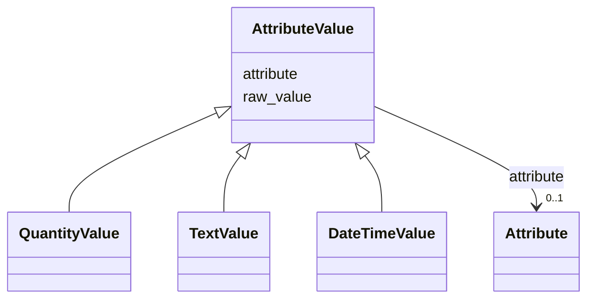

# Class: AttributeValue 


_The value for any attribute of an entity. This object can hold both the un-normalized atomic value and the structured value._


* __NOTE__: this is an abstract class and should not be instantiated directly


URI: [nmdc:AttributeValue](https://w3id.org/nmdc/AttributeValue)





## Inheritance
* **AttributeValue**
    * [QuantityValue](QuantityValue.md)
    * [TextValue](TextValue.md)
    * [DateTimeValue](DateTimeValue.md)


## Slots

| Name | Cardinality and Range | Description | Inheritance |
| ---  | --- | --- | --- |
| [attribute](attribute.md) | 0..1 <br/> [Attribute](Attribute.md) | The attribute being represented | direct |
| [raw_value](raw_value.md) | 0..1 <br/> [String](String.md) | Unnormalized atomic string representation, suggested syntax {number} {unit} | direct |


## Identifier and Mapping Information


### Schema Source


* from schema: https://w3id.org/lambda-ber-schema/


## Mappings

| Mapping Type | Mapped Value |
| ---  | ---  |
| self | nmdc:AttributeValue |
| native | lambdaber:AttributeValue |


## LinkML Source

<!-- TODO: investigate https://stackoverflow.com/questions/37606292/how-to-create-tabbed-code-blocks-in-mkdocs-or-sphinx -->

### Direct

<details>
```yaml
name: AttributeValue
description: The value for any attribute of an entity. This object can hold both the
  un-normalized atomic value and the structured value.
from_schema: https://w3id.org/lambda-ber-schema/
abstract: true
attributes:
  attribute:
    name: attribute
    description: The attribute being represented.
    from_schema: https://w3id.org/lambda-ber-schema/types
    domain_of:
    - AttributeValue
    range: Attribute
  raw_value:
    name: raw_value
    description: Unnormalized atomic string representation, suggested syntax {number}
      {unit}
    from_schema: https://w3id.org/lambda-ber-schema/types
    domain_of:
    - AttributeValue
    range: string
class_uri: nmdc:AttributeValue

```
</details>

### Induced

<details>
```yaml
name: AttributeValue
description: The value for any attribute of an entity. This object can hold both the
  un-normalized atomic value and the structured value.
from_schema: https://w3id.org/lambda-ber-schema/
abstract: true
attributes:
  attribute:
    name: attribute
    description: The attribute being represented.
    from_schema: https://w3id.org/lambda-ber-schema/types
    alias: attribute
    owner: AttributeValue
    domain_of:
    - AttributeValue
    range: Attribute
  raw_value:
    name: raw_value
    description: Unnormalized atomic string representation, suggested syntax {number}
      {unit}
    from_schema: https://w3id.org/lambda-ber-schema/types
    alias: raw_value
    owner: AttributeValue
    domain_of:
    - AttributeValue
    range: string
class_uri: nmdc:AttributeValue

```
</details>