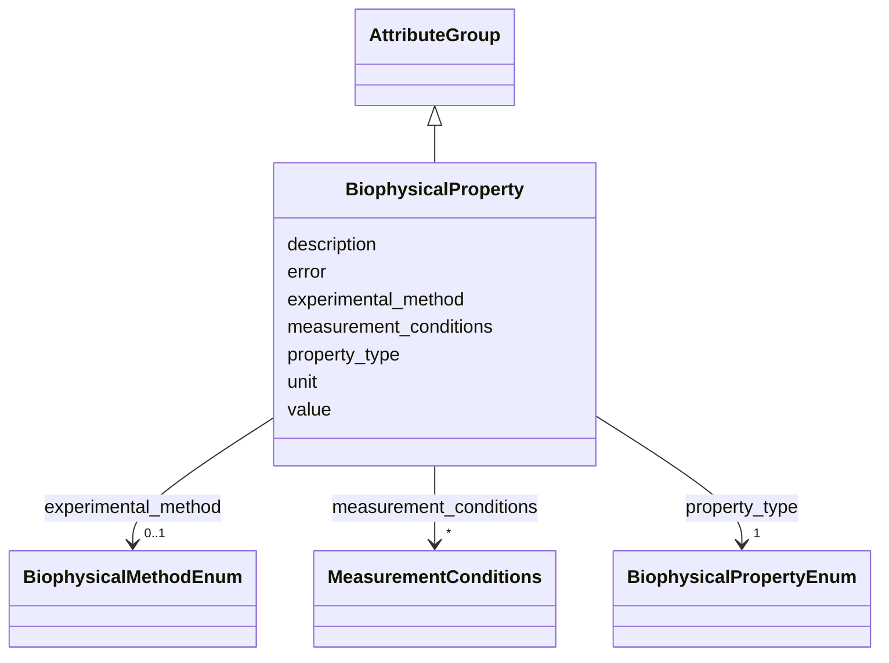

# Class: BiophysicalProperty 


_Measured or calculated biophysical properties_


URI: [lambdaber:BiophysicalProperty](https://w3id.org/lambda-ber-schema/BiophysicalProperty)





## Inheritance
* [AttributeGroup](AttributeGroup.md)
    * **BiophysicalProperty**


## Slots

| Name | Cardinality and Range | Description | Inheritance |
| ---  | --- | --- | --- |
| [property_type](property_type.md) | 1 <br/> [BiophysicalPropertyEnum](BiophysicalPropertyEnum.md) | Type of biophysical property | direct |
| [value](value.md) | 1 <br/> [Float](Float.md) | Numerical value of the property | direct |
| [unit](unit.md) | 1 <br/> [String](String.md) | Unit of measurement | direct |
| [error](error.md) | 0..1 <br/> [Float](Float.md) | Experimental error or uncertainty | direct |
| [measurement_conditions](measurement_conditions.md) | * <br/> [MeasurementConditions](MeasurementConditions.md) | Conditions under which measurement was made | direct |
| [experimental_method](experimental_method.md) | 0..1 <br/> [BiophysicalMethodEnum](BiophysicalMethodEnum.md) | Method used for measurement | direct |
| [description](description.md) | 0..1 <br/> [String](String.md) |  | [AttributeGroup](AttributeGroup.md) |


## Usages

| used by | used in | type | used |
| ---  | --- | --- | --- |
| [Sample](Sample.md) | [biophysical_properties](biophysical_properties.md) | range | [BiophysicalProperty](BiophysicalProperty.md) |
| [AggregatedProteinView](AggregatedProteinView.md) | [biophysical_properties](biophysical_properties.md) | range | [BiophysicalProperty](BiophysicalProperty.md) |


## Identifier and Mapping Information


### Schema Source


* from schema: https://w3id.org/lambda-ber-schema/


## Mappings

| Mapping Type | Mapped Value |
| ---  | ---  |
| self | lambdaber:BiophysicalProperty |
| native | lambdaber:BiophysicalProperty |


## LinkML Source

<!-- TODO: investigate https://stackoverflow.com/questions/37606292/how-to-create-tabbed-code-blocks-in-mkdocs-or-sphinx -->

### Direct

<details>
```yaml
name: BiophysicalProperty
description: Measured or calculated biophysical properties
from_schema: https://w3id.org/lambda-ber-schema/
is_a: AttributeGroup
attributes:
  property_type:
    name: property_type
    description: Type of biophysical property
    from_schema: https://w3id.org/lambda-ber-schema/functional_annotation
    rank: 1000
    domain_of:
    - BiophysicalProperty
    range: BiophysicalPropertyEnum
    required: true
  value:
    name: value
    description: Numerical value of the property
    from_schema: https://w3id.org/lambda-ber-schema/functional_annotation
    domain_of:
    - TextValue
    - DateTimeValue
    - BiophysicalProperty
    range: float
    required: true
  unit:
    name: unit
    description: Unit of measurement
    from_schema: https://w3id.org/lambda-ber-schema/functional_annotation
    domain_of:
    - QuantityValue
    - BiophysicalProperty
    required: true
  error:
    name: error
    description: Experimental error or uncertainty
    from_schema: https://w3id.org/lambda-ber-schema/functional_annotation
    rank: 1000
    domain_of:
    - BiophysicalProperty
    range: float
  measurement_conditions:
    name: measurement_conditions
    description: Conditions under which measurement was made. If multiple sets of
      conditions were used, this will represent that the same values were obtained
      under different conditions. If values differ under different conditions, separate
      BiophysicalProperty instances should be created.
    from_schema: https://w3id.org/lambda-ber-schema/functional_annotation
    rank: 1000
    domain_of:
    - BiophysicalProperty
    range: MeasurementConditions
    multivalued: true
    inlined: true
    inlined_as_list: true
  experimental_method:
    name: experimental_method
    description: Method used for measurement
    from_schema: https://w3id.org/lambda-ber-schema/functional_annotation
    domain_of:
    - ExperimentRun
    - BiophysicalProperty
    range: BiophysicalMethodEnum

```
</details>

### Induced

<details>
```yaml
name: BiophysicalProperty
description: Measured or calculated biophysical properties
from_schema: https://w3id.org/lambda-ber-schema/
is_a: AttributeGroup
attributes:
  property_type:
    name: property_type
    description: Type of biophysical property
    from_schema: https://w3id.org/lambda-ber-schema/functional_annotation
    rank: 1000
    alias: property_type
    owner: BiophysicalProperty
    domain_of:
    - BiophysicalProperty
    range: BiophysicalPropertyEnum
    required: true
  value:
    name: value
    description: Numerical value of the property
    from_schema: https://w3id.org/lambda-ber-schema/functional_annotation
    alias: value
    owner: BiophysicalProperty
    domain_of:
    - TextValue
    - DateTimeValue
    - BiophysicalProperty
    range: float
    required: true
  unit:
    name: unit
    description: Unit of measurement
    from_schema: https://w3id.org/lambda-ber-schema/functional_annotation
    alias: unit
    owner: BiophysicalProperty
    domain_of:
    - QuantityValue
    - BiophysicalProperty
    range: string
    required: true
  error:
    name: error
    description: Experimental error or uncertainty
    from_schema: https://w3id.org/lambda-ber-schema/functional_annotation
    rank: 1000
    alias: error
    owner: BiophysicalProperty
    domain_of:
    - BiophysicalProperty
    range: float
  measurement_conditions:
    name: measurement_conditions
    description: Conditions under which measurement was made. If multiple sets of
      conditions were used, this will represent that the same values were obtained
      under different conditions. If values differ under different conditions, separate
      BiophysicalProperty instances should be created.
    from_schema: https://w3id.org/lambda-ber-schema/functional_annotation
    rank: 1000
    alias: measurement_conditions
    owner: BiophysicalProperty
    domain_of:
    - BiophysicalProperty
    range: MeasurementConditions
    multivalued: true
    inlined: true
    inlined_as_list: true
  experimental_method:
    name: experimental_method
    description: Method used for measurement
    from_schema: https://w3id.org/lambda-ber-schema/functional_annotation
    alias: experimental_method
    owner: BiophysicalProperty
    domain_of:
    - ExperimentRun
    - BiophysicalProperty
    range: BiophysicalMethodEnum
  description:
    name: description
    from_schema: https://w3id.org/lambda-ber-schema/
    alias: description
    owner: BiophysicalProperty
    domain_of:
    - NamedThing
    - AttributeGroup
    range: string

```
</details>