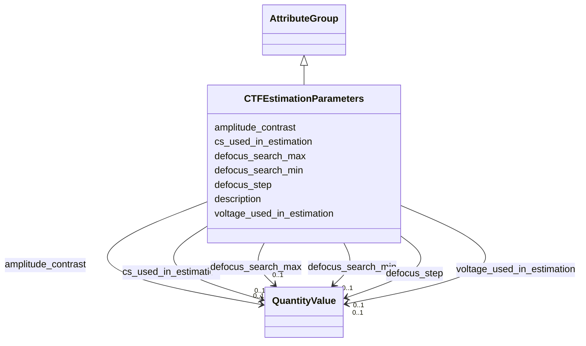

# Class: CTFEstimationParameters 


_Parameters specific to CTF estimation workflows_


URI: [lambdaber:CTFEstimationParameters](https://w3id.org/lambda-ber-schema/CTFEstimationParameters)





## Inheritance
* [AttributeGroup](AttributeGroup.md)
    * **CTFEstimationParameters**


## Slots

| Name | Cardinality and Range | Description | Inheritance |
| ---  | --- | --- | --- |
| [defocus_search_min](defocus_search_min.md) | 0..1 <br/> [QuantityValue](QuantityValue.md) | Minimum defocus search range, typically specified in micrometers | direct |
| [defocus_search_max](defocus_search_max.md) | 0..1 <br/> [QuantityValue](QuantityValue.md) | Maximum defocus search range, typically specified in micrometers | direct |
| [defocus_step](defocus_step.md) | 0..1 <br/> [QuantityValue](QuantityValue.md) | Defocus search step, typically specified in micrometers | direct |
| [amplitude_contrast](amplitude_contrast.md) | 0..1 <br/> [QuantityValue](QuantityValue.md) | Amplitude contrast value | direct |
| [cs_used_in_estimation](cs_used_in_estimation.md) | 0..1 <br/> [QuantityValue](QuantityValue.md) | Spherical aberration (Cs) value used during CTF estimation, typically specifi... | direct |
| [voltage_used_in_estimation](voltage_used_in_estimation.md) | 0..1 <br/> [QuantityValue](QuantityValue.md) | Accelerating voltage value used during CTF estimation, typically specified in... | direct |
| [description](description.md) | 0..1 <br/> [String](String.md) |  | [AttributeGroup](AttributeGroup.md) |


## Usages

| used by | used in | type | used |
| ---  | --- | --- | --- |
| [WorkflowRun](WorkflowRun.md) | [ctf_estimation_params](ctf_estimation_params.md) | range | [CTFEstimationParameters](CTFEstimationParameters.md) |


## Identifier and Mapping Information


### Schema Source


* from schema: https://w3id.org/lambda-ber-schema/


## Mappings

| Mapping Type | Mapped Value |
| ---  | ---  |
| self | lambdaber:CTFEstimationParameters |
| native | lambdaber:CTFEstimationParameters |


## LinkML Source

<!-- TODO: investigate https://stackoverflow.com/questions/37606292/how-to-create-tabbed-code-blocks-in-mkdocs-or-sphinx -->

### Direct

<details>
```yaml
name: CTFEstimationParameters
description: Parameters specific to CTF estimation workflows
from_schema: https://w3id.org/lambda-ber-schema/
is_a: AttributeGroup
attributes:
  defocus_search_min:
    name: defocus_search_min
    description: Minimum defocus search range, typically specified in micrometers.
      Data providers may specify alternative units by including the unit in the QuantityValue.
    from_schema: https://w3id.org/lambda-ber-schema/
    rank: 1000
    domain_of:
    - CTFEstimationParameters
    range: QuantityValue
    inlined: true
  defocus_search_max:
    name: defocus_search_max
    description: Maximum defocus search range, typically specified in micrometers.
      Data providers may specify alternative units by including the unit in the QuantityValue.
    from_schema: https://w3id.org/lambda-ber-schema/
    rank: 1000
    domain_of:
    - CTFEstimationParameters
    range: QuantityValue
    inlined: true
  defocus_step:
    name: defocus_step
    description: Defocus search step, typically specified in micrometers. Data providers
      may specify alternative units by including the unit in the QuantityValue.
    from_schema: https://w3id.org/lambda-ber-schema/
    rank: 1000
    domain_of:
    - CTFEstimationParameters
    range: QuantityValue
    inlined: true
  amplitude_contrast:
    name: amplitude_contrast
    description: Amplitude contrast value
    from_schema: https://w3id.org/lambda-ber-schema/
    rank: 1000
    domain_of:
    - CTFEstimationParameters
    range: QuantityValue
    inlined: true
  cs_used_in_estimation:
    name: cs_used_in_estimation
    description: Spherical aberration (Cs) value used during CTF estimation, typically
      specified in millimeters; may differ from instrument specification. Data providers
      may specify alternative units by including the unit in the QuantityValue.
    from_schema: https://w3id.org/lambda-ber-schema/
    rank: 1000
    domain_of:
    - CTFEstimationParameters
    range: QuantityValue
    inlined: true
  voltage_used_in_estimation:
    name: voltage_used_in_estimation
    description: Accelerating voltage value used during CTF estimation, typically
      specified in kilovolts (kV); may differ from instrument specification. Data
      providers may specify alternative units by including the unit in the QuantityValue.
    from_schema: https://w3id.org/lambda-ber-schema/
    rank: 1000
    domain_of:
    - CTFEstimationParameters
    range: QuantityValue
    inlined: true

```
</details>

### Induced

<details>
```yaml
name: CTFEstimationParameters
description: Parameters specific to CTF estimation workflows
from_schema: https://w3id.org/lambda-ber-schema/
is_a: AttributeGroup
attributes:
  defocus_search_min:
    name: defocus_search_min
    description: Minimum defocus search range, typically specified in micrometers.
      Data providers may specify alternative units by including the unit in the QuantityValue.
    from_schema: https://w3id.org/lambda-ber-schema/
    rank: 1000
    alias: defocus_search_min
    owner: CTFEstimationParameters
    domain_of:
    - CTFEstimationParameters
    range: QuantityValue
    inlined: true
  defocus_search_max:
    name: defocus_search_max
    description: Maximum defocus search range, typically specified in micrometers.
      Data providers may specify alternative units by including the unit in the QuantityValue.
    from_schema: https://w3id.org/lambda-ber-schema/
    rank: 1000
    alias: defocus_search_max
    owner: CTFEstimationParameters
    domain_of:
    - CTFEstimationParameters
    range: QuantityValue
    inlined: true
  defocus_step:
    name: defocus_step
    description: Defocus search step, typically specified in micrometers. Data providers
      may specify alternative units by including the unit in the QuantityValue.
    from_schema: https://w3id.org/lambda-ber-schema/
    rank: 1000
    alias: defocus_step
    owner: CTFEstimationParameters
    domain_of:
    - CTFEstimationParameters
    range: QuantityValue
    inlined: true
  amplitude_contrast:
    name: amplitude_contrast
    description: Amplitude contrast value
    from_schema: https://w3id.org/lambda-ber-schema/
    rank: 1000
    alias: amplitude_contrast
    owner: CTFEstimationParameters
    domain_of:
    - CTFEstimationParameters
    range: QuantityValue
    inlined: true
  cs_used_in_estimation:
    name: cs_used_in_estimation
    description: Spherical aberration (Cs) value used during CTF estimation, typically
      specified in millimeters; may differ from instrument specification. Data providers
      may specify alternative units by including the unit in the QuantityValue.
    from_schema: https://w3id.org/lambda-ber-schema/
    rank: 1000
    alias: cs_used_in_estimation
    owner: CTFEstimationParameters
    domain_of:
    - CTFEstimationParameters
    range: QuantityValue
    inlined: true
  voltage_used_in_estimation:
    name: voltage_used_in_estimation
    description: Accelerating voltage value used during CTF estimation, typically
      specified in kilovolts (kV); may differ from instrument specification. Data
      providers may specify alternative units by including the unit in the QuantityValue.
    from_schema: https://w3id.org/lambda-ber-schema/
    rank: 1000
    alias: voltage_used_in_estimation
    owner: CTFEstimationParameters
    domain_of:
    - CTFEstimationParameters
    range: QuantityValue
    inlined: true
  description:
    name: description
    from_schema: https://w3id.org/lambda-ber-schema/
    alias: description
    owner: CTFEstimationParameters
    domain_of:
    - NamedThing
    - AttributeGroup
    range: string

```
</details>