# Class: ExperimentRun 


_An experimental data collection session_


URI: [lambdaber:ExperimentRun](https://w3id.org/lambda-ber-schema/ExperimentRun)

```mermaid
 classDiagram
    class ExperimentRun
    click ExperimentRun href "../ExperimentRun/"
      NamedThing <|-- ExperimentRun
        click NamedThing href "../NamedThing/"
      
      ExperimentRun : acquisition_software
        
      ExperimentRun : acquisition_software_version
        
      ExperimentRun : astigmatism_target
        
          
    
        
        
        ExperimentRun --> "0..1" QuantityValue : astigmatism_target
        click QuantityValue href "../QuantityValue/"
    

        
      ExperimentRun : autoloader_slot
        
      ExperimentRun : beam_center_x
        
          
    
        
        
        ExperimentRun --> "0..1" QuantityValue : beam_center_x
        click QuantityValue href "../QuantityValue/"
    

        
      ExperimentRun : beam_center_y
        
          
    
        
        
        ExperimentRun --> "0..1" QuantityValue : beam_center_y
        click QuantityValue href "../QuantityValue/"
    

        
      ExperimentRun : beamline
        
      ExperimentRun : calibrated_pixel_size
        
          
    
        
        
        ExperimentRun --> "0..1" QuantityValue : calibrated_pixel_size
        click QuantityValue href "../QuantityValue/"
    

        
      ExperimentRun : camera_binning
        
          
    
        
        
        ExperimentRun --> "0..1" QuantityValue : camera_binning
        click QuantityValue href "../QuantityValue/"
    

        
      ExperimentRun : coma
        
          
    
        
        
        ExperimentRun --> "0..1" QuantityValue : coma
        click QuantityValue href "../QuantityValue/"
    

        
      ExperimentRun : data_collection_strategy
        
          
    
        
        
        ExperimentRun --> "0..1" DataCollectionStrategy : data_collection_strategy
        click DataCollectionStrategy href "../DataCollectionStrategy/"
    

        
      ExperimentRun : defocus_range_increment
        
          
    
        
        
        ExperimentRun --> "0..1" QuantityValue : defocus_range_increment
        click QuantityValue href "../QuantityValue/"
    

        
      ExperimentRun : defocus_range_max
        
          
    
        
        
        ExperimentRun --> "0..1" QuantityValue : defocus_range_max
        click QuantityValue href "../QuantityValue/"
    

        
      ExperimentRun : defocus_range_min
        
          
    
        
        
        ExperimentRun --> "0..1" QuantityValue : defocus_range_min
        click QuantityValue href "../QuantityValue/"
    

        
      ExperimentRun : defocus_target
        
          
    
        
        
        ExperimentRun --> "0..1" QuantityValue : defocus_target
        click QuantityValue href "../QuantityValue/"
    

        
      ExperimentRun : description
        
      ExperimentRun : detector_distance
        
          
    
        
        
        ExperimentRun --> "0..1" QuantityValue : detector_distance
        click QuantityValue href "../QuantityValue/"
    

        
      ExperimentRun : dose_rate
        
          
    
        
        
        ExperimentRun --> "0..1" QuantityValue : dose_rate
        click QuantityValue href "../QuantityValue/"
    

        
      ExperimentRun : end_time
        
      ExperimentRun : experiment_code
        
      ExperimentRun : experiment_date
        
      ExperimentRun : experimental_conditions
        
          
    
        
        
        ExperimentRun --> "0..1" ExperimentalConditions : experimental_conditions
        click ExperimentalConditions href "../ExperimentalConditions/"
    

        
      ExperimentRun : experimental_method
        
          
    
        
        
        ExperimentRun --> "0..1" ExperimentalMethodEnum : experimental_method
        click ExperimentalMethodEnum href "../ExperimentalMethodEnum/"
    

        
      ExperimentRun : exposure_time
        
          
    
        
        
        ExperimentRun --> "0..1" QuantityValue : exposure_time
        click QuantityValue href "../QuantityValue/"
    

        
      ExperimentRun : exposure_time_per_frame
        
          
    
        
        
        ExperimentRun --> "0..1" QuantityValue : exposure_time_per_frame
        click QuantityValue href "../QuantityValue/"
    

        
      ExperimentRun : flux
        
          
    
        
        
        ExperimentRun --> "0..1" QuantityValue : flux
        click QuantityValue href "../QuantityValue/"
    

        
      ExperimentRun : flux_end
        
          
    
        
        
        ExperimentRun --> "0..1" QuantityValue : flux_end
        click QuantityValue href "../QuantityValue/"
    

        
      ExperimentRun : frames_per_movie
        
          
    
        
        
        ExperimentRun --> "0..1" QuantityValue : frames_per_movie
        click QuantityValue href "../QuantityValue/"
    

        
      ExperimentRun : holes_per_group
        
          
    
        
        
        ExperimentRun --> "0..1" QuantityValue : holes_per_group
        click QuantityValue href "../QuantityValue/"
    

        
      ExperimentRun : id
        
      ExperimentRun : instrument_id
        
          
    
        
        
        ExperimentRun --> "1" Instrument : instrument_id
        click Instrument href "../Instrument/"
    

        
      ExperimentRun : ispyb_data_collection_id
        
          
    
        
        
        ExperimentRun --> "0..1" QuantityValue : ispyb_data_collection_id
        click QuantityValue href "../QuantityValue/"
    

        
      ExperimentRun : ispyb_session_id
        
          
    
        
        
        ExperimentRun --> "0..1" QuantityValue : ispyb_session_id
        click QuantityValue href "../QuantityValue/"
    

        
      ExperimentRun : magnification
        
          
    
        
        
        ExperimentRun --> "0..1" QuantityValue : magnification
        click QuantityValue href "../QuantityValue/"
    

        
      ExperimentRun : number_of_images
        
          
    
        
        
        ExperimentRun --> "0..1" QuantityValue : number_of_images
        click QuantityValue href "../QuantityValue/"
    

        
      ExperimentRun : operator_id
        
      ExperimentRun : oscillation_angle
        
          
    
        
        
        ExperimentRun --> "0..1" QuantityValue : oscillation_angle
        click QuantityValue href "../QuantityValue/"
    

        
      ExperimentRun : pixel_size_x
        
          
    
        
        
        ExperimentRun --> "0..1" QuantityValue : pixel_size_x
        click QuantityValue href "../QuantityValue/"
    

        
      ExperimentRun : pixel_size_y
        
          
    
        
        
        ExperimentRun --> "0..1" QuantityValue : pixel_size_y
        click QuantityValue href "../QuantityValue/"
    

        
      ExperimentRun : processing_status
        
          
    
        
        
        ExperimentRun --> "0..1" ProcessingStatusEnum : processing_status
        click ProcessingStatusEnum href "../ProcessingStatusEnum/"
    

        
      ExperimentRun : quality_metrics
        
          
    
        
        
        ExperimentRun --> "0..1" QualityMetrics : quality_metrics
        click QualityMetrics href "../QualityMetrics/"
    

        
      ExperimentRun : raw_data_location
        
      ExperimentRun : resolution
        
          
    
        
        
        ExperimentRun --> "0..1" QuantityValue : resolution
        click QuantityValue href "../QuantityValue/"
    

        
      ExperimentRun : resolution_at_corner
        
          
    
        
        
        ExperimentRun --> "0..1" QuantityValue : resolution_at_corner
        click QuantityValue href "../QuantityValue/"
    

        
      ExperimentRun : sample_id
        
      ExperimentRun : shots_per_hole
        
          
    
        
        
        ExperimentRun --> "0..1" QuantityValue : shots_per_hole
        click QuantityValue href "../QuantityValue/"
    

        
      ExperimentRun : slit_gap_horizontal
        
          
    
        
        
        ExperimentRun --> "0..1" QuantityValue : slit_gap_horizontal
        click QuantityValue href "../QuantityValue/"
    

        
      ExperimentRun : slit_gap_vertical
        
          
    
        
        
        ExperimentRun --> "0..1" QuantityValue : slit_gap_vertical
        click QuantityValue href "../QuantityValue/"
    

        
      ExperimentRun : stage_tilt
        
          
    
        
        
        ExperimentRun --> "0..1" QuantityValue : stage_tilt
        click QuantityValue href "../QuantityValue/"
    

        
      ExperimentRun : start_angle
        
          
    
        
        
        ExperimentRun --> "0..1" QuantityValue : start_angle
        click QuantityValue href "../QuantityValue/"
    

        
      ExperimentRun : start_time
        
      ExperimentRun : synchrotron_mode
        
      ExperimentRun : technique
        
          
    
        
        
        ExperimentRun --> "1" TechniqueEnum : technique
        click TechniqueEnum href "../TechniqueEnum/"
    

        
      ExperimentRun : title
        
      ExperimentRun : total_dose
        
          
    
        
        
        ExperimentRun --> "0..1" QuantityValue : total_dose
        click QuantityValue href "../QuantityValue/"
    

        
      ExperimentRun : total_exposure_time
        
          
    
        
        
        ExperimentRun --> "0..1" QuantityValue : total_exposure_time
        click QuantityValue href "../QuantityValue/"
    

        
      ExperimentRun : total_rotation
        
          
    
        
        
        ExperimentRun --> "0..1" QuantityValue : total_rotation
        click QuantityValue href "../QuantityValue/"
    

        
      ExperimentRun : transmission
        
          
    
        
        
        ExperimentRun --> "0..1" QuantityValue : transmission
        click QuantityValue href "../QuantityValue/"
    

        
      ExperimentRun : undulator_gap
        
          
    
        
        
        ExperimentRun --> "0..1" QuantityValue : undulator_gap
        click QuantityValue href "../QuantityValue/"
    

        
      ExperimentRun : wavelength
        
          
    
        
        
        ExperimentRun --> "0..1" QuantityValue : wavelength
        click QuantityValue href "../QuantityValue/"
    

        
      
```





## Inheritance
* [NamedThing](NamedThing.md)
    * **ExperimentRun**


## Slots

| Name | Cardinality and Range | Description | Inheritance |
| ---  | --- | --- | --- |
| [experiment_code](experiment_code.md) | 1 <br/> [String](String.md) | Human-friendly laboratory or facility identifier for the experiment (e | direct |
| [sample_id](sample_id.md) | 1 <br/> [String](String.md) | Reference to the sample being analyzed | direct |
| [instrument_id](instrument_id.md) | 1 <br/> [Instrument](Instrument.md) | Reference to the instrument used | direct |
| [experiment_date](experiment_date.md) | 0..1 <br/> [String](String.md) | Date of the experiment | direct |
| [operator_id](operator_id.md) | 0..1 <br/> [String](String.md) | Identifier or name of the person who performed the experiment data collection... | direct |
| [technique](technique.md) | 1 <br/> [TechniqueEnum](TechniqueEnum.md) | Technique used for data collection | direct |
| [experimental_method](experimental_method.md) | 0..1 <br/> [ExperimentalMethodEnum](ExperimentalMethodEnum.md) | Specific experimental method for structure determination (particularly for di... | direct |
| [experimental_conditions](experimental_conditions.md) | 0..1 <br/> [ExperimentalConditions](ExperimentalConditions.md) | Environmental and experimental conditions | direct |
| [data_collection_strategy](data_collection_strategy.md) | 0..1 <br/> [DataCollectionStrategy](DataCollectionStrategy.md) | Strategy for data collection | direct |
| [quality_metrics](quality_metrics.md) | 0..1 <br/> [QualityMetrics](QualityMetrics.md) | Quality metrics for the experiment | direct |
| [raw_data_location](raw_data_location.md) | 0..1 <br/> [String](String.md) | Location of raw data files | direct |
| [processing_status](processing_status.md) | 0..1 <br/> [ProcessingStatusEnum](ProcessingStatusEnum.md) | Current processing status | direct |
| [magnification](magnification.md) | 0..1 <br/> [QuantityValue](QuantityValue.md) | Magnification used during data collection | direct |
| [calibrated_pixel_size](calibrated_pixel_size.md) | 0..1 <br/> [QuantityValue](QuantityValue.md) | Calibrated pixel size in Angstroms per pixel | direct |
| [camera_binning](camera_binning.md) | 0..1 <br/> [QuantityValue](QuantityValue.md) | Camera binning factor | direct |
| [exposure_time_per_frame](exposure_time_per_frame.md) | 0..1 <br/> [QuantityValue](QuantityValue.md) | Exposure time per frame in milliseconds | direct |
| [frames_per_movie](frames_per_movie.md) | 0..1 <br/> [QuantityValue](QuantityValue.md) | Number of frames per movie | direct |
| [total_exposure_time](total_exposure_time.md) | 0..1 <br/> [QuantityValue](QuantityValue.md) | Total exposure time in milliseconds | direct |
| [total_dose](total_dose.md) | 0..1 <br/> [QuantityValue](QuantityValue.md) | Total electron dose in e-/Angstrom^2 | direct |
| [dose_rate](dose_rate.md) | 0..1 <br/> [QuantityValue](QuantityValue.md) | Dose rate in e-/pixel/s or e-/Angstrom^2/s | direct |
| [defocus_target](defocus_target.md) | 0..1 <br/> [QuantityValue](QuantityValue.md) | Target defocus value in micrometers | direct |
| [defocus_range_min](defocus_range_min.md) | 0..1 <br/> [QuantityValue](QuantityValue.md) | Minimum defocus range in micrometers | direct |
| [defocus_range_max](defocus_range_max.md) | 0..1 <br/> [QuantityValue](QuantityValue.md) | Maximum defocus range in micrometers | direct |
| [defocus_range_increment](defocus_range_increment.md) | 0..1 <br/> [QuantityValue](QuantityValue.md) | Defocus range increment in micrometers | direct |
| [astigmatism_target](astigmatism_target.md) | 0..1 <br/> [QuantityValue](QuantityValue.md) | Target astigmatism in Angstroms | direct |
| [coma](coma.md) | 0..1 <br/> [QuantityValue](QuantityValue.md) | Coma aberration in nanometers | direct |
| [stage_tilt](stage_tilt.md) | 0..1 <br/> [QuantityValue](QuantityValue.md) | Stage tilt angle in degrees | direct |
| [autoloader_slot](autoloader_slot.md) | 0..1 <br/> [String](String.md) | Autoloader slot identifier | direct |
| [shots_per_hole](shots_per_hole.md) | 0..1 <br/> [QuantityValue](QuantityValue.md) | Number of shots taken per hole | direct |
| [holes_per_group](holes_per_group.md) | 0..1 <br/> [QuantityValue](QuantityValue.md) | Number of holes per group | direct |
| [acquisition_software](acquisition_software.md) | 0..1 <br/> [String](String.md) | Acquisition software used (e | direct |
| [acquisition_software_version](acquisition_software_version.md) | 0..1 <br/> [String](String.md) | Version of acquisition software | direct |
| [wavelength](wavelength.md) | 0..1 <br/> [QuantityValue](QuantityValue.md) | X-ray wavelength, typically specified in Angstroms (Å) | direct |
| [oscillation_angle](oscillation_angle.md) | 0..1 <br/> [QuantityValue](QuantityValue.md) | Oscillation angle per image, typically specified in degrees | direct |
| [start_angle](start_angle.md) | 0..1 <br/> [QuantityValue](QuantityValue.md) | Starting rotation angle, typically specified in degrees | direct |
| [number_of_images](number_of_images.md) | 0..1 <br/> [QuantityValue](QuantityValue.md) | Total number of diffraction images collected | direct |
| [beam_center_x](beam_center_x.md) | 0..1 <br/> [QuantityValue](QuantityValue.md) | Beam center X coordinate, typically specified in pixels ([px]) | direct |
| [beam_center_y](beam_center_y.md) | 0..1 <br/> [QuantityValue](QuantityValue.md) | Beam center Y coordinate, typically specified in pixels ([px]) | direct |
| [detector_distance](detector_distance.md) | 0..1 <br/> [QuantityValue](QuantityValue.md) | Distance from sample to detector, typically specified in millimeters (mm) | direct |
| [pixel_size_x](pixel_size_x.md) | 0..1 <br/> [QuantityValue](QuantityValue.md) | Pixel size X dimension, typically specified in micrometers (µm) | direct |
| [pixel_size_y](pixel_size_y.md) | 0..1 <br/> [QuantityValue](QuantityValue.md) | Pixel size Y dimension, typically specified in micrometers (µm) | direct |
| [total_rotation](total_rotation.md) | 0..1 <br/> [QuantityValue](QuantityValue.md) | Total rotation range collected, typically specified in degrees | direct |
| [beamline](beamline.md) | 0..1 <br/> [String](String.md) | Beamline identifier (e | direct |
| [transmission](transmission.md) | 0..1 <br/> [QuantityValue](QuantityValue.md) | X-ray beam transmission as a percentage (0-100) | direct |
| [flux](flux.md) | 0..1 <br/> [QuantityValue](QuantityValue.md) | Photon flux at sample position, typically specified in photons per second | direct |
| [flux_end](flux_end.md) | 0..1 <br/> [QuantityValue](QuantityValue.md) | Photon flux at end of data collection, typically specified in photons per sec... | direct |
| [slit_gap_horizontal](slit_gap_horizontal.md) | 0..1 <br/> [QuantityValue](QuantityValue.md) | Horizontal slit gap aperture, typically specified in micrometers (µm) | direct |
| [slit_gap_vertical](slit_gap_vertical.md) | 0..1 <br/> [QuantityValue](QuantityValue.md) | Vertical slit gap aperture, typically specified in micrometers (µm) | direct |
| [undulator_gap](undulator_gap.md) | 0..1 <br/> [QuantityValue](QuantityValue.md) | Undulator gap setting, typically specified in millimeters (mm) | direct |
| [synchrotron_mode](synchrotron_mode.md) | 0..1 <br/> [String](String.md) | Synchrotron storage ring fill mode | direct |
| [exposure_time](exposure_time.md) | 0..1 <br/> [QuantityValue](QuantityValue.md) | Exposure time per image, typically specified in seconds (s) | direct |
| [start_time](start_time.md) | 0..1 <br/> [String](String.md) | Data collection start timestamp | direct |
| [end_time](end_time.md) | 0..1 <br/> [String](String.md) | Data collection end timestamp | direct |
| [resolution](resolution.md) | 0..1 <br/> [QuantityValue](QuantityValue.md) | Resolution at edge of detector, typically specified in Angstroms (Å) | direct |
| [resolution_at_corner](resolution_at_corner.md) | 0..1 <br/> [QuantityValue](QuantityValue.md) | Resolution at corner of detector, typically specified in Angstroms (Å) | direct |
| [ispyb_data_collection_id](ispyb_data_collection_id.md) | 0..1 <br/> [QuantityValue](QuantityValue.md) | ISPyB DataCollection | direct |
| [ispyb_session_id](ispyb_session_id.md) | 0..1 <br/> [QuantityValue](QuantityValue.md) | ISPyB BLSession | direct |
| [id](id.md) | 1 <br/> [Uriorcurie](Uriorcurie.md) | Globally unique identifier as an IRI or CURIE for machine processing and exte... | [NamedThing](NamedThing.md) |
| [title](title.md) | 0..1 <br/> [String](String.md) | A human-readable name or title for this entity | [NamedThing](NamedThing.md) |
| [description](description.md) | 0..1 <br/> [String](String.md) | A detailed textual description of this entity | [NamedThing](NamedThing.md) |


## Usages

| used by | used in | type | used |
| ---  | --- | --- | --- |
| [Study](Study.md) | [instrument_runs](instrument_runs.md) | range | [ExperimentRun](ExperimentRun.md) |


## Identifier and Mapping Information


### Schema Source


* from schema: https://w3id.org/lambda-ber-schema/


## Mappings

| Mapping Type | Mapped Value |
| ---  | ---  |
| self | lambdaber:ExperimentRun |
| native | lambdaber:ExperimentRun |


## LinkML Source

<!-- TODO: investigate https://stackoverflow.com/questions/37606292/how-to-create-tabbed-code-blocks-in-mkdocs-or-sphinx -->

### Direct

<details>
```yaml
name: ExperimentRun
description: An experimental data collection session
from_schema: https://w3id.org/lambda-ber-schema/
is_a: NamedThing
attributes:
  experiment_code:
    name: experiment_code
    description: Human-friendly laboratory or facility identifier for the experiment
      (e.g., 'SIBYLS-2024-02-01-hetBGL', 'CRYOEM-RUN-240815-001'). Used for local
      tracking and cross-referencing within laboratory systems.
    from_schema: https://w3id.org/lambda-ber-schema/
    rank: 1000
    domain_of:
    - ExperimentRun
    required: true
  sample_id:
    name: sample_id
    description: Reference to the sample being analyzed
    from_schema: https://w3id.org/lambda-ber-schema/
    domain_of:
    - SamplePreparation
    - ExperimentRun
    range: string
    required: true
  instrument_id:
    name: instrument_id
    description: Reference to the instrument used
    from_schema: https://w3id.org/lambda-ber-schema/
    rank: 1000
    domain_of:
    - ExperimentRun
    range: Instrument
    required: true
  experiment_date:
    name: experiment_date
    description: Date of the experiment
    from_schema: https://w3id.org/lambda-ber-schema/
    rank: 1000
    domain_of:
    - ExperimentRun
    range: string
  operator_id:
    name: operator_id
    description: Identifier or name of the person who performed the experiment data
      collection (e.g., 'jsmith', 'John Smith', or personnel ID)
    from_schema: https://w3id.org/lambda-ber-schema/
    domain_of:
    - SamplePreparation
    - ExperimentRun
    range: string
  technique:
    name: technique
    description: Technique used for data collection
    from_schema: https://w3id.org/lambda-ber-schema/
    rank: 1000
    domain_of:
    - ExperimentRun
    range: TechniqueEnum
    required: true
  experimental_method:
    name: experimental_method
    description: Specific experimental method for structure determination (particularly
      for diffraction techniques)
    from_schema: https://w3id.org/lambda-ber-schema/
    rank: 1000
    domain_of:
    - ExperimentRun
    - BiophysicalProperty
    range: ExperimentalMethodEnum
  experimental_conditions:
    name: experimental_conditions
    description: Environmental and experimental conditions
    from_schema: https://w3id.org/lambda-ber-schema/
    rank: 1000
    domain_of:
    - ExperimentRun
    range: ExperimentalConditions
  data_collection_strategy:
    name: data_collection_strategy
    description: Strategy for data collection
    from_schema: https://w3id.org/lambda-ber-schema/
    rank: 1000
    domain_of:
    - ExperimentRun
    range: DataCollectionStrategy
  quality_metrics:
    name: quality_metrics
    description: Quality metrics for the experiment
    from_schema: https://w3id.org/lambda-ber-schema/
    domain_of:
    - Sample
    - ExperimentRun
    range: QualityMetrics
  raw_data_location:
    name: raw_data_location
    description: Location of raw data files
    from_schema: https://w3id.org/lambda-ber-schema/
    rank: 1000
    domain_of:
    - ExperimentRun
  processing_status:
    name: processing_status
    description: Current processing status
    from_schema: https://w3id.org/lambda-ber-schema/
    rank: 1000
    domain_of:
    - ExperimentRun
    range: ProcessingStatusEnum
  magnification:
    name: magnification
    description: Magnification used during data collection
    from_schema: https://w3id.org/lambda-ber-schema/
    rank: 1000
    domain_of:
    - ExperimentRun
    - OpticalImage
    range: QuantityValue
    inlined: true
  calibrated_pixel_size:
    name: calibrated_pixel_size
    description: Calibrated pixel size in Angstroms per pixel
    from_schema: https://w3id.org/lambda-ber-schema/
    rank: 1000
    domain_of:
    - ExperimentRun
    range: QuantityValue
    inlined: true
  camera_binning:
    name: camera_binning
    description: Camera binning factor. This must be a positive float value (e.g.,
      1, 1.5, 2, 3).
    from_schema: https://w3id.org/lambda-ber-schema/
    rank: 1000
    domain_of:
    - ExperimentRun
    range: QuantityValue
    inlined: true
  exposure_time_per_frame:
    name: exposure_time_per_frame
    description: Exposure time per frame in milliseconds
    from_schema: https://w3id.org/lambda-ber-schema/
    rank: 1000
    domain_of:
    - ExperimentRun
    range: QuantityValue
    inlined: true
  frames_per_movie:
    name: frames_per_movie
    description: Number of frames per movie
    from_schema: https://w3id.org/lambda-ber-schema/
    rank: 1000
    domain_of:
    - ExperimentRun
    range: QuantityValue
    inlined: true
  total_exposure_time:
    name: total_exposure_time
    description: Total exposure time in milliseconds
    from_schema: https://w3id.org/lambda-ber-schema/
    rank: 1000
    domain_of:
    - ExperimentRun
    range: QuantityValue
    inlined: true
  total_dose:
    name: total_dose
    description: Total electron dose in e-/Angstrom^2
    from_schema: https://w3id.org/lambda-ber-schema/
    rank: 1000
    domain_of:
    - ExperimentRun
    - DataCollectionStrategy
    range: QuantityValue
    inlined: true
  dose_rate:
    name: dose_rate
    description: Dose rate in e-/pixel/s or e-/Angstrom^2/s
    from_schema: https://w3id.org/lambda-ber-schema/
    rank: 1000
    domain_of:
    - ExperimentRun
    range: QuantityValue
    inlined: true
  defocus_target:
    name: defocus_target
    description: Target defocus value in micrometers
    from_schema: https://w3id.org/lambda-ber-schema/
    rank: 1000
    domain_of:
    - ExperimentRun
    range: QuantityValue
    inlined: true
  defocus_range_min:
    name: defocus_range_min
    description: Minimum defocus range in micrometers
    from_schema: https://w3id.org/lambda-ber-schema/
    rank: 1000
    domain_of:
    - ExperimentRun
    range: QuantityValue
    inlined: true
  defocus_range_max:
    name: defocus_range_max
    description: Maximum defocus range in micrometers
    from_schema: https://w3id.org/lambda-ber-schema/
    rank: 1000
    domain_of:
    - ExperimentRun
    range: QuantityValue
    inlined: true
  defocus_range_increment:
    name: defocus_range_increment
    description: Defocus range increment in micrometers
    from_schema: https://w3id.org/lambda-ber-schema/
    rank: 1000
    domain_of:
    - ExperimentRun
    range: QuantityValue
    inlined: true
  astigmatism_target:
    name: astigmatism_target
    description: Target astigmatism in Angstroms
    from_schema: https://w3id.org/lambda-ber-schema/
    rank: 1000
    domain_of:
    - ExperimentRun
    range: QuantityValue
    inlined: true
  coma:
    name: coma
    description: Coma aberration in nanometers
    from_schema: https://w3id.org/lambda-ber-schema/
    rank: 1000
    domain_of:
    - ExperimentRun
    range: QuantityValue
    inlined: true
  stage_tilt:
    name: stage_tilt
    description: Stage tilt angle in degrees
    from_schema: https://w3id.org/lambda-ber-schema/
    rank: 1000
    domain_of:
    - ExperimentRun
    range: QuantityValue
    inlined: true
  autoloader_slot:
    name: autoloader_slot
    description: Autoloader slot identifier
    from_schema: https://w3id.org/lambda-ber-schema/
    rank: 1000
    domain_of:
    - ExperimentRun
    range: string
  shots_per_hole:
    name: shots_per_hole
    description: Number of shots taken per hole
    from_schema: https://w3id.org/lambda-ber-schema/
    rank: 1000
    domain_of:
    - ExperimentRun
    range: QuantityValue
    inlined: true
  holes_per_group:
    name: holes_per_group
    description: Number of holes per group. Data providers may include unit information
      in the QuantityValue if needed.
    from_schema: https://w3id.org/lambda-ber-schema/
    rank: 1000
    domain_of:
    - ExperimentRun
    range: QuantityValue
    inlined: true
  acquisition_software:
    name: acquisition_software
    description: Acquisition software used (e.g., SerialEM, EPU, Leginon)
    from_schema: https://w3id.org/lambda-ber-schema/
    rank: 1000
    domain_of:
    - ExperimentRun
    range: string
  acquisition_software_version:
    name: acquisition_software_version
    description: Version of acquisition software
    from_schema: https://w3id.org/lambda-ber-schema/
    rank: 1000
    domain_of:
    - ExperimentRun
    range: string
  wavelength:
    name: wavelength
    description: X-ray wavelength, typically specified in Angstroms (Å). Data providers
      may specify alternative units by including the unit in the QuantityValue.
    from_schema: https://w3id.org/lambda-ber-schema/
    exact_mappings:
    - nsls2:Wavelength
    - imgCIF:_diffrn_radiation_wavelength.wavelength
    - mmCIF:_diffrn_radiation_wavelength.wavelength
    - ispyb:DataCollection.wavelength
    rank: 1000
    domain_of:
    - ExperimentRun
    range: QuantityValue
    inlined: true
  oscillation_angle:
    name: oscillation_angle
    description: Oscillation angle per image, typically specified in degrees. Data
      providers may specify alternative units by including the unit in the QuantityValue.
    from_schema: https://w3id.org/lambda-ber-schema/
    exact_mappings:
    - nsls2:Angle_increment
    - imgCIF:_diffrn_scan_axis.angle_increment
    - mmCIF:_diffrn_scan.angle_increment
    - ispyb:DataCollection.axisRange
    rank: 1000
    domain_of:
    - ExperimentRun
    range: QuantityValue
    inlined: true
  start_angle:
    name: start_angle
    description: Starting rotation angle, typically specified in degrees. Data providers
      may specify alternative units by including the unit in the QuantityValue.
    from_schema: https://w3id.org/lambda-ber-schema/
    exact_mappings:
    - nsls2:Start_angle
    - imgCIF:_diffrn_scan_axis.angle_start
    - ispyb:DataCollection.axisStart
    rank: 1000
    domain_of:
    - ExperimentRun
    range: QuantityValue
    inlined: true
  number_of_images:
    name: number_of_images
    description: Total number of diffraction images collected
    from_schema: https://w3id.org/lambda-ber-schema/
    rank: 1000
    domain_of:
    - ExperimentRun
    range: QuantityValue
    inlined: true
  beam_center_x:
    name: beam_center_x
    description: Beam center X coordinate, typically specified in pixels ([px]). Data
      providers may specify alternative units by including the unit in the QuantityValue.
    from_schema: https://w3id.org/lambda-ber-schema/
    exact_mappings:
    - nsls2:Beam_xy_x
    - imgCIF:_diffrn_detector.beam_centre_x
    - mmCIF:_diffrn_detector.beam_center_x
    - ispyb:DataCollection.xBeam
    rank: 1000
    domain_of:
    - ExperimentRun
    range: QuantityValue
    inlined: true
  beam_center_y:
    name: beam_center_y
    description: Beam center Y coordinate, typically specified in pixels ([px]). Data
      providers may specify alternative units by including the unit in the QuantityValue.
    from_schema: https://w3id.org/lambda-ber-schema/
    exact_mappings:
    - nsls2:Beam_xy_y
    - imgCIF:_diffrn_detector.beam_centre_y
    - mmCIF:_diffrn_detector.beam_center_y
    - ispyb:DataCollection.yBeam
    rank: 1000
    domain_of:
    - ExperimentRun
    range: QuantityValue
    inlined: true
  detector_distance:
    name: detector_distance
    description: Distance from sample to detector, typically specified in millimeters
      (mm). Data providers may specify alternative units by including the unit in
      the QuantityValue.
    from_schema: https://w3id.org/lambda-ber-schema/
    exact_mappings:
    - nsls2:Detector_distance
    - imgCIF:_diffrn_measurement.sample_detector_distance
    - mmCIF:_diffrn_detector.distance
    - ispyb:DataCollection.detectorDistance
    rank: 1000
    domain_of:
    - ExperimentRun
    range: QuantityValue
    inlined: true
  pixel_size_x:
    name: pixel_size_x
    description: Pixel size X dimension, typically specified in micrometers (µm).
      Data providers may specify alternative units (e.g., Angstroms) by including
      the unit in the QuantityValue.
    comments:
    - 'imgCIF: _array_element_size.size[1]'
    from_schema: https://w3id.org/lambda-ber-schema/
    exact_mappings:
    - nsls2:Pixel_size_x
    - imgCIF:_array_element_size.size
    rank: 1000
    domain_of:
    - ExperimentRun
    range: QuantityValue
    inlined: true
  pixel_size_y:
    name: pixel_size_y
    description: Pixel size Y dimension, typically specified in micrometers (µm).
      Data providers may specify alternative units (e.g., Angstroms) by including
      the unit in the QuantityValue.
    comments:
    - 'imgCIF: _array_element_size.size[2]'
    from_schema: https://w3id.org/lambda-ber-schema/
    exact_mappings:
    - nsls2:Pixel_size_y
    - imgCIF:_array_element_size.size
    rank: 1000
    domain_of:
    - ExperimentRun
    range: QuantityValue
    inlined: true
  total_rotation:
    name: total_rotation
    description: Total rotation range collected, typically specified in degrees. Data
      providers may specify alternative units by including the unit in the QuantityValue.
    from_schema: https://w3id.org/lambda-ber-schema/
    exact_mappings:
    - nsls2:Total_rotation_deg
    - imgCIF:_diffrn_scan_axis.angle_range
    rank: 1000
    domain_of:
    - ExperimentRun
    range: QuantityValue
    inlined: true
  beamline:
    name: beamline
    description: Beamline identifier (e.g., FMX, AMX, 12.3.1)
    from_schema: https://w3id.org/lambda-ber-schema/
    exact_mappings:
    - nsls2:Beamline
    - mmCIF:_diffrn_source.pdbx_synchrotron_beamline
    - ispyb:BLSession.beamLineName
    rank: 1000
    domain_of:
    - ExperimentRun
    range: string
  transmission:
    name: transmission
    description: X-ray beam transmission as a percentage (0-100). Data providers may
      specify as a decimal fraction or percentage by including the unit in the QuantityValue.
    comments:
    - Percentage of full beam intensity used
    from_schema: https://w3id.org/lambda-ber-schema/
    exact_mappings:
    - ispyb:DataCollection.transmission
    rank: 1000
    domain_of:
    - ExperimentRun
    range: QuantityValue
    inlined: true
  flux:
    name: flux
    description: Photon flux at sample position, typically specified in photons per
      second. Data providers may specify alternative units by including the unit in
      the QuantityValue.
    comments:
    - Measured or calculated photon flux
    from_schema: https://w3id.org/lambda-ber-schema/
    exact_mappings:
    - ispyb:DataCollection.flux
    rank: 1000
    domain_of:
    - ExperimentRun
    - XRFImage
    range: QuantityValue
    inlined: true
  flux_end:
    name: flux_end
    description: Photon flux at end of data collection, typically specified in photons
      per second. Data providers may specify alternative units by including the unit
      in the QuantityValue.
    from_schema: https://w3id.org/lambda-ber-schema/
    exact_mappings:
    - ispyb:DataCollection.flux_end
    rank: 1000
    domain_of:
    - ExperimentRun
    range: QuantityValue
    inlined: true
  slit_gap_horizontal:
    name: slit_gap_horizontal
    description: Horizontal slit gap aperture, typically specified in micrometers
      (µm). Data providers may specify alternative units by including the unit in
      the QuantityValue.
    from_schema: https://w3id.org/lambda-ber-schema/
    exact_mappings:
    - ispyb:DataCollection.slitGapHorizontal
    rank: 1000
    domain_of:
    - ExperimentRun
    range: QuantityValue
    inlined: true
  slit_gap_vertical:
    name: slit_gap_vertical
    description: Vertical slit gap aperture, typically specified in micrometers (µm).
      Data providers may specify alternative units by including the unit in the QuantityValue.
    from_schema: https://w3id.org/lambda-ber-schema/
    exact_mappings:
    - ispyb:DataCollection.slitGapVertical
    rank: 1000
    domain_of:
    - ExperimentRun
    range: QuantityValue
    inlined: true
  undulator_gap:
    name: undulator_gap
    description: Undulator gap setting, typically specified in millimeters (mm). Data
      providers may specify alternative units by including the unit in the QuantityValue.
      Primary undulator gap for beamlines with insertion devices.
    comments:
    - Primary undulator gap for beamlines with insertion devices
    from_schema: https://w3id.org/lambda-ber-schema/
    exact_mappings:
    - ispyb:DataCollection.undulatorGap1
    rank: 1000
    domain_of:
    - ExperimentRun
    range: QuantityValue
    inlined: true
  synchrotron_mode:
    name: synchrotron_mode
    description: Synchrotron storage ring fill mode
    comments:
    - e.g., 'Top-up', 'Decay', 'Hybrid'
    from_schema: https://w3id.org/lambda-ber-schema/
    exact_mappings:
    - ispyb:DataCollection.synchrotronMode
    rank: 1000
    domain_of:
    - ExperimentRun
    range: string
  exposure_time:
    name: exposure_time
    description: Exposure time per image, typically specified in seconds (s). Data
      providers may specify alternative units by including the unit in the QuantityValue.
    from_schema: https://w3id.org/lambda-ber-schema/
    exact_mappings:
    - ispyb:DataCollection.exposureTime
    rank: 1000
    domain_of:
    - ExperimentRun
    - Image
    - ExperimentalConditions
    range: QuantityValue
    inlined: true
  start_time:
    name: start_time
    description: Data collection start timestamp
    from_schema: https://w3id.org/lambda-ber-schema/
    exact_mappings:
    - ispyb:DataCollection.startTime
    rank: 1000
    domain_of:
    - ExperimentRun
    range: string
  end_time:
    name: end_time
    description: Data collection end timestamp
    from_schema: https://w3id.org/lambda-ber-schema/
    exact_mappings:
    - ispyb:DataCollection.endTime
    rank: 1000
    domain_of:
    - ExperimentRun
    range: string
  resolution:
    name: resolution
    description: Resolution at edge of detector, typically specified in Angstroms
      (Å). Data providers may specify alternative units by including the unit in the
      QuantityValue.
    from_schema: https://w3id.org/lambda-ber-schema/
    exact_mappings:
    - ispyb:DataCollection.resolution
    rank: 1000
    domain_of:
    - ExperimentRun
    - QualityMetrics
    range: QuantityValue
    inlined: true
  resolution_at_corner:
    name: resolution_at_corner
    description: Resolution at corner of detector, typically specified in Angstroms
      (Å). Data providers may specify alternative units by including the unit in the
      QuantityValue.
    from_schema: https://w3id.org/lambda-ber-schema/
    exact_mappings:
    - ispyb:DataCollection.resolutionAtCorner
    rank: 1000
    domain_of:
    - ExperimentRun
    range: QuantityValue
    inlined: true
  ispyb_data_collection_id:
    name: ispyb_data_collection_id
    description: ISPyB DataCollection.dataCollectionId for traceability
    from_schema: https://w3id.org/lambda-ber-schema/
    rank: 1000
    domain_of:
    - ExperimentRun
    range: QuantityValue
    inlined: true
  ispyb_session_id:
    name: ispyb_session_id
    description: ISPyB BLSession.sessionId
    from_schema: https://w3id.org/lambda-ber-schema/
    rank: 1000
    domain_of:
    - ExperimentRun
    range: QuantityValue
    inlined: true

```
</details>

### Induced

<details>
```yaml
name: ExperimentRun
description: An experimental data collection session
from_schema: https://w3id.org/lambda-ber-schema/
is_a: NamedThing
attributes:
  experiment_code:
    name: experiment_code
    description: Human-friendly laboratory or facility identifier for the experiment
      (e.g., 'SIBYLS-2024-02-01-hetBGL', 'CRYOEM-RUN-240815-001'). Used for local
      tracking and cross-referencing within laboratory systems.
    from_schema: https://w3id.org/lambda-ber-schema/
    rank: 1000
    alias: experiment_code
    owner: ExperimentRun
    domain_of:
    - ExperimentRun
    range: string
    required: true
  sample_id:
    name: sample_id
    description: Reference to the sample being analyzed
    from_schema: https://w3id.org/lambda-ber-schema/
    alias: sample_id
    owner: ExperimentRun
    domain_of:
    - SamplePreparation
    - ExperimentRun
    range: string
    required: true
  instrument_id:
    name: instrument_id
    description: Reference to the instrument used
    from_schema: https://w3id.org/lambda-ber-schema/
    rank: 1000
    alias: instrument_id
    owner: ExperimentRun
    domain_of:
    - ExperimentRun
    range: Instrument
    required: true
  experiment_date:
    name: experiment_date
    description: Date of the experiment
    from_schema: https://w3id.org/lambda-ber-schema/
    rank: 1000
    alias: experiment_date
    owner: ExperimentRun
    domain_of:
    - ExperimentRun
    range: string
  operator_id:
    name: operator_id
    description: Identifier or name of the person who performed the experiment data
      collection (e.g., 'jsmith', 'John Smith', or personnel ID)
    from_schema: https://w3id.org/lambda-ber-schema/
    alias: operator_id
    owner: ExperimentRun
    domain_of:
    - SamplePreparation
    - ExperimentRun
    range: string
  technique:
    name: technique
    description: Technique used for data collection
    from_schema: https://w3id.org/lambda-ber-schema/
    rank: 1000
    alias: technique
    owner: ExperimentRun
    domain_of:
    - ExperimentRun
    range: TechniqueEnum
    required: true
  experimental_method:
    name: experimental_method
    description: Specific experimental method for structure determination (particularly
      for diffraction techniques)
    from_schema: https://w3id.org/lambda-ber-schema/
    rank: 1000
    alias: experimental_method
    owner: ExperimentRun
    domain_of:
    - ExperimentRun
    - BiophysicalProperty
    range: ExperimentalMethodEnum
  experimental_conditions:
    name: experimental_conditions
    description: Environmental and experimental conditions
    from_schema: https://w3id.org/lambda-ber-schema/
    rank: 1000
    alias: experimental_conditions
    owner: ExperimentRun
    domain_of:
    - ExperimentRun
    range: ExperimentalConditions
  data_collection_strategy:
    name: data_collection_strategy
    description: Strategy for data collection
    from_schema: https://w3id.org/lambda-ber-schema/
    rank: 1000
    alias: data_collection_strategy
    owner: ExperimentRun
    domain_of:
    - ExperimentRun
    range: DataCollectionStrategy
  quality_metrics:
    name: quality_metrics
    description: Quality metrics for the experiment
    from_schema: https://w3id.org/lambda-ber-schema/
    alias: quality_metrics
    owner: ExperimentRun
    domain_of:
    - Sample
    - ExperimentRun
    range: QualityMetrics
  raw_data_location:
    name: raw_data_location
    description: Location of raw data files
    from_schema: https://w3id.org/lambda-ber-schema/
    rank: 1000
    alias: raw_data_location
    owner: ExperimentRun
    domain_of:
    - ExperimentRun
    range: string
  processing_status:
    name: processing_status
    description: Current processing status
    from_schema: https://w3id.org/lambda-ber-schema/
    rank: 1000
    alias: processing_status
    owner: ExperimentRun
    domain_of:
    - ExperimentRun
    range: ProcessingStatusEnum
  magnification:
    name: magnification
    description: Magnification used during data collection
    from_schema: https://w3id.org/lambda-ber-schema/
    rank: 1000
    alias: magnification
    owner: ExperimentRun
    domain_of:
    - ExperimentRun
    - OpticalImage
    range: QuantityValue
    inlined: true
  calibrated_pixel_size:
    name: calibrated_pixel_size
    description: Calibrated pixel size in Angstroms per pixel
    from_schema: https://w3id.org/lambda-ber-schema/
    rank: 1000
    alias: calibrated_pixel_size
    owner: ExperimentRun
    domain_of:
    - ExperimentRun
    range: QuantityValue
    inlined: true
  camera_binning:
    name: camera_binning
    description: Camera binning factor. This must be a positive float value (e.g.,
      1, 1.5, 2, 3).
    from_schema: https://w3id.org/lambda-ber-schema/
    rank: 1000
    alias: camera_binning
    owner: ExperimentRun
    domain_of:
    - ExperimentRun
    range: QuantityValue
    inlined: true
  exposure_time_per_frame:
    name: exposure_time_per_frame
    description: Exposure time per frame in milliseconds
    from_schema: https://w3id.org/lambda-ber-schema/
    rank: 1000
    alias: exposure_time_per_frame
    owner: ExperimentRun
    domain_of:
    - ExperimentRun
    range: QuantityValue
    inlined: true
  frames_per_movie:
    name: frames_per_movie
    description: Number of frames per movie
    from_schema: https://w3id.org/lambda-ber-schema/
    rank: 1000
    alias: frames_per_movie
    owner: ExperimentRun
    domain_of:
    - ExperimentRun
    range: QuantityValue
    inlined: true
  total_exposure_time:
    name: total_exposure_time
    description: Total exposure time in milliseconds
    from_schema: https://w3id.org/lambda-ber-schema/
    rank: 1000
    alias: total_exposure_time
    owner: ExperimentRun
    domain_of:
    - ExperimentRun
    range: QuantityValue
    inlined: true
  total_dose:
    name: total_dose
    description: Total electron dose in e-/Angstrom^2
    from_schema: https://w3id.org/lambda-ber-schema/
    rank: 1000
    alias: total_dose
    owner: ExperimentRun
    domain_of:
    - ExperimentRun
    - DataCollectionStrategy
    range: QuantityValue
    inlined: true
  dose_rate:
    name: dose_rate
    description: Dose rate in e-/pixel/s or e-/Angstrom^2/s
    from_schema: https://w3id.org/lambda-ber-schema/
    rank: 1000
    alias: dose_rate
    owner: ExperimentRun
    domain_of:
    - ExperimentRun
    range: QuantityValue
    inlined: true
  defocus_target:
    name: defocus_target
    description: Target defocus value in micrometers
    from_schema: https://w3id.org/lambda-ber-schema/
    rank: 1000
    alias: defocus_target
    owner: ExperimentRun
    domain_of:
    - ExperimentRun
    range: QuantityValue
    inlined: true
  defocus_range_min:
    name: defocus_range_min
    description: Minimum defocus range in micrometers
    from_schema: https://w3id.org/lambda-ber-schema/
    rank: 1000
    alias: defocus_range_min
    owner: ExperimentRun
    domain_of:
    - ExperimentRun
    range: QuantityValue
    inlined: true
  defocus_range_max:
    name: defocus_range_max
    description: Maximum defocus range in micrometers
    from_schema: https://w3id.org/lambda-ber-schema/
    rank: 1000
    alias: defocus_range_max
    owner: ExperimentRun
    domain_of:
    - ExperimentRun
    range: QuantityValue
    inlined: true
  defocus_range_increment:
    name: defocus_range_increment
    description: Defocus range increment in micrometers
    from_schema: https://w3id.org/lambda-ber-schema/
    rank: 1000
    alias: defocus_range_increment
    owner: ExperimentRun
    domain_of:
    - ExperimentRun
    range: QuantityValue
    inlined: true
  astigmatism_target:
    name: astigmatism_target
    description: Target astigmatism in Angstroms
    from_schema: https://w3id.org/lambda-ber-schema/
    rank: 1000
    alias: astigmatism_target
    owner: ExperimentRun
    domain_of:
    - ExperimentRun
    range: QuantityValue
    inlined: true
  coma:
    name: coma
    description: Coma aberration in nanometers
    from_schema: https://w3id.org/lambda-ber-schema/
    rank: 1000
    alias: coma
    owner: ExperimentRun
    domain_of:
    - ExperimentRun
    range: QuantityValue
    inlined: true
  stage_tilt:
    name: stage_tilt
    description: Stage tilt angle in degrees
    from_schema: https://w3id.org/lambda-ber-schema/
    rank: 1000
    alias: stage_tilt
    owner: ExperimentRun
    domain_of:
    - ExperimentRun
    range: QuantityValue
    inlined: true
  autoloader_slot:
    name: autoloader_slot
    description: Autoloader slot identifier
    from_schema: https://w3id.org/lambda-ber-schema/
    rank: 1000
    alias: autoloader_slot
    owner: ExperimentRun
    domain_of:
    - ExperimentRun
    range: string
  shots_per_hole:
    name: shots_per_hole
    description: Number of shots taken per hole
    from_schema: https://w3id.org/lambda-ber-schema/
    rank: 1000
    alias: shots_per_hole
    owner: ExperimentRun
    domain_of:
    - ExperimentRun
    range: QuantityValue
    inlined: true
  holes_per_group:
    name: holes_per_group
    description: Number of holes per group. Data providers may include unit information
      in the QuantityValue if needed.
    from_schema: https://w3id.org/lambda-ber-schema/
    rank: 1000
    alias: holes_per_group
    owner: ExperimentRun
    domain_of:
    - ExperimentRun
    range: QuantityValue
    inlined: true
  acquisition_software:
    name: acquisition_software
    description: Acquisition software used (e.g., SerialEM, EPU, Leginon)
    from_schema: https://w3id.org/lambda-ber-schema/
    rank: 1000
    alias: acquisition_software
    owner: ExperimentRun
    domain_of:
    - ExperimentRun
    range: string
  acquisition_software_version:
    name: acquisition_software_version
    description: Version of acquisition software
    from_schema: https://w3id.org/lambda-ber-schema/
    rank: 1000
    alias: acquisition_software_version
    owner: ExperimentRun
    domain_of:
    - ExperimentRun
    range: string
  wavelength:
    name: wavelength
    description: X-ray wavelength, typically specified in Angstroms (Å). Data providers
      may specify alternative units by including the unit in the QuantityValue.
    from_schema: https://w3id.org/lambda-ber-schema/
    exact_mappings:
    - nsls2:Wavelength
    - imgCIF:_diffrn_radiation_wavelength.wavelength
    - mmCIF:_diffrn_radiation_wavelength.wavelength
    - ispyb:DataCollection.wavelength
    rank: 1000
    alias: wavelength
    owner: ExperimentRun
    domain_of:
    - ExperimentRun
    range: QuantityValue
    inlined: true
  oscillation_angle:
    name: oscillation_angle
    description: Oscillation angle per image, typically specified in degrees. Data
      providers may specify alternative units by including the unit in the QuantityValue.
    from_schema: https://w3id.org/lambda-ber-schema/
    exact_mappings:
    - nsls2:Angle_increment
    - imgCIF:_diffrn_scan_axis.angle_increment
    - mmCIF:_diffrn_scan.angle_increment
    - ispyb:DataCollection.axisRange
    rank: 1000
    alias: oscillation_angle
    owner: ExperimentRun
    domain_of:
    - ExperimentRun
    range: QuantityValue
    inlined: true
  start_angle:
    name: start_angle
    description: Starting rotation angle, typically specified in degrees. Data providers
      may specify alternative units by including the unit in the QuantityValue.
    from_schema: https://w3id.org/lambda-ber-schema/
    exact_mappings:
    - nsls2:Start_angle
    - imgCIF:_diffrn_scan_axis.angle_start
    - ispyb:DataCollection.axisStart
    rank: 1000
    alias: start_angle
    owner: ExperimentRun
    domain_of:
    - ExperimentRun
    range: QuantityValue
    inlined: true
  number_of_images:
    name: number_of_images
    description: Total number of diffraction images collected
    from_schema: https://w3id.org/lambda-ber-schema/
    rank: 1000
    alias: number_of_images
    owner: ExperimentRun
    domain_of:
    - ExperimentRun
    range: QuantityValue
    inlined: true
  beam_center_x:
    name: beam_center_x
    description: Beam center X coordinate, typically specified in pixels ([px]). Data
      providers may specify alternative units by including the unit in the QuantityValue.
    from_schema: https://w3id.org/lambda-ber-schema/
    exact_mappings:
    - nsls2:Beam_xy_x
    - imgCIF:_diffrn_detector.beam_centre_x
    - mmCIF:_diffrn_detector.beam_center_x
    - ispyb:DataCollection.xBeam
    rank: 1000
    alias: beam_center_x
    owner: ExperimentRun
    domain_of:
    - ExperimentRun
    range: QuantityValue
    inlined: true
  beam_center_y:
    name: beam_center_y
    description: Beam center Y coordinate, typically specified in pixels ([px]). Data
      providers may specify alternative units by including the unit in the QuantityValue.
    from_schema: https://w3id.org/lambda-ber-schema/
    exact_mappings:
    - nsls2:Beam_xy_y
    - imgCIF:_diffrn_detector.beam_centre_y
    - mmCIF:_diffrn_detector.beam_center_y
    - ispyb:DataCollection.yBeam
    rank: 1000
    alias: beam_center_y
    owner: ExperimentRun
    domain_of:
    - ExperimentRun
    range: QuantityValue
    inlined: true
  detector_distance:
    name: detector_distance
    description: Distance from sample to detector, typically specified in millimeters
      (mm). Data providers may specify alternative units by including the unit in
      the QuantityValue.
    from_schema: https://w3id.org/lambda-ber-schema/
    exact_mappings:
    - nsls2:Detector_distance
    - imgCIF:_diffrn_measurement.sample_detector_distance
    - mmCIF:_diffrn_detector.distance
    - ispyb:DataCollection.detectorDistance
    rank: 1000
    alias: detector_distance
    owner: ExperimentRun
    domain_of:
    - ExperimentRun
    range: QuantityValue
    inlined: true
  pixel_size_x:
    name: pixel_size_x
    description: Pixel size X dimension, typically specified in micrometers (µm).
      Data providers may specify alternative units (e.g., Angstroms) by including
      the unit in the QuantityValue.
    comments:
    - 'imgCIF: _array_element_size.size[1]'
    from_schema: https://w3id.org/lambda-ber-schema/
    exact_mappings:
    - nsls2:Pixel_size_x
    - imgCIF:_array_element_size.size
    rank: 1000
    alias: pixel_size_x
    owner: ExperimentRun
    domain_of:
    - ExperimentRun
    range: QuantityValue
    inlined: true
  pixel_size_y:
    name: pixel_size_y
    description: Pixel size Y dimension, typically specified in micrometers (µm).
      Data providers may specify alternative units (e.g., Angstroms) by including
      the unit in the QuantityValue.
    comments:
    - 'imgCIF: _array_element_size.size[2]'
    from_schema: https://w3id.org/lambda-ber-schema/
    exact_mappings:
    - nsls2:Pixel_size_y
    - imgCIF:_array_element_size.size
    rank: 1000
    alias: pixel_size_y
    owner: ExperimentRun
    domain_of:
    - ExperimentRun
    range: QuantityValue
    inlined: true
  total_rotation:
    name: total_rotation
    description: Total rotation range collected, typically specified in degrees. Data
      providers may specify alternative units by including the unit in the QuantityValue.
    from_schema: https://w3id.org/lambda-ber-schema/
    exact_mappings:
    - nsls2:Total_rotation_deg
    - imgCIF:_diffrn_scan_axis.angle_range
    rank: 1000
    alias: total_rotation
    owner: ExperimentRun
    domain_of:
    - ExperimentRun
    range: QuantityValue
    inlined: true
  beamline:
    name: beamline
    description: Beamline identifier (e.g., FMX, AMX, 12.3.1)
    from_schema: https://w3id.org/lambda-ber-schema/
    exact_mappings:
    - nsls2:Beamline
    - mmCIF:_diffrn_source.pdbx_synchrotron_beamline
    - ispyb:BLSession.beamLineName
    rank: 1000
    alias: beamline
    owner: ExperimentRun
    domain_of:
    - ExperimentRun
    range: string
  transmission:
    name: transmission
    description: X-ray beam transmission as a percentage (0-100). Data providers may
      specify as a decimal fraction or percentage by including the unit in the QuantityValue.
    comments:
    - Percentage of full beam intensity used
    from_schema: https://w3id.org/lambda-ber-schema/
    exact_mappings:
    - ispyb:DataCollection.transmission
    rank: 1000
    alias: transmission
    owner: ExperimentRun
    domain_of:
    - ExperimentRun
    range: QuantityValue
    inlined: true
  flux:
    name: flux
    description: Photon flux at sample position, typically specified in photons per
      second. Data providers may specify alternative units by including the unit in
      the QuantityValue.
    comments:
    - Measured or calculated photon flux
    from_schema: https://w3id.org/lambda-ber-schema/
    exact_mappings:
    - ispyb:DataCollection.flux
    rank: 1000
    alias: flux
    owner: ExperimentRun
    domain_of:
    - ExperimentRun
    - XRFImage
    range: QuantityValue
    inlined: true
  flux_end:
    name: flux_end
    description: Photon flux at end of data collection, typically specified in photons
      per second. Data providers may specify alternative units by including the unit
      in the QuantityValue.
    from_schema: https://w3id.org/lambda-ber-schema/
    exact_mappings:
    - ispyb:DataCollection.flux_end
    rank: 1000
    alias: flux_end
    owner: ExperimentRun
    domain_of:
    - ExperimentRun
    range: QuantityValue
    inlined: true
  slit_gap_horizontal:
    name: slit_gap_horizontal
    description: Horizontal slit gap aperture, typically specified in micrometers
      (µm). Data providers may specify alternative units by including the unit in
      the QuantityValue.
    from_schema: https://w3id.org/lambda-ber-schema/
    exact_mappings:
    - ispyb:DataCollection.slitGapHorizontal
    rank: 1000
    alias: slit_gap_horizontal
    owner: ExperimentRun
    domain_of:
    - ExperimentRun
    range: QuantityValue
    inlined: true
  slit_gap_vertical:
    name: slit_gap_vertical
    description: Vertical slit gap aperture, typically specified in micrometers (µm).
      Data providers may specify alternative units by including the unit in the QuantityValue.
    from_schema: https://w3id.org/lambda-ber-schema/
    exact_mappings:
    - ispyb:DataCollection.slitGapVertical
    rank: 1000
    alias: slit_gap_vertical
    owner: ExperimentRun
    domain_of:
    - ExperimentRun
    range: QuantityValue
    inlined: true
  undulator_gap:
    name: undulator_gap
    description: Undulator gap setting, typically specified in millimeters (mm). Data
      providers may specify alternative units by including the unit in the QuantityValue.
      Primary undulator gap for beamlines with insertion devices.
    comments:
    - Primary undulator gap for beamlines with insertion devices
    from_schema: https://w3id.org/lambda-ber-schema/
    exact_mappings:
    - ispyb:DataCollection.undulatorGap1
    rank: 1000
    alias: undulator_gap
    owner: ExperimentRun
    domain_of:
    - ExperimentRun
    range: QuantityValue
    inlined: true
  synchrotron_mode:
    name: synchrotron_mode
    description: Synchrotron storage ring fill mode
    comments:
    - e.g., 'Top-up', 'Decay', 'Hybrid'
    from_schema: https://w3id.org/lambda-ber-schema/
    exact_mappings:
    - ispyb:DataCollection.synchrotronMode
    rank: 1000
    alias: synchrotron_mode
    owner: ExperimentRun
    domain_of:
    - ExperimentRun
    range: string
  exposure_time:
    name: exposure_time
    description: Exposure time per image, typically specified in seconds (s). Data
      providers may specify alternative units by including the unit in the QuantityValue.
    from_schema: https://w3id.org/lambda-ber-schema/
    exact_mappings:
    - ispyb:DataCollection.exposureTime
    rank: 1000
    alias: exposure_time
    owner: ExperimentRun
    domain_of:
    - ExperimentRun
    - Image
    - ExperimentalConditions
    range: QuantityValue
    inlined: true
  start_time:
    name: start_time
    description: Data collection start timestamp
    from_schema: https://w3id.org/lambda-ber-schema/
    exact_mappings:
    - ispyb:DataCollection.startTime
    rank: 1000
    alias: start_time
    owner: ExperimentRun
    domain_of:
    - ExperimentRun
    range: string
  end_time:
    name: end_time
    description: Data collection end timestamp
    from_schema: https://w3id.org/lambda-ber-schema/
    exact_mappings:
    - ispyb:DataCollection.endTime
    rank: 1000
    alias: end_time
    owner: ExperimentRun
    domain_of:
    - ExperimentRun
    range: string
  resolution:
    name: resolution
    description: Resolution at edge of detector, typically specified in Angstroms
      (Å). Data providers may specify alternative units by including the unit in the
      QuantityValue.
    from_schema: https://w3id.org/lambda-ber-schema/
    exact_mappings:
    - ispyb:DataCollection.resolution
    rank: 1000
    alias: resolution
    owner: ExperimentRun
    domain_of:
    - ExperimentRun
    - QualityMetrics
    range: QuantityValue
    inlined: true
  resolution_at_corner:
    name: resolution_at_corner
    description: Resolution at corner of detector, typically specified in Angstroms
      (Å). Data providers may specify alternative units by including the unit in the
      QuantityValue.
    from_schema: https://w3id.org/lambda-ber-schema/
    exact_mappings:
    - ispyb:DataCollection.resolutionAtCorner
    rank: 1000
    alias: resolution_at_corner
    owner: ExperimentRun
    domain_of:
    - ExperimentRun
    range: QuantityValue
    inlined: true
  ispyb_data_collection_id:
    name: ispyb_data_collection_id
    description: ISPyB DataCollection.dataCollectionId for traceability
    from_schema: https://w3id.org/lambda-ber-schema/
    rank: 1000
    alias: ispyb_data_collection_id
    owner: ExperimentRun
    domain_of:
    - ExperimentRun
    range: QuantityValue
    inlined: true
  ispyb_session_id:
    name: ispyb_session_id
    description: ISPyB BLSession.sessionId
    from_schema: https://w3id.org/lambda-ber-schema/
    rank: 1000
    alias: ispyb_session_id
    owner: ExperimentRun
    domain_of:
    - ExperimentRun
    range: QuantityValue
    inlined: true
  id:
    name: id
    description: Globally unique identifier as an IRI or CURIE for machine processing
      and external references. Used for linking data across systems and semantic web
      integration.
    from_schema: https://w3id.org/lambda-ber-schema/
    rank: 1000
    identifier: true
    alias: id
    owner: ExperimentRun
    domain_of:
    - NamedThing
    - Attribute
    range: uriorcurie
    required: true
  title:
    name: title
    description: A human-readable name or title for this entity
    from_schema: https://w3id.org/lambda-ber-schema/
    rank: 1000
    slot_uri: dcterms:title
    alias: title
    owner: ExperimentRun
    domain_of:
    - NamedThing
    range: string
  description:
    name: description
    description: A detailed textual description of this entity
    from_schema: https://w3id.org/lambda-ber-schema/
    rank: 1000
    alias: description
    owner: ExperimentRun
    domain_of:
    - NamedThing
    - AttributeGroup
    range: string

```
</details>