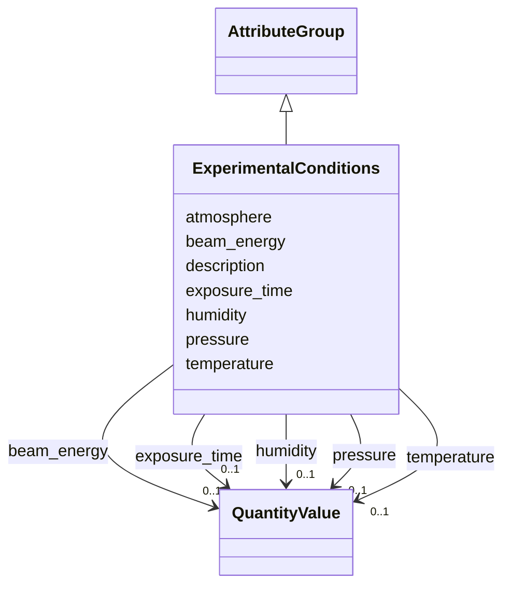

# Class: ExperimentalConditions 


_Environmental and experimental conditions_


URI: [lambdaber:ExperimentalConditions](https://w3id.org/lambda-ber-schema/ExperimentalConditions)





## Inheritance
* [AttributeGroup](AttributeGroup.md)
    * **ExperimentalConditions**


## Slots

| Name | Cardinality and Range | Description | Inheritance |
| ---  | --- | --- | --- |
| [temperature](temperature.md) | 0..1 <br/> [QuantityValue](QuantityValue.md) | Temperature, typically specified in degrees Celsius | direct |
| [humidity](humidity.md) | 0..1 <br/> [QuantityValue](QuantityValue.md) | Humidity, typically specified as a percentage (0-100) | direct |
| [pressure](pressure.md) | 0..1 <br/> [QuantityValue](QuantityValue.md) | Pressure, typically specified in kilopascals (kPa) | direct |
| [atmosphere](atmosphere.md) | 0..1 <br/> [String](String.md) | Atmosphere composition | direct |
| [beam_energy](beam_energy.md) | 0..1 <br/> [QuantityValue](QuantityValue.md) | Beam energy, typically specified in kiloelectronvolts (keV) | direct |
| [exposure_time](exposure_time.md) | 0..1 <br/> [QuantityValue](QuantityValue.md) | Exposure time, typically specified in seconds | direct |
| [description](description.md) | 0..1 <br/> [String](String.md) |  | [AttributeGroup](AttributeGroup.md) |


## Usages

| used by | used in | type | used |
| ---  | --- | --- | --- |
| [ExperimentRun](ExperimentRun.md) | [experimental_conditions](experimental_conditions.md) | range | [ExperimentalConditions](ExperimentalConditions.md) |


## Identifier and Mapping Information


### Schema Source


* from schema: https://w3id.org/lambda-ber-schema/


## Mappings

| Mapping Type | Mapped Value |
| ---  | ---  |
| self | lambdaber:ExperimentalConditions |
| native | lambdaber:ExperimentalConditions |


## LinkML Source

<!-- TODO: investigate https://stackoverflow.com/questions/37606292/how-to-create-tabbed-code-blocks-in-mkdocs-or-sphinx -->

### Direct

<details>
```yaml
name: ExperimentalConditions
description: Environmental and experimental conditions
from_schema: https://w3id.org/lambda-ber-schema/
is_a: AttributeGroup
attributes:
  temperature:
    name: temperature
    description: Temperature, typically specified in degrees Celsius. Data providers
      may specify alternative units by including the unit in the QuantityValue.
    from_schema: https://w3id.org/lambda-ber-schema/
    domain_of:
    - StorageConditions
    - ExperimentalConditions
    - MeasurementConditions
    range: QuantityValue
    inlined: true
  humidity:
    name: humidity
    description: Humidity, typically specified as a percentage (0-100). Data providers
      may specify as a decimal fraction or percentage by including the unit in the
      QuantityValue.
    from_schema: https://w3id.org/lambda-ber-schema/
    rank: 1000
    domain_of:
    - ExperimentalConditions
    range: QuantityValue
    inlined: true
  pressure:
    name: pressure
    description: Pressure, typically specified in kilopascals (kPa). Data providers
      may specify alternative units by including the unit in the QuantityValue.
    from_schema: https://w3id.org/lambda-ber-schema/
    rank: 1000
    domain_of:
    - ExperimentalConditions
    range: QuantityValue
    inlined: true
  atmosphere:
    name: atmosphere
    description: Atmosphere composition
    from_schema: https://w3id.org/lambda-ber-schema/
    domain_of:
    - StorageConditions
    - ExperimentalConditions
  beam_energy:
    name: beam_energy
    description: Beam energy, typically specified in kiloelectronvolts (keV). Data
      providers may specify alternative units by including the unit in the QuantityValue.
    from_schema: https://w3id.org/lambda-ber-schema/
    domain_of:
    - XRFImage
    - ExperimentalConditions
    range: QuantityValue
    inlined: true
  exposure_time:
    name: exposure_time
    description: Exposure time, typically specified in seconds. Data providers may
      specify alternative units by including the unit in the QuantityValue.
    from_schema: https://w3id.org/lambda-ber-schema/
    domain_of:
    - ExperimentRun
    - Image
    - ExperimentalConditions
    range: QuantityValue
    inlined: true

```
</details>

### Induced

<details>
```yaml
name: ExperimentalConditions
description: Environmental and experimental conditions
from_schema: https://w3id.org/lambda-ber-schema/
is_a: AttributeGroup
attributes:
  temperature:
    name: temperature
    description: Temperature, typically specified in degrees Celsius. Data providers
      may specify alternative units by including the unit in the QuantityValue.
    from_schema: https://w3id.org/lambda-ber-schema/
    alias: temperature
    owner: ExperimentalConditions
    domain_of:
    - StorageConditions
    - ExperimentalConditions
    - MeasurementConditions
    range: QuantityValue
    inlined: true
  humidity:
    name: humidity
    description: Humidity, typically specified as a percentage (0-100). Data providers
      may specify as a decimal fraction or percentage by including the unit in the
      QuantityValue.
    from_schema: https://w3id.org/lambda-ber-schema/
    rank: 1000
    alias: humidity
    owner: ExperimentalConditions
    domain_of:
    - ExperimentalConditions
    range: QuantityValue
    inlined: true
  pressure:
    name: pressure
    description: Pressure, typically specified in kilopascals (kPa). Data providers
      may specify alternative units by including the unit in the QuantityValue.
    from_schema: https://w3id.org/lambda-ber-schema/
    rank: 1000
    alias: pressure
    owner: ExperimentalConditions
    domain_of:
    - ExperimentalConditions
    range: QuantityValue
    inlined: true
  atmosphere:
    name: atmosphere
    description: Atmosphere composition
    from_schema: https://w3id.org/lambda-ber-schema/
    alias: atmosphere
    owner: ExperimentalConditions
    domain_of:
    - StorageConditions
    - ExperimentalConditions
    range: string
  beam_energy:
    name: beam_energy
    description: Beam energy, typically specified in kiloelectronvolts (keV). Data
      providers may specify alternative units by including the unit in the QuantityValue.
    from_schema: https://w3id.org/lambda-ber-schema/
    alias: beam_energy
    owner: ExperimentalConditions
    domain_of:
    - XRFImage
    - ExperimentalConditions
    range: QuantityValue
    inlined: true
  exposure_time:
    name: exposure_time
    description: Exposure time, typically specified in seconds. Data providers may
      specify alternative units by including the unit in the QuantityValue.
    from_schema: https://w3id.org/lambda-ber-schema/
    alias: exposure_time
    owner: ExperimentalConditions
    domain_of:
    - ExperimentRun
    - Image
    - ExperimentalConditions
    range: QuantityValue
    inlined: true
  description:
    name: description
    from_schema: https://w3id.org/lambda-ber-schema/
    alias: description
    owner: ExperimentalConditions
    domain_of:
    - NamedThing
    - AttributeGroup
    range: string

```
</details>