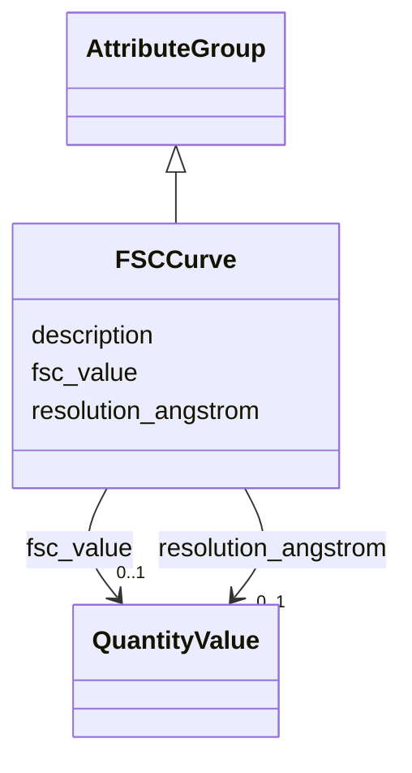

# Class: FSCCurve 


_Fourier Shell Correlation curve data._

__

_The `resolution_angstrom` and `fsc_value` arrays must be of equal length, with each value at index i in `resolution_angstrom`_

_corresponding to the value at index i in `fsc_value`. Both arrays should not exceed 10,000 elements._

__


URI: [lambdaber:FSCCurve](https://w3id.org/lambda-ber-schema/FSCCurve)





## Inheritance
* [AttributeGroup](AttributeGroup.md)
    * **FSCCurve**


## Slots

| Name | Cardinality and Range | Description | Inheritance |
| ---  | --- | --- | --- |
| [resolution_angstrom](resolution_angstrom.md) | 0..1 <br/> [QuantityValue](QuantityValue.md) | Resolution values in Angstroms | direct |
| [fsc_value](fsc_value.md) | 0..1 <br/> [QuantityValue](QuantityValue.md) | FSC values corresponding to each resolution | direct |
| [description](description.md) | 0..1 <br/> [String](String.md) |  | [AttributeGroup](AttributeGroup.md) |


## Usages

| used by | used in | type | used |
| ---  | --- | --- | --- |
| [WorkflowRun](WorkflowRun.md) | [fsc_curve](fsc_curve.md) | range | [FSCCurve](FSCCurve.md) |


## Identifier and Mapping Information


### Schema Source


* from schema: https://w3id.org/lambda-ber-schema/


## Mappings

| Mapping Type | Mapped Value |
| ---  | ---  |
| self | lambdaber:FSCCurve |
| native | lambdaber:FSCCurve |


## LinkML Source

<!-- TODO: investigate https://stackoverflow.com/questions/37606292/how-to-create-tabbed-code-blocks-in-mkdocs-or-sphinx -->

### Direct

<details>
```yaml
name: FSCCurve
description: 'Fourier Shell Correlation curve data.


  The `resolution_angstrom` and `fsc_value` arrays must be of equal length, with each
  value at index i in `resolution_angstrom`

  corresponding to the value at index i in `fsc_value`. Both arrays should not exceed
  10,000 elements.

  '
from_schema: https://w3id.org/lambda-ber-schema/
is_a: AttributeGroup
attributes:
  resolution_angstrom:
    name: resolution_angstrom
    description: Resolution values in Angstroms
    from_schema: https://w3id.org/lambda-ber-schema/
    rank: 1000
    domain_of:
    - FSCCurve
    range: QuantityValue
    inlined: true
  fsc_value:
    name: fsc_value
    description: FSC values corresponding to each resolution
    from_schema: https://w3id.org/lambda-ber-schema/
    rank: 1000
    domain_of:
    - FSCCurve
    range: QuantityValue
    inlined: true

```
</details>

### Induced

<details>
```yaml
name: FSCCurve
description: 'Fourier Shell Correlation curve data.


  The `resolution_angstrom` and `fsc_value` arrays must be of equal length, with each
  value at index i in `resolution_angstrom`

  corresponding to the value at index i in `fsc_value`. Both arrays should not exceed
  10,000 elements.

  '
from_schema: https://w3id.org/lambda-ber-schema/
is_a: AttributeGroup
attributes:
  resolution_angstrom:
    name: resolution_angstrom
    description: Resolution values in Angstroms
    from_schema: https://w3id.org/lambda-ber-schema/
    rank: 1000
    alias: resolution_angstrom
    owner: FSCCurve
    domain_of:
    - FSCCurve
    range: QuantityValue
    inlined: true
  fsc_value:
    name: fsc_value
    description: FSC values corresponding to each resolution
    from_schema: https://w3id.org/lambda-ber-schema/
    rank: 1000
    alias: fsc_value
    owner: FSCCurve
    domain_of:
    - FSCCurve
    range: QuantityValue
    inlined: true
  description:
    name: description
    from_schema: https://w3id.org/lambda-ber-schema/
    alias: description
    owner: FSCCurve
    domain_of:
    - NamedThing
    - AttributeGroup
    range: string

```
</details>