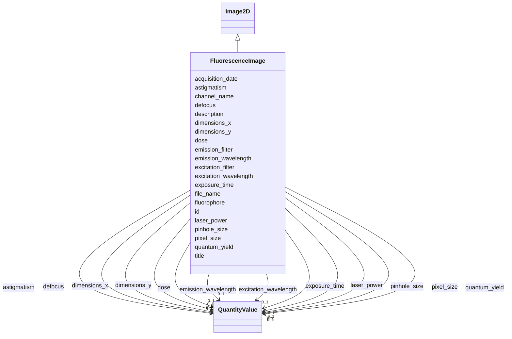

# Class: FluorescenceImage 


_Fluorescence microscopy image capturing specific molecular targets through fluorescent labeling_


URI: [lambdaber:FluorescenceImage](https://w3id.org/lambda-ber-schema/FluorescenceImage)





## Inheritance
* [NamedThing](NamedThing.md)
    * [Image](Image.md)
        * [Image2D](Image2D.md)
            * **FluorescenceImage**


## Slots

| Name | Cardinality and Range | Description | Inheritance |
| ---  | --- | --- | --- |
| [excitation_wavelength](excitation_wavelength.md) | 0..1 <br/> [QuantityValue](QuantityValue.md) | Excitation wavelength, typically specified in nanometers | direct |
| [emission_wavelength](emission_wavelength.md) | 0..1 <br/> [QuantityValue](QuantityValue.md) | Emission wavelength, typically specified in nanometers | direct |
| [excitation_filter](excitation_filter.md) | 0..1 <br/> [String](String.md) | Specifications of the excitation filter | direct |
| [emission_filter](emission_filter.md) | 0..1 <br/> [String](String.md) | Specifications of the emission filter | direct |
| [fluorophore](fluorophore.md) | 0..1 <br/> [String](String.md) | Name or type of fluorophore used | direct |
| [channel_name](channel_name.md) | 0..1 <br/> [String](String.md) | Name of the fluorescence channel (e | direct |
| [laser_power](laser_power.md) | 0..1 <br/> [QuantityValue](QuantityValue.md) | Laser power, typically specified in milliwatts | direct |
| [pinhole_size](pinhole_size.md) | 0..1 <br/> [QuantityValue](QuantityValue.md) | Pinhole size, typically specified in Airy units for confocal microscopy | direct |
| [quantum_yield](quantum_yield.md) | 0..1 <br/> [QuantityValue](QuantityValue.md) | Quantum yield of the fluorophore | direct |
| [defocus](defocus.md) | 0..1 <br/> [QuantityValue](QuantityValue.md) | Defocus value, typically specified in micrometers | [Image2D](Image2D.md) |
| [astigmatism](astigmatism.md) | 0..1 <br/> [QuantityValue](QuantityValue.md) | Astigmatism value, typically specified in Angstroms | [Image2D](Image2D.md) |
| [file_name](file_name.md) | 1 <br/> [String](String.md) | Image file name | [Image](Image.md) |
| [acquisition_date](acquisition_date.md) | 0..1 <br/> [String](String.md) | Date image was acquired | [Image](Image.md) |
| [pixel_size](pixel_size.md) | 0..1 <br/> [QuantityValue](QuantityValue.md) | Pixel size, typically specified in Angstroms | [Image](Image.md) |
| [dimensions_x](dimensions_x.md) | 0..1 <br/> [QuantityValue](QuantityValue.md) | Image width, typically specified in pixels | [Image](Image.md) |
| [dimensions_y](dimensions_y.md) | 0..1 <br/> [QuantityValue](QuantityValue.md) | Image height, typically specified in pixels | [Image](Image.md) |
| [exposure_time](exposure_time.md) | 0..1 <br/> [QuantityValue](QuantityValue.md) | Exposure time, typically specified in seconds | [Image](Image.md) |
| [dose](dose.md) | 0..1 <br/> [QuantityValue](QuantityValue.md) | Electron dose in e-/Ų | [Image](Image.md) |
| [id](id.md) | 1 <br/> [Uriorcurie](Uriorcurie.md) | Globally unique identifier as an IRI or CURIE for machine processing and exte... | [NamedThing](NamedThing.md) |
| [title](title.md) | 0..1 <br/> [String](String.md) | A human-readable name or title for this entity | [NamedThing](NamedThing.md) |
| [description](description.md) | 0..1 <br/> [String](String.md) | A detailed textual description of this entity | [NamedThing](NamedThing.md) |


## Identifier and Mapping Information


### Schema Source


* from schema: https://w3id.org/lambda-ber-schema/


## Mappings

| Mapping Type | Mapped Value |
| ---  | ---  |
| self | lambdaber:FluorescenceImage |
| native | lambdaber:FluorescenceImage |


## LinkML Source

<!-- TODO: investigate https://stackoverflow.com/questions/37606292/how-to-create-tabbed-code-blocks-in-mkdocs-or-sphinx -->

### Direct

<details>
```yaml
name: FluorescenceImage
description: Fluorescence microscopy image capturing specific molecular targets through
  fluorescent labeling
from_schema: https://w3id.org/lambda-ber-schema/
is_a: Image2D
attributes:
  excitation_wavelength:
    name: excitation_wavelength
    description: Excitation wavelength, typically specified in nanometers. Data providers
      may specify alternative units by including the unit in the QuantityValue.
    from_schema: https://w3id.org/lambda-ber-schema/
    rank: 1000
    domain_of:
    - FluorescenceImage
    range: QuantityValue
    inlined: true
  emission_wavelength:
    name: emission_wavelength
    description: Emission wavelength, typically specified in nanometers. Data providers
      may specify alternative units by including the unit in the QuantityValue.
    from_schema: https://w3id.org/lambda-ber-schema/
    rank: 1000
    domain_of:
    - FluorescenceImage
    range: QuantityValue
    inlined: true
  excitation_filter:
    name: excitation_filter
    description: Specifications of the excitation filter
    from_schema: https://w3id.org/lambda-ber-schema/
    rank: 1000
    domain_of:
    - FluorescenceImage
    range: string
  emission_filter:
    name: emission_filter
    description: Specifications of the emission filter
    from_schema: https://w3id.org/lambda-ber-schema/
    rank: 1000
    domain_of:
    - FluorescenceImage
    range: string
  fluorophore:
    name: fluorophore
    description: Name or type of fluorophore used
    from_schema: https://w3id.org/lambda-ber-schema/
    rank: 1000
    domain_of:
    - FluorescenceImage
    range: string
  channel_name:
    name: channel_name
    description: Name of the fluorescence channel (e.g., DAPI, GFP, RFP)
    from_schema: https://w3id.org/lambda-ber-schema/
    rank: 1000
    domain_of:
    - FluorescenceImage
    range: string
  laser_power:
    name: laser_power
    description: Laser power, typically specified in milliwatts. Data providers may
      specify alternative units by including the unit in the QuantityValue.
    from_schema: https://w3id.org/lambda-ber-schema/
    rank: 1000
    domain_of:
    - FluorescenceImage
    range: QuantityValue
    inlined: true
  pinhole_size:
    name: pinhole_size
    description: Pinhole size, typically specified in Airy units for confocal microscopy.
      Data providers may specify alternative units by including the unit in the QuantityValue.
    from_schema: https://w3id.org/lambda-ber-schema/
    rank: 1000
    domain_of:
    - FluorescenceImage
    range: QuantityValue
    inlined: true
  quantum_yield:
    name: quantum_yield
    description: Quantum yield of the fluorophore
    from_schema: https://w3id.org/lambda-ber-schema/
    rank: 1000
    domain_of:
    - FluorescenceImage
    range: QuantityValue
    inlined: true

```
</details>

### Induced

<details>
```yaml
name: FluorescenceImage
description: Fluorescence microscopy image capturing specific molecular targets through
  fluorescent labeling
from_schema: https://w3id.org/lambda-ber-schema/
is_a: Image2D
attributes:
  excitation_wavelength:
    name: excitation_wavelength
    description: Excitation wavelength, typically specified in nanometers. Data providers
      may specify alternative units by including the unit in the QuantityValue.
    from_schema: https://w3id.org/lambda-ber-schema/
    rank: 1000
    alias: excitation_wavelength
    owner: FluorescenceImage
    domain_of:
    - FluorescenceImage
    range: QuantityValue
    inlined: true
  emission_wavelength:
    name: emission_wavelength
    description: Emission wavelength, typically specified in nanometers. Data providers
      may specify alternative units by including the unit in the QuantityValue.
    from_schema: https://w3id.org/lambda-ber-schema/
    rank: 1000
    alias: emission_wavelength
    owner: FluorescenceImage
    domain_of:
    - FluorescenceImage
    range: QuantityValue
    inlined: true
  excitation_filter:
    name: excitation_filter
    description: Specifications of the excitation filter
    from_schema: https://w3id.org/lambda-ber-schema/
    rank: 1000
    alias: excitation_filter
    owner: FluorescenceImage
    domain_of:
    - FluorescenceImage
    range: string
  emission_filter:
    name: emission_filter
    description: Specifications of the emission filter
    from_schema: https://w3id.org/lambda-ber-schema/
    rank: 1000
    alias: emission_filter
    owner: FluorescenceImage
    domain_of:
    - FluorescenceImage
    range: string
  fluorophore:
    name: fluorophore
    description: Name or type of fluorophore used
    from_schema: https://w3id.org/lambda-ber-schema/
    rank: 1000
    alias: fluorophore
    owner: FluorescenceImage
    domain_of:
    - FluorescenceImage
    range: string
  channel_name:
    name: channel_name
    description: Name of the fluorescence channel (e.g., DAPI, GFP, RFP)
    from_schema: https://w3id.org/lambda-ber-schema/
    rank: 1000
    alias: channel_name
    owner: FluorescenceImage
    domain_of:
    - FluorescenceImage
    range: string
  laser_power:
    name: laser_power
    description: Laser power, typically specified in milliwatts. Data providers may
      specify alternative units by including the unit in the QuantityValue.
    from_schema: https://w3id.org/lambda-ber-schema/
    rank: 1000
    alias: laser_power
    owner: FluorescenceImage
    domain_of:
    - FluorescenceImage
    range: QuantityValue
    inlined: true
  pinhole_size:
    name: pinhole_size
    description: Pinhole size, typically specified in Airy units for confocal microscopy.
      Data providers may specify alternative units by including the unit in the QuantityValue.
    from_schema: https://w3id.org/lambda-ber-schema/
    rank: 1000
    alias: pinhole_size
    owner: FluorescenceImage
    domain_of:
    - FluorescenceImage
    range: QuantityValue
    inlined: true
  quantum_yield:
    name: quantum_yield
    description: Quantum yield of the fluorophore
    from_schema: https://w3id.org/lambda-ber-schema/
    rank: 1000
    alias: quantum_yield
    owner: FluorescenceImage
    domain_of:
    - FluorescenceImage
    range: QuantityValue
    inlined: true
  defocus:
    name: defocus
    description: Defocus value, typically specified in micrometers. Data providers
      may specify alternative units by including the unit in the QuantityValue.
    from_schema: https://w3id.org/lambda-ber-schema/
    rank: 1000
    alias: defocus
    owner: FluorescenceImage
    domain_of:
    - Image2D
    range: QuantityValue
    inlined: true
  astigmatism:
    name: astigmatism
    description: Astigmatism value, typically specified in Angstroms. Data providers
      may specify alternative units by including the unit in the QuantityValue.
    from_schema: https://w3id.org/lambda-ber-schema/
    rank: 1000
    alias: astigmatism
    owner: FluorescenceImage
    domain_of:
    - Image2D
    range: QuantityValue
    inlined: true
  file_name:
    name: file_name
    description: Image file name
    from_schema: https://w3id.org/lambda-ber-schema/
    alias: file_name
    owner: FluorescenceImage
    domain_of:
    - DataFile
    - Image
    range: string
    required: true
  acquisition_date:
    name: acquisition_date
    description: Date image was acquired
    from_schema: https://w3id.org/lambda-ber-schema/
    rank: 1000
    alias: acquisition_date
    owner: FluorescenceImage
    domain_of:
    - Image
    range: string
  pixel_size:
    name: pixel_size
    description: Pixel size, typically specified in Angstroms. Data providers may
      specify alternative units by including the unit in the QuantityValue.
    from_schema: https://w3id.org/lambda-ber-schema/
    rank: 1000
    alias: pixel_size
    owner: FluorescenceImage
    domain_of:
    - Image
    - RefinementParameters
    range: QuantityValue
    inlined: true
  dimensions_x:
    name: dimensions_x
    description: Image width, typically specified in pixels. Data providers may specify
      alternative units by including the unit in the QuantityValue.
    from_schema: https://w3id.org/lambda-ber-schema/
    rank: 1000
    alias: dimensions_x
    owner: FluorescenceImage
    domain_of:
    - Image
    range: QuantityValue
    inlined: true
  dimensions_y:
    name: dimensions_y
    description: Image height, typically specified in pixels. Data providers may specify
      alternative units by including the unit in the QuantityValue.
    from_schema: https://w3id.org/lambda-ber-schema/
    rank: 1000
    alias: dimensions_y
    owner: FluorescenceImage
    domain_of:
    - Image
    range: QuantityValue
    inlined: true
  exposure_time:
    name: exposure_time
    description: Exposure time, typically specified in seconds. Data providers may
      specify alternative units by including the unit in the QuantityValue.
    from_schema: https://w3id.org/lambda-ber-schema/
    alias: exposure_time
    owner: FluorescenceImage
    domain_of:
    - ExperimentRun
    - Image
    - ExperimentalConditions
    range: QuantityValue
    inlined: true
  dose:
    name: dose
    description: Electron dose in e-/Ų
    from_schema: https://w3id.org/lambda-ber-schema/
    rank: 1000
    alias: dose
    owner: FluorescenceImage
    domain_of:
    - Image
    - Micrograph
    range: QuantityValue
    inlined: true
  id:
    name: id
    description: Globally unique identifier as an IRI or CURIE for machine processing
      and external references. Used for linking data across systems and semantic web
      integration.
    from_schema: https://w3id.org/lambda-ber-schema/
    rank: 1000
    identifier: true
    alias: id
    owner: FluorescenceImage
    domain_of:
    - NamedThing
    - Attribute
    range: uriorcurie
    required: true
  title:
    name: title
    description: A human-readable name or title for this entity
    from_schema: https://w3id.org/lambda-ber-schema/
    rank: 1000
    slot_uri: dcterms:title
    alias: title
    owner: FluorescenceImage
    domain_of:
    - NamedThing
    range: string
  description:
    name: description
    description: A detailed textual description of this entity
    from_schema: https://w3id.org/lambda-ber-schema/
    rank: 1000
    alias: description
    owner: FluorescenceImage
    domain_of:
    - NamedThing
    - AttributeGroup
    range: string

```
</details>