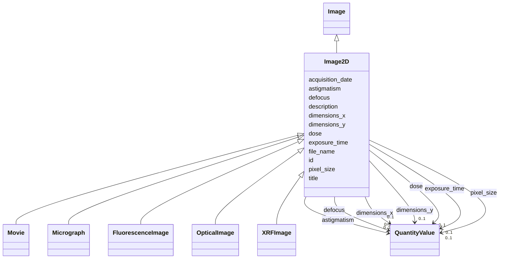

# Class: Image2D 


_A 2D image (micrograph, diffraction pattern)_


URI: [lambdaber:Image2D](https://w3id.org/lambda-ber-schema/Image2D)





## Inheritance
* [NamedThing](NamedThing.md)
    * [Image](Image.md)
        * **Image2D**
            * [Movie](Movie.md)
            * [Micrograph](Micrograph.md)
            * [FluorescenceImage](FluorescenceImage.md)
            * [OpticalImage](OpticalImage.md)
            * [XRFImage](XRFImage.md)


## Slots

| Name | Cardinality and Range | Description | Inheritance |
| ---  | --- | --- | --- |
| [defocus](defocus.md) | 0..1 <br/> [QuantityValue](QuantityValue.md) | Defocus value, typically specified in micrometers | direct |
| [astigmatism](astigmatism.md) | 0..1 <br/> [QuantityValue](QuantityValue.md) | Astigmatism value, typically specified in Angstroms | direct |
| [file_name](file_name.md) | 1 <br/> [String](String.md) | Image file name | [Image](Image.md) |
| [acquisition_date](acquisition_date.md) | 0..1 <br/> [String](String.md) | Date image was acquired | [Image](Image.md) |
| [pixel_size](pixel_size.md) | 0..1 <br/> [QuantityValue](QuantityValue.md) | Pixel size, typically specified in Angstroms | [Image](Image.md) |
| [dimensions_x](dimensions_x.md) | 0..1 <br/> [QuantityValue](QuantityValue.md) | Image width, typically specified in pixels | [Image](Image.md) |
| [dimensions_y](dimensions_y.md) | 0..1 <br/> [QuantityValue](QuantityValue.md) | Image height, typically specified in pixels | [Image](Image.md) |
| [exposure_time](exposure_time.md) | 0..1 <br/> [QuantityValue](QuantityValue.md) | Exposure time, typically specified in seconds | [Image](Image.md) |
| [dose](dose.md) | 0..1 <br/> [QuantityValue](QuantityValue.md) | Electron dose in e-/Ų | [Image](Image.md) |
| [id](id.md) | 1 <br/> [Uriorcurie](Uriorcurie.md) | Globally unique identifier as an IRI or CURIE for machine processing and exte... | [NamedThing](NamedThing.md) |
| [title](title.md) | 0..1 <br/> [String](String.md) | A human-readable name or title for this entity | [NamedThing](NamedThing.md) |
| [description](description.md) | 0..1 <br/> [String](String.md) | A detailed textual description of this entity | [NamedThing](NamedThing.md) |


## Identifier and Mapping Information


### Schema Source


* from schema: https://w3id.org/lambda-ber-schema/


## Mappings

| Mapping Type | Mapped Value |
| ---  | ---  |
| self | lambdaber:Image2D |
| native | lambdaber:Image2D |


## LinkML Source

<!-- TODO: investigate https://stackoverflow.com/questions/37606292/how-to-create-tabbed-code-blocks-in-mkdocs-or-sphinx -->

### Direct

<details>
```yaml
name: Image2D
description: A 2D image (micrograph, diffraction pattern)
from_schema: https://w3id.org/lambda-ber-schema/
is_a: Image
attributes:
  defocus:
    name: defocus
    description: Defocus value, typically specified in micrometers. Data providers
      may specify alternative units by including the unit in the QuantityValue.
    from_schema: https://w3id.org/lambda-ber-schema/
    rank: 1000
    domain_of:
    - Image2D
    range: QuantityValue
    inlined: true
  astigmatism:
    name: astigmatism
    description: Astigmatism value, typically specified in Angstroms. Data providers
      may specify alternative units by including the unit in the QuantityValue.
    from_schema: https://w3id.org/lambda-ber-schema/
    rank: 1000
    domain_of:
    - Image2D
    range: QuantityValue
    inlined: true

```
</details>

### Induced

<details>
```yaml
name: Image2D
description: A 2D image (micrograph, diffraction pattern)
from_schema: https://w3id.org/lambda-ber-schema/
is_a: Image
attributes:
  defocus:
    name: defocus
    description: Defocus value, typically specified in micrometers. Data providers
      may specify alternative units by including the unit in the QuantityValue.
    from_schema: https://w3id.org/lambda-ber-schema/
    rank: 1000
    alias: defocus
    owner: Image2D
    domain_of:
    - Image2D
    range: QuantityValue
    inlined: true
  astigmatism:
    name: astigmatism
    description: Astigmatism value, typically specified in Angstroms. Data providers
      may specify alternative units by including the unit in the QuantityValue.
    from_schema: https://w3id.org/lambda-ber-schema/
    rank: 1000
    alias: astigmatism
    owner: Image2D
    domain_of:
    - Image2D
    range: QuantityValue
    inlined: true
  file_name:
    name: file_name
    description: Image file name
    from_schema: https://w3id.org/lambda-ber-schema/
    alias: file_name
    owner: Image2D
    domain_of:
    - DataFile
    - Image
    range: string
    required: true
  acquisition_date:
    name: acquisition_date
    description: Date image was acquired
    from_schema: https://w3id.org/lambda-ber-schema/
    rank: 1000
    alias: acquisition_date
    owner: Image2D
    domain_of:
    - Image
    range: string
  pixel_size:
    name: pixel_size
    description: Pixel size, typically specified in Angstroms. Data providers may
      specify alternative units by including the unit in the QuantityValue.
    from_schema: https://w3id.org/lambda-ber-schema/
    rank: 1000
    alias: pixel_size
    owner: Image2D
    domain_of:
    - Image
    - RefinementParameters
    range: QuantityValue
    inlined: true
  dimensions_x:
    name: dimensions_x
    description: Image width, typically specified in pixels. Data providers may specify
      alternative units by including the unit in the QuantityValue.
    from_schema: https://w3id.org/lambda-ber-schema/
    rank: 1000
    alias: dimensions_x
    owner: Image2D
    domain_of:
    - Image
    range: QuantityValue
    inlined: true
  dimensions_y:
    name: dimensions_y
    description: Image height, typically specified in pixels. Data providers may specify
      alternative units by including the unit in the QuantityValue.
    from_schema: https://w3id.org/lambda-ber-schema/
    rank: 1000
    alias: dimensions_y
    owner: Image2D
    domain_of:
    - Image
    range: QuantityValue
    inlined: true
  exposure_time:
    name: exposure_time
    description: Exposure time, typically specified in seconds. Data providers may
      specify alternative units by including the unit in the QuantityValue.
    from_schema: https://w3id.org/lambda-ber-schema/
    alias: exposure_time
    owner: Image2D
    domain_of:
    - ExperimentRun
    - Image
    - ExperimentalConditions
    range: QuantityValue
    inlined: true
  dose:
    name: dose
    description: Electron dose in e-/Ų
    from_schema: https://w3id.org/lambda-ber-schema/
    rank: 1000
    alias: dose
    owner: Image2D
    domain_of:
    - Image
    - Micrograph
    range: QuantityValue
    inlined: true
  id:
    name: id
    description: Globally unique identifier as an IRI or CURIE for machine processing
      and external references. Used for linking data across systems and semantic web
      integration.
    from_schema: https://w3id.org/lambda-ber-schema/
    rank: 1000
    identifier: true
    alias: id
    owner: Image2D
    domain_of:
    - NamedThing
    - Attribute
    range: uriorcurie
    required: true
  title:
    name: title
    description: A human-readable name or title for this entity
    from_schema: https://w3id.org/lambda-ber-schema/
    rank: 1000
    slot_uri: dcterms:title
    alias: title
    owner: Image2D
    domain_of:
    - NamedThing
    range: string
  description:
    name: description
    description: A detailed textual description of this entity
    from_schema: https://w3id.org/lambda-ber-schema/
    rank: 1000
    alias: description
    owner: Image2D
    domain_of:
    - NamedThing
    - AttributeGroup
    range: string

```
</details>