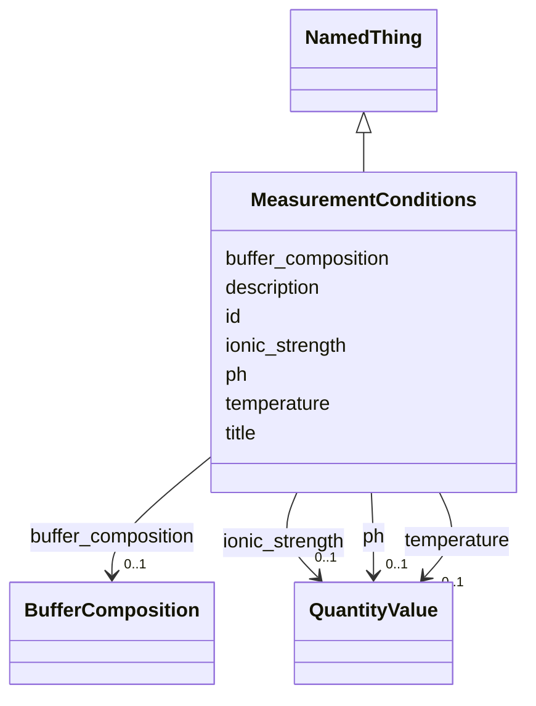

# Class: MeasurementConditions 


_Conditions under which biophysical measurements were made_


URI: [lambdaber:MeasurementConditions](https://w3id.org/lambda-ber-schema/MeasurementConditions)





## Inheritance
* [NamedThing](NamedThing.md)
    * **MeasurementConditions**


## Slots

| Name | Cardinality and Range | Description | Inheritance |
| ---  | --- | --- | --- |
| [buffer_composition](buffer_composition.md) | 0..1 <br/> [BufferComposition](BufferComposition.md) | Composition of the buffer used | direct |
| [ph](ph.md) | 0..1 <br/> [QuantityValue](QuantityValue.md) | pH value of the solution during measurement (range: 0-14), typically expresse... | direct |
| [ionic_strength](ionic_strength.md) | 0..1 <br/> [QuantityValue](QuantityValue.md) | Ionic strength, typically specified in molar (mol/L) | direct |
| [temperature](temperature.md) | 0..1 <br/> [QuantityValue](QuantityValue.md) | Temperature during measurement, typically specified in Kelvin | direct |
| [id](id.md) | 1 <br/> [Uriorcurie](Uriorcurie.md) | Globally unique identifier as an IRI or CURIE for machine processing and exte... | [NamedThing](NamedThing.md) |
| [title](title.md) | 0..1 <br/> [String](String.md) | A human-readable name or title for this entity | [NamedThing](NamedThing.md) |
| [description](description.md) | 0..1 <br/> [String](String.md) | A detailed textual description of this entity | [NamedThing](NamedThing.md) |


## Usages

| used by | used in | type | used |
| ---  | --- | --- | --- |
| [BiophysicalProperty](BiophysicalProperty.md) | [measurement_conditions](measurement_conditions.md) | range | [MeasurementConditions](MeasurementConditions.md) |


## Identifier and Mapping Information


### Schema Source


* from schema: https://w3id.org/lambda-ber-schema/


## Mappings

| Mapping Type | Mapped Value |
| ---  | ---  |
| self | lambdaber:MeasurementConditions |
| native | lambdaber:MeasurementConditions |


## LinkML Source

<!-- TODO: investigate https://stackoverflow.com/questions/37606292/how-to-create-tabbed-code-blocks-in-mkdocs-or-sphinx -->

### Direct

<details>
```yaml
name: MeasurementConditions
description: Conditions under which biophysical measurements were made
from_schema: https://w3id.org/lambda-ber-schema/
is_a: NamedThing
attributes:
  buffer_composition:
    name: buffer_composition
    description: Composition of the buffer used
    from_schema: https://w3id.org/lambda-ber-schema/functional_annotation
    domain_of:
    - Sample
    - MeasurementConditions
    range: BufferComposition
  ph:
    name: ph
    description: 'pH value of the solution during measurement (range: 0-14), typically
      expressed in pH units. Data providers may specify alternative units by including
      the unit in the QuantityValue.'
    from_schema: https://w3id.org/lambda-ber-schema/functional_annotation
    domain_of:
    - BufferComposition
    - MeasurementConditions
    range: QuantityValue
    inlined: true
  ionic_strength:
    name: ionic_strength
    description: Ionic strength, typically specified in molar (mol/L). Data providers
      may specify alternative units by including the unit in the QuantityValue.
    from_schema: https://w3id.org/lambda-ber-schema/functional_annotation
    rank: 1000
    domain_of:
    - MeasurementConditions
    range: QuantityValue
    inlined: true
  temperature:
    name: temperature
    description: Temperature during measurement, typically specified in Kelvin. Data
      providers may specify alternative units by including the unit in the QuantityValue.
    from_schema: https://w3id.org/lambda-ber-schema/functional_annotation
    domain_of:
    - StorageConditions
    - ExperimentalConditions
    - MeasurementConditions
    range: QuantityValue
    inlined: true

```
</details>

### Induced

<details>
```yaml
name: MeasurementConditions
description: Conditions under which biophysical measurements were made
from_schema: https://w3id.org/lambda-ber-schema/
is_a: NamedThing
attributes:
  buffer_composition:
    name: buffer_composition
    description: Composition of the buffer used
    from_schema: https://w3id.org/lambda-ber-schema/functional_annotation
    alias: buffer_composition
    owner: MeasurementConditions
    domain_of:
    - Sample
    - MeasurementConditions
    range: BufferComposition
  ph:
    name: ph
    description: 'pH value of the solution during measurement (range: 0-14), typically
      expressed in pH units. Data providers may specify alternative units by including
      the unit in the QuantityValue.'
    from_schema: https://w3id.org/lambda-ber-schema/functional_annotation
    alias: ph
    owner: MeasurementConditions
    domain_of:
    - BufferComposition
    - MeasurementConditions
    range: QuantityValue
    inlined: true
  ionic_strength:
    name: ionic_strength
    description: Ionic strength, typically specified in molar (mol/L). Data providers
      may specify alternative units by including the unit in the QuantityValue.
    from_schema: https://w3id.org/lambda-ber-schema/functional_annotation
    rank: 1000
    alias: ionic_strength
    owner: MeasurementConditions
    domain_of:
    - MeasurementConditions
    range: QuantityValue
    inlined: true
  temperature:
    name: temperature
    description: Temperature during measurement, typically specified in Kelvin. Data
      providers may specify alternative units by including the unit in the QuantityValue.
    from_schema: https://w3id.org/lambda-ber-schema/functional_annotation
    alias: temperature
    owner: MeasurementConditions
    domain_of:
    - StorageConditions
    - ExperimentalConditions
    - MeasurementConditions
    range: QuantityValue
    inlined: true
  id:
    name: id
    description: Globally unique identifier as an IRI or CURIE for machine processing
      and external references. Used for linking data across systems and semantic web
      integration.
    from_schema: https://w3id.org/lambda-ber-schema/
    rank: 1000
    identifier: true
    alias: id
    owner: MeasurementConditions
    domain_of:
    - NamedThing
    - Attribute
    range: uriorcurie
    required: true
  title:
    name: title
    description: A human-readable name or title for this entity
    from_schema: https://w3id.org/lambda-ber-schema/
    rank: 1000
    slot_uri: dcterms:title
    alias: title
    owner: MeasurementConditions
    domain_of:
    - NamedThing
    range: string
  description:
    name: description
    description: A detailed textual description of this entity
    from_schema: https://w3id.org/lambda-ber-schema/
    rank: 1000
    alias: description
    owner: MeasurementConditions
    domain_of:
    - NamedThing
    - AttributeGroup
    range: string

```
</details>