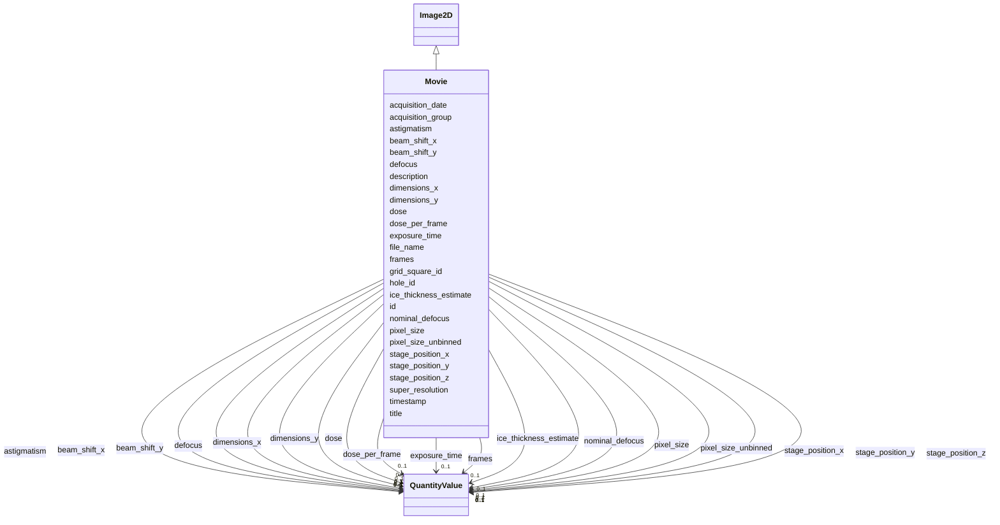

# Class: Movie 


_Raw cryo-EM movie with frame-by-frame metadata for motion correction_


URI: [lambdaber:Movie](https://w3id.org/lambda-ber-schema/Movie)





## Inheritance
* [NamedThing](NamedThing.md)
    * [Image](Image.md)
        * [Image2D](Image2D.md)
            * **Movie**


## Slots

| Name | Cardinality and Range | Description | Inheritance |
| ---  | --- | --- | --- |
| [frames](frames.md) | 0..1 <br/> [QuantityValue](QuantityValue.md) | Number of frames in the movie | direct |
| [super_resolution](super_resolution.md) | 0..1 <br/> [Boolean](Boolean.md) | Whether super-resolution mode was used | direct |
| [pixel_size_unbinned](pixel_size_unbinned.md) | 0..1 <br/> [QuantityValue](QuantityValue.md) | Unbinned pixel size, typically specified in Angstroms per pixel | direct |
| [timestamp](timestamp.md) | 0..1 <br/> [String](String.md) | Acquisition timestamp | direct |
| [stage_position_x](stage_position_x.md) | 0..1 <br/> [QuantityValue](QuantityValue.md) | Stage X position, typically specified in micrometers | direct |
| [stage_position_y](stage_position_y.md) | 0..1 <br/> [QuantityValue](QuantityValue.md) | Stage Y position, typically specified in micrometers | direct |
| [stage_position_z](stage_position_z.md) | 0..1 <br/> [QuantityValue](QuantityValue.md) | Stage Z position, typically specified in micrometers | direct |
| [nominal_defocus](nominal_defocus.md) | 0..1 <br/> [QuantityValue](QuantityValue.md) | Nominal defocus value, typically specified in micrometers | direct |
| [dose_per_frame](dose_per_frame.md) | 0..1 <br/> [QuantityValue](QuantityValue.md) | Electron dose per frame in e-/Angstrom^2 | direct |
| [beam_shift_x](beam_shift_x.md) | 0..1 <br/> [QuantityValue](QuantityValue.md) | Beam shift X in microradians | direct |
| [beam_shift_y](beam_shift_y.md) | 0..1 <br/> [QuantityValue](QuantityValue.md) | Beam shift Y in microradians | direct |
| [ice_thickness_estimate](ice_thickness_estimate.md) | 0..1 <br/> [QuantityValue](QuantityValue.md) | Estimated ice thickness, typically specified in nanometers | direct |
| [grid_square_id](grid_square_id.md) | 0..1 <br/> [String](String.md) | Grid square identifier | direct |
| [hole_id](hole_id.md) | 0..1 <br/> [String](String.md) | Hole identifier within grid square | direct |
| [acquisition_group](acquisition_group.md) | 0..1 <br/> [String](String.md) | Acquisition group identifier (e | direct |
| [defocus](defocus.md) | 0..1 <br/> [QuantityValue](QuantityValue.md) | Defocus value, typically specified in micrometers | [Image2D](Image2D.md) |
| [astigmatism](astigmatism.md) | 0..1 <br/> [QuantityValue](QuantityValue.md) | Astigmatism value, typically specified in Angstroms | [Image2D](Image2D.md) |
| [file_name](file_name.md) | 1 <br/> [String](String.md) | Image file name | [Image](Image.md) |
| [acquisition_date](acquisition_date.md) | 0..1 <br/> [String](String.md) | Date image was acquired | [Image](Image.md) |
| [pixel_size](pixel_size.md) | 0..1 <br/> [QuantityValue](QuantityValue.md) | Pixel size, typically specified in Angstroms | [Image](Image.md) |
| [dimensions_x](dimensions_x.md) | 0..1 <br/> [QuantityValue](QuantityValue.md) | Image width, typically specified in pixels | [Image](Image.md) |
| [dimensions_y](dimensions_y.md) | 0..1 <br/> [QuantityValue](QuantityValue.md) | Image height, typically specified in pixels | [Image](Image.md) |
| [exposure_time](exposure_time.md) | 0..1 <br/> [QuantityValue](QuantityValue.md) | Exposure time, typically specified in seconds | [Image](Image.md) |
| [dose](dose.md) | 0..1 <br/> [QuantityValue](QuantityValue.md) | Electron dose in e-/Ų | [Image](Image.md) |
| [id](id.md) | 1 <br/> [Uriorcurie](Uriorcurie.md) | Globally unique identifier as an IRI or CURIE for machine processing and exte... | [NamedThing](NamedThing.md) |
| [title](title.md) | 0..1 <br/> [String](String.md) | A human-readable name or title for this entity | [NamedThing](NamedThing.md) |
| [description](description.md) | 0..1 <br/> [String](String.md) | A detailed textual description of this entity | [NamedThing](NamedThing.md) |


## Identifier and Mapping Information


### Schema Source


* from schema: https://w3id.org/lambda-ber-schema/


## Mappings

| Mapping Type | Mapped Value |
| ---  | ---  |
| self | lambdaber:Movie |
| native | lambdaber:Movie |


## LinkML Source

<!-- TODO: investigate https://stackoverflow.com/questions/37606292/how-to-create-tabbed-code-blocks-in-mkdocs-or-sphinx -->

### Direct

<details>
```yaml
name: Movie
description: Raw cryo-EM movie with frame-by-frame metadata for motion correction
from_schema: https://w3id.org/lambda-ber-schema/
is_a: Image2D
attributes:
  frames:
    name: frames
    description: Number of frames in the movie
    from_schema: https://w3id.org/lambda-ber-schema/
    rank: 1000
    domain_of:
    - Movie
    range: QuantityValue
    inlined: true
  super_resolution:
    name: super_resolution
    description: Whether super-resolution mode was used
    from_schema: https://w3id.org/lambda-ber-schema/
    rank: 1000
    domain_of:
    - Movie
    range: boolean
  pixel_size_unbinned:
    name: pixel_size_unbinned
    description: Unbinned pixel size, typically specified in Angstroms per pixel.
      Data providers may specify alternative units by including the unit in the QuantityValue.
    from_schema: https://w3id.org/lambda-ber-schema/
    rank: 1000
    domain_of:
    - Movie
    range: QuantityValue
    inlined: true
  timestamp:
    name: timestamp
    description: Acquisition timestamp
    from_schema: https://w3id.org/lambda-ber-schema/
    rank: 1000
    domain_of:
    - Movie
    range: string
  stage_position_x:
    name: stage_position_x
    description: Stage X position, typically specified in micrometers. Data providers
      may specify alternative units by including the unit in the QuantityValue.
    from_schema: https://w3id.org/lambda-ber-schema/
    rank: 1000
    domain_of:
    - Movie
    range: QuantityValue
    inlined: true
  stage_position_y:
    name: stage_position_y
    description: Stage Y position, typically specified in micrometers. Data providers
      may specify alternative units by including the unit in the QuantityValue.
    from_schema: https://w3id.org/lambda-ber-schema/
    rank: 1000
    domain_of:
    - Movie
    range: QuantityValue
    inlined: true
  stage_position_z:
    name: stage_position_z
    description: Stage Z position, typically specified in micrometers. Data providers
      may specify alternative units by including the unit in the QuantityValue.
    from_schema: https://w3id.org/lambda-ber-schema/
    rank: 1000
    domain_of:
    - Movie
    range: QuantityValue
    inlined: true
  nominal_defocus:
    name: nominal_defocus
    description: Nominal defocus value, typically specified in micrometers. Data providers
      may specify alternative units by including the unit in the QuantityValue.
    from_schema: https://w3id.org/lambda-ber-schema/
    rank: 1000
    domain_of:
    - Movie
    range: QuantityValue
    inlined: true
  dose_per_frame:
    name: dose_per_frame
    description: Electron dose per frame in e-/Angstrom^2
    from_schema: https://w3id.org/lambda-ber-schema/
    rank: 1000
    domain_of:
    - Movie
    - DataCollectionStrategy
    range: QuantityValue
    inlined: true
  beam_shift_x:
    name: beam_shift_x
    description: Beam shift X in microradians
    from_schema: https://w3id.org/lambda-ber-schema/
    rank: 1000
    domain_of:
    - Movie
    range: QuantityValue
    inlined: true
  beam_shift_y:
    name: beam_shift_y
    description: Beam shift Y in microradians
    from_schema: https://w3id.org/lambda-ber-schema/
    rank: 1000
    domain_of:
    - Movie
    range: QuantityValue
    inlined: true
  ice_thickness_estimate:
    name: ice_thickness_estimate
    description: Estimated ice thickness, typically specified in nanometers. Data
      providers may specify alternative units by including the unit in the QuantityValue.
    from_schema: https://w3id.org/lambda-ber-schema/
    rank: 1000
    domain_of:
    - Movie
    range: QuantityValue
    inlined: true
  grid_square_id:
    name: grid_square_id
    description: Grid square identifier
    from_schema: https://w3id.org/lambda-ber-schema/
    rank: 1000
    domain_of:
    - Movie
    range: string
  hole_id:
    name: hole_id
    description: Hole identifier within grid square
    from_schema: https://w3id.org/lambda-ber-schema/
    rank: 1000
    domain_of:
    - Movie
    range: string
  acquisition_group:
    name: acquisition_group
    description: Acquisition group identifier (e.g., template or area)
    from_schema: https://w3id.org/lambda-ber-schema/
    rank: 1000
    domain_of:
    - Movie
    range: string

```
</details>

### Induced

<details>
```yaml
name: Movie
description: Raw cryo-EM movie with frame-by-frame metadata for motion correction
from_schema: https://w3id.org/lambda-ber-schema/
is_a: Image2D
attributes:
  frames:
    name: frames
    description: Number of frames in the movie
    from_schema: https://w3id.org/lambda-ber-schema/
    rank: 1000
    alias: frames
    owner: Movie
    domain_of:
    - Movie
    range: QuantityValue
    inlined: true
  super_resolution:
    name: super_resolution
    description: Whether super-resolution mode was used
    from_schema: https://w3id.org/lambda-ber-schema/
    rank: 1000
    alias: super_resolution
    owner: Movie
    domain_of:
    - Movie
    range: boolean
  pixel_size_unbinned:
    name: pixel_size_unbinned
    description: Unbinned pixel size, typically specified in Angstroms per pixel.
      Data providers may specify alternative units by including the unit in the QuantityValue.
    from_schema: https://w3id.org/lambda-ber-schema/
    rank: 1000
    alias: pixel_size_unbinned
    owner: Movie
    domain_of:
    - Movie
    range: QuantityValue
    inlined: true
  timestamp:
    name: timestamp
    description: Acquisition timestamp
    from_schema: https://w3id.org/lambda-ber-schema/
    rank: 1000
    alias: timestamp
    owner: Movie
    domain_of:
    - Movie
    range: string
  stage_position_x:
    name: stage_position_x
    description: Stage X position, typically specified in micrometers. Data providers
      may specify alternative units by including the unit in the QuantityValue.
    from_schema: https://w3id.org/lambda-ber-schema/
    rank: 1000
    alias: stage_position_x
    owner: Movie
    domain_of:
    - Movie
    range: QuantityValue
    inlined: true
  stage_position_y:
    name: stage_position_y
    description: Stage Y position, typically specified in micrometers. Data providers
      may specify alternative units by including the unit in the QuantityValue.
    from_schema: https://w3id.org/lambda-ber-schema/
    rank: 1000
    alias: stage_position_y
    owner: Movie
    domain_of:
    - Movie
    range: QuantityValue
    inlined: true
  stage_position_z:
    name: stage_position_z
    description: Stage Z position, typically specified in micrometers. Data providers
      may specify alternative units by including the unit in the QuantityValue.
    from_schema: https://w3id.org/lambda-ber-schema/
    rank: 1000
    alias: stage_position_z
    owner: Movie
    domain_of:
    - Movie
    range: QuantityValue
    inlined: true
  nominal_defocus:
    name: nominal_defocus
    description: Nominal defocus value, typically specified in micrometers. Data providers
      may specify alternative units by including the unit in the QuantityValue.
    from_schema: https://w3id.org/lambda-ber-schema/
    rank: 1000
    alias: nominal_defocus
    owner: Movie
    domain_of:
    - Movie
    range: QuantityValue
    inlined: true
  dose_per_frame:
    name: dose_per_frame
    description: Electron dose per frame in e-/Angstrom^2
    from_schema: https://w3id.org/lambda-ber-schema/
    rank: 1000
    alias: dose_per_frame
    owner: Movie
    domain_of:
    - Movie
    - DataCollectionStrategy
    range: QuantityValue
    inlined: true
  beam_shift_x:
    name: beam_shift_x
    description: Beam shift X in microradians
    from_schema: https://w3id.org/lambda-ber-schema/
    rank: 1000
    alias: beam_shift_x
    owner: Movie
    domain_of:
    - Movie
    range: QuantityValue
    inlined: true
  beam_shift_y:
    name: beam_shift_y
    description: Beam shift Y in microradians
    from_schema: https://w3id.org/lambda-ber-schema/
    rank: 1000
    alias: beam_shift_y
    owner: Movie
    domain_of:
    - Movie
    range: QuantityValue
    inlined: true
  ice_thickness_estimate:
    name: ice_thickness_estimate
    description: Estimated ice thickness, typically specified in nanometers. Data
      providers may specify alternative units by including the unit in the QuantityValue.
    from_schema: https://w3id.org/lambda-ber-schema/
    rank: 1000
    alias: ice_thickness_estimate
    owner: Movie
    domain_of:
    - Movie
    range: QuantityValue
    inlined: true
  grid_square_id:
    name: grid_square_id
    description: Grid square identifier
    from_schema: https://w3id.org/lambda-ber-schema/
    rank: 1000
    alias: grid_square_id
    owner: Movie
    domain_of:
    - Movie
    range: string
  hole_id:
    name: hole_id
    description: Hole identifier within grid square
    from_schema: https://w3id.org/lambda-ber-schema/
    rank: 1000
    alias: hole_id
    owner: Movie
    domain_of:
    - Movie
    range: string
  acquisition_group:
    name: acquisition_group
    description: Acquisition group identifier (e.g., template or area)
    from_schema: https://w3id.org/lambda-ber-schema/
    rank: 1000
    alias: acquisition_group
    owner: Movie
    domain_of:
    - Movie
    range: string
  defocus:
    name: defocus
    description: Defocus value, typically specified in micrometers. Data providers
      may specify alternative units by including the unit in the QuantityValue.
    from_schema: https://w3id.org/lambda-ber-schema/
    rank: 1000
    alias: defocus
    owner: Movie
    domain_of:
    - Image2D
    range: QuantityValue
    inlined: true
  astigmatism:
    name: astigmatism
    description: Astigmatism value, typically specified in Angstroms. Data providers
      may specify alternative units by including the unit in the QuantityValue.
    from_schema: https://w3id.org/lambda-ber-schema/
    rank: 1000
    alias: astigmatism
    owner: Movie
    domain_of:
    - Image2D
    range: QuantityValue
    inlined: true
  file_name:
    name: file_name
    description: Image file name
    from_schema: https://w3id.org/lambda-ber-schema/
    alias: file_name
    owner: Movie
    domain_of:
    - DataFile
    - Image
    range: string
    required: true
  acquisition_date:
    name: acquisition_date
    description: Date image was acquired
    from_schema: https://w3id.org/lambda-ber-schema/
    rank: 1000
    alias: acquisition_date
    owner: Movie
    domain_of:
    - Image
    range: string
  pixel_size:
    name: pixel_size
    description: Pixel size, typically specified in Angstroms. Data providers may
      specify alternative units by including the unit in the QuantityValue.
    from_schema: https://w3id.org/lambda-ber-schema/
    rank: 1000
    alias: pixel_size
    owner: Movie
    domain_of:
    - Image
    - RefinementParameters
    range: QuantityValue
    inlined: true
  dimensions_x:
    name: dimensions_x
    description: Image width, typically specified in pixels. Data providers may specify
      alternative units by including the unit in the QuantityValue.
    from_schema: https://w3id.org/lambda-ber-schema/
    rank: 1000
    alias: dimensions_x
    owner: Movie
    domain_of:
    - Image
    range: QuantityValue
    inlined: true
  dimensions_y:
    name: dimensions_y
    description: Image height, typically specified in pixels. Data providers may specify
      alternative units by including the unit in the QuantityValue.
    from_schema: https://w3id.org/lambda-ber-schema/
    rank: 1000
    alias: dimensions_y
    owner: Movie
    domain_of:
    - Image
    range: QuantityValue
    inlined: true
  exposure_time:
    name: exposure_time
    description: Exposure time, typically specified in seconds. Data providers may
      specify alternative units by including the unit in the QuantityValue.
    from_schema: https://w3id.org/lambda-ber-schema/
    alias: exposure_time
    owner: Movie
    domain_of:
    - ExperimentRun
    - Image
    - ExperimentalConditions
    range: QuantityValue
    inlined: true
  dose:
    name: dose
    description: Electron dose in e-/Ų
    from_schema: https://w3id.org/lambda-ber-schema/
    rank: 1000
    alias: dose
    owner: Movie
    domain_of:
    - Image
    - Micrograph
    range: QuantityValue
    inlined: true
  id:
    name: id
    description: Globally unique identifier as an IRI or CURIE for machine processing
      and external references. Used for linking data across systems and semantic web
      integration.
    from_schema: https://w3id.org/lambda-ber-schema/
    rank: 1000
    identifier: true
    alias: id
    owner: Movie
    domain_of:
    - NamedThing
    - Attribute
    range: uriorcurie
    required: true
  title:
    name: title
    description: A human-readable name or title for this entity
    from_schema: https://w3id.org/lambda-ber-schema/
    rank: 1000
    slot_uri: dcterms:title
    alias: title
    owner: Movie
    domain_of:
    - NamedThing
    range: string
  description:
    name: description
    description: A detailed textual description of this entity
    from_schema: https://w3id.org/lambda-ber-schema/
    rank: 1000
    alias: description
    owner: Movie
    domain_of:
    - NamedThing
    - AttributeGroup
    range: string

```
</details>