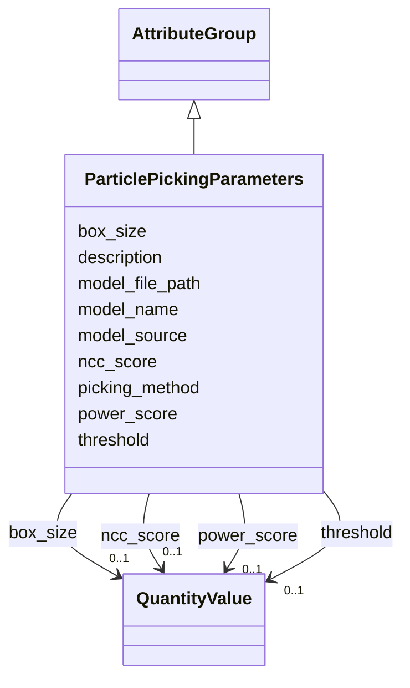

# Class: ParticlePickingParameters 


_Parameters specific to particle picking workflows_


URI: [lambdaber:ParticlePickingParameters](https://w3id.org/lambda-ber-schema/ParticlePickingParameters)





## Inheritance
* [AttributeGroup](AttributeGroup.md)
    * **ParticlePickingParameters**


## Slots

| Name | Cardinality and Range | Description | Inheritance |
| ---  | --- | --- | --- |
| [picking_method](picking_method.md) | 0..1 <br/> [String](String.md) | Method used (manual, template_matching, deep_learning, LoG, Topaz, other) | direct |
| [box_size](box_size.md) | 0..1 <br/> [QuantityValue](QuantityValue.md) | Particle box size in pixels | direct |
| [threshold](threshold.md) | 0..1 <br/> [QuantityValue](QuantityValue.md) | Picking threshold | direct |
| [power_score](power_score.md) | 0..1 <br/> [QuantityValue](QuantityValue.md) | Power score threshold | direct |
| [ncc_score](ncc_score.md) | 0..1 <br/> [QuantityValue](QuantityValue.md) | Normalized cross-correlation score threshold | direct |
| [model_name](model_name.md) | 0..1 <br/> [String](String.md) | Name or identifier of the deep learning model (e | direct |
| [model_file_path](model_file_path.md) | 0..1 <br/> [String](String.md) | Path to deep learning model file if using a local or custom trained model fil... | direct |
| [model_source](model_source.md) | 0..1 <br/> [String](String.md) | Source or software associated with the model (e | direct |
| [description](description.md) | 0..1 <br/> [String](String.md) |  | [AttributeGroup](AttributeGroup.md) |


## Usages

| used by | used in | type | used |
| ---  | --- | --- | --- |
| [WorkflowRun](WorkflowRun.md) | [particle_picking_params](particle_picking_params.md) | range | [ParticlePickingParameters](ParticlePickingParameters.md) |


## Identifier and Mapping Information


### Schema Source


* from schema: https://w3id.org/lambda-ber-schema/


## Mappings

| Mapping Type | Mapped Value |
| ---  | ---  |
| self | lambdaber:ParticlePickingParameters |
| native | lambdaber:ParticlePickingParameters |


## LinkML Source

<!-- TODO: investigate https://stackoverflow.com/questions/37606292/how-to-create-tabbed-code-blocks-in-mkdocs-or-sphinx -->

### Direct

<details>
```yaml
name: ParticlePickingParameters
description: Parameters specific to particle picking workflows
from_schema: https://w3id.org/lambda-ber-schema/
is_a: AttributeGroup
attributes:
  picking_method:
    name: picking_method
    description: Method used (manual, template_matching, deep_learning, LoG, Topaz,
      other)
    from_schema: https://w3id.org/lambda-ber-schema/
    rank: 1000
    domain_of:
    - ParticlePickingParameters
    range: string
  box_size:
    name: box_size
    description: Particle box size in pixels
    from_schema: https://w3id.org/lambda-ber-schema/
    rank: 1000
    domain_of:
    - ParticlePickingParameters
    - RefinementParameters
    range: QuantityValue
    inlined: true
  threshold:
    name: threshold
    description: Picking threshold
    from_schema: https://w3id.org/lambda-ber-schema/
    rank: 1000
    domain_of:
    - ParticlePickingParameters
    range: QuantityValue
    inlined: true
  power_score:
    name: power_score
    description: Power score threshold
    from_schema: https://w3id.org/lambda-ber-schema/
    rank: 1000
    domain_of:
    - ParticlePickingParameters
    range: QuantityValue
    inlined: true
  ncc_score:
    name: ncc_score
    description: Normalized cross-correlation score threshold
    from_schema: https://w3id.org/lambda-ber-schema/
    rank: 1000
    domain_of:
    - ParticlePickingParameters
    range: QuantityValue
    inlined: true
  model_name:
    name: model_name
    description: Name or identifier of the deep learning model (e.g., 'resnet16',
      'resnet8', 'cryolo_general'). Use this for standard pretrained models. Either
      model_name or model_file_path should be provided when using deep learning methods.
    from_schema: https://w3id.org/lambda-ber-schema/
    rank: 1000
    domain_of:
    - ParticlePickingParameters
    range: string
  model_file_path:
    name: model_file_path
    description: Path to deep learning model file if using a local or custom trained
      model file. Use this instead of model_name when pointing to a specific file
      on disk. Either model_name or model_file_path should be provided when using
      deep learning methods.
    from_schema: https://w3id.org/lambda-ber-schema/
    rank: 1000
    domain_of:
    - ParticlePickingParameters
    range: string
  model_source:
    name: model_source
    description: Source or software associated with the model (e.g., 'topaz', 'cryolo',
      'warp', 'custom', 'pretrained'). Helps track model provenance and should be
      provided alongside model_name or model_file_path to document which software/framework
      the model is for.
    from_schema: https://w3id.org/lambda-ber-schema/
    rank: 1000
    domain_of:
    - ParticlePickingParameters
    range: string

```
</details>

### Induced

<details>
```yaml
name: ParticlePickingParameters
description: Parameters specific to particle picking workflows
from_schema: https://w3id.org/lambda-ber-schema/
is_a: AttributeGroup
attributes:
  picking_method:
    name: picking_method
    description: Method used (manual, template_matching, deep_learning, LoG, Topaz,
      other)
    from_schema: https://w3id.org/lambda-ber-schema/
    rank: 1000
    alias: picking_method
    owner: ParticlePickingParameters
    domain_of:
    - ParticlePickingParameters
    range: string
  box_size:
    name: box_size
    description: Particle box size in pixels
    from_schema: https://w3id.org/lambda-ber-schema/
    rank: 1000
    alias: box_size
    owner: ParticlePickingParameters
    domain_of:
    - ParticlePickingParameters
    - RefinementParameters
    range: QuantityValue
    inlined: true
  threshold:
    name: threshold
    description: Picking threshold
    from_schema: https://w3id.org/lambda-ber-schema/
    rank: 1000
    alias: threshold
    owner: ParticlePickingParameters
    domain_of:
    - ParticlePickingParameters
    range: QuantityValue
    inlined: true
  power_score:
    name: power_score
    description: Power score threshold
    from_schema: https://w3id.org/lambda-ber-schema/
    rank: 1000
    alias: power_score
    owner: ParticlePickingParameters
    domain_of:
    - ParticlePickingParameters
    range: QuantityValue
    inlined: true
  ncc_score:
    name: ncc_score
    description: Normalized cross-correlation score threshold
    from_schema: https://w3id.org/lambda-ber-schema/
    rank: 1000
    alias: ncc_score
    owner: ParticlePickingParameters
    domain_of:
    - ParticlePickingParameters
    range: QuantityValue
    inlined: true
  model_name:
    name: model_name
    description: Name or identifier of the deep learning model (e.g., 'resnet16',
      'resnet8', 'cryolo_general'). Use this for standard pretrained models. Either
      model_name or model_file_path should be provided when using deep learning methods.
    from_schema: https://w3id.org/lambda-ber-schema/
    rank: 1000
    alias: model_name
    owner: ParticlePickingParameters
    domain_of:
    - ParticlePickingParameters
    range: string
  model_file_path:
    name: model_file_path
    description: Path to deep learning model file if using a local or custom trained
      model file. Use this instead of model_name when pointing to a specific file
      on disk. Either model_name or model_file_path should be provided when using
      deep learning methods.
    from_schema: https://w3id.org/lambda-ber-schema/
    rank: 1000
    alias: model_file_path
    owner: ParticlePickingParameters
    domain_of:
    - ParticlePickingParameters
    range: string
  model_source:
    name: model_source
    description: Source or software associated with the model (e.g., 'topaz', 'cryolo',
      'warp', 'custom', 'pretrained'). Helps track model provenance and should be
      provided alongside model_name or model_file_path to document which software/framework
      the model is for.
    from_schema: https://w3id.org/lambda-ber-schema/
    rank: 1000
    alias: model_source
    owner: ParticlePickingParameters
    domain_of:
    - ParticlePickingParameters
    range: string
  description:
    name: description
    from_schema: https://w3id.org/lambda-ber-schema/
    alias: description
    owner: ParticlePickingParameters
    domain_of:
    - NamedThing
    - AttributeGroup
    range: string

```
</details>