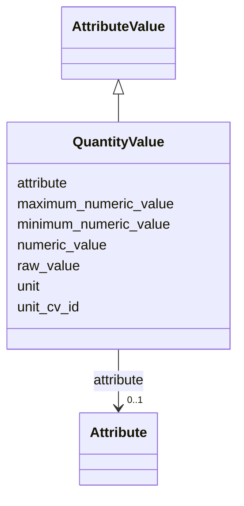

# Class: QuantityValue 


_A simple quantity value, representing a measurement with a numeric value and unit. This allows data providers to specify measurements in their preferred unit while enabling standardized interpretation. For example, a pixel size could be specified as 1.5 micrometers or 15 Angstroms, with the unit clearly specified._


URI: [nmdc:QuantityValue](https://w3id.org/nmdc/QuantityValue)





## Inheritance
* [AttributeValue](AttributeValue.md)
    * **QuantityValue**


## Slots

| Name | Cardinality and Range | Description | Inheritance |
| ---  | --- | --- | --- |
| [maximum_numeric_value](maximum_numeric_value.md) | 0..1 <br/> [Float](Float.md) | The maximum value part, expressed as a number, of the quantity value when the... | direct |
| [minimum_numeric_value](minimum_numeric_value.md) | 0..1 <br/> [Float](Float.md) | The minimum value part, expressed as a number, of the quantity value when the... | direct |
| [numeric_value](numeric_value.md) | 1 <br/> [Float](Float.md) | The numerical value of the quantity | direct |
| [unit](unit.md) | 1 <br/> [String](String.md) | The unit of measurement (e | direct |
| [unit_cv_id](unit_cv_id.md) | 0..1 <br/> [Curie](Curie.md) | The unit of the quantity, expressed as a CURIE from the Unit Ontology (e | direct |
| [attribute](attribute.md) | 0..1 <br/> [Attribute](Attribute.md) | The attribute being represented | [AttributeValue](AttributeValue.md) |
| [raw_value](raw_value.md) | 0..1 <br/> [String](String.md) | Unnormalized atomic string representation, suggested syntax {number} {unit} | [AttributeValue](AttributeValue.md) |


## Usages

| used by | used in | type | used |
| ---  | --- | --- | --- |
| [Sample](Sample.md) | [molecular_weight](molecular_weight.md) | range | [QuantityValue](QuantityValue.md) |
| [Sample](Sample.md) | [concentration](concentration.md) | range | [QuantityValue](QuantityValue.md) |
| [Sample](Sample.md) | [purity_percentage](purity_percentage.md) | range | [QuantityValue](QuantityValue.md) |
| [ProteinConstruct](ProteinConstruct.md) | [sequence_length_aa](sequence_length_aa.md) | range | [QuantityValue](QuantityValue.md) |
| [SamplePreparation](SamplePreparation.md) | [culture_volume_l](culture_volume_l.md) | range | [QuantityValue](QuantityValue.md) |
| [SamplePreparation](SamplePreparation.md) | [growth_temperature_c](growth_temperature_c.md) | range | [QuantityValue](QuantityValue.md) |
| [SamplePreparation](SamplePreparation.md) | [induction_temperature_c](induction_temperature_c.md) | range | [QuantityValue](QuantityValue.md) |
| [SamplePreparation](SamplePreparation.md) | [induction_time_h](induction_time_h.md) | range | [QuantityValue](QuantityValue.md) |
| [SamplePreparation](SamplePreparation.md) | [od600_at_induction](od600_at_induction.md) | range | [QuantityValue](QuantityValue.md) |
| [SamplePreparation](SamplePreparation.md) | [cleavage_time_h](cleavage_time_h.md) | range | [QuantityValue](QuantityValue.md) |
| [SamplePreparation](SamplePreparation.md) | [cleavage_temperature_c](cleavage_temperature_c.md) | range | [QuantityValue](QuantityValue.md) |
| [SamplePreparation](SamplePreparation.md) | [final_concentration_mg_per_ml](final_concentration_mg_per_ml.md) | range | [QuantityValue](QuantityValue.md) |
| [SamplePreparation](SamplePreparation.md) | [yield_mg](yield_mg.md) | range | [QuantityValue](QuantityValue.md) |
| [SamplePreparation](SamplePreparation.md) | [purity_by_sds_page_percent](purity_by_sds_page_percent.md) | range | [QuantityValue](QuantityValue.md) |
| [CryoEMInstrument](CryoEMInstrument.md) | [accelerating_voltage](accelerating_voltage.md) | range | [QuantityValue](QuantityValue.md) |
| [CryoEMInstrument](CryoEMInstrument.md) | [pixel_size_physical_um](pixel_size_physical_um.md) | range | [QuantityValue](QuantityValue.md) |
| [CryoEMInstrument](CryoEMInstrument.md) | [autoloader_capacity](autoloader_capacity.md) | range | [QuantityValue](QuantityValue.md) |
| [CryoEMInstrument](CryoEMInstrument.md) | [cs](cs.md) | range | [QuantityValue](QuantityValue.md) |
| [CryoEMInstrument](CryoEMInstrument.md) | [c2_aperture](c2_aperture.md) | range | [QuantityValue](QuantityValue.md) |
| [CryoEMInstrument](CryoEMInstrument.md) | [objective_aperture](objective_aperture.md) | range | [QuantityValue](QuantityValue.md) |
| [CryoEMInstrument](CryoEMInstrument.md) | [energy_filter_slit_width](energy_filter_slit_width.md) | range | [QuantityValue](QuantityValue.md) |
| [CryoEMInstrument](CryoEMInstrument.md) | [pixel_size_physical](pixel_size_physical.md) | range | [QuantityValue](QuantityValue.md) |
| [CryoEMInstrument](CryoEMInstrument.md) | [spotsize](spotsize.md) | range | [QuantityValue](QuantityValue.md) |
| [CryoEMInstrument](CryoEMInstrument.md) | [gunlens](gunlens.md) | range | [QuantityValue](QuantityValue.md) |
| [CryoEMInstrument](CryoEMInstrument.md) | [tem_beam_diameter](tem_beam_diameter.md) | range | [QuantityValue](QuantityValue.md) |
| [XRayInstrument](XRayInstrument.md) | [energy_min](energy_min.md) | range | [QuantityValue](QuantityValue.md) |
| [XRayInstrument](XRayInstrument.md) | [energy_max](energy_max.md) | range | [QuantityValue](QuantityValue.md) |
| [XRayInstrument](XRayInstrument.md) | [beam_size_min](beam_size_min.md) | range | [QuantityValue](QuantityValue.md) |
| [XRayInstrument](XRayInstrument.md) | [beam_size_max](beam_size_max.md) | range | [QuantityValue](QuantityValue.md) |
| [XRayInstrument](XRayInstrument.md) | [flux_density](flux_density.md) | range | [QuantityValue](QuantityValue.md) |
| [SAXSInstrument](SAXSInstrument.md) | [q_range_min](q_range_min.md) | range | [QuantityValue](QuantityValue.md) |
| [SAXSInstrument](SAXSInstrument.md) | [q_range_max](q_range_max.md) | range | [QuantityValue](QuantityValue.md) |
| [SAXSInstrument](SAXSInstrument.md) | [detector_distance_min](detector_distance_min.md) | range | [QuantityValue](QuantityValue.md) |
| [SAXSInstrument](SAXSInstrument.md) | [detector_distance_max](detector_distance_max.md) | range | [QuantityValue](QuantityValue.md) |
| [SAXSInstrument](SAXSInstrument.md) | [sample_changer_capacity](sample_changer_capacity.md) | range | [QuantityValue](QuantityValue.md) |
| [BeamlineInstrument](BeamlineInstrument.md) | [energy_min](energy_min.md) | range | [QuantityValue](QuantityValue.md) |
| [BeamlineInstrument](BeamlineInstrument.md) | [energy_max](energy_max.md) | range | [QuantityValue](QuantityValue.md) |
| [BeamlineInstrument](BeamlineInstrument.md) | [q_range_min](q_range_min.md) | range | [QuantityValue](QuantityValue.md) |
| [BeamlineInstrument](BeamlineInstrument.md) | [q_range_max](q_range_max.md) | range | [QuantityValue](QuantityValue.md) |
| [BeamlineInstrument](BeamlineInstrument.md) | [sample_changer_capacity](sample_changer_capacity.md) | range | [QuantityValue](QuantityValue.md) |
| [ExperimentRun](ExperimentRun.md) | [magnification](magnification.md) | range | [QuantityValue](QuantityValue.md) |
| [ExperimentRun](ExperimentRun.md) | [calibrated_pixel_size](calibrated_pixel_size.md) | range | [QuantityValue](QuantityValue.md) |
| [ExperimentRun](ExperimentRun.md) | [camera_binning](camera_binning.md) | range | [QuantityValue](QuantityValue.md) |
| [ExperimentRun](ExperimentRun.md) | [exposure_time_per_frame](exposure_time_per_frame.md) | range | [QuantityValue](QuantityValue.md) |
| [ExperimentRun](ExperimentRun.md) | [frames_per_movie](frames_per_movie.md) | range | [QuantityValue](QuantityValue.md) |
| [ExperimentRun](ExperimentRun.md) | [total_exposure_time](total_exposure_time.md) | range | [QuantityValue](QuantityValue.md) |
| [ExperimentRun](ExperimentRun.md) | [total_dose](total_dose.md) | range | [QuantityValue](QuantityValue.md) |
| [ExperimentRun](ExperimentRun.md) | [dose_rate](dose_rate.md) | range | [QuantityValue](QuantityValue.md) |
| [ExperimentRun](ExperimentRun.md) | [defocus_target](defocus_target.md) | range | [QuantityValue](QuantityValue.md) |
| [ExperimentRun](ExperimentRun.md) | [defocus_range_min](defocus_range_min.md) | range | [QuantityValue](QuantityValue.md) |
| [ExperimentRun](ExperimentRun.md) | [defocus_range_max](defocus_range_max.md) | range | [QuantityValue](QuantityValue.md) |
| [ExperimentRun](ExperimentRun.md) | [defocus_range_increment](defocus_range_increment.md) | range | [QuantityValue](QuantityValue.md) |
| [ExperimentRun](ExperimentRun.md) | [astigmatism_target](astigmatism_target.md) | range | [QuantityValue](QuantityValue.md) |
| [ExperimentRun](ExperimentRun.md) | [coma](coma.md) | range | [QuantityValue](QuantityValue.md) |
| [ExperimentRun](ExperimentRun.md) | [stage_tilt](stage_tilt.md) | range | [QuantityValue](QuantityValue.md) |
| [ExperimentRun](ExperimentRun.md) | [shots_per_hole](shots_per_hole.md) | range | [QuantityValue](QuantityValue.md) |
| [ExperimentRun](ExperimentRun.md) | [holes_per_group](holes_per_group.md) | range | [QuantityValue](QuantityValue.md) |
| [ExperimentRun](ExperimentRun.md) | [wavelength](wavelength.md) | range | [QuantityValue](QuantityValue.md) |
| [ExperimentRun](ExperimentRun.md) | [oscillation_angle](oscillation_angle.md) | range | [QuantityValue](QuantityValue.md) |
| [ExperimentRun](ExperimentRun.md) | [start_angle](start_angle.md) | range | [QuantityValue](QuantityValue.md) |
| [ExperimentRun](ExperimentRun.md) | [number_of_images](number_of_images.md) | range | [QuantityValue](QuantityValue.md) |
| [ExperimentRun](ExperimentRun.md) | [beam_center_x](beam_center_x.md) | range | [QuantityValue](QuantityValue.md) |
| [ExperimentRun](ExperimentRun.md) | [beam_center_y](beam_center_y.md) | range | [QuantityValue](QuantityValue.md) |
| [ExperimentRun](ExperimentRun.md) | [detector_distance](detector_distance.md) | range | [QuantityValue](QuantityValue.md) |
| [ExperimentRun](ExperimentRun.md) | [pixel_size_x](pixel_size_x.md) | range | [QuantityValue](QuantityValue.md) |
| [ExperimentRun](ExperimentRun.md) | [pixel_size_y](pixel_size_y.md) | range | [QuantityValue](QuantityValue.md) |
| [ExperimentRun](ExperimentRun.md) | [total_rotation](total_rotation.md) | range | [QuantityValue](QuantityValue.md) |
| [ExperimentRun](ExperimentRun.md) | [transmission](transmission.md) | range | [QuantityValue](QuantityValue.md) |
| [ExperimentRun](ExperimentRun.md) | [flux](flux.md) | range | [QuantityValue](QuantityValue.md) |
| [ExperimentRun](ExperimentRun.md) | [flux_end](flux_end.md) | range | [QuantityValue](QuantityValue.md) |
| [ExperimentRun](ExperimentRun.md) | [slit_gap_horizontal](slit_gap_horizontal.md) | range | [QuantityValue](QuantityValue.md) |
| [ExperimentRun](ExperimentRun.md) | [slit_gap_vertical](slit_gap_vertical.md) | range | [QuantityValue](QuantityValue.md) |
| [ExperimentRun](ExperimentRun.md) | [undulator_gap](undulator_gap.md) | range | [QuantityValue](QuantityValue.md) |
| [ExperimentRun](ExperimentRun.md) | [exposure_time](exposure_time.md) | range | [QuantityValue](QuantityValue.md) |
| [ExperimentRun](ExperimentRun.md) | [resolution](resolution.md) | range | [QuantityValue](QuantityValue.md) |
| [ExperimentRun](ExperimentRun.md) | [resolution_at_corner](resolution_at_corner.md) | range | [QuantityValue](QuantityValue.md) |
| [ExperimentRun](ExperimentRun.md) | [ispyb_data_collection_id](ispyb_data_collection_id.md) | range | [QuantityValue](QuantityValue.md) |
| [ExperimentRun](ExperimentRun.md) | [ispyb_session_id](ispyb_session_id.md) | range | [QuantityValue](QuantityValue.md) |
| [WorkflowRun](WorkflowRun.md) | [processing_level](processing_level.md) | range | [QuantityValue](QuantityValue.md) |
| [WorkflowRun](WorkflowRun.md) | [number_of_waters](number_of_waters.md) | range | [QuantityValue](QuantityValue.md) |
| [WorkflowRun](WorkflowRun.md) | [refinement_resolution_a](refinement_resolution_a.md) | range | [QuantityValue](QuantityValue.md) |
| [WorkflowRun](WorkflowRun.md) | [unit_cell_a](unit_cell_a.md) | range | [QuantityValue](QuantityValue.md) |
| [WorkflowRun](WorkflowRun.md) | [unit_cell_b](unit_cell_b.md) | range | [QuantityValue](QuantityValue.md) |
| [WorkflowRun](WorkflowRun.md) | [unit_cell_c](unit_cell_c.md) | range | [QuantityValue](QuantityValue.md) |
| [WorkflowRun](WorkflowRun.md) | [unit_cell_alpha](unit_cell_alpha.md) | range | [QuantityValue](QuantityValue.md) |
| [WorkflowRun](WorkflowRun.md) | [unit_cell_beta](unit_cell_beta.md) | range | [QuantityValue](QuantityValue.md) |
| [WorkflowRun](WorkflowRun.md) | [unit_cell_gamma](unit_cell_gamma.md) | range | [QuantityValue](QuantityValue.md) |
| [WorkflowRun](WorkflowRun.md) | [resolution_high](resolution_high.md) | range | [QuantityValue](QuantityValue.md) |
| [WorkflowRun](WorkflowRun.md) | [resolution_low](resolution_low.md) | range | [QuantityValue](QuantityValue.md) |
| [WorkflowRun](WorkflowRun.md) | [rmerge](rmerge.md) | range | [QuantityValue](QuantityValue.md) |
| [WorkflowRun](WorkflowRun.md) | [rpim](rpim.md) | range | [QuantityValue](QuantityValue.md) |
| [WorkflowRun](WorkflowRun.md) | [cc_half](cc_half.md) | range | [QuantityValue](QuantityValue.md) |
| [WorkflowRun](WorkflowRun.md) | [completeness_percent](completeness_percent.md) | range | [QuantityValue](QuantityValue.md) |
| [WorkflowRun](WorkflowRun.md) | [i_over_sigma](i_over_sigma.md) | range | [QuantityValue](QuantityValue.md) |
| [WorkflowRun](WorkflowRun.md) | [wilson_b_factor](wilson_b_factor.md) | range | [QuantityValue](QuantityValue.md) |
| [WorkflowRun](WorkflowRun.md) | [multiplicity](multiplicity.md) | range | [QuantityValue](QuantityValue.md) |
| [WorkflowRun](WorkflowRun.md) | [anomalous_completeness](anomalous_completeness.md) | range | [QuantityValue](QuantityValue.md) |
| [WorkflowRun](WorkflowRun.md) | [anomalous_multiplicity](anomalous_multiplicity.md) | range | [QuantityValue](QuantityValue.md) |
| [WorkflowRun](WorkflowRun.md) | [cc_anomalous](cc_anomalous.md) | range | [QuantityValue](QuantityValue.md) |
| [WorkflowRun](WorkflowRun.md) | [r_anomalous](r_anomalous.md) | range | [QuantityValue](QuantityValue.md) |
| [WorkflowRun](WorkflowRun.md) | [sig_anomalous](sig_anomalous.md) | range | [QuantityValue](QuantityValue.md) |
| [WorkflowRun](WorkflowRun.md) | [n_total_observations](n_total_observations.md) | range | [QuantityValue](QuantityValue.md) |
| [WorkflowRun](WorkflowRun.md) | [n_total_unique](n_total_unique.md) | range | [QuantityValue](QuantityValue.md) |
| [WorkflowRun](WorkflowRun.md) | [ispyb_auto_proc_program_id](ispyb_auto_proc_program_id.md) | range | [QuantityValue](QuantityValue.md) |
| [WorkflowRun](WorkflowRun.md) | [ispyb_auto_proc_scaling_id](ispyb_auto_proc_scaling_id.md) | range | [QuantityValue](QuantityValue.md) |
| [WorkflowRun](WorkflowRun.md) | [rwork](rwork.md) | range | [QuantityValue](QuantityValue.md) |
| [WorkflowRun](WorkflowRun.md) | [rfree](rfree.md) | range | [QuantityValue](QuantityValue.md) |
| [WorkflowRun](WorkflowRun.md) | [rmsd_bonds](rmsd_bonds.md) | range | [QuantityValue](QuantityValue.md) |
| [WorkflowRun](WorkflowRun.md) | [rmsd_angles](rmsd_angles.md) | range | [QuantityValue](QuantityValue.md) |
| [WorkflowRun](WorkflowRun.md) | [ramachandran_favored](ramachandran_favored.md) | range | [QuantityValue](QuantityValue.md) |
| [WorkflowRun](WorkflowRun.md) | [ramachandran_outliers](ramachandran_outliers.md) | range | [QuantityValue](QuantityValue.md) |
| [WorkflowRun](WorkflowRun.md) | [clashscore](clashscore.md) | range | [QuantityValue](QuantityValue.md) |
| [DataFile](DataFile.md) | [file_size_bytes](file_size_bytes.md) | range | [QuantityValue](QuantityValue.md) |
| [Image](Image.md) | [pixel_size](pixel_size.md) | range | [QuantityValue](QuantityValue.md) |
| [Image](Image.md) | [dimensions_x](dimensions_x.md) | range | [QuantityValue](QuantityValue.md) |
| [Image](Image.md) | [dimensions_y](dimensions_y.md) | range | [QuantityValue](QuantityValue.md) |
| [Image](Image.md) | [exposure_time](exposure_time.md) | range | [QuantityValue](QuantityValue.md) |
| [Image](Image.md) | [dose](dose.md) | range | [QuantityValue](QuantityValue.md) |
| [Image2D](Image2D.md) | [defocus](defocus.md) | range | [QuantityValue](QuantityValue.md) |
| [Image2D](Image2D.md) | [astigmatism](astigmatism.md) | range | [QuantityValue](QuantityValue.md) |
| [Image2D](Image2D.md) | [pixel_size](pixel_size.md) | range | [QuantityValue](QuantityValue.md) |
| [Image2D](Image2D.md) | [dimensions_x](dimensions_x.md) | range | [QuantityValue](QuantityValue.md) |
| [Image2D](Image2D.md) | [dimensions_y](dimensions_y.md) | range | [QuantityValue](QuantityValue.md) |
| [Image2D](Image2D.md) | [exposure_time](exposure_time.md) | range | [QuantityValue](QuantityValue.md) |
| [Image2D](Image2D.md) | [dose](dose.md) | range | [QuantityValue](QuantityValue.md) |
| [Image3D](Image3D.md) | [dimensions_z](dimensions_z.md) | range | [QuantityValue](QuantityValue.md) |
| [Image3D](Image3D.md) | [voxel_size](voxel_size.md) | range | [QuantityValue](QuantityValue.md) |
| [Image3D](Image3D.md) | [pixel_size](pixel_size.md) | range | [QuantityValue](QuantityValue.md) |
| [Image3D](Image3D.md) | [dimensions_x](dimensions_x.md) | range | [QuantityValue](QuantityValue.md) |
| [Image3D](Image3D.md) | [dimensions_y](dimensions_y.md) | range | [QuantityValue](QuantityValue.md) |
| [Image3D](Image3D.md) | [exposure_time](exposure_time.md) | range | [QuantityValue](QuantityValue.md) |
| [Image3D](Image3D.md) | [dose](dose.md) | range | [QuantityValue](QuantityValue.md) |
| [Movie](Movie.md) | [frames](frames.md) | range | [QuantityValue](QuantityValue.md) |
| [Movie](Movie.md) | [pixel_size_unbinned](pixel_size_unbinned.md) | range | [QuantityValue](QuantityValue.md) |
| [Movie](Movie.md) | [stage_position_x](stage_position_x.md) | range | [QuantityValue](QuantityValue.md) |
| [Movie](Movie.md) | [stage_position_y](stage_position_y.md) | range | [QuantityValue](QuantityValue.md) |
| [Movie](Movie.md) | [stage_position_z](stage_position_z.md) | range | [QuantityValue](QuantityValue.md) |
| [Movie](Movie.md) | [nominal_defocus](nominal_defocus.md) | range | [QuantityValue](QuantityValue.md) |
| [Movie](Movie.md) | [dose_per_frame](dose_per_frame.md) | range | [QuantityValue](QuantityValue.md) |
| [Movie](Movie.md) | [beam_shift_x](beam_shift_x.md) | range | [QuantityValue](QuantityValue.md) |
| [Movie](Movie.md) | [beam_shift_y](beam_shift_y.md) | range | [QuantityValue](QuantityValue.md) |
| [Movie](Movie.md) | [ice_thickness_estimate](ice_thickness_estimate.md) | range | [QuantityValue](QuantityValue.md) |
| [Movie](Movie.md) | [defocus](defocus.md) | range | [QuantityValue](QuantityValue.md) |
| [Movie](Movie.md) | [astigmatism](astigmatism.md) | range | [QuantityValue](QuantityValue.md) |
| [Movie](Movie.md) | [pixel_size](pixel_size.md) | range | [QuantityValue](QuantityValue.md) |
| [Movie](Movie.md) | [dimensions_x](dimensions_x.md) | range | [QuantityValue](QuantityValue.md) |
| [Movie](Movie.md) | [dimensions_y](dimensions_y.md) | range | [QuantityValue](QuantityValue.md) |
| [Movie](Movie.md) | [exposure_time](exposure_time.md) | range | [QuantityValue](QuantityValue.md) |
| [Movie](Movie.md) | [dose](dose.md) | range | [QuantityValue](QuantityValue.md) |
| [Micrograph](Micrograph.md) | [dose](dose.md) | range | [QuantityValue](QuantityValue.md) |
| [Micrograph](Micrograph.md) | [defocus_u](defocus_u.md) | range | [QuantityValue](QuantityValue.md) |
| [Micrograph](Micrograph.md) | [defocus_v](defocus_v.md) | range | [QuantityValue](QuantityValue.md) |
| [Micrograph](Micrograph.md) | [astigmatism_angle](astigmatism_angle.md) | range | [QuantityValue](QuantityValue.md) |
| [Micrograph](Micrograph.md) | [resolution_fit_limit](resolution_fit_limit.md) | range | [QuantityValue](QuantityValue.md) |
| [Micrograph](Micrograph.md) | [ctf_quality_score](ctf_quality_score.md) | range | [QuantityValue](QuantityValue.md) |
| [Micrograph](Micrograph.md) | [defocus](defocus.md) | range | [QuantityValue](QuantityValue.md) |
| [Micrograph](Micrograph.md) | [astigmatism](astigmatism.md) | range | [QuantityValue](QuantityValue.md) |
| [Micrograph](Micrograph.md) | [pixel_size](pixel_size.md) | range | [QuantityValue](QuantityValue.md) |
| [Micrograph](Micrograph.md) | [dimensions_x](dimensions_x.md) | range | [QuantityValue](QuantityValue.md) |
| [Micrograph](Micrograph.md) | [dimensions_y](dimensions_y.md) | range | [QuantityValue](QuantityValue.md) |
| [Micrograph](Micrograph.md) | [exposure_time](exposure_time.md) | range | [QuantityValue](QuantityValue.md) |
| [FTIRImage](FTIRImage.md) | [wavenumber_min](wavenumber_min.md) | range | [QuantityValue](QuantityValue.md) |
| [FTIRImage](FTIRImage.md) | [wavenumber_max](wavenumber_max.md) | range | [QuantityValue](QuantityValue.md) |
| [FTIRImage](FTIRImage.md) | [spectral_resolution](spectral_resolution.md) | range | [QuantityValue](QuantityValue.md) |
| [FTIRImage](FTIRImage.md) | [number_of_scans](number_of_scans.md) | range | [QuantityValue](QuantityValue.md) |
| [FTIRImage](FTIRImage.md) | [pixel_size](pixel_size.md) | range | [QuantityValue](QuantityValue.md) |
| [FTIRImage](FTIRImage.md) | [dimensions_x](dimensions_x.md) | range | [QuantityValue](QuantityValue.md) |
| [FTIRImage](FTIRImage.md) | [dimensions_y](dimensions_y.md) | range | [QuantityValue](QuantityValue.md) |
| [FTIRImage](FTIRImage.md) | [exposure_time](exposure_time.md) | range | [QuantityValue](QuantityValue.md) |
| [FTIRImage](FTIRImage.md) | [dose](dose.md) | range | [QuantityValue](QuantityValue.md) |
| [FluorescenceImage](FluorescenceImage.md) | [excitation_wavelength](excitation_wavelength.md) | range | [QuantityValue](QuantityValue.md) |
| [FluorescenceImage](FluorescenceImage.md) | [emission_wavelength](emission_wavelength.md) | range | [QuantityValue](QuantityValue.md) |
| [FluorescenceImage](FluorescenceImage.md) | [laser_power](laser_power.md) | range | [QuantityValue](QuantityValue.md) |
| [FluorescenceImage](FluorescenceImage.md) | [pinhole_size](pinhole_size.md) | range | [QuantityValue](QuantityValue.md) |
| [FluorescenceImage](FluorescenceImage.md) | [quantum_yield](quantum_yield.md) | range | [QuantityValue](QuantityValue.md) |
| [FluorescenceImage](FluorescenceImage.md) | [defocus](defocus.md) | range | [QuantityValue](QuantityValue.md) |
| [FluorescenceImage](FluorescenceImage.md) | [astigmatism](astigmatism.md) | range | [QuantityValue](QuantityValue.md) |
| [FluorescenceImage](FluorescenceImage.md) | [pixel_size](pixel_size.md) | range | [QuantityValue](QuantityValue.md) |
| [FluorescenceImage](FluorescenceImage.md) | [dimensions_x](dimensions_x.md) | range | [QuantityValue](QuantityValue.md) |
| [FluorescenceImage](FluorescenceImage.md) | [dimensions_y](dimensions_y.md) | range | [QuantityValue](QuantityValue.md) |
| [FluorescenceImage](FluorescenceImage.md) | [exposure_time](exposure_time.md) | range | [QuantityValue](QuantityValue.md) |
| [FluorescenceImage](FluorescenceImage.md) | [dose](dose.md) | range | [QuantityValue](QuantityValue.md) |
| [OpticalImage](OpticalImage.md) | [magnification](magnification.md) | range | [QuantityValue](QuantityValue.md) |
| [OpticalImage](OpticalImage.md) | [numerical_aperture](numerical_aperture.md) | range | [QuantityValue](QuantityValue.md) |
| [OpticalImage](OpticalImage.md) | [defocus](defocus.md) | range | [QuantityValue](QuantityValue.md) |
| [OpticalImage](OpticalImage.md) | [astigmatism](astigmatism.md) | range | [QuantityValue](QuantityValue.md) |
| [OpticalImage](OpticalImage.md) | [pixel_size](pixel_size.md) | range | [QuantityValue](QuantityValue.md) |
| [OpticalImage](OpticalImage.md) | [dimensions_x](dimensions_x.md) | range | [QuantityValue](QuantityValue.md) |
| [OpticalImage](OpticalImage.md) | [dimensions_y](dimensions_y.md) | range | [QuantityValue](QuantityValue.md) |
| [OpticalImage](OpticalImage.md) | [exposure_time](exposure_time.md) | range | [QuantityValue](QuantityValue.md) |
| [OpticalImage](OpticalImage.md) | [dose](dose.md) | range | [QuantityValue](QuantityValue.md) |
| [XRFImage](XRFImage.md) | [beam_energy](beam_energy.md) | range | [QuantityValue](QuantityValue.md) |
| [XRFImage](XRFImage.md) | [beam_size](beam_size.md) | range | [QuantityValue](QuantityValue.md) |
| [XRFImage](XRFImage.md) | [dwell_time](dwell_time.md) | range | [QuantityValue](QuantityValue.md) |
| [XRFImage](XRFImage.md) | [flux](flux.md) | range | [QuantityValue](QuantityValue.md) |
| [XRFImage](XRFImage.md) | [defocus](defocus.md) | range | [QuantityValue](QuantityValue.md) |
| [XRFImage](XRFImage.md) | [astigmatism](astigmatism.md) | range | [QuantityValue](QuantityValue.md) |
| [XRFImage](XRFImage.md) | [pixel_size](pixel_size.md) | range | [QuantityValue](QuantityValue.md) |
| [XRFImage](XRFImage.md) | [dimensions_x](dimensions_x.md) | range | [QuantityValue](QuantityValue.md) |
| [XRFImage](XRFImage.md) | [dimensions_y](dimensions_y.md) | range | [QuantityValue](QuantityValue.md) |
| [XRFImage](XRFImage.md) | [exposure_time](exposure_time.md) | range | [QuantityValue](QuantityValue.md) |
| [XRFImage](XRFImage.md) | [dose](dose.md) | range | [QuantityValue](QuantityValue.md) |
| [BufferComposition](BufferComposition.md) | [ph](ph.md) | range | [QuantityValue](QuantityValue.md) |
| [StorageConditions](StorageConditions.md) | [temperature](temperature.md) | range | [QuantityValue](QuantityValue.md) |
| [CryoEMPreparation](CryoEMPreparation.md) | [hole_size](hole_size.md) | range | [QuantityValue](QuantityValue.md) |
| [CryoEMPreparation](CryoEMPreparation.md) | [blot_time](blot_time.md) | range | [QuantityValue](QuantityValue.md) |
| [CryoEMPreparation](CryoEMPreparation.md) | [blot_force](blot_force.md) | range | [QuantityValue](QuantityValue.md) |
| [CryoEMPreparation](CryoEMPreparation.md) | [humidity_percentage](humidity_percentage.md) | range | [QuantityValue](QuantityValue.md) |
| [CryoEMPreparation](CryoEMPreparation.md) | [chamber_temperature](chamber_temperature.md) | range | [QuantityValue](QuantityValue.md) |
| [CryoEMPreparation](CryoEMPreparation.md) | [glow_discharge_time](glow_discharge_time.md) | range | [QuantityValue](QuantityValue.md) |
| [CryoEMPreparation](CryoEMPreparation.md) | [glow_discharge_current](glow_discharge_current.md) | range | [QuantityValue](QuantityValue.md) |
| [CryoEMPreparation](CryoEMPreparation.md) | [glow_discharge_pressure](glow_discharge_pressure.md) | range | [QuantityValue](QuantityValue.md) |
| [CryoEMPreparation](CryoEMPreparation.md) | [blot_number](blot_number.md) | range | [QuantityValue](QuantityValue.md) |
| [CryoEMPreparation](CryoEMPreparation.md) | [wait_time](wait_time.md) | range | [QuantityValue](QuantityValue.md) |
| [CryoEMPreparation](CryoEMPreparation.md) | [blotter_height](blotter_height.md) | range | [QuantityValue](QuantityValue.md) |
| [CryoEMPreparation](CryoEMPreparation.md) | [blotter_setting](blotter_setting.md) | range | [QuantityValue](QuantityValue.md) |
| [CryoEMPreparation](CryoEMPreparation.md) | [sample_applied_volume](sample_applied_volume.md) | range | [QuantityValue](QuantityValue.md) |
| [CryoEMPreparation](CryoEMPreparation.md) | [ethane_temperature](ethane_temperature.md) | range | [QuantityValue](QuantityValue.md) |
| [CrystallizationConditions](CrystallizationConditions.md) | [drop_volume](drop_volume.md) | range | [QuantityValue](QuantityValue.md) |
| [CrystallizationConditions](CrystallizationConditions.md) | [protein_concentration](protein_concentration.md) | range | [QuantityValue](QuantityValue.md) |
| [CrystallizationConditions](CrystallizationConditions.md) | [temperature_c](temperature_c.md) | range | [QuantityValue](QuantityValue.md) |
| [CrystallizationConditions](CrystallizationConditions.md) | [reservoir_volume_ul](reservoir_volume_ul.md) | range | [QuantityValue](QuantityValue.md) |
| [XRayPreparation](XRayPreparation.md) | [protein_concentration_mg_per_ml](protein_concentration_mg_per_ml.md) | range | [QuantityValue](QuantityValue.md) |
| [XRayPreparation](XRayPreparation.md) | [temperature_c](temperature_c.md) | range | [QuantityValue](QuantityValue.md) |
| [XRayPreparation](XRayPreparation.md) | [drop_volume_nl](drop_volume_nl.md) | range | [QuantityValue](QuantityValue.md) |
| [XRayPreparation](XRayPreparation.md) | [reservoir_volume_ul](reservoir_volume_ul.md) | range | [QuantityValue](QuantityValue.md) |
| [XRayPreparation](XRayPreparation.md) | [cryoprotectant_concentration](cryoprotectant_concentration.md) | range | [QuantityValue](QuantityValue.md) |
| [XRayPreparation](XRayPreparation.md) | [loop_size](loop_size.md) | range | [QuantityValue](QuantityValue.md) |
| [XRayPreparation](XRayPreparation.md) | [mounting_temperature](mounting_temperature.md) | range | [QuantityValue](QuantityValue.md) |
| [SAXSPreparation](SAXSPreparation.md) | [concentration_series](concentration_series.md) | range | [QuantityValue](QuantityValue.md) |
| [SAXSPreparation](SAXSPreparation.md) | [cell_path_length](cell_path_length.md) | range | [QuantityValue](QuantityValue.md) |
| [ExperimentalConditions](ExperimentalConditions.md) | [temperature](temperature.md) | range | [QuantityValue](QuantityValue.md) |
| [ExperimentalConditions](ExperimentalConditions.md) | [humidity](humidity.md) | range | [QuantityValue](QuantityValue.md) |
| [ExperimentalConditions](ExperimentalConditions.md) | [pressure](pressure.md) | range | [QuantityValue](QuantityValue.md) |
| [ExperimentalConditions](ExperimentalConditions.md) | [beam_energy](beam_energy.md) | range | [QuantityValue](QuantityValue.md) |
| [ExperimentalConditions](ExperimentalConditions.md) | [exposure_time](exposure_time.md) | range | [QuantityValue](QuantityValue.md) |
| [DataCollectionStrategy](DataCollectionStrategy.md) | [total_frames](total_frames.md) | range | [QuantityValue](QuantityValue.md) |
| [DataCollectionStrategy](DataCollectionStrategy.md) | [frame_rate](frame_rate.md) | range | [QuantityValue](QuantityValue.md) |
| [DataCollectionStrategy](DataCollectionStrategy.md) | [total_dose](total_dose.md) | range | [QuantityValue](QuantityValue.md) |
| [DataCollectionStrategy](DataCollectionStrategy.md) | [dose_per_frame](dose_per_frame.md) | range | [QuantityValue](QuantityValue.md) |
| [DataCollectionStrategy](DataCollectionStrategy.md) | [wavelength_a](wavelength_a.md) | range | [QuantityValue](QuantityValue.md) |
| [DataCollectionStrategy](DataCollectionStrategy.md) | [pixel_size_calibrated](pixel_size_calibrated.md) | range | [QuantityValue](QuantityValue.md) |
| [DataCollectionStrategy](DataCollectionStrategy.md) | [detector_distance_mm](detector_distance_mm.md) | range | [QuantityValue](QuantityValue.md) |
| [DataCollectionStrategy](DataCollectionStrategy.md) | [beam_center_x_px](beam_center_x_px.md) | range | [QuantityValue](QuantityValue.md) |
| [DataCollectionStrategy](DataCollectionStrategy.md) | [beam_center_y_px](beam_center_y_px.md) | range | [QuantityValue](QuantityValue.md) |
| [DataCollectionStrategy](DataCollectionStrategy.md) | [beam_size_um](beam_size_um.md) | range | [QuantityValue](QuantityValue.md) |
| [DataCollectionStrategy](DataCollectionStrategy.md) | [flux_photons_per_s](flux_photons_per_s.md) | range | [QuantityValue](QuantityValue.md) |
| [DataCollectionStrategy](DataCollectionStrategy.md) | [transmission_percent](transmission_percent.md) | range | [QuantityValue](QuantityValue.md) |
| [DataCollectionStrategy](DataCollectionStrategy.md) | [temperature_k](temperature_k.md) | range | [QuantityValue](QuantityValue.md) |
| [DataCollectionStrategy](DataCollectionStrategy.md) | [oscillation_per_image_deg](oscillation_per_image_deg.md) | range | [QuantityValue](QuantityValue.md) |
| [DataCollectionStrategy](DataCollectionStrategy.md) | [total_rotation_deg](total_rotation_deg.md) | range | [QuantityValue](QuantityValue.md) |
| [QualityMetrics](QualityMetrics.md) | [resolution](resolution.md) | range | [QuantityValue](QuantityValue.md) |
| [QualityMetrics](QualityMetrics.md) | [resolution_high_shell_a](resolution_high_shell_a.md) | range | [QuantityValue](QuantityValue.md) |
| [QualityMetrics](QualityMetrics.md) | [resolution_low_a](resolution_low_a.md) | range | [QuantityValue](QuantityValue.md) |
| [QualityMetrics](QualityMetrics.md) | [completeness](completeness.md) | range | [QuantityValue](QuantityValue.md) |
| [QualityMetrics](QualityMetrics.md) | [completeness_high_res_shell_percent](completeness_high_res_shell_percent.md) | range | [QuantityValue](QuantityValue.md) |
| [QualityMetrics](QualityMetrics.md) | [signal_to_noise](signal_to_noise.md) | range | [QuantityValue](QuantityValue.md) |
| [QualityMetrics](QualityMetrics.md) | [mean_i_over_sigma_i](mean_i_over_sigma_i.md) | range | [QuantityValue](QuantityValue.md) |
| [QualityMetrics](QualityMetrics.md) | [unit_cell_a](unit_cell_a.md) | range | [QuantityValue](QuantityValue.md) |
| [QualityMetrics](QualityMetrics.md) | [unit_cell_b](unit_cell_b.md) | range | [QuantityValue](QuantityValue.md) |
| [QualityMetrics](QualityMetrics.md) | [unit_cell_c](unit_cell_c.md) | range | [QuantityValue](QuantityValue.md) |
| [QualityMetrics](QualityMetrics.md) | [unit_cell_alpha](unit_cell_alpha.md) | range | [QuantityValue](QuantityValue.md) |
| [QualityMetrics](QualityMetrics.md) | [unit_cell_beta](unit_cell_beta.md) | range | [QuantityValue](QuantityValue.md) |
| [QualityMetrics](QualityMetrics.md) | [unit_cell_gamma](unit_cell_gamma.md) | range | [QuantityValue](QuantityValue.md) |
| [QualityMetrics](QualityMetrics.md) | [multiplicity](multiplicity.md) | range | [QuantityValue](QuantityValue.md) |
| [QualityMetrics](QualityMetrics.md) | [cc_half](cc_half.md) | range | [QuantityValue](QuantityValue.md) |
| [QualityMetrics](QualityMetrics.md) | [r_merge](r_merge.md) | range | [QuantityValue](QuantityValue.md) |
| [QualityMetrics](QualityMetrics.md) | [r_pim](r_pim.md) | range | [QuantityValue](QuantityValue.md) |
| [QualityMetrics](QualityMetrics.md) | [wilson_b_factor_a2](wilson_b_factor_a2.md) | range | [QuantityValue](QuantityValue.md) |
| [QualityMetrics](QualityMetrics.md) | [anom_corr](anom_corr.md) | range | [QuantityValue](QuantityValue.md) |
| [QualityMetrics](QualityMetrics.md) | [anom_sig_ano](anom_sig_ano.md) | range | [QuantityValue](QuantityValue.md) |
| [QualityMetrics](QualityMetrics.md) | [r_work](r_work.md) | range | [QuantityValue](QuantityValue.md) |
| [QualityMetrics](QualityMetrics.md) | [r_free](r_free.md) | range | [QuantityValue](QuantityValue.md) |
| [QualityMetrics](QualityMetrics.md) | [ramachandran_favored_percent](ramachandran_favored_percent.md) | range | [QuantityValue](QuantityValue.md) |
| [QualityMetrics](QualityMetrics.md) | [ramachandran_outliers_percent](ramachandran_outliers_percent.md) | range | [QuantityValue](QuantityValue.md) |
| [QualityMetrics](QualityMetrics.md) | [clashscore](clashscore.md) | range | [QuantityValue](QuantityValue.md) |
| [QualityMetrics](QualityMetrics.md) | [molprobity_score](molprobity_score.md) | range | [QuantityValue](QuantityValue.md) |
| [QualityMetrics](QualityMetrics.md) | [average_b_factor_a2](average_b_factor_a2.md) | range | [QuantityValue](QuantityValue.md) |
| [QualityMetrics](QualityMetrics.md) | [i_zero](i_zero.md) | range | [QuantityValue](QuantityValue.md) |
| [QualityMetrics](QualityMetrics.md) | [rg](rg.md) | range | [QuantityValue](QuantityValue.md) |
| [QualityMetrics](QualityMetrics.md) | [r_factor](r_factor.md) | range | [QuantityValue](QuantityValue.md) |
| [ComputeResources](ComputeResources.md) | [cpu_hours](cpu_hours.md) | range | [QuantityValue](QuantityValue.md) |
| [ComputeResources](ComputeResources.md) | [gpu_hours](gpu_hours.md) | range | [QuantityValue](QuantityValue.md) |
| [ComputeResources](ComputeResources.md) | [memory_gb](memory_gb.md) | range | [QuantityValue](QuantityValue.md) |
| [ComputeResources](ComputeResources.md) | [storage_gb](storage_gb.md) | range | [QuantityValue](QuantityValue.md) |
| [MotionCorrectionParameters](MotionCorrectionParameters.md) | [patch_size](patch_size.md) | range | [QuantityValue](QuantityValue.md) |
| [MotionCorrectionParameters](MotionCorrectionParameters.md) | [binning](binning.md) | range | [QuantityValue](QuantityValue.md) |
| [MotionCorrectionParameters](MotionCorrectionParameters.md) | [bfactor_dose_weighting](bfactor_dose_weighting.md) | range | [QuantityValue](QuantityValue.md) |
| [MotionCorrectionParameters](MotionCorrectionParameters.md) | [frame_grouping](frame_grouping.md) | range | [QuantityValue](QuantityValue.md) |
| [MotionCorrectionParameters](MotionCorrectionParameters.md) | [output_binning](output_binning.md) | range | [QuantityValue](QuantityValue.md) |
| [MotionCorrectionParameters](MotionCorrectionParameters.md) | [drift_total](drift_total.md) | range | [QuantityValue](QuantityValue.md) |
| [CTFEstimationParameters](CTFEstimationParameters.md) | [defocus_search_min](defocus_search_min.md) | range | [QuantityValue](QuantityValue.md) |
| [CTFEstimationParameters](CTFEstimationParameters.md) | [defocus_search_max](defocus_search_max.md) | range | [QuantityValue](QuantityValue.md) |
| [CTFEstimationParameters](CTFEstimationParameters.md) | [defocus_step](defocus_step.md) | range | [QuantityValue](QuantityValue.md) |
| [CTFEstimationParameters](CTFEstimationParameters.md) | [amplitude_contrast](amplitude_contrast.md) | range | [QuantityValue](QuantityValue.md) |
| [CTFEstimationParameters](CTFEstimationParameters.md) | [cs_used_in_estimation](cs_used_in_estimation.md) | range | [QuantityValue](QuantityValue.md) |
| [CTFEstimationParameters](CTFEstimationParameters.md) | [voltage_used_in_estimation](voltage_used_in_estimation.md) | range | [QuantityValue](QuantityValue.md) |
| [ParticlePickingParameters](ParticlePickingParameters.md) | [box_size](box_size.md) | range | [QuantityValue](QuantityValue.md) |
| [ParticlePickingParameters](ParticlePickingParameters.md) | [threshold](threshold.md) | range | [QuantityValue](QuantityValue.md) |
| [ParticlePickingParameters](ParticlePickingParameters.md) | [power_score](power_score.md) | range | [QuantityValue](QuantityValue.md) |
| [ParticlePickingParameters](ParticlePickingParameters.md) | [ncc_score](ncc_score.md) | range | [QuantityValue](QuantityValue.md) |
| [RefinementParameters](RefinementParameters.md) | [pixel_size](pixel_size.md) | range | [QuantityValue](QuantityValue.md) |
| [RefinementParameters](RefinementParameters.md) | [box_size](box_size.md) | range | [QuantityValue](QuantityValue.md) |
| [RefinementParameters](RefinementParameters.md) | [resolution_0_143](resolution_0_143.md) | range | [QuantityValue](QuantityValue.md) |
| [RefinementParameters](RefinementParameters.md) | [resolution_0_5](resolution_0_5.md) | range | [QuantityValue](QuantityValue.md) |
| [RefinementParameters](RefinementParameters.md) | [map_sharpening_bfactor](map_sharpening_bfactor.md) | range | [QuantityValue](QuantityValue.md) |
| [FSCCurve](FSCCurve.md) | [resolution_angstrom](resolution_angstrom.md) | range | [QuantityValue](QuantityValue.md) |
| [FSCCurve](FSCCurve.md) | [fsc_value](fsc_value.md) | range | [QuantityValue](QuantityValue.md) |
| [MeasurementConditions](MeasurementConditions.md) | [ph](ph.md) | range | [QuantityValue](QuantityValue.md) |
| [MeasurementConditions](MeasurementConditions.md) | [ionic_strength](ionic_strength.md) | range | [QuantityValue](QuantityValue.md) |
| [MeasurementConditions](MeasurementConditions.md) | [temperature](temperature.md) | range | [QuantityValue](QuantityValue.md) |


## Identifier and Mapping Information


### Schema Source


* from schema: https://w3id.org/lambda-ber-schema/


## Mappings

| Mapping Type | Mapped Value |
| ---  | ---  |
| self | nmdc:QuantityValue |
| native | lambdaber:QuantityValue |
| undefined | schema:QuantityValue |


## LinkML Source

<!-- TODO: investigate https://stackoverflow.com/questions/37606292/how-to-create-tabbed-code-blocks-in-mkdocs-or-sphinx -->

### Direct

<details>
```yaml
name: QuantityValue
description: A simple quantity value, representing a measurement with a numeric value
  and unit. This allows data providers to specify measurements in their preferred
  unit while enabling standardized interpretation. For example, a pixel size could
  be specified as 1.5 micrometers or 15 Angstroms, with the unit clearly specified.
from_schema: https://w3id.org/lambda-ber-schema/
mappings:
- schema:QuantityValue
is_a: AttributeValue
slots:
- maximum_numeric_value
- minimum_numeric_value
- numeric_value
- unit
- unit_cv_id
slot_usage:
  numeric_value:
    name: numeric_value
    description: The numerical value of the quantity
    required: true
  unit:
    name: unit
    description: The unit of measurement (e.g., "Angstroms", "micrometers", "kilodaltons").
      Should match the UCUM standard notation or Unit Ontology.
    required: true
  raw_value:
    name: raw_value
    description: Unnormalized atomic string representation, suggested syntax {number}
      {unit}
    examples:
    - value: 1.5 micrometers
    - value: 50 Angstroms
class_uri: nmdc:QuantityValue

```
</details>

### Induced

<details>
```yaml
name: QuantityValue
description: A simple quantity value, representing a measurement with a numeric value
  and unit. This allows data providers to specify measurements in their preferred
  unit while enabling standardized interpretation. For example, a pixel size could
  be specified as 1.5 micrometers or 15 Angstroms, with the unit clearly specified.
from_schema: https://w3id.org/lambda-ber-schema/
mappings:
- schema:QuantityValue
is_a: AttributeValue
slot_usage:
  numeric_value:
    name: numeric_value
    description: The numerical value of the quantity
    required: true
  unit:
    name: unit
    description: The unit of measurement (e.g., "Angstroms", "micrometers", "kilodaltons").
      Should match the UCUM standard notation or Unit Ontology.
    required: true
  raw_value:
    name: raw_value
    description: Unnormalized atomic string representation, suggested syntax {number}
      {unit}
    examples:
    - value: 1.5 micrometers
    - value: 50 Angstroms
attributes:
  maximum_numeric_value:
    name: maximum_numeric_value
    description: The maximum value part, expressed as a number, of the quantity value
      when the value covers a range.
    from_schema: https://w3id.org/lambda-ber-schema/
    mappings:
    - nmdc:maximum_numeric_value
    rank: 1000
    is_a: numeric_value
    alias: maximum_numeric_value
    owner: QuantityValue
    domain_of:
    - QuantityValue
    range: float
  minimum_numeric_value:
    name: minimum_numeric_value
    description: The minimum value part, expressed as a number, of the quantity value
      when the value covers a range.
    from_schema: https://w3id.org/lambda-ber-schema/
    mappings:
    - nmdc:minimum_numeric_value
    rank: 1000
    is_a: numeric_value
    alias: minimum_numeric_value
    owner: QuantityValue
    domain_of:
    - QuantityValue
    range: float
  numeric_value:
    name: numeric_value
    description: The numerical value of the quantity
    from_schema: https://w3id.org/lambda-ber-schema/
    mappings:
    - nmdc:numeric_value
    - qud:quantityValue
    - schema:value
    rank: 1000
    alias: numeric_value
    owner: QuantityValue
    domain_of:
    - QuantityValue
    range: float
    required: true
  unit:
    name: unit
    description: The unit of measurement (e.g., "Angstroms", "micrometers", "kilodaltons").
      Should match the UCUM standard notation or Unit Ontology.
    from_schema: https://w3id.org/lambda-ber-schema/
    aliases:
    - scale
    mappings:
    - nmdc:unit
    - qud:unit
    - schema:unitCode
    - UO:0000000
    rank: 1000
    alias: unit
    owner: QuantityValue
    domain_of:
    - QuantityValue
    - BiophysicalProperty
    range: string
    required: true
  unit_cv_id:
    name: unit_cv_id
    description: The unit of the quantity, expressed as a CURIE from the Unit Ontology
      (e.g., UO:0000016 for micrometer).
    from_schema: https://w3id.org/lambda-ber-schema/
    rank: 1000
    alias: unit_cv_id
    owner: QuantityValue
    domain_of:
    - QuantityValue
    range: curie
  attribute:
    name: attribute
    description: The attribute being represented.
    from_schema: https://w3id.org/lambda-ber-schema/types
    alias: attribute
    owner: QuantityValue
    domain_of:
    - AttributeValue
    range: Attribute
  raw_value:
    name: raw_value
    description: Unnormalized atomic string representation, suggested syntax {number}
      {unit}
    examples:
    - value: 1.5 micrometers
    - value: 50 Angstroms
    from_schema: https://w3id.org/lambda-ber-schema/types
    alias: raw_value
    owner: QuantityValue
    domain_of:
    - AttributeValue
    range: string
class_uri: nmdc:QuantityValue

```
</details>