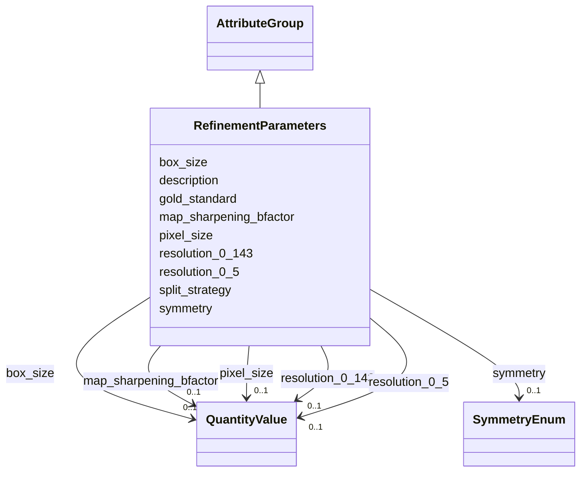

# Class: RefinementParameters 


_Parameters specific to 3D refinement workflows_


URI: [lambdaber:RefinementParameters](https://w3id.org/lambda-ber-schema/RefinementParameters)





## Inheritance
* [AttributeGroup](AttributeGroup.md)
    * **RefinementParameters**


## Slots

| Name | Cardinality and Range | Description | Inheritance |
| ---  | --- | --- | --- |
| [symmetry](symmetry.md) | 0..1 <br/> [SymmetryEnum](SymmetryEnum.md) | Symmetry applied (C1, Cn, Dn, T, O, I) | direct |
| [pixel_size](pixel_size.md) | 0..1 <br/> [QuantityValue](QuantityValue.md) | Pixel size, typically specified in Angstroms per pixel | direct |
| [box_size](box_size.md) | 0..1 <br/> [QuantityValue](QuantityValue.md) | Box size in pixels | direct |
| [gold_standard](gold_standard.md) | 0..1 <br/> [Boolean](Boolean.md) | Whether gold-standard refinement was used | direct |
| [split_strategy](split_strategy.md) | 0..1 <br/> [String](String.md) | Strategy for data splitting | direct |
| [resolution_0_143](resolution_0_143.md) | 0..1 <br/> [QuantityValue](QuantityValue.md) | Resolution at FSC=0 | direct |
| [resolution_0_5](resolution_0_5.md) | 0..1 <br/> [QuantityValue](QuantityValue.md) | Resolution at FSC=0 | direct |
| [map_sharpening_bfactor](map_sharpening_bfactor.md) | 0..1 <br/> [QuantityValue](QuantityValue.md) | B-factor used for map sharpening, typically specified in Angstroms squared (Å... | direct |
| [description](description.md) | 0..1 <br/> [String](String.md) |  | [AttributeGroup](AttributeGroup.md) |


## Usages

| used by | used in | type | used |
| ---  | --- | --- | --- |
| [WorkflowRun](WorkflowRun.md) | [refinement_params](refinement_params.md) | range | [RefinementParameters](RefinementParameters.md) |


## Identifier and Mapping Information


### Schema Source


* from schema: https://w3id.org/lambda-ber-schema/


## Mappings

| Mapping Type | Mapped Value |
| ---  | ---  |
| self | lambdaber:RefinementParameters |
| native | lambdaber:RefinementParameters |


## LinkML Source

<!-- TODO: investigate https://stackoverflow.com/questions/37606292/how-to-create-tabbed-code-blocks-in-mkdocs-or-sphinx -->

### Direct

<details>
```yaml
name: RefinementParameters
description: Parameters specific to 3D refinement workflows
from_schema: https://w3id.org/lambda-ber-schema/
is_a: AttributeGroup
attributes:
  symmetry:
    name: symmetry
    description: Symmetry applied (C1, Cn, Dn, T, O, I)
    from_schema: https://w3id.org/lambda-ber-schema/
    rank: 1000
    domain_of:
    - RefinementParameters
    range: SymmetryEnum
  pixel_size:
    name: pixel_size
    description: Pixel size, typically specified in Angstroms per pixel. Data providers
      may specify alternative units by including the unit in the QuantityValue.
    from_schema: https://w3id.org/lambda-ber-schema/
    domain_of:
    - Image
    - RefinementParameters
    range: QuantityValue
    inlined: true
  box_size:
    name: box_size
    description: Box size in pixels
    from_schema: https://w3id.org/lambda-ber-schema/
    domain_of:
    - ParticlePickingParameters
    - RefinementParameters
    range: QuantityValue
    inlined: true
  gold_standard:
    name: gold_standard
    description: Whether gold-standard refinement was used
    from_schema: https://w3id.org/lambda-ber-schema/
    rank: 1000
    domain_of:
    - RefinementParameters
    range: boolean
  split_strategy:
    name: split_strategy
    description: Strategy for data splitting
    from_schema: https://w3id.org/lambda-ber-schema/
    rank: 1000
    domain_of:
    - RefinementParameters
    range: string
  resolution_0_143:
    name: resolution_0_143
    description: Resolution at FSC=0.143, typically specified in Angstroms. Data providers
      may specify alternative units by including the unit in the QuantityValue.
    from_schema: https://w3id.org/lambda-ber-schema/
    rank: 1000
    domain_of:
    - RefinementParameters
    range: QuantityValue
    inlined: true
  resolution_0_5:
    name: resolution_0_5
    description: Resolution at FSC=0.5, typically specified in Angstroms. Data providers
      may specify alternative units by including the unit in the QuantityValue.
    from_schema: https://w3id.org/lambda-ber-schema/
    rank: 1000
    domain_of:
    - RefinementParameters
    range: QuantityValue
    inlined: true
  map_sharpening_bfactor:
    name: map_sharpening_bfactor
    description: B-factor used for map sharpening, typically specified in Angstroms
      squared (Ų). Data providers may specify alternative units by including the
      unit in the QuantityValue.
    from_schema: https://w3id.org/lambda-ber-schema/
    rank: 1000
    domain_of:
    - RefinementParameters
    range: QuantityValue
    inlined: true

```
</details>

### Induced

<details>
```yaml
name: RefinementParameters
description: Parameters specific to 3D refinement workflows
from_schema: https://w3id.org/lambda-ber-schema/
is_a: AttributeGroup
attributes:
  symmetry:
    name: symmetry
    description: Symmetry applied (C1, Cn, Dn, T, O, I)
    from_schema: https://w3id.org/lambda-ber-schema/
    rank: 1000
    alias: symmetry
    owner: RefinementParameters
    domain_of:
    - RefinementParameters
    range: SymmetryEnum
  pixel_size:
    name: pixel_size
    description: Pixel size, typically specified in Angstroms per pixel. Data providers
      may specify alternative units by including the unit in the QuantityValue.
    from_schema: https://w3id.org/lambda-ber-schema/
    alias: pixel_size
    owner: RefinementParameters
    domain_of:
    - Image
    - RefinementParameters
    range: QuantityValue
    inlined: true
  box_size:
    name: box_size
    description: Box size in pixels
    from_schema: https://w3id.org/lambda-ber-schema/
    alias: box_size
    owner: RefinementParameters
    domain_of:
    - ParticlePickingParameters
    - RefinementParameters
    range: QuantityValue
    inlined: true
  gold_standard:
    name: gold_standard
    description: Whether gold-standard refinement was used
    from_schema: https://w3id.org/lambda-ber-schema/
    rank: 1000
    alias: gold_standard
    owner: RefinementParameters
    domain_of:
    - RefinementParameters
    range: boolean
  split_strategy:
    name: split_strategy
    description: Strategy for data splitting
    from_schema: https://w3id.org/lambda-ber-schema/
    rank: 1000
    alias: split_strategy
    owner: RefinementParameters
    domain_of:
    - RefinementParameters
    range: string
  resolution_0_143:
    name: resolution_0_143
    description: Resolution at FSC=0.143, typically specified in Angstroms. Data providers
      may specify alternative units by including the unit in the QuantityValue.
    from_schema: https://w3id.org/lambda-ber-schema/
    rank: 1000
    alias: resolution_0_143
    owner: RefinementParameters
    domain_of:
    - RefinementParameters
    range: QuantityValue
    inlined: true
  resolution_0_5:
    name: resolution_0_5
    description: Resolution at FSC=0.5, typically specified in Angstroms. Data providers
      may specify alternative units by including the unit in the QuantityValue.
    from_schema: https://w3id.org/lambda-ber-schema/
    rank: 1000
    alias: resolution_0_5
    owner: RefinementParameters
    domain_of:
    - RefinementParameters
    range: QuantityValue
    inlined: true
  map_sharpening_bfactor:
    name: map_sharpening_bfactor
    description: B-factor used for map sharpening, typically specified in Angstroms
      squared (Ų). Data providers may specify alternative units by including the
      unit in the QuantityValue.
    from_schema: https://w3id.org/lambda-ber-schema/
    rank: 1000
    alias: map_sharpening_bfactor
    owner: RefinementParameters
    domain_of:
    - RefinementParameters
    range: QuantityValue
    inlined: true
  description:
    name: description
    from_schema: https://w3id.org/lambda-ber-schema/
    alias: description
    owner: RefinementParameters
    domain_of:
    - NamedThing
    - AttributeGroup
    range: string

```
</details>