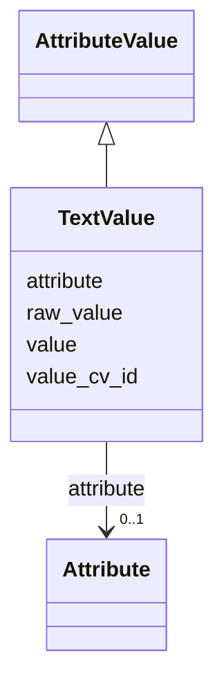

# Class: TextValue 


_A value described using a text string, optionally with a controlled vocabulary ID._


URI: [nmdc:TextValue](https://w3id.org/nmdc/TextValue)





## Inheritance
* [AttributeValue](AttributeValue.md)
    * **TextValue**


## Slots

| Name | Cardinality and Range | Description | Inheritance |
| ---  | --- | --- | --- |
| [value](value.md) | 1 <br/> [String](String.md) | The text value | direct |
| [value_cv_id](value_cv_id.md) | 0..1 <br/> [Curie](Curie.md) | For values in a controlled vocabulary, the CV ID for the value | direct |
| [attribute](attribute.md) | 0..1 <br/> [Attribute](Attribute.md) | The attribute being represented | [AttributeValue](AttributeValue.md) |
| [raw_value](raw_value.md) | 0..1 <br/> [String](String.md) | Unnormalized atomic string representation, suggested syntax {number} {unit} | [AttributeValue](AttributeValue.md) |


## Identifier and Mapping Information


### Schema Source


* from schema: https://w3id.org/lambda-ber-schema/


## Mappings

| Mapping Type | Mapped Value |
| ---  | ---  |
| self | nmdc:TextValue |
| native | lambdaber:TextValue |


## LinkML Source

<!-- TODO: investigate https://stackoverflow.com/questions/37606292/how-to-create-tabbed-code-blocks-in-mkdocs-or-sphinx -->

### Direct

<details>
```yaml
name: TextValue
description: A value described using a text string, optionally with a controlled vocabulary
  ID.
from_schema: https://w3id.org/lambda-ber-schema/
is_a: AttributeValue
attributes:
  value:
    name: value
    description: The text value
    from_schema: https://w3id.org/lambda-ber-schema/types
    domain_of:
    - TextValue
    - DateTimeValue
    - BiophysicalProperty
    range: string
    required: true
  value_cv_id:
    name: value_cv_id
    description: For values in a controlled vocabulary, the CV ID for the value.
    from_schema: https://w3id.org/lambda-ber-schema/types
    domain_of:
    - TextValue
    range: curie
class_uri: nmdc:TextValue

```
</details>

### Induced

<details>
```yaml
name: TextValue
description: A value described using a text string, optionally with a controlled vocabulary
  ID.
from_schema: https://w3id.org/lambda-ber-schema/
is_a: AttributeValue
attributes:
  value:
    name: value
    description: The text value
    from_schema: https://w3id.org/lambda-ber-schema/types
    alias: value
    owner: TextValue
    domain_of:
    - TextValue
    - DateTimeValue
    - BiophysicalProperty
    range: string
    required: true
  value_cv_id:
    name: value_cv_id
    description: For values in a controlled vocabulary, the CV ID for the value.
    from_schema: https://w3id.org/lambda-ber-schema/types
    alias: value_cv_id
    owner: TextValue
    domain_of:
    - TextValue
    range: curie
  attribute:
    name: attribute
    description: The attribute being represented.
    from_schema: https://w3id.org/lambda-ber-schema/types
    alias: attribute
    owner: TextValue
    domain_of:
    - AttributeValue
    range: Attribute
  raw_value:
    name: raw_value
    description: Unnormalized atomic string representation, suggested syntax {number}
      {unit}
    from_schema: https://w3id.org/lambda-ber-schema/types
    alias: raw_value
    owner: TextValue
    domain_of:
    - AttributeValue
    range: string
class_uri: nmdc:TextValue

```
</details>