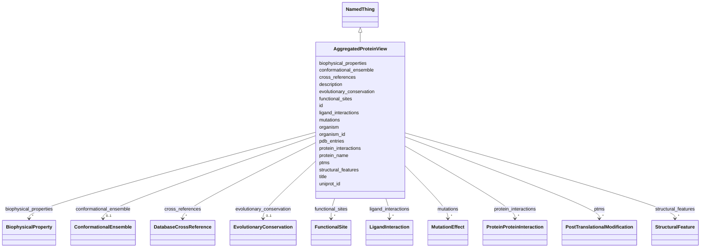

# Class: AggregatedProteinView 


_Aggregated view of all structural and functional data for a protein_


URI: [lambdaber:AggregatedProteinView](https://w3id.org/lambda-ber-schema/AggregatedProteinView)





## Inheritance
* [NamedThing](NamedThing.md)
    * **AggregatedProteinView**


## Slots

| Name | Cardinality and Range | Description | Inheritance |
| ---  | --- | --- | --- |
| [uniprot_id](uniprot_id.md) | 1 <br/> [String](String.md) | UniProt accession | direct |
| [protein_name](protein_name.md) | 1 <br/> [String](String.md) | Protein name | direct |
| [organism](organism.md) | 0..1 <br/> [String](String.md) | Source organism | direct |
| [organism_id](organism_id.md) | 0..1 <br/> [Integer](Integer.md) | NCBI taxonomy ID | direct |
| [pdb_entries](pdb_entries.md) | * <br/> [String](String.md) | All PDB entries for this protein | direct |
| [functional_sites](functional_sites.md) | * <br/> [FunctionalSite](FunctionalSite.md) | All functional site annotations | direct |
| [structural_features](structural_features.md) | * <br/> [StructuralFeature](StructuralFeature.md) | All structural feature annotations | direct |
| [protein_interactions](protein_interactions.md) | * <br/> [ProteinProteinInteraction](ProteinProteinInteraction.md) | All protein-protein interactions | direct |
| [ligand_interactions](ligand_interactions.md) | * <br/> [LigandInteraction](LigandInteraction.md) | All ligand interactions | direct |
| [mutations](mutations.md) | * <br/> [MutationEffect](MutationEffect.md) | All mutation annotations | direct |
| [ptms](ptms.md) | * <br/> [PostTranslationalModification](PostTranslationalModification.md) | All post-translational modifications | direct |
| [biophysical_properties](biophysical_properties.md) | * <br/> [BiophysicalProperty](BiophysicalProperty.md) | All biophysical properties | direct |
| [conformational_ensemble](conformational_ensemble.md) | 0..1 <br/> [ConformationalEnsemble](ConformationalEnsemble.md) | Conformational ensemble data | direct |
| [evolutionary_conservation](evolutionary_conservation.md) | 0..1 <br/> [EvolutionaryConservation](EvolutionaryConservation.md) | Conservation analysis | direct |
| [cross_references](cross_references.md) | * <br/> [DatabaseCrossReference](DatabaseCrossReference.md) | Database cross-references | direct |
| [id](id.md) | 1 <br/> [Uriorcurie](Uriorcurie.md) | Globally unique identifier as an IRI or CURIE for machine processing and exte... | [NamedThing](NamedThing.md) |
| [title](title.md) | 0..1 <br/> [String](String.md) | A human-readable name or title for this entity | [NamedThing](NamedThing.md) |
| [description](description.md) | 0..1 <br/> [String](String.md) | A detailed textual description of this entity | [NamedThing](NamedThing.md) |


## Usages

| used by | used in | type | used |
| ---  | --- | --- | --- |
| [Study](Study.md) | [aggregated_protein_views](aggregated_protein_views.md) | range | [AggregatedProteinView](AggregatedProteinView.md) |


## Identifier and Mapping Information


### Schema Source


* from schema: https://w3id.org/lambda-ber-schema/


## Mappings

| Mapping Type | Mapped Value |
| ---  | ---  |
| self | lambdaber:AggregatedProteinView |
| native | lambdaber:AggregatedProteinView |


## LinkML Source

<!-- TODO: investigate https://stackoverflow.com/questions/37606292/how-to-create-tabbed-code-blocks-in-mkdocs-or-sphinx -->

### Direct

<details>
```yaml
name: AggregatedProteinView
description: Aggregated view of all structural and functional data for a protein
from_schema: https://w3id.org/lambda-ber-schema/
is_a: NamedThing
attributes:
  uniprot_id:
    name: uniprot_id
    description: UniProt accession
    from_schema: https://w3id.org/lambda-ber-schema/functional_annotation
    domain_of:
    - ProteinConstruct
    - AggregatedProteinView
    required: true
  protein_name:
    name: protein_name
    description: Protein name
    from_schema: https://w3id.org/lambda-ber-schema/functional_annotation
    domain_of:
    - Sample
    - AggregatedProteinView
    required: true
  organism:
    name: organism
    description: Source organism
    from_schema: https://w3id.org/lambda-ber-schema/functional_annotation
    domain_of:
    - Sample
    - AggregatedProteinView
  organism_id:
    name: organism_id
    description: NCBI taxonomy ID
    from_schema: https://w3id.org/lambda-ber-schema/functional_annotation
    rank: 1000
    domain_of:
    - AggregatedProteinView
    range: integer
  pdb_entries:
    name: pdb_entries
    description: All PDB entries for this protein
    from_schema: https://w3id.org/lambda-ber-schema/functional_annotation
    domain_of:
    - ConformationalState
    - AggregatedProteinView
    multivalued: true
  functional_sites:
    name: functional_sites
    description: All functional site annotations
    from_schema: https://w3id.org/lambda-ber-schema/functional_annotation
    domain_of:
    - Sample
    - AggregatedProteinView
    range: FunctionalSite
    multivalued: true
    inlined: true
    inlined_as_list: true
  structural_features:
    name: structural_features
    description: All structural feature annotations
    from_schema: https://w3id.org/lambda-ber-schema/functional_annotation
    domain_of:
    - Sample
    - AggregatedProteinView
    range: StructuralFeature
    multivalued: true
    inlined: true
    inlined_as_list: true
  protein_interactions:
    name: protein_interactions
    description: All protein-protein interactions
    from_schema: https://w3id.org/lambda-ber-schema/functional_annotation
    domain_of:
    - Sample
    - AggregatedProteinView
    range: ProteinProteinInteraction
    multivalued: true
    inlined: true
    inlined_as_list: true
  ligand_interactions:
    name: ligand_interactions
    description: All ligand interactions
    from_schema: https://w3id.org/lambda-ber-schema/functional_annotation
    domain_of:
    - Sample
    - FunctionalSite
    - AggregatedProteinView
    range: LigandInteraction
    multivalued: true
    inlined: true
    inlined_as_list: true
  mutations:
    name: mutations
    description: All mutation annotations
    from_schema: https://w3id.org/lambda-ber-schema/functional_annotation
    domain_of:
    - Sample
    - AggregatedProteinView
    range: MutationEffect
    multivalued: true
    inlined: true
    inlined_as_list: true
  ptms:
    name: ptms
    description: All post-translational modifications
    from_schema: https://w3id.org/lambda-ber-schema/functional_annotation
    rank: 1000
    domain_of:
    - AggregatedProteinView
    range: PostTranslationalModification
    multivalued: true
    inlined: true
    inlined_as_list: true
  biophysical_properties:
    name: biophysical_properties
    description: All biophysical properties
    from_schema: https://w3id.org/lambda-ber-schema/functional_annotation
    domain_of:
    - Sample
    - AggregatedProteinView
    range: BiophysicalProperty
    multivalued: true
    inlined: true
    inlined_as_list: true
  conformational_ensemble:
    name: conformational_ensemble
    description: Conformational ensemble data
    from_schema: https://w3id.org/lambda-ber-schema/functional_annotation
    domain_of:
    - Sample
    - AggregatedProteinView
    range: ConformationalEnsemble
    inlined: true
  evolutionary_conservation:
    name: evolutionary_conservation
    description: Conservation analysis
    from_schema: https://w3id.org/lambda-ber-schema/functional_annotation
    domain_of:
    - Sample
    - AggregatedProteinView
    range: EvolutionaryConservation
    inlined: true
  cross_references:
    name: cross_references
    description: Database cross-references
    from_schema: https://w3id.org/lambda-ber-schema/functional_annotation
    rank: 1000
    domain_of:
    - AggregatedProteinView
    range: DatabaseCrossReference
    multivalued: true
    inlined: true
    inlined_as_list: true

```
</details>

### Induced

<details>
```yaml
name: AggregatedProteinView
description: Aggregated view of all structural and functional data for a protein
from_schema: https://w3id.org/lambda-ber-schema/
is_a: NamedThing
attributes:
  uniprot_id:
    name: uniprot_id
    description: UniProt accession
    from_schema: https://w3id.org/lambda-ber-schema/functional_annotation
    alias: uniprot_id
    owner: AggregatedProteinView
    domain_of:
    - ProteinConstruct
    - AggregatedProteinView
    range: string
    required: true
  protein_name:
    name: protein_name
    description: Protein name
    from_schema: https://w3id.org/lambda-ber-schema/functional_annotation
    alias: protein_name
    owner: AggregatedProteinView
    domain_of:
    - Sample
    - AggregatedProteinView
    range: string
    required: true
  organism:
    name: organism
    description: Source organism
    from_schema: https://w3id.org/lambda-ber-schema/functional_annotation
    alias: organism
    owner: AggregatedProteinView
    domain_of:
    - Sample
    - AggregatedProteinView
    range: string
  organism_id:
    name: organism_id
    description: NCBI taxonomy ID
    from_schema: https://w3id.org/lambda-ber-schema/functional_annotation
    rank: 1000
    alias: organism_id
    owner: AggregatedProteinView
    domain_of:
    - AggregatedProteinView
    range: integer
  pdb_entries:
    name: pdb_entries
    description: All PDB entries for this protein
    from_schema: https://w3id.org/lambda-ber-schema/functional_annotation
    alias: pdb_entries
    owner: AggregatedProteinView
    domain_of:
    - ConformationalState
    - AggregatedProteinView
    range: string
    multivalued: true
  functional_sites:
    name: functional_sites
    description: All functional site annotations
    from_schema: https://w3id.org/lambda-ber-schema/functional_annotation
    alias: functional_sites
    owner: AggregatedProteinView
    domain_of:
    - Sample
    - AggregatedProteinView
    range: FunctionalSite
    multivalued: true
    inlined: true
    inlined_as_list: true
  structural_features:
    name: structural_features
    description: All structural feature annotations
    from_schema: https://w3id.org/lambda-ber-schema/functional_annotation
    alias: structural_features
    owner: AggregatedProteinView
    domain_of:
    - Sample
    - AggregatedProteinView
    range: StructuralFeature
    multivalued: true
    inlined: true
    inlined_as_list: true
  protein_interactions:
    name: protein_interactions
    description: All protein-protein interactions
    from_schema: https://w3id.org/lambda-ber-schema/functional_annotation
    alias: protein_interactions
    owner: AggregatedProteinView
    domain_of:
    - Sample
    - AggregatedProteinView
    range: ProteinProteinInteraction
    multivalued: true
    inlined: true
    inlined_as_list: true
  ligand_interactions:
    name: ligand_interactions
    description: All ligand interactions
    from_schema: https://w3id.org/lambda-ber-schema/functional_annotation
    alias: ligand_interactions
    owner: AggregatedProteinView
    domain_of:
    - Sample
    - FunctionalSite
    - AggregatedProteinView
    range: LigandInteraction
    multivalued: true
    inlined: true
    inlined_as_list: true
  mutations:
    name: mutations
    description: All mutation annotations
    from_schema: https://w3id.org/lambda-ber-schema/functional_annotation
    alias: mutations
    owner: AggregatedProteinView
    domain_of:
    - Sample
    - AggregatedProteinView
    range: MutationEffect
    multivalued: true
    inlined: true
    inlined_as_list: true
  ptms:
    name: ptms
    description: All post-translational modifications
    from_schema: https://w3id.org/lambda-ber-schema/functional_annotation
    rank: 1000
    alias: ptms
    owner: AggregatedProteinView
    domain_of:
    - AggregatedProteinView
    range: PostTranslationalModification
    multivalued: true
    inlined: true
    inlined_as_list: true
  biophysical_properties:
    name: biophysical_properties
    description: All biophysical properties
    from_schema: https://w3id.org/lambda-ber-schema/functional_annotation
    alias: biophysical_properties
    owner: AggregatedProteinView
    domain_of:
    - Sample
    - AggregatedProteinView
    range: BiophysicalProperty
    multivalued: true
    inlined: true
    inlined_as_list: true
  conformational_ensemble:
    name: conformational_ensemble
    description: Conformational ensemble data
    from_schema: https://w3id.org/lambda-ber-schema/functional_annotation
    alias: conformational_ensemble
    owner: AggregatedProteinView
    domain_of:
    - Sample
    - AggregatedProteinView
    range: ConformationalEnsemble
    inlined: true
  evolutionary_conservation:
    name: evolutionary_conservation
    description: Conservation analysis
    from_schema: https://w3id.org/lambda-ber-schema/functional_annotation
    alias: evolutionary_conservation
    owner: AggregatedProteinView
    domain_of:
    - Sample
    - AggregatedProteinView
    range: EvolutionaryConservation
    inlined: true
  cross_references:
    name: cross_references
    description: Database cross-references
    from_schema: https://w3id.org/lambda-ber-schema/functional_annotation
    rank: 1000
    alias: cross_references
    owner: AggregatedProteinView
    domain_of:
    - AggregatedProteinView
    range: DatabaseCrossReference
    multivalued: true
    inlined: true
    inlined_as_list: true
  id:
    name: id
    description: Globally unique identifier as an IRI or CURIE for machine processing
      and external references. Used for linking data across systems and semantic web
      integration.
    from_schema: https://w3id.org/lambda-ber-schema/
    rank: 1000
    identifier: true
    alias: id
    owner: AggregatedProteinView
    domain_of:
    - NamedThing
    range: uriorcurie
    required: true
  title:
    name: title
    description: A human-readable name or title for this entity
    from_schema: https://w3id.org/lambda-ber-schema/
    rank: 1000
    slot_uri: dcterms:title
    alias: title
    owner: AggregatedProteinView
    domain_of:
    - NamedThing
    range: string
  description:
    name: description
    description: A detailed textual description of this entity
    from_schema: https://w3id.org/lambda-ber-schema/
    rank: 1000
    alias: description
    owner: AggregatedProteinView
    domain_of:
    - NamedThing
    - AttributeGroup
    range: string

```
</details>