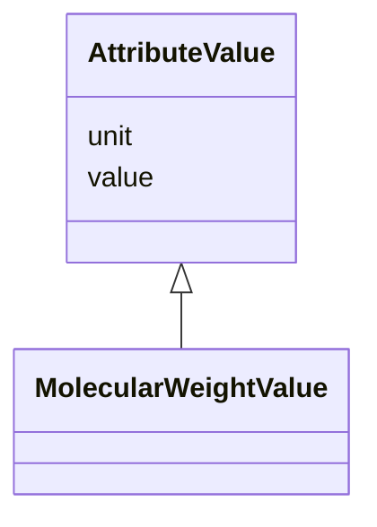

# Class: AttributeValue 


_"A numerical value for a specific attribute along with its metadata, including its unit of measurement, expressed as a string corresponding to the UCUM code."_


URI: [lambdaber:AttributeValue](https://w3id.org/lambda-ber-schema/AttributeValue)





## Inheritance
* **AttributeValue**
    * [MolecularWeightValue](MolecularWeightValue.md)


## Slots

| Name | Cardinality and Range | Description | Inheritance |
| ---  | --- | --- | --- |
| [value](value.md) | 0..1 <br/> [Float](Float.md) | The numerical value of the attribute | direct |
| [unit](unit.md) | 0..1 <br/> [String](String.md) | The unit of measurement for the attribute value | direct |


## Identifier and Mapping Information


### Schema Source


* from schema: https://w3id.org/lambda-ber-schema/


## Mappings

| Mapping Type | Mapped Value |
| ---  | ---  |
| self | lambdaber:AttributeValue |
| native | lambdaber:AttributeValue |


## LinkML Source

<!-- TODO: investigate https://stackoverflow.com/questions/37606292/how-to-create-tabbed-code-blocks-in-mkdocs-or-sphinx -->

### Direct

<details>
```yaml
name: AttributeValue
description: '"A numerical value for a specific attribute along with its metadata,
  including its unit of measurement, expressed as a string corresponding to the UCUM
  code."'
from_schema: https://w3id.org/lambda-ber-schema/
attributes:
  value:
    name: value
    description: The numerical value of the attribute
    from_schema: https://w3id.org/lambda-ber-schema/
    rank: 1000
    domain_of:
    - AttributeValue
    - BiophysicalProperty
    range: float
  unit:
    name: unit
    description: The unit of measurement for the attribute value
    comments:
    - UCUM code representing the unit (e.g., 'kDa' for kilodaltons, 'Cel' for degrees
      Celsius)
    from_schema: https://w3id.org/lambda-ber-schema/
    rank: 1000
    domain_of:
    - AttributeValue
    - BiophysicalProperty
    range: string

```
</details>

### Induced

<details>
```yaml
name: AttributeValue
description: '"A numerical value for a specific attribute along with its metadata,
  including its unit of measurement, expressed as a string corresponding to the UCUM
  code."'
from_schema: https://w3id.org/lambda-ber-schema/
attributes:
  value:
    name: value
    description: The numerical value of the attribute
    from_schema: https://w3id.org/lambda-ber-schema/
    rank: 1000
    alias: value
    owner: AttributeValue
    domain_of:
    - AttributeValue
    - BiophysicalProperty
    range: float
  unit:
    name: unit
    description: The unit of measurement for the attribute value
    comments:
    - UCUM code representing the unit (e.g., 'kDa' for kilodaltons, 'Cel' for degrees
      Celsius)
    from_schema: https://w3id.org/lambda-ber-schema/
    rank: 1000
    alias: unit
    owner: AttributeValue
    domain_of:
    - AttributeValue
    - BiophysicalProperty
    range: string

```
</details>