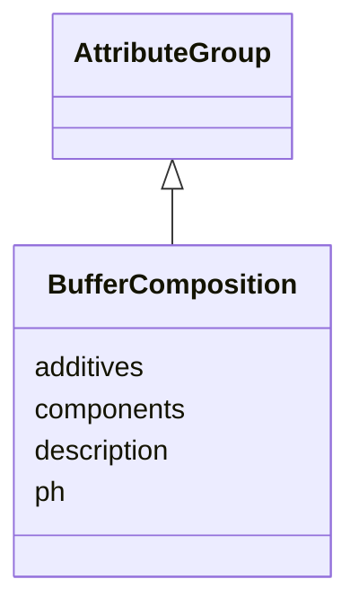

# Class: BufferComposition 


_Buffer composition for sample storage_


URI: [lambdaber:BufferComposition](https://w3id.org/lambda-ber-schema/BufferComposition)





## Inheritance
* [AttributeGroup](AttributeGroup.md)
    * **BufferComposition**


## Slots

| Name | Cardinality and Range | Description | Inheritance |
| ---  | --- | --- | --- |
| [ph](ph.md) | 0..1 <br/> [Float](Float.md) | pH of the buffer | direct |
| [components](components.md) | * <br/> [String](String.md) | Buffer components and their concentrations | direct |
| [additives](additives.md) | * <br/> [String](String.md) | Additional additives in the buffer | direct |
| [description](description.md) | 0..1 <br/> [String](String.md) |  | [AttributeGroup](AttributeGroup.md) |


## Usages

| used by | used in | type | used |
| ---  | --- | --- | --- |
| [Sample](Sample.md) | [buffer_composition](buffer_composition.md) | range | [BufferComposition](BufferComposition.md) |
| [MeasurementConditions](MeasurementConditions.md) | [buffer_composition](buffer_composition.md) | range | [BufferComposition](BufferComposition.md) |


## Identifier and Mapping Information


### Schema Source


* from schema: https://w3id.org/lambda-ber-schema/


## Mappings

| Mapping Type | Mapped Value |
| ---  | ---  |
| self | lambdaber:BufferComposition |
| native | lambdaber:BufferComposition |


## LinkML Source

<!-- TODO: investigate https://stackoverflow.com/questions/37606292/how-to-create-tabbed-code-blocks-in-mkdocs-or-sphinx -->

### Direct

<details>
```yaml
name: BufferComposition
description: Buffer composition for sample storage
from_schema: https://w3id.org/lambda-ber-schema/
is_a: AttributeGroup
attributes:
  ph:
    name: ph
    description: pH of the buffer
    from_schema: https://w3id.org/lambda-ber-schema/
    rank: 1000
    domain_of:
    - BufferComposition
    - MeasurementConditions
    range: float
    minimum_value: 0
    maximum_value: 14
  components:
    name: components
    description: Buffer components and their concentrations
    from_schema: https://w3id.org/lambda-ber-schema/
    rank: 1000
    domain_of:
    - BufferComposition
    range: string
    multivalued: true
  additives:
    name: additives
    description: Additional additives in the buffer
    from_schema: https://w3id.org/lambda-ber-schema/
    rank: 1000
    domain_of:
    - BufferComposition
    - XRayPreparation
    range: string
    multivalued: true

```
</details>

### Induced

<details>
```yaml
name: BufferComposition
description: Buffer composition for sample storage
from_schema: https://w3id.org/lambda-ber-schema/
is_a: AttributeGroup
attributes:
  ph:
    name: ph
    description: pH of the buffer
    from_schema: https://w3id.org/lambda-ber-schema/
    rank: 1000
    alias: ph
    owner: BufferComposition
    domain_of:
    - BufferComposition
    - MeasurementConditions
    range: float
    minimum_value: 0
    maximum_value: 14
  components:
    name: components
    description: Buffer components and their concentrations
    from_schema: https://w3id.org/lambda-ber-schema/
    rank: 1000
    alias: components
    owner: BufferComposition
    domain_of:
    - BufferComposition
    range: string
    multivalued: true
  additives:
    name: additives
    description: Additional additives in the buffer
    from_schema: https://w3id.org/lambda-ber-schema/
    rank: 1000
    alias: additives
    owner: BufferComposition
    domain_of:
    - BufferComposition
    - XRayPreparation
    range: string
    multivalued: true
  description:
    name: description
    from_schema: https://w3id.org/lambda-ber-schema/
    alias: description
    owner: BufferComposition
    domain_of:
    - NamedThing
    - AttributeGroup
    range: string

```
</details>