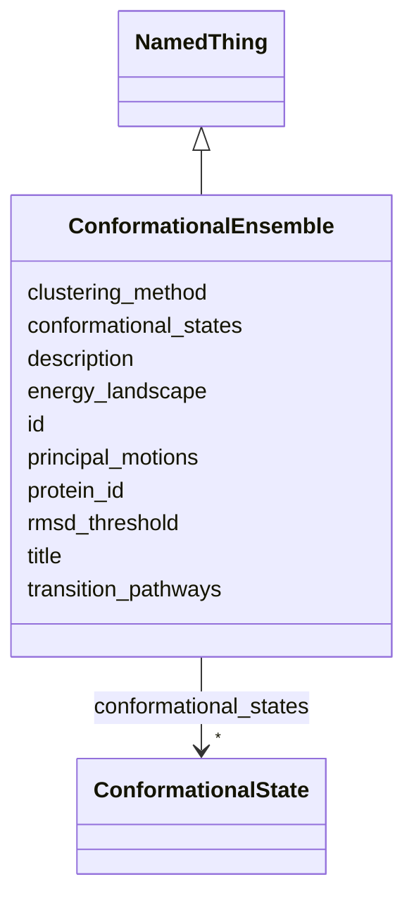

# Class: ConformationalEnsemble 


_Ensemble of conformational states for a protein_


URI: [lambdaber:ConformationalEnsemble](https://w3id.org/lambda-ber-schema/ConformationalEnsemble)





## Inheritance
* [NamedThing](NamedThing.md)
    * **ConformationalEnsemble**


## Slots

| Name | Cardinality and Range | Description | Inheritance |
| ---  | --- | --- | --- |
| [protein_id](protein_id.md) | 1 <br/> [String](String.md) | UniProt accession | direct |
| [conformational_states](conformational_states.md) | * <br/> [ConformationalState](ConformationalState.md) | Individual conformational states | direct |
| [clustering_method](clustering_method.md) | 0..1 <br/> [String](String.md) | Method used for conformational clustering | direct |
| [rmsd_threshold](rmsd_threshold.md) | 0..1 <br/> [Float](Float.md) | RMSD threshold for clustering (Angstroms) | direct |
| [transition_pathways](transition_pathways.md) | 0..1 <br/> [String](String.md) | Description of transition pathways between states | direct |
| [energy_landscape](energy_landscape.md) | 0..1 <br/> [String](String.md) | Description of the energy landscape | direct |
| [principal_motions](principal_motions.md) | * <br/> [String](String.md) | Description of principal motions | direct |
| [id](id.md) | 1 <br/> [Uriorcurie](Uriorcurie.md) | Globally unique identifier as an IRI or CURIE for machine processing and exte... | [NamedThing](NamedThing.md) |
| [title](title.md) | 0..1 <br/> [String](String.md) |  | [NamedThing](NamedThing.md) |
| [description](description.md) | 0..1 <br/> [String](String.md) |  | [NamedThing](NamedThing.md) |


## Usages

| used by | used in | type | used |
| ---  | --- | --- | --- |
| [Sample](Sample.md) | [conformational_ensemble](conformational_ensemble.md) | range | [ConformationalEnsemble](ConformationalEnsemble.md) |
| [AggregatedProteinView](AggregatedProteinView.md) | [conformational_ensemble](conformational_ensemble.md) | range | [ConformationalEnsemble](ConformationalEnsemble.md) |


## Identifier and Mapping Information


### Schema Source


* from schema: https://w3id.org/lambda-ber-schema/


## Mappings

| Mapping Type | Mapped Value |
| ---  | ---  |
| self | lambdaber:ConformationalEnsemble |
| native | lambdaber:ConformationalEnsemble |


## LinkML Source

<!-- TODO: investigate https://stackoverflow.com/questions/37606292/how-to-create-tabbed-code-blocks-in-mkdocs-or-sphinx -->

### Direct

<details>
```yaml
name: ConformationalEnsemble
description: Ensemble of conformational states for a protein
from_schema: https://w3id.org/lambda-ber-schema/
is_a: NamedThing
attributes:
  protein_id:
    name: protein_id
    description: UniProt accession
    from_schema: https://w3id.org/lambda-ber-schema/functional_annotation
    domain_of:
    - ProteinAnnotation
    - ConformationalEnsemble
    required: true
  conformational_states:
    name: conformational_states
    description: Individual conformational states
    from_schema: https://w3id.org/lambda-ber-schema/functional_annotation
    rank: 1000
    domain_of:
    - ConformationalEnsemble
    range: ConformationalState
    multivalued: true
    inlined: true
    inlined_as_list: true
  clustering_method:
    name: clustering_method
    description: Method used for conformational clustering
    from_schema: https://w3id.org/lambda-ber-schema/functional_annotation
    rank: 1000
    domain_of:
    - ConformationalEnsemble
  rmsd_threshold:
    name: rmsd_threshold
    description: RMSD threshold for clustering (Angstroms)
    from_schema: https://w3id.org/lambda-ber-schema/functional_annotation
    rank: 1000
    domain_of:
    - ConformationalEnsemble
    range: float
    unit:
      ucum_code: Angstrom
  transition_pathways:
    name: transition_pathways
    description: Description of transition pathways between states
    from_schema: https://w3id.org/lambda-ber-schema/functional_annotation
    rank: 1000
    domain_of:
    - ConformationalEnsemble
  energy_landscape:
    name: energy_landscape
    description: Description of the energy landscape
    from_schema: https://w3id.org/lambda-ber-schema/functional_annotation
    rank: 1000
    domain_of:
    - ConformationalEnsemble
  principal_motions:
    name: principal_motions
    description: Description of principal motions
    from_schema: https://w3id.org/lambda-ber-schema/functional_annotation
    rank: 1000
    domain_of:
    - ConformationalEnsemble
    multivalued: true

```
</details>

### Induced

<details>
```yaml
name: ConformationalEnsemble
description: Ensemble of conformational states for a protein
from_schema: https://w3id.org/lambda-ber-schema/
is_a: NamedThing
attributes:
  protein_id:
    name: protein_id
    description: UniProt accession
    from_schema: https://w3id.org/lambda-ber-schema/functional_annotation
    alias: protein_id
    owner: ConformationalEnsemble
    domain_of:
    - ProteinAnnotation
    - ConformationalEnsemble
    range: string
    required: true
  conformational_states:
    name: conformational_states
    description: Individual conformational states
    from_schema: https://w3id.org/lambda-ber-schema/functional_annotation
    rank: 1000
    alias: conformational_states
    owner: ConformationalEnsemble
    domain_of:
    - ConformationalEnsemble
    range: ConformationalState
    multivalued: true
    inlined: true
    inlined_as_list: true
  clustering_method:
    name: clustering_method
    description: Method used for conformational clustering
    from_schema: https://w3id.org/lambda-ber-schema/functional_annotation
    rank: 1000
    alias: clustering_method
    owner: ConformationalEnsemble
    domain_of:
    - ConformationalEnsemble
    range: string
  rmsd_threshold:
    name: rmsd_threshold
    description: RMSD threshold for clustering (Angstroms)
    from_schema: https://w3id.org/lambda-ber-schema/functional_annotation
    rank: 1000
    alias: rmsd_threshold
    owner: ConformationalEnsemble
    domain_of:
    - ConformationalEnsemble
    range: float
    unit:
      ucum_code: Angstrom
  transition_pathways:
    name: transition_pathways
    description: Description of transition pathways between states
    from_schema: https://w3id.org/lambda-ber-schema/functional_annotation
    rank: 1000
    alias: transition_pathways
    owner: ConformationalEnsemble
    domain_of:
    - ConformationalEnsemble
    range: string
  energy_landscape:
    name: energy_landscape
    description: Description of the energy landscape
    from_schema: https://w3id.org/lambda-ber-schema/functional_annotation
    rank: 1000
    alias: energy_landscape
    owner: ConformationalEnsemble
    domain_of:
    - ConformationalEnsemble
    range: string
  principal_motions:
    name: principal_motions
    description: Description of principal motions
    from_schema: https://w3id.org/lambda-ber-schema/functional_annotation
    rank: 1000
    alias: principal_motions
    owner: ConformationalEnsemble
    domain_of:
    - ConformationalEnsemble
    range: string
    multivalued: true
  id:
    name: id
    description: Globally unique identifier as an IRI or CURIE for machine processing
      and external references. Used for linking data across systems and semantic web
      integration.
    from_schema: https://w3id.org/lambda-ber-schema/
    rank: 1000
    identifier: true
    alias: id
    owner: ConformationalEnsemble
    domain_of:
    - NamedThing
    range: uriorcurie
    required: true
  title:
    name: title
    from_schema: https://w3id.org/lambda-ber-schema/
    rank: 1000
    slot_uri: dcterms:title
    alias: title
    owner: ConformationalEnsemble
    domain_of:
    - NamedThing
    range: string
  description:
    name: description
    from_schema: https://w3id.org/lambda-ber-schema/
    rank: 1000
    alias: description
    owner: ConformationalEnsemble
    domain_of:
    - NamedThing
    - AttributeGroup
    range: string

```
</details>