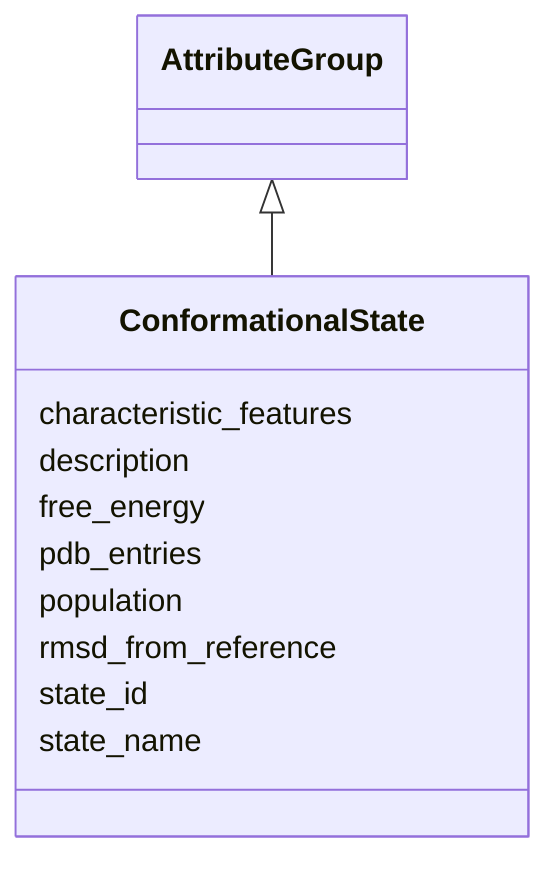

# Class: ConformationalState 


_Individual conformational state_


URI: [lambdaber:ConformationalState](https://w3id.org/lambda-ber-schema/ConformationalState)





## Inheritance
* [AttributeGroup](AttributeGroup.md)
    * **ConformationalState**


## Slots

| Name | Cardinality and Range | Description | Inheritance |
| ---  | --- | --- | --- |
| [state_id](state_id.md) | 1 <br/> [String](String.md) | Identifier for this state | direct |
| [state_name](state_name.md) | 0..1 <br/> [String](String.md) | Descriptive name (e | direct |
| [pdb_entries](pdb_entries.md) | * <br/> [String](String.md) | PDB entries representing this state | direct |
| [population](population.md) | 0..1 <br/> [Float](Float.md) | Relative population of this state | direct |
| [free_energy](free_energy.md) | 0..1 <br/> [Float](Float.md) | Relative free energy (kcal/mol) | direct |
| [rmsd_from_reference](rmsd_from_reference.md) | 0..1 <br/> [Float](Float.md) | RMSD from reference structure | direct |
| [characteristic_features](characteristic_features.md) | * <br/> [String](String.md) | Key features of this conformation | direct |
| [description](description.md) | 0..1 <br/> [String](String.md) |  | [AttributeGroup](AttributeGroup.md) |


## Usages

| used by | used in | type | used |
| ---  | --- | --- | --- |
| [ConformationalEnsemble](ConformationalEnsemble.md) | [conformational_states](conformational_states.md) | range | [ConformationalState](ConformationalState.md) |


## Identifier and Mapping Information


### Schema Source


* from schema: https://w3id.org/lambda-ber-schema/


## Mappings

| Mapping Type | Mapped Value |
| ---  | ---  |
| self | lambdaber:ConformationalState |
| native | lambdaber:ConformationalState |


## LinkML Source

<!-- TODO: investigate https://stackoverflow.com/questions/37606292/how-to-create-tabbed-code-blocks-in-mkdocs-or-sphinx -->

### Direct

<details>
```yaml
name: ConformationalState
description: Individual conformational state
from_schema: https://w3id.org/lambda-ber-schema/
is_a: AttributeGroup
attributes:
  state_id:
    name: state_id
    description: Identifier for this state
    from_schema: https://w3id.org/lambda-ber-schema/functional_annotation
    rank: 1000
    domain_of:
    - ConformationalState
    required: true
  state_name:
    name: state_name
    description: Descriptive name (e.g., 'open', 'closed')
    from_schema: https://w3id.org/lambda-ber-schema/functional_annotation
    rank: 1000
    domain_of:
    - ConformationalState
  pdb_entries:
    name: pdb_entries
    description: PDB entries representing this state
    from_schema: https://w3id.org/lambda-ber-schema/functional_annotation
    rank: 1000
    domain_of:
    - ConformationalState
    - AggregatedProteinView
    multivalued: true
  population:
    name: population
    description: Relative population of this state
    from_schema: https://w3id.org/lambda-ber-schema/functional_annotation
    rank: 1000
    domain_of:
    - ConformationalState
    range: float
    minimum_value: 0
    maximum_value: 1
  free_energy:
    name: free_energy
    description: Relative free energy (kcal/mol)
    from_schema: https://w3id.org/lambda-ber-schema/functional_annotation
    rank: 1000
    domain_of:
    - ConformationalState
    range: float
    unit:
      ucum_code: kcal/mol
  rmsd_from_reference:
    name: rmsd_from_reference
    description: RMSD from reference structure
    from_schema: https://w3id.org/lambda-ber-schema/functional_annotation
    rank: 1000
    domain_of:
    - ConformationalState
    range: float
    unit:
      ucum_code: Angstrom
  characteristic_features:
    name: characteristic_features
    description: Key features of this conformation
    from_schema: https://w3id.org/lambda-ber-schema/functional_annotation
    rank: 1000
    domain_of:
    - ConformationalState
    multivalued: true

```
</details>

### Induced

<details>
```yaml
name: ConformationalState
description: Individual conformational state
from_schema: https://w3id.org/lambda-ber-schema/
is_a: AttributeGroup
attributes:
  state_id:
    name: state_id
    description: Identifier for this state
    from_schema: https://w3id.org/lambda-ber-schema/functional_annotation
    rank: 1000
    alias: state_id
    owner: ConformationalState
    domain_of:
    - ConformationalState
    range: string
    required: true
  state_name:
    name: state_name
    description: Descriptive name (e.g., 'open', 'closed')
    from_schema: https://w3id.org/lambda-ber-schema/functional_annotation
    rank: 1000
    alias: state_name
    owner: ConformationalState
    domain_of:
    - ConformationalState
    range: string
  pdb_entries:
    name: pdb_entries
    description: PDB entries representing this state
    from_schema: https://w3id.org/lambda-ber-schema/functional_annotation
    rank: 1000
    alias: pdb_entries
    owner: ConformationalState
    domain_of:
    - ConformationalState
    - AggregatedProteinView
    range: string
    multivalued: true
  population:
    name: population
    description: Relative population of this state
    from_schema: https://w3id.org/lambda-ber-schema/functional_annotation
    rank: 1000
    alias: population
    owner: ConformationalState
    domain_of:
    - ConformationalState
    range: float
    minimum_value: 0
    maximum_value: 1
  free_energy:
    name: free_energy
    description: Relative free energy (kcal/mol)
    from_schema: https://w3id.org/lambda-ber-schema/functional_annotation
    rank: 1000
    alias: free_energy
    owner: ConformationalState
    domain_of:
    - ConformationalState
    range: float
    unit:
      ucum_code: kcal/mol
  rmsd_from_reference:
    name: rmsd_from_reference
    description: RMSD from reference structure
    from_schema: https://w3id.org/lambda-ber-schema/functional_annotation
    rank: 1000
    alias: rmsd_from_reference
    owner: ConformationalState
    domain_of:
    - ConformationalState
    range: float
    unit:
      ucum_code: Angstrom
  characteristic_features:
    name: characteristic_features
    description: Key features of this conformation
    from_schema: https://w3id.org/lambda-ber-schema/functional_annotation
    rank: 1000
    alias: characteristic_features
    owner: ConformationalState
    domain_of:
    - ConformationalState
    range: string
    multivalued: true
  description:
    name: description
    from_schema: https://w3id.org/lambda-ber-schema/
    alias: description
    owner: ConformationalState
    domain_of:
    - NamedThing
    - AttributeGroup
    range: string

```
</details>