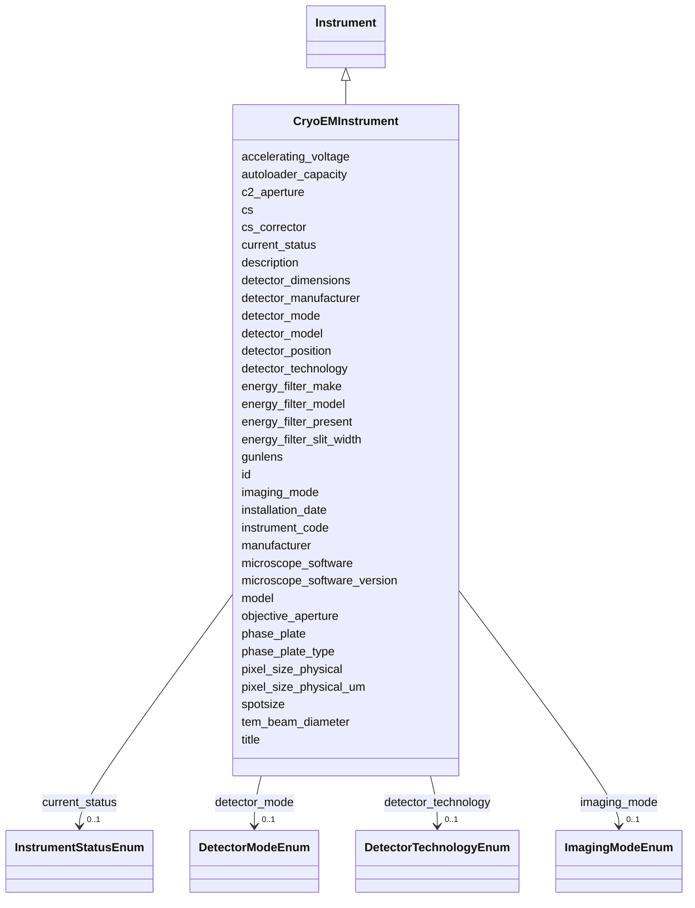

# Class: CryoEMInstrument 


_Cryo-EM microscope specifications_


URI: [lambdaber:CryoEMInstrument](https://w3id.org/lambda-ber-schema/CryoEMInstrument)





## Inheritance
* [NamedThing](NamedThing.md)
    * [Instrument](Instrument.md)
        * **CryoEMInstrument**


## Slots

| Name | Cardinality and Range | Description | Inheritance |
| ---  | --- | --- | --- |
| [accelerating_voltage](accelerating_voltage.md) | 0..1 <br/> [Integer](Integer.md) | Accelerating voltage in kV | direct |
| [cs_corrector](cs_corrector.md) | 0..1 <br/> [Boolean](Boolean.md) | Spherical aberration corrector present | direct |
| [phase_plate](phase_plate.md) | 0..1 <br/> [Boolean](Boolean.md) | Phase plate available | direct |
| [detector_technology](detector_technology.md) | 0..1 <br/> [DetectorTechnologyEnum](DetectorTechnologyEnum.md) | Generic detector technology type | direct |
| [detector_manufacturer](detector_manufacturer.md) | 0..1 <br/> [String](String.md) | Detector manufacturer (e | direct |
| [detector_model](detector_model.md) | 0..1 <br/> [String](String.md) | Detector model (e | direct |
| [detector_mode](detector_mode.md) | 0..1 <br/> [DetectorModeEnum](DetectorModeEnum.md) | Supported or default detector operating mode | direct |
| [detector_position](detector_position.md) | 0..1 <br/> [String](String.md) | Physical position of detector in microscope (e | direct |
| [detector_dimensions](detector_dimensions.md) | 0..1 <br/> [String](String.md) | Detector dimensions in pixels (e | direct |
| [pixel_size_physical_um](pixel_size_physical_um.md) | 0..1 <br/> [Float](Float.md) | Physical pixel size of the detector in micrometers | direct |
| [autoloader_capacity](autoloader_capacity.md) | 0..1 <br/> [Integer](Integer.md) | Number of grids the autoloader can hold | direct |
| [cs](cs.md) | 0..1 <br/> [Float](Float.md) | Spherical aberration (Cs) in millimeters | direct |
| [c2_aperture](c2_aperture.md) | 0..1 <br/> [Float](Float.md) | C2 aperture size in micrometers | direct |
| [objective_aperture](objective_aperture.md) | 0..1 <br/> [Float](Float.md) | Objective aperture size in micrometers | direct |
| [phase_plate_type](phase_plate_type.md) | 0..1 <br/> [String](String.md) | Type of phase plate if present | direct |
| [energy_filter_present](energy_filter_present.md) | 0..1 <br/> [Boolean](Boolean.md) | Whether energy filter is present | direct |
| [energy_filter_make](energy_filter_make.md) | 0..1 <br/> [String](String.md) | Energy filter manufacturer | direct |
| [energy_filter_model](energy_filter_model.md) | 0..1 <br/> [String](String.md) | Energy filter model | direct |
| [energy_filter_slit_width](energy_filter_slit_width.md) | 0..1 <br/> [Float](Float.md) | Energy filter slit width in eV | direct |
| [pixel_size_physical](pixel_size_physical.md) | 0..1 <br/> [Float](Float.md) | Physical pixel size in micrometers | direct |
| [microscope_software](microscope_software.md) | 0..1 <br/> [String](String.md) | Microscope control software (e | direct |
| [microscope_software_version](microscope_software_version.md) | 0..1 <br/> [String](String.md) | Software version | direct |
| [spotsize](spotsize.md) | 0..1 <br/> [Integer](Integer.md) | Electron beam spot size setting | direct |
| [gunlens](gunlens.md) | 0..1 <br/> [Integer](Integer.md) | Gun lens setting | direct |
| [imaging_mode](imaging_mode.md) | 0..1 <br/> [ImagingModeEnum](ImagingModeEnum.md) | Imaging mode for electron microscopy | direct |
| [tem_beam_diameter](tem_beam_diameter.md) | 0..1 <br/> [Float](Float.md) | TEM beam diameter in micrometers | direct |
| [instrument_code](instrument_code.md) | 1 <br/> [String](String.md) | Human-friendly facility or laboratory identifier for the instrument (e | [Instrument](Instrument.md) |
| [manufacturer](manufacturer.md) | 0..1 <br/> [String](String.md) | Instrument manufacturer | [Instrument](Instrument.md) |
| [model](model.md) | 0..1 <br/> [String](String.md) | Instrument model | [Instrument](Instrument.md) |
| [installation_date](installation_date.md) | 0..1 <br/> [String](String.md) | Date of instrument installation | [Instrument](Instrument.md) |
| [current_status](current_status.md) | 0..1 <br/> [InstrumentStatusEnum](InstrumentStatusEnum.md) | Current operational status | [Instrument](Instrument.md) |
| [id](id.md) | 1 <br/> [Uriorcurie](Uriorcurie.md) | Globally unique identifier as an IRI or CURIE for machine processing and exte... | [NamedThing](NamedThing.md) |
| [title](title.md) | 0..1 <br/> [String](String.md) |  | [NamedThing](NamedThing.md) |
| [description](description.md) | 0..1 <br/> [String](String.md) |  | [NamedThing](NamedThing.md) |


## Identifier and Mapping Information


### Schema Source


* from schema: https://w3id.org/lambda-ber-schema/


## Mappings

| Mapping Type | Mapped Value |
| ---  | ---  |
| self | lambdaber:CryoEMInstrument |
| native | lambdaber:CryoEMInstrument |


## LinkML Source

<!-- TODO: investigate https://stackoverflow.com/questions/37606292/how-to-create-tabbed-code-blocks-in-mkdocs-or-sphinx -->

### Direct

<details>
```yaml
name: CryoEMInstrument
description: Cryo-EM microscope specifications
from_schema: https://w3id.org/lambda-ber-schema/
is_a: Instrument
attributes:
  accelerating_voltage:
    name: accelerating_voltage
    description: Accelerating voltage in kV
    from_schema: https://w3id.org/lambda-ber-schema/
    rank: 1000
    domain_of:
    - CryoEMInstrument
    range: integer
    any_of:
    - equals_number: 120
    - equals_number: 200
    - equals_number: 300
  cs_corrector:
    name: cs_corrector
    description: Spherical aberration corrector present
    from_schema: https://w3id.org/lambda-ber-schema/
    rank: 1000
    domain_of:
    - CryoEMInstrument
    range: boolean
  phase_plate:
    name: phase_plate
    description: Phase plate available
    from_schema: https://w3id.org/lambda-ber-schema/
    rank: 1000
    domain_of:
    - CryoEMInstrument
    range: boolean
  detector_technology:
    name: detector_technology
    description: Generic detector technology type
    comments:
    - Use this for technology classification (e.g., direct_electron_detector, ccd)
    - See detector_manufacturer and detector_model for specific equipment details
    from_schema: https://w3id.org/lambda-ber-schema/
    rank: 1000
    domain_of:
    - CryoEMInstrument
    - XRayInstrument
    - XRFImage
    range: DetectorTechnologyEnum
  detector_manufacturer:
    name: detector_manufacturer
    description: Detector manufacturer (e.g., Gatan, ThermoFisher, DirectElectron)
    comments:
    - 'Examples: Gatan, ThermoFisher Scientific, DirectElectron'
    from_schema: https://w3id.org/lambda-ber-schema/
    rank: 1000
    domain_of:
    - CryoEMInstrument
    - XRayInstrument
    range: string
  detector_model:
    name: detector_model
    description: Detector model (e.g., K3, Falcon 4i, DE-64)
    comments:
    - 'Examples: K3 BioQuantum, Falcon 4i, DE-64'
    from_schema: https://w3id.org/lambda-ber-schema/
    rank: 1000
    domain_of:
    - CryoEMInstrument
    - XRayInstrument
    - XRFImage
    range: string
  detector_mode:
    name: detector_mode
    description: Supported or default detector operating mode
    comments:
    - Indicates operating mode capabilities (e.g., counting, super_resolution)
    from_schema: https://w3id.org/lambda-ber-schema/
    rank: 1000
    domain_of:
    - CryoEMInstrument
    - DataCollectionStrategy
    range: DetectorModeEnum
  detector_position:
    name: detector_position
    description: Physical position of detector in microscope (e.g., post-GIF, pre-column)
    from_schema: https://w3id.org/lambda-ber-schema/
    rank: 1000
    domain_of:
    - CryoEMInstrument
    range: string
  detector_dimensions:
    name: detector_dimensions
    description: Detector dimensions in pixels (e.g., 4096x4096, 5760x4092)
    from_schema: https://w3id.org/lambda-ber-schema/
    rank: 1000
    domain_of:
    - CryoEMInstrument
    range: string
  pixel_size_physical_um:
    name: pixel_size_physical_um
    description: Physical pixel size of the detector in micrometers
    comments:
    - Hardware specification, independent of magnification
    - Calibrated pixel size (Å/pixel) depends on magnification and is stored in ExperimentRun
    from_schema: https://w3id.org/lambda-ber-schema/
    rank: 1000
    domain_of:
    - CryoEMInstrument
    range: float
  autoloader_capacity:
    name: autoloader_capacity
    description: Number of grids the autoloader can hold
    from_schema: https://w3id.org/lambda-ber-schema/
    rank: 1000
    domain_of:
    - CryoEMInstrument
    range: integer
  cs:
    name: cs
    description: Spherical aberration (Cs) in millimeters
    from_schema: https://w3id.org/lambda-ber-schema/
    rank: 1000
    domain_of:
    - CryoEMInstrument
    range: float
  c2_aperture:
    name: c2_aperture
    description: C2 aperture size in micrometers
    from_schema: https://w3id.org/lambda-ber-schema/
    rank: 1000
    domain_of:
    - CryoEMInstrument
    range: float
  objective_aperture:
    name: objective_aperture
    description: Objective aperture size in micrometers
    from_schema: https://w3id.org/lambda-ber-schema/
    rank: 1000
    domain_of:
    - CryoEMInstrument
    range: float
  phase_plate_type:
    name: phase_plate_type
    description: Type of phase plate if present
    from_schema: https://w3id.org/lambda-ber-schema/
    rank: 1000
    domain_of:
    - CryoEMInstrument
    range: string
  energy_filter_present:
    name: energy_filter_present
    description: Whether energy filter is present
    from_schema: https://w3id.org/lambda-ber-schema/
    rank: 1000
    domain_of:
    - CryoEMInstrument
    range: boolean
  energy_filter_make:
    name: energy_filter_make
    description: Energy filter manufacturer
    from_schema: https://w3id.org/lambda-ber-schema/
    rank: 1000
    domain_of:
    - CryoEMInstrument
    range: string
  energy_filter_model:
    name: energy_filter_model
    description: Energy filter model
    from_schema: https://w3id.org/lambda-ber-schema/
    rank: 1000
    domain_of:
    - CryoEMInstrument
    range: string
  energy_filter_slit_width:
    name: energy_filter_slit_width
    description: Energy filter slit width in eV
    from_schema: https://w3id.org/lambda-ber-schema/
    rank: 1000
    domain_of:
    - CryoEMInstrument
    range: float
  pixel_size_physical:
    name: pixel_size_physical
    description: Physical pixel size in micrometers
    from_schema: https://w3id.org/lambda-ber-schema/
    rank: 1000
    domain_of:
    - CryoEMInstrument
    range: float
  microscope_software:
    name: microscope_software
    description: Microscope control software (e.g., SerialEM, EPU, Leginon)
    from_schema: https://w3id.org/lambda-ber-schema/
    rank: 1000
    domain_of:
    - CryoEMInstrument
    range: string
  microscope_software_version:
    name: microscope_software_version
    description: Software version
    from_schema: https://w3id.org/lambda-ber-schema/
    rank: 1000
    domain_of:
    - CryoEMInstrument
    range: string
  spotsize:
    name: spotsize
    description: Electron beam spot size setting
    from_schema: https://w3id.org/lambda-ber-schema/
    rank: 1000
    domain_of:
    - CryoEMInstrument
    range: integer
  gunlens:
    name: gunlens
    description: Gun lens setting
    from_schema: https://w3id.org/lambda-ber-schema/
    rank: 1000
    domain_of:
    - CryoEMInstrument
    range: integer
  imaging_mode:
    name: imaging_mode
    description: Imaging mode for electron microscopy
    from_schema: https://w3id.org/lambda-ber-schema/
    rank: 1000
    domain_of:
    - CryoEMInstrument
    range: ImagingModeEnum
  tem_beam_diameter:
    name: tem_beam_diameter
    description: TEM beam diameter in micrometers
    from_schema: https://w3id.org/lambda-ber-schema/
    rank: 1000
    domain_of:
    - CryoEMInstrument
    range: float

```
</details>

### Induced

<details>
```yaml
name: CryoEMInstrument
description: Cryo-EM microscope specifications
from_schema: https://w3id.org/lambda-ber-schema/
is_a: Instrument
attributes:
  accelerating_voltage:
    name: accelerating_voltage
    description: Accelerating voltage in kV
    from_schema: https://w3id.org/lambda-ber-schema/
    rank: 1000
    alias: accelerating_voltage
    owner: CryoEMInstrument
    domain_of:
    - CryoEMInstrument
    range: integer
    any_of:
    - equals_number: 120
    - equals_number: 200
    - equals_number: 300
  cs_corrector:
    name: cs_corrector
    description: Spherical aberration corrector present
    from_schema: https://w3id.org/lambda-ber-schema/
    rank: 1000
    alias: cs_corrector
    owner: CryoEMInstrument
    domain_of:
    - CryoEMInstrument
    range: boolean
  phase_plate:
    name: phase_plate
    description: Phase plate available
    from_schema: https://w3id.org/lambda-ber-schema/
    rank: 1000
    alias: phase_plate
    owner: CryoEMInstrument
    domain_of:
    - CryoEMInstrument
    range: boolean
  detector_technology:
    name: detector_technology
    description: Generic detector technology type
    comments:
    - Use this for technology classification (e.g., direct_electron_detector, ccd)
    - See detector_manufacturer and detector_model for specific equipment details
    from_schema: https://w3id.org/lambda-ber-schema/
    rank: 1000
    alias: detector_technology
    owner: CryoEMInstrument
    domain_of:
    - CryoEMInstrument
    - XRayInstrument
    - XRFImage
    range: DetectorTechnologyEnum
  detector_manufacturer:
    name: detector_manufacturer
    description: Detector manufacturer (e.g., Gatan, ThermoFisher, DirectElectron)
    comments:
    - 'Examples: Gatan, ThermoFisher Scientific, DirectElectron'
    from_schema: https://w3id.org/lambda-ber-schema/
    rank: 1000
    alias: detector_manufacturer
    owner: CryoEMInstrument
    domain_of:
    - CryoEMInstrument
    - XRayInstrument
    range: string
  detector_model:
    name: detector_model
    description: Detector model (e.g., K3, Falcon 4i, DE-64)
    comments:
    - 'Examples: K3 BioQuantum, Falcon 4i, DE-64'
    from_schema: https://w3id.org/lambda-ber-schema/
    rank: 1000
    alias: detector_model
    owner: CryoEMInstrument
    domain_of:
    - CryoEMInstrument
    - XRayInstrument
    - XRFImage
    range: string
  detector_mode:
    name: detector_mode
    description: Supported or default detector operating mode
    comments:
    - Indicates operating mode capabilities (e.g., counting, super_resolution)
    from_schema: https://w3id.org/lambda-ber-schema/
    rank: 1000
    alias: detector_mode
    owner: CryoEMInstrument
    domain_of:
    - CryoEMInstrument
    - DataCollectionStrategy
    range: DetectorModeEnum
  detector_position:
    name: detector_position
    description: Physical position of detector in microscope (e.g., post-GIF, pre-column)
    from_schema: https://w3id.org/lambda-ber-schema/
    rank: 1000
    alias: detector_position
    owner: CryoEMInstrument
    domain_of:
    - CryoEMInstrument
    range: string
  detector_dimensions:
    name: detector_dimensions
    description: Detector dimensions in pixels (e.g., 4096x4096, 5760x4092)
    from_schema: https://w3id.org/lambda-ber-schema/
    rank: 1000
    alias: detector_dimensions
    owner: CryoEMInstrument
    domain_of:
    - CryoEMInstrument
    range: string
  pixel_size_physical_um:
    name: pixel_size_physical_um
    description: Physical pixel size of the detector in micrometers
    comments:
    - Hardware specification, independent of magnification
    - Calibrated pixel size (Å/pixel) depends on magnification and is stored in ExperimentRun
    from_schema: https://w3id.org/lambda-ber-schema/
    rank: 1000
    alias: pixel_size_physical_um
    owner: CryoEMInstrument
    domain_of:
    - CryoEMInstrument
    range: float
  autoloader_capacity:
    name: autoloader_capacity
    description: Number of grids the autoloader can hold
    from_schema: https://w3id.org/lambda-ber-schema/
    rank: 1000
    alias: autoloader_capacity
    owner: CryoEMInstrument
    domain_of:
    - CryoEMInstrument
    range: integer
  cs:
    name: cs
    description: Spherical aberration (Cs) in millimeters
    from_schema: https://w3id.org/lambda-ber-schema/
    rank: 1000
    alias: cs
    owner: CryoEMInstrument
    domain_of:
    - CryoEMInstrument
    range: float
  c2_aperture:
    name: c2_aperture
    description: C2 aperture size in micrometers
    from_schema: https://w3id.org/lambda-ber-schema/
    rank: 1000
    alias: c2_aperture
    owner: CryoEMInstrument
    domain_of:
    - CryoEMInstrument
    range: float
  objective_aperture:
    name: objective_aperture
    description: Objective aperture size in micrometers
    from_schema: https://w3id.org/lambda-ber-schema/
    rank: 1000
    alias: objective_aperture
    owner: CryoEMInstrument
    domain_of:
    - CryoEMInstrument
    range: float
  phase_plate_type:
    name: phase_plate_type
    description: Type of phase plate if present
    from_schema: https://w3id.org/lambda-ber-schema/
    rank: 1000
    alias: phase_plate_type
    owner: CryoEMInstrument
    domain_of:
    - CryoEMInstrument
    range: string
  energy_filter_present:
    name: energy_filter_present
    description: Whether energy filter is present
    from_schema: https://w3id.org/lambda-ber-schema/
    rank: 1000
    alias: energy_filter_present
    owner: CryoEMInstrument
    domain_of:
    - CryoEMInstrument
    range: boolean
  energy_filter_make:
    name: energy_filter_make
    description: Energy filter manufacturer
    from_schema: https://w3id.org/lambda-ber-schema/
    rank: 1000
    alias: energy_filter_make
    owner: CryoEMInstrument
    domain_of:
    - CryoEMInstrument
    range: string
  energy_filter_model:
    name: energy_filter_model
    description: Energy filter model
    from_schema: https://w3id.org/lambda-ber-schema/
    rank: 1000
    alias: energy_filter_model
    owner: CryoEMInstrument
    domain_of:
    - CryoEMInstrument
    range: string
  energy_filter_slit_width:
    name: energy_filter_slit_width
    description: Energy filter slit width in eV
    from_schema: https://w3id.org/lambda-ber-schema/
    rank: 1000
    alias: energy_filter_slit_width
    owner: CryoEMInstrument
    domain_of:
    - CryoEMInstrument
    range: float
  pixel_size_physical:
    name: pixel_size_physical
    description: Physical pixel size in micrometers
    from_schema: https://w3id.org/lambda-ber-schema/
    rank: 1000
    alias: pixel_size_physical
    owner: CryoEMInstrument
    domain_of:
    - CryoEMInstrument
    range: float
  microscope_software:
    name: microscope_software
    description: Microscope control software (e.g., SerialEM, EPU, Leginon)
    from_schema: https://w3id.org/lambda-ber-schema/
    rank: 1000
    alias: microscope_software
    owner: CryoEMInstrument
    domain_of:
    - CryoEMInstrument
    range: string
  microscope_software_version:
    name: microscope_software_version
    description: Software version
    from_schema: https://w3id.org/lambda-ber-schema/
    rank: 1000
    alias: microscope_software_version
    owner: CryoEMInstrument
    domain_of:
    - CryoEMInstrument
    range: string
  spotsize:
    name: spotsize
    description: Electron beam spot size setting
    from_schema: https://w3id.org/lambda-ber-schema/
    rank: 1000
    alias: spotsize
    owner: CryoEMInstrument
    domain_of:
    - CryoEMInstrument
    range: integer
  gunlens:
    name: gunlens
    description: Gun lens setting
    from_schema: https://w3id.org/lambda-ber-schema/
    rank: 1000
    alias: gunlens
    owner: CryoEMInstrument
    domain_of:
    - CryoEMInstrument
    range: integer
  imaging_mode:
    name: imaging_mode
    description: Imaging mode for electron microscopy
    from_schema: https://w3id.org/lambda-ber-schema/
    rank: 1000
    alias: imaging_mode
    owner: CryoEMInstrument
    domain_of:
    - CryoEMInstrument
    range: ImagingModeEnum
  tem_beam_diameter:
    name: tem_beam_diameter
    description: TEM beam diameter in micrometers
    from_schema: https://w3id.org/lambda-ber-schema/
    rank: 1000
    alias: tem_beam_diameter
    owner: CryoEMInstrument
    domain_of:
    - CryoEMInstrument
    range: float
  instrument_code:
    name: instrument_code
    description: Human-friendly facility or laboratory identifier for the instrument
      (e.g., 'TITAN-KRIOS-1', 'ALS-12.3.1-SIBYLS', 'RIGAKU-FR-E'). Used for local
      reference and equipment tracking.
    from_schema: https://w3id.org/lambda-ber-schema/
    rank: 1000
    alias: instrument_code
    owner: CryoEMInstrument
    domain_of:
    - Instrument
    range: string
    required: true
  manufacturer:
    name: manufacturer
    description: Instrument manufacturer
    from_schema: https://w3id.org/lambda-ber-schema/
    rank: 1000
    alias: manufacturer
    owner: CryoEMInstrument
    domain_of:
    - Instrument
    range: string
  model:
    name: model
    description: Instrument model
    from_schema: https://w3id.org/lambda-ber-schema/
    rank: 1000
    alias: model
    owner: CryoEMInstrument
    domain_of:
    - Instrument
    range: string
  installation_date:
    name: installation_date
    description: Date of instrument installation
    from_schema: https://w3id.org/lambda-ber-schema/
    rank: 1000
    alias: installation_date
    owner: CryoEMInstrument
    domain_of:
    - Instrument
    range: string
  current_status:
    name: current_status
    description: Current operational status
    from_schema: https://w3id.org/lambda-ber-schema/
    rank: 1000
    alias: current_status
    owner: CryoEMInstrument
    domain_of:
    - Instrument
    range: InstrumentStatusEnum
  id:
    name: id
    description: Globally unique identifier as an IRI or CURIE for machine processing
      and external references. Used for linking data across systems and semantic web
      integration.
    from_schema: https://w3id.org/lambda-ber-schema/
    rank: 1000
    identifier: true
    alias: id
    owner: CryoEMInstrument
    domain_of:
    - NamedThing
    range: uriorcurie
    required: true
  title:
    name: title
    from_schema: https://w3id.org/lambda-ber-schema/
    rank: 1000
    slot_uri: dcterms:title
    alias: title
    owner: CryoEMInstrument
    domain_of:
    - NamedThing
    range: string
  description:
    name: description
    from_schema: https://w3id.org/lambda-ber-schema/
    rank: 1000
    alias: description
    owner: CryoEMInstrument
    domain_of:
    - NamedThing
    - AttributeGroup
    range: string

```
</details>