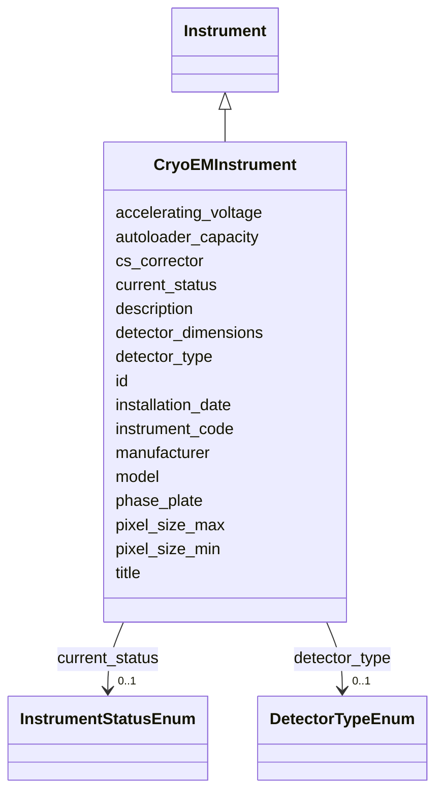

# Class: CryoEMInstrument 


_Cryo-EM microscope specifications_


URI: [lambdaber:CryoEMInstrument](https://w3id.org/lambda-ber-schema/CryoEMInstrument)





## Inheritance
* [NamedThing](NamedThing.md)
    * [Instrument](Instrument.md)
        * **CryoEMInstrument**


## Slots

| Name | Cardinality and Range | Description | Inheritance |
| ---  | --- | --- | --- |
| [accelerating_voltage](accelerating_voltage.md) | 0..1 <br/> [Integer](Integer.md) | Accelerating voltage in kV | direct |
| [cs_corrector](cs_corrector.md) | 0..1 <br/> [Boolean](Boolean.md) | Spherical aberration corrector present | direct |
| [phase_plate](phase_plate.md) | 0..1 <br/> [Boolean](Boolean.md) | Phase plate available | direct |
| [detector_type](detector_type.md) | 0..1 <br/> [DetectorTypeEnum](DetectorTypeEnum.md) | Type of detector | direct |
| [detector_dimensions](detector_dimensions.md) | 0..1 <br/> [String](String.md) | Detector dimensions in pixels (e | direct |
| [pixel_size_min](pixel_size_min.md) | 0..1 <br/> [Float](Float.md) | Minimum pixel size in Angstroms per pixel | direct |
| [pixel_size_max](pixel_size_max.md) | 0..1 <br/> [Float](Float.md) | Maximum pixel size in Angstroms per pixel | direct |
| [autoloader_capacity](autoloader_capacity.md) | 0..1 <br/> [Integer](Integer.md) | Number of grids the autoloader can hold | direct |
| [instrument_code](instrument_code.md) | 1 <br/> [String](String.md) | Human-friendly facility or laboratory identifier for the instrument (e | [Instrument](Instrument.md) |
| [manufacturer](manufacturer.md) | 0..1 <br/> [String](String.md) | Instrument manufacturer | [Instrument](Instrument.md) |
| [model](model.md) | 0..1 <br/> [String](String.md) | Instrument model | [Instrument](Instrument.md) |
| [installation_date](installation_date.md) | 0..1 <br/> [String](String.md) | Date of instrument installation | [Instrument](Instrument.md) |
| [current_status](current_status.md) | 0..1 <br/> [InstrumentStatusEnum](InstrumentStatusEnum.md) | Current operational status | [Instrument](Instrument.md) |
| [id](id.md) | 1 <br/> [Uriorcurie](Uriorcurie.md) | Globally unique identifier as an IRI or CURIE for machine processing and exte... | [NamedThing](NamedThing.md) |
| [title](title.md) | 0..1 <br/> [String](String.md) |  | [NamedThing](NamedThing.md) |
| [description](description.md) | 0..1 <br/> [String](String.md) |  | [NamedThing](NamedThing.md) |


## Identifier and Mapping Information


### Schema Source


* from schema: https://w3id.org/lambda-ber-schema/


## Mappings

| Mapping Type | Mapped Value |
| ---  | ---  |
| self | lambdaber:CryoEMInstrument |
| native | lambdaber:CryoEMInstrument |


## LinkML Source

<!-- TODO: investigate https://stackoverflow.com/questions/37606292/how-to-create-tabbed-code-blocks-in-mkdocs-or-sphinx -->

### Direct

<details>
```yaml
name: CryoEMInstrument
description: Cryo-EM microscope specifications
from_schema: https://w3id.org/lambda-ber-schema/
is_a: Instrument
attributes:
  accelerating_voltage:
    name: accelerating_voltage
    description: Accelerating voltage in kV
    from_schema: https://w3id.org/lambda-ber-schema/
    rank: 1000
    domain_of:
    - CryoEMInstrument
    range: integer
    any_of:
    - equals_number: 120
    - equals_number: 200
    - equals_number: 300
  cs_corrector:
    name: cs_corrector
    description: Spherical aberration corrector present
    from_schema: https://w3id.org/lambda-ber-schema/
    rank: 1000
    domain_of:
    - CryoEMInstrument
    range: boolean
  phase_plate:
    name: phase_plate
    description: Phase plate available
    from_schema: https://w3id.org/lambda-ber-schema/
    rank: 1000
    domain_of:
    - CryoEMInstrument
    range: boolean
  detector_type:
    name: detector_type
    description: Type of detector
    from_schema: https://w3id.org/lambda-ber-schema/
    rank: 1000
    domain_of:
    - CryoEMInstrument
    - XRFImage
    range: DetectorTypeEnum
  detector_dimensions:
    name: detector_dimensions
    description: Detector dimensions in pixels (e.g., 4096x4096)
    from_schema: https://w3id.org/lambda-ber-schema/
    rank: 1000
    domain_of:
    - CryoEMInstrument
  pixel_size_min:
    name: pixel_size_min
    description: Minimum pixel size in Angstroms per pixel
    from_schema: https://w3id.org/lambda-ber-schema/
    rank: 1000
    domain_of:
    - CryoEMInstrument
    range: float
  pixel_size_max:
    name: pixel_size_max
    description: Maximum pixel size in Angstroms per pixel
    from_schema: https://w3id.org/lambda-ber-schema/
    rank: 1000
    domain_of:
    - CryoEMInstrument
    range: float
  autoloader_capacity:
    name: autoloader_capacity
    description: Number of grids the autoloader can hold
    from_schema: https://w3id.org/lambda-ber-schema/
    rank: 1000
    domain_of:
    - CryoEMInstrument
    range: integer

```
</details>

### Induced

<details>
```yaml
name: CryoEMInstrument
description: Cryo-EM microscope specifications
from_schema: https://w3id.org/lambda-ber-schema/
is_a: Instrument
attributes:
  accelerating_voltage:
    name: accelerating_voltage
    description: Accelerating voltage in kV
    from_schema: https://w3id.org/lambda-ber-schema/
    rank: 1000
    alias: accelerating_voltage
    owner: CryoEMInstrument
    domain_of:
    - CryoEMInstrument
    range: integer
    any_of:
    - equals_number: 120
    - equals_number: 200
    - equals_number: 300
  cs_corrector:
    name: cs_corrector
    description: Spherical aberration corrector present
    from_schema: https://w3id.org/lambda-ber-schema/
    rank: 1000
    alias: cs_corrector
    owner: CryoEMInstrument
    domain_of:
    - CryoEMInstrument
    range: boolean
  phase_plate:
    name: phase_plate
    description: Phase plate available
    from_schema: https://w3id.org/lambda-ber-schema/
    rank: 1000
    alias: phase_plate
    owner: CryoEMInstrument
    domain_of:
    - CryoEMInstrument
    range: boolean
  detector_type:
    name: detector_type
    description: Type of detector
    from_schema: https://w3id.org/lambda-ber-schema/
    rank: 1000
    alias: detector_type
    owner: CryoEMInstrument
    domain_of:
    - CryoEMInstrument
    - XRFImage
    range: DetectorTypeEnum
  detector_dimensions:
    name: detector_dimensions
    description: Detector dimensions in pixels (e.g., 4096x4096)
    from_schema: https://w3id.org/lambda-ber-schema/
    rank: 1000
    alias: detector_dimensions
    owner: CryoEMInstrument
    domain_of:
    - CryoEMInstrument
    range: string
  pixel_size_min:
    name: pixel_size_min
    description: Minimum pixel size in Angstroms per pixel
    from_schema: https://w3id.org/lambda-ber-schema/
    rank: 1000
    alias: pixel_size_min
    owner: CryoEMInstrument
    domain_of:
    - CryoEMInstrument
    range: float
  pixel_size_max:
    name: pixel_size_max
    description: Maximum pixel size in Angstroms per pixel
    from_schema: https://w3id.org/lambda-ber-schema/
    rank: 1000
    alias: pixel_size_max
    owner: CryoEMInstrument
    domain_of:
    - CryoEMInstrument
    range: float
  autoloader_capacity:
    name: autoloader_capacity
    description: Number of grids the autoloader can hold
    from_schema: https://w3id.org/lambda-ber-schema/
    rank: 1000
    alias: autoloader_capacity
    owner: CryoEMInstrument
    domain_of:
    - CryoEMInstrument
    range: integer
  instrument_code:
    name: instrument_code
    description: Human-friendly facility or laboratory identifier for the instrument
      (e.g., 'TITAN-KRIOS-1', 'ALS-12.3.1-SIBYLS', 'RIGAKU-FR-E'). Used for local
      reference and equipment tracking.
    from_schema: https://w3id.org/lambda-ber-schema/
    rank: 1000
    alias: instrument_code
    owner: CryoEMInstrument
    domain_of:
    - Instrument
    range: string
    required: true
  manufacturer:
    name: manufacturer
    description: Instrument manufacturer
    from_schema: https://w3id.org/lambda-ber-schema/
    rank: 1000
    alias: manufacturer
    owner: CryoEMInstrument
    domain_of:
    - Instrument
    range: string
  model:
    name: model
    description: Instrument model
    from_schema: https://w3id.org/lambda-ber-schema/
    rank: 1000
    alias: model
    owner: CryoEMInstrument
    domain_of:
    - Instrument
    range: string
  installation_date:
    name: installation_date
    description: Date of instrument installation
    from_schema: https://w3id.org/lambda-ber-schema/
    rank: 1000
    alias: installation_date
    owner: CryoEMInstrument
    domain_of:
    - Instrument
    range: string
  current_status:
    name: current_status
    description: Current operational status
    from_schema: https://w3id.org/lambda-ber-schema/
    rank: 1000
    alias: current_status
    owner: CryoEMInstrument
    domain_of:
    - Instrument
    range: InstrumentStatusEnum
  id:
    name: id
    description: Globally unique identifier as an IRI or CURIE for machine processing
      and external references. Used for linking data across systems and semantic web
      integration.
    from_schema: https://w3id.org/lambda-ber-schema/
    rank: 1000
    identifier: true
    alias: id
    owner: CryoEMInstrument
    domain_of:
    - NamedThing
    range: uriorcurie
    required: true
  title:
    name: title
    from_schema: https://w3id.org/lambda-ber-schema/
    rank: 1000
    slot_uri: dcterms:title
    alias: title
    owner: CryoEMInstrument
    domain_of:
    - NamedThing
    range: string
  description:
    name: description
    from_schema: https://w3id.org/lambda-ber-schema/
    rank: 1000
    alias: description
    owner: CryoEMInstrument
    domain_of:
    - NamedThing
    - AttributeGroup
    range: string

```
</details>