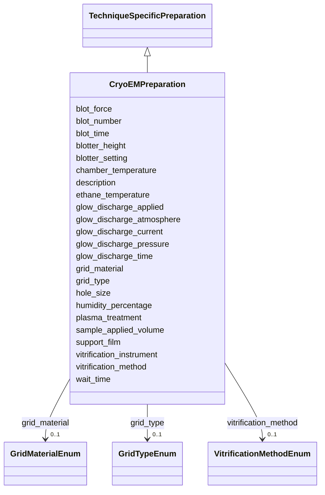

# Class: CryoEMPreparation 


_Cryo-EM specific sample preparation_


URI: [lambdaber:CryoEMPreparation](https://w3id.org/lambda-ber-schema/CryoEMPreparation)





## Inheritance
* [AttributeGroup](AttributeGroup.md)
    * [TechniqueSpecificPreparation](TechniqueSpecificPreparation.md)
        * **CryoEMPreparation**


## Slots

| Name | Cardinality and Range | Description | Inheritance |
| ---  | --- | --- | --- |
| [grid_type](grid_type.md) | 0..1 <br/> [GridTypeEnum](GridTypeEnum.md) | Type of EM grid used | direct |
| [support_film](support_film.md) | 0..1 <br/> [String](String.md) | Support film type | direct |
| [hole_size](hole_size.md) | 0..1 <br/> [Float](Float.md) | Hole size in micrometers (range: 0 | direct |
| [vitrification_method](vitrification_method.md) | 0..1 <br/> [VitrificationMethodEnum](VitrificationMethodEnum.md) | Method used for vitrification | direct |
| [blot_time](blot_time.md) | 0..1 <br/> [Float](Float.md) | Blotting time in seconds (range: 0 | direct |
| [blot_force](blot_force.md) | 0..1 <br/> [Integer](Integer.md) | Blotting force setting | direct |
| [humidity_percentage](humidity_percentage.md) | 0..1 <br/> [Float](Float.md) | Chamber humidity during vitrification (range: 0-100) | direct |
| [chamber_temperature](chamber_temperature.md) | 0..1 <br/> [Float](Float.md) | Chamber temperature in Celsius | direct |
| [grid_material](grid_material.md) | 0..1 <br/> [GridMaterialEnum](GridMaterialEnum.md) | Grid material | direct |
| [glow_discharge_applied](glow_discharge_applied.md) | 0..1 <br/> [Boolean](Boolean.md) | Whether glow discharge treatment was applied | direct |
| [glow_discharge_time](glow_discharge_time.md) | 0..1 <br/> [Float](Float.md) | Glow discharge time in seconds | direct |
| [glow_discharge_current](glow_discharge_current.md) | 0..1 <br/> [Float](Float.md) | Glow discharge current in milliamperes | direct |
| [glow_discharge_atmosphere](glow_discharge_atmosphere.md) | 0..1 <br/> [String](String.md) | Glow discharge atmosphere (air, amylamine) | direct |
| [glow_discharge_pressure](glow_discharge_pressure.md) | 0..1 <br/> [Float](Float.md) | Glow discharge pressure in millibar | direct |
| [vitrification_instrument](vitrification_instrument.md) | 0..1 <br/> [String](String.md) | Vitrification instrument used (e | direct |
| [blot_number](blot_number.md) | 0..1 <br/> [Integer](Integer.md) | Number of blots applied | direct |
| [wait_time](wait_time.md) | 0..1 <br/> [Float](Float.md) | Wait time before blotting in seconds | direct |
| [blotter_height](blotter_height.md) | 0..1 <br/> [Float](Float.md) | Blotter height setting | direct |
| [blotter_setting](blotter_setting.md) | 0..1 <br/> [Float](Float.md) | Blotter setting value | direct |
| [sample_applied_volume](sample_applied_volume.md) | 0..1 <br/> [Float](Float.md) | Volume of sample applied in microliters | direct |
| [ethane_temperature](ethane_temperature.md) | 0..1 <br/> [Float](Float.md) | Ethane temperature in Celsius | direct |
| [plasma_treatment](plasma_treatment.md) | 0..1 <br/> [String](String.md) | Plasma treatment details | direct |
| [description](description.md) | 0..1 <br/> [String](String.md) |  | [AttributeGroup](AttributeGroup.md) |


## Identifier and Mapping Information


### Schema Source


* from schema: https://w3id.org/lambda-ber-schema/


## Mappings

| Mapping Type | Mapped Value |
| ---  | ---  |
| self | lambdaber:CryoEMPreparation |
| native | lambdaber:CryoEMPreparation |


## LinkML Source

<!-- TODO: investigate https://stackoverflow.com/questions/37606292/how-to-create-tabbed-code-blocks-in-mkdocs-or-sphinx -->

### Direct

<details>
```yaml
name: CryoEMPreparation
description: Cryo-EM specific sample preparation
from_schema: https://w3id.org/lambda-ber-schema/
is_a: TechniqueSpecificPreparation
attributes:
  grid_type:
    name: grid_type
    description: Type of EM grid used
    from_schema: https://w3id.org/lambda-ber-schema/
    rank: 1000
    domain_of:
    - CryoEMPreparation
    range: GridTypeEnum
  support_film:
    name: support_film
    description: Support film type
    from_schema: https://w3id.org/lambda-ber-schema/
    rank: 1000
    domain_of:
    - CryoEMPreparation
    range: string
  hole_size:
    name: hole_size
    description: 'Hole size in micrometers (range: 0.5-5.0)'
    from_schema: https://w3id.org/lambda-ber-schema/
    rank: 1000
    domain_of:
    - CryoEMPreparation
    range: float
    minimum_value: 0.5
    maximum_value: 5.0
  vitrification_method:
    name: vitrification_method
    description: Method used for vitrification
    from_schema: https://w3id.org/lambda-ber-schema/
    rank: 1000
    domain_of:
    - CryoEMPreparation
    range: VitrificationMethodEnum
  blot_time:
    name: blot_time
    description: 'Blotting time in seconds (range: 0.5-10.0)'
    from_schema: https://w3id.org/lambda-ber-schema/
    rank: 1000
    domain_of:
    - CryoEMPreparation
    range: float
    minimum_value: 0.5
    maximum_value: 10.0
  blot_force:
    name: blot_force
    description: Blotting force setting
    from_schema: https://w3id.org/lambda-ber-schema/
    rank: 1000
    domain_of:
    - CryoEMPreparation
    range: integer
  humidity_percentage:
    name: humidity_percentage
    description: 'Chamber humidity during vitrification (range: 0-100)'
    from_schema: https://w3id.org/lambda-ber-schema/
    rank: 1000
    domain_of:
    - CryoEMPreparation
    range: float
    minimum_value: 0
    maximum_value: 100
  chamber_temperature:
    name: chamber_temperature
    description: Chamber temperature in Celsius
    from_schema: https://w3id.org/lambda-ber-schema/
    rank: 1000
    domain_of:
    - CryoEMPreparation
    range: float
  grid_material:
    name: grid_material
    description: Grid material
    from_schema: https://w3id.org/lambda-ber-schema/
    rank: 1000
    domain_of:
    - CryoEMPreparation
    range: GridMaterialEnum
  glow_discharge_applied:
    name: glow_discharge_applied
    description: Whether glow discharge treatment was applied
    from_schema: https://w3id.org/lambda-ber-schema/
    rank: 1000
    domain_of:
    - CryoEMPreparation
    range: boolean
  glow_discharge_time:
    name: glow_discharge_time
    description: Glow discharge time in seconds
    from_schema: https://w3id.org/lambda-ber-schema/
    rank: 1000
    domain_of:
    - CryoEMPreparation
    range: float
  glow_discharge_current:
    name: glow_discharge_current
    description: Glow discharge current in milliamperes
    from_schema: https://w3id.org/lambda-ber-schema/
    rank: 1000
    domain_of:
    - CryoEMPreparation
    range: float
  glow_discharge_atmosphere:
    name: glow_discharge_atmosphere
    description: Glow discharge atmosphere (air, amylamine)
    from_schema: https://w3id.org/lambda-ber-schema/
    rank: 1000
    domain_of:
    - CryoEMPreparation
    range: string
  glow_discharge_pressure:
    name: glow_discharge_pressure
    description: Glow discharge pressure in millibar
    from_schema: https://w3id.org/lambda-ber-schema/
    rank: 1000
    domain_of:
    - CryoEMPreparation
    range: float
  vitrification_instrument:
    name: vitrification_instrument
    description: Vitrification instrument used (e.g., Vitrobot)
    from_schema: https://w3id.org/lambda-ber-schema/
    rank: 1000
    domain_of:
    - CryoEMPreparation
    range: string
  blot_number:
    name: blot_number
    description: Number of blots applied
    from_schema: https://w3id.org/lambda-ber-schema/
    rank: 1000
    domain_of:
    - CryoEMPreparation
    range: integer
  wait_time:
    name: wait_time
    description: Wait time before blotting in seconds
    from_schema: https://w3id.org/lambda-ber-schema/
    rank: 1000
    domain_of:
    - CryoEMPreparation
    range: float
  blotter_height:
    name: blotter_height
    description: Blotter height setting
    from_schema: https://w3id.org/lambda-ber-schema/
    rank: 1000
    domain_of:
    - CryoEMPreparation
    range: float
  blotter_setting:
    name: blotter_setting
    description: Blotter setting value
    from_schema: https://w3id.org/lambda-ber-schema/
    rank: 1000
    domain_of:
    - CryoEMPreparation
    range: float
  sample_applied_volume:
    name: sample_applied_volume
    description: Volume of sample applied in microliters
    from_schema: https://w3id.org/lambda-ber-schema/
    rank: 1000
    domain_of:
    - CryoEMPreparation
    range: float
  ethane_temperature:
    name: ethane_temperature
    description: Ethane temperature in Celsius
    from_schema: https://w3id.org/lambda-ber-schema/
    rank: 1000
    domain_of:
    - CryoEMPreparation
    range: float
  plasma_treatment:
    name: plasma_treatment
    description: Plasma treatment details
    from_schema: https://w3id.org/lambda-ber-schema/
    rank: 1000
    domain_of:
    - CryoEMPreparation

```
</details>

### Induced

<details>
```yaml
name: CryoEMPreparation
description: Cryo-EM specific sample preparation
from_schema: https://w3id.org/lambda-ber-schema/
is_a: TechniqueSpecificPreparation
attributes:
  grid_type:
    name: grid_type
    description: Type of EM grid used
    from_schema: https://w3id.org/lambda-ber-schema/
    rank: 1000
    alias: grid_type
    owner: CryoEMPreparation
    domain_of:
    - CryoEMPreparation
    range: GridTypeEnum
  support_film:
    name: support_film
    description: Support film type
    from_schema: https://w3id.org/lambda-ber-schema/
    rank: 1000
    alias: support_film
    owner: CryoEMPreparation
    domain_of:
    - CryoEMPreparation
    range: string
  hole_size:
    name: hole_size
    description: 'Hole size in micrometers (range: 0.5-5.0)'
    from_schema: https://w3id.org/lambda-ber-schema/
    rank: 1000
    alias: hole_size
    owner: CryoEMPreparation
    domain_of:
    - CryoEMPreparation
    range: float
    minimum_value: 0.5
    maximum_value: 5.0
  vitrification_method:
    name: vitrification_method
    description: Method used for vitrification
    from_schema: https://w3id.org/lambda-ber-schema/
    rank: 1000
    alias: vitrification_method
    owner: CryoEMPreparation
    domain_of:
    - CryoEMPreparation
    range: VitrificationMethodEnum
  blot_time:
    name: blot_time
    description: 'Blotting time in seconds (range: 0.5-10.0)'
    from_schema: https://w3id.org/lambda-ber-schema/
    rank: 1000
    alias: blot_time
    owner: CryoEMPreparation
    domain_of:
    - CryoEMPreparation
    range: float
    minimum_value: 0.5
    maximum_value: 10.0
  blot_force:
    name: blot_force
    description: Blotting force setting
    from_schema: https://w3id.org/lambda-ber-schema/
    rank: 1000
    alias: blot_force
    owner: CryoEMPreparation
    domain_of:
    - CryoEMPreparation
    range: integer
  humidity_percentage:
    name: humidity_percentage
    description: 'Chamber humidity during vitrification (range: 0-100)'
    from_schema: https://w3id.org/lambda-ber-schema/
    rank: 1000
    alias: humidity_percentage
    owner: CryoEMPreparation
    domain_of:
    - CryoEMPreparation
    range: float
    minimum_value: 0
    maximum_value: 100
  chamber_temperature:
    name: chamber_temperature
    description: Chamber temperature in Celsius
    from_schema: https://w3id.org/lambda-ber-schema/
    rank: 1000
    alias: chamber_temperature
    owner: CryoEMPreparation
    domain_of:
    - CryoEMPreparation
    range: float
  grid_material:
    name: grid_material
    description: Grid material
    from_schema: https://w3id.org/lambda-ber-schema/
    rank: 1000
    alias: grid_material
    owner: CryoEMPreparation
    domain_of:
    - CryoEMPreparation
    range: GridMaterialEnum
  glow_discharge_applied:
    name: glow_discharge_applied
    description: Whether glow discharge treatment was applied
    from_schema: https://w3id.org/lambda-ber-schema/
    rank: 1000
    alias: glow_discharge_applied
    owner: CryoEMPreparation
    domain_of:
    - CryoEMPreparation
    range: boolean
  glow_discharge_time:
    name: glow_discharge_time
    description: Glow discharge time in seconds
    from_schema: https://w3id.org/lambda-ber-schema/
    rank: 1000
    alias: glow_discharge_time
    owner: CryoEMPreparation
    domain_of:
    - CryoEMPreparation
    range: float
  glow_discharge_current:
    name: glow_discharge_current
    description: Glow discharge current in milliamperes
    from_schema: https://w3id.org/lambda-ber-schema/
    rank: 1000
    alias: glow_discharge_current
    owner: CryoEMPreparation
    domain_of:
    - CryoEMPreparation
    range: float
  glow_discharge_atmosphere:
    name: glow_discharge_atmosphere
    description: Glow discharge atmosphere (air, amylamine)
    from_schema: https://w3id.org/lambda-ber-schema/
    rank: 1000
    alias: glow_discharge_atmosphere
    owner: CryoEMPreparation
    domain_of:
    - CryoEMPreparation
    range: string
  glow_discharge_pressure:
    name: glow_discharge_pressure
    description: Glow discharge pressure in millibar
    from_schema: https://w3id.org/lambda-ber-schema/
    rank: 1000
    alias: glow_discharge_pressure
    owner: CryoEMPreparation
    domain_of:
    - CryoEMPreparation
    range: float
  vitrification_instrument:
    name: vitrification_instrument
    description: Vitrification instrument used (e.g., Vitrobot)
    from_schema: https://w3id.org/lambda-ber-schema/
    rank: 1000
    alias: vitrification_instrument
    owner: CryoEMPreparation
    domain_of:
    - CryoEMPreparation
    range: string
  blot_number:
    name: blot_number
    description: Number of blots applied
    from_schema: https://w3id.org/lambda-ber-schema/
    rank: 1000
    alias: blot_number
    owner: CryoEMPreparation
    domain_of:
    - CryoEMPreparation
    range: integer
  wait_time:
    name: wait_time
    description: Wait time before blotting in seconds
    from_schema: https://w3id.org/lambda-ber-schema/
    rank: 1000
    alias: wait_time
    owner: CryoEMPreparation
    domain_of:
    - CryoEMPreparation
    range: float
  blotter_height:
    name: blotter_height
    description: Blotter height setting
    from_schema: https://w3id.org/lambda-ber-schema/
    rank: 1000
    alias: blotter_height
    owner: CryoEMPreparation
    domain_of:
    - CryoEMPreparation
    range: float
  blotter_setting:
    name: blotter_setting
    description: Blotter setting value
    from_schema: https://w3id.org/lambda-ber-schema/
    rank: 1000
    alias: blotter_setting
    owner: CryoEMPreparation
    domain_of:
    - CryoEMPreparation
    range: float
  sample_applied_volume:
    name: sample_applied_volume
    description: Volume of sample applied in microliters
    from_schema: https://w3id.org/lambda-ber-schema/
    rank: 1000
    alias: sample_applied_volume
    owner: CryoEMPreparation
    domain_of:
    - CryoEMPreparation
    range: float
  ethane_temperature:
    name: ethane_temperature
    description: Ethane temperature in Celsius
    from_schema: https://w3id.org/lambda-ber-schema/
    rank: 1000
    alias: ethane_temperature
    owner: CryoEMPreparation
    domain_of:
    - CryoEMPreparation
    range: float
  plasma_treatment:
    name: plasma_treatment
    description: Plasma treatment details
    from_schema: https://w3id.org/lambda-ber-schema/
    rank: 1000
    alias: plasma_treatment
    owner: CryoEMPreparation
    domain_of:
    - CryoEMPreparation
    range: string
  description:
    name: description
    from_schema: https://w3id.org/lambda-ber-schema/
    alias: description
    owner: CryoEMPreparation
    domain_of:
    - NamedThing
    - AttributeGroup
    range: string

```
</details>