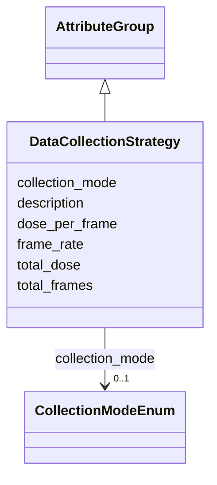

# Class: DataCollectionStrategy 


_Strategy for data collection_


URI: [lambdaber:DataCollectionStrategy](https://w3id.org/lambda-ber-schema/DataCollectionStrategy)





## Inheritance
* [AttributeGroup](AttributeGroup.md)
    * **DataCollectionStrategy**


## Slots

| Name | Cardinality and Range | Description | Inheritance |
| ---  | --- | --- | --- |
| [collection_mode](collection_mode.md) | 0..1 <br/> [CollectionModeEnum](CollectionModeEnum.md) | Mode of data collection | direct |
| [total_frames](total_frames.md) | 0..1 <br/> [Integer](Integer.md) | Total number of frames/images | direct |
| [frame_rate](frame_rate.md) | 0..1 <br/> [Float](Float.md) | Frames per second | direct |
| [total_dose](total_dose.md) | 0..1 <br/> [Float](Float.md) | Total electron dose for cryo-EM | direct |
| [dose_per_frame](dose_per_frame.md) | 0..1 <br/> [Float](Float.md) | Dose per frame | direct |
| [description](description.md) | 0..1 <br/> [String](String.md) |  | [AttributeGroup](AttributeGroup.md) |


## Usages

| used by | used in | type | used |
| ---  | --- | --- | --- |
| [ExperimentRun](ExperimentRun.md) | [data_collection_strategy](data_collection_strategy.md) | range | [DataCollectionStrategy](DataCollectionStrategy.md) |


## Identifier and Mapping Information


### Schema Source


* from schema: https://w3id.org/lambda-ber-schema/


## Mappings

| Mapping Type | Mapped Value |
| ---  | ---  |
| self | lambdaber:DataCollectionStrategy |
| native | lambdaber:DataCollectionStrategy |


## LinkML Source

<!-- TODO: investigate https://stackoverflow.com/questions/37606292/how-to-create-tabbed-code-blocks-in-mkdocs-or-sphinx -->

### Direct

<details>
```yaml
name: DataCollectionStrategy
description: Strategy for data collection
from_schema: https://w3id.org/lambda-ber-schema/
is_a: AttributeGroup
attributes:
  collection_mode:
    name: collection_mode
    description: Mode of data collection
    from_schema: https://w3id.org/lambda-ber-schema/
    rank: 1000
    domain_of:
    - DataCollectionStrategy
    range: CollectionModeEnum
  total_frames:
    name: total_frames
    description: Total number of frames/images
    from_schema: https://w3id.org/lambda-ber-schema/
    rank: 1000
    domain_of:
    - DataCollectionStrategy
    range: integer
  frame_rate:
    name: frame_rate
    description: Frames per second
    from_schema: https://w3id.org/lambda-ber-schema/
    rank: 1000
    domain_of:
    - DataCollectionStrategy
    range: float
  total_dose:
    name: total_dose
    description: Total electron dose for cryo-EM
    from_schema: https://w3id.org/lambda-ber-schema/
    rank: 1000
    domain_of:
    - DataCollectionStrategy
    range: float
  dose_per_frame:
    name: dose_per_frame
    description: Dose per frame
    from_schema: https://w3id.org/lambda-ber-schema/
    rank: 1000
    domain_of:
    - DataCollectionStrategy
    range: float

```
</details>

### Induced

<details>
```yaml
name: DataCollectionStrategy
description: Strategy for data collection
from_schema: https://w3id.org/lambda-ber-schema/
is_a: AttributeGroup
attributes:
  collection_mode:
    name: collection_mode
    description: Mode of data collection
    from_schema: https://w3id.org/lambda-ber-schema/
    rank: 1000
    alias: collection_mode
    owner: DataCollectionStrategy
    domain_of:
    - DataCollectionStrategy
    range: CollectionModeEnum
  total_frames:
    name: total_frames
    description: Total number of frames/images
    from_schema: https://w3id.org/lambda-ber-schema/
    rank: 1000
    alias: total_frames
    owner: DataCollectionStrategy
    domain_of:
    - DataCollectionStrategy
    range: integer
  frame_rate:
    name: frame_rate
    description: Frames per second
    from_schema: https://w3id.org/lambda-ber-schema/
    rank: 1000
    alias: frame_rate
    owner: DataCollectionStrategy
    domain_of:
    - DataCollectionStrategy
    range: float
  total_dose:
    name: total_dose
    description: Total electron dose for cryo-EM
    from_schema: https://w3id.org/lambda-ber-schema/
    rank: 1000
    alias: total_dose
    owner: DataCollectionStrategy
    domain_of:
    - DataCollectionStrategy
    range: float
  dose_per_frame:
    name: dose_per_frame
    description: Dose per frame
    from_schema: https://w3id.org/lambda-ber-schema/
    rank: 1000
    alias: dose_per_frame
    owner: DataCollectionStrategy
    domain_of:
    - DataCollectionStrategy
    range: float
  description:
    name: description
    from_schema: https://w3id.org/lambda-ber-schema/
    alias: description
    owner: DataCollectionStrategy
    domain_of:
    - NamedThing
    - AttributeGroup
    range: string

```
</details>