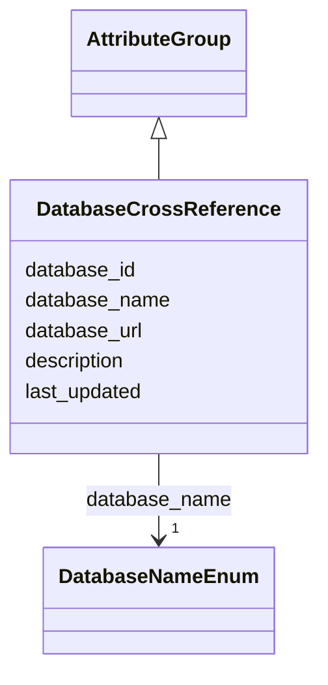

# Class: DatabaseCrossReference 


_Cross-references to external databases_


URI: [lambdaber:DatabaseCrossReference](https://w3id.org/lambda-ber-schema/DatabaseCrossReference)





## Inheritance
* [AttributeGroup](AttributeGroup.md)
    * **DatabaseCrossReference**


## Slots

| Name | Cardinality and Range | Description | Inheritance |
| ---  | --- | --- | --- |
| [database_name](database_name.md) | 1 <br/> [DatabaseNameEnum](DatabaseNameEnum.md) | Name of the external database | direct |
| [database_id](database_id.md) | 1 <br/> [String](String.md) | Identifier in the external database | direct |
| [database_url](database_url.md) | 0..1 <br/> [Uri](Uri.md) | URL to the database entry | direct |
| [last_updated](last_updated.md) | 0..1 <br/> [String](String.md) | Date of last update | direct |
| [description](description.md) | 0..1 <br/> [String](String.md) |  | [AttributeGroup](AttributeGroup.md) |


## Usages

| used by | used in | type | used |
| ---  | --- | --- | --- |
| [Sample](Sample.md) | [database_cross_references](database_cross_references.md) | range | [DatabaseCrossReference](DatabaseCrossReference.md) |
| [AggregatedProteinView](AggregatedProteinView.md) | [cross_references](cross_references.md) | range | [DatabaseCrossReference](DatabaseCrossReference.md) |


## Identifier and Mapping Information


### Schema Source


* from schema: https://w3id.org/lambda-ber-schema/


## Mappings

| Mapping Type | Mapped Value |
| ---  | ---  |
| self | lambdaber:DatabaseCrossReference |
| native | lambdaber:DatabaseCrossReference |


## LinkML Source

<!-- TODO: investigate https://stackoverflow.com/questions/37606292/how-to-create-tabbed-code-blocks-in-mkdocs-or-sphinx -->

### Direct

<details>
```yaml
name: DatabaseCrossReference
description: Cross-references to external databases
from_schema: https://w3id.org/lambda-ber-schema/
is_a: AttributeGroup
attributes:
  database_name:
    name: database_name
    description: Name of the external database
    from_schema: https://w3id.org/lambda-ber-schema/functional_annotation
    rank: 1000
    domain_of:
    - DatabaseCrossReference
    range: DatabaseNameEnum
    required: true
  database_id:
    name: database_id
    description: Identifier in the external database
    from_schema: https://w3id.org/lambda-ber-schema/functional_annotation
    rank: 1000
    domain_of:
    - DatabaseCrossReference
    required: true
  database_url:
    name: database_url
    description: URL to the database entry
    from_schema: https://w3id.org/lambda-ber-schema/functional_annotation
    rank: 1000
    domain_of:
    - DatabaseCrossReference
    range: uri
  last_updated:
    name: last_updated
    description: Date of last update
    from_schema: https://w3id.org/lambda-ber-schema/functional_annotation
    rank: 1000
    domain_of:
    - DatabaseCrossReference
    range: string

```
</details>

### Induced

<details>
```yaml
name: DatabaseCrossReference
description: Cross-references to external databases
from_schema: https://w3id.org/lambda-ber-schema/
is_a: AttributeGroup
attributes:
  database_name:
    name: database_name
    description: Name of the external database
    from_schema: https://w3id.org/lambda-ber-schema/functional_annotation
    rank: 1000
    alias: database_name
    owner: DatabaseCrossReference
    domain_of:
    - DatabaseCrossReference
    range: DatabaseNameEnum
    required: true
  database_id:
    name: database_id
    description: Identifier in the external database
    from_schema: https://w3id.org/lambda-ber-schema/functional_annotation
    rank: 1000
    alias: database_id
    owner: DatabaseCrossReference
    domain_of:
    - DatabaseCrossReference
    range: string
    required: true
  database_url:
    name: database_url
    description: URL to the database entry
    from_schema: https://w3id.org/lambda-ber-schema/functional_annotation
    rank: 1000
    alias: database_url
    owner: DatabaseCrossReference
    domain_of:
    - DatabaseCrossReference
    range: uri
  last_updated:
    name: last_updated
    description: Date of last update
    from_schema: https://w3id.org/lambda-ber-schema/functional_annotation
    rank: 1000
    alias: last_updated
    owner: DatabaseCrossReference
    domain_of:
    - DatabaseCrossReference
    range: string
  description:
    name: description
    from_schema: https://w3id.org/lambda-ber-schema/
    alias: description
    owner: DatabaseCrossReference
    domain_of:
    - NamedThing
    - AttributeGroup
    range: string

```
</details>