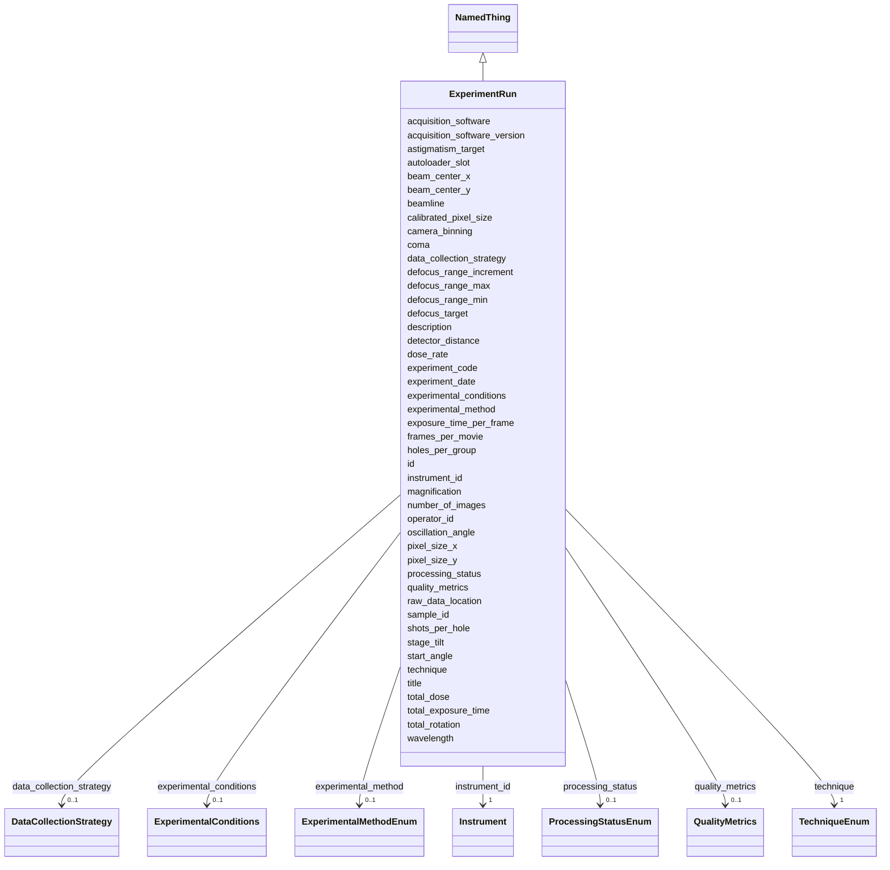

# Class: ExperimentRun 


_An experimental data collection session_


URI: [lambdaber:ExperimentRun](https://w3id.org/lambda-ber-schema/ExperimentRun)





## Inheritance
* [NamedThing](NamedThing.md)
    * **ExperimentRun**


## Slots

| Name | Cardinality and Range | Description | Inheritance |
| ---  | --- | --- | --- |
| [experiment_code](experiment_code.md) | 1 <br/> [String](String.md) | Human-friendly laboratory or facility identifier for the experiment (e | direct |
| [sample_id](sample_id.md) | 1 <br/> [String](String.md) | Reference to the sample being analyzed | direct |
| [instrument_id](instrument_id.md) | 1 <br/> [Instrument](Instrument.md) | Reference to the instrument used | direct |
| [experiment_date](experiment_date.md) | 0..1 <br/> [String](String.md) | Date of the experiment | direct |
| [operator_id](operator_id.md) | 0..1 <br/> [String](String.md) | Identifier or name of the person who performed the experiment data collection... | direct |
| [technique](technique.md) | 1 <br/> [TechniqueEnum](TechniqueEnum.md) | Technique used for data collection | direct |
| [experimental_method](experimental_method.md) | 0..1 <br/> [ExperimentalMethodEnum](ExperimentalMethodEnum.md) | Specific experimental method for structure determination (particularly for di... | direct |
| [experimental_conditions](experimental_conditions.md) | 0..1 <br/> [ExperimentalConditions](ExperimentalConditions.md) | Environmental and experimental conditions | direct |
| [data_collection_strategy](data_collection_strategy.md) | 0..1 <br/> [DataCollectionStrategy](DataCollectionStrategy.md) | Strategy for data collection | direct |
| [quality_metrics](quality_metrics.md) | 0..1 <br/> [QualityMetrics](QualityMetrics.md) | Quality metrics for the experiment | direct |
| [raw_data_location](raw_data_location.md) | 0..1 <br/> [String](String.md) | Location of raw data files | direct |
| [processing_status](processing_status.md) | 0..1 <br/> [ProcessingStatusEnum](ProcessingStatusEnum.md) | Current processing status | direct |
| [magnification](magnification.md) | 0..1 <br/> [Integer](Integer.md) | Magnification used during data collection | direct |
| [calibrated_pixel_size](calibrated_pixel_size.md) | 0..1 <br/> [Float](Float.md) | Calibrated pixel size in Angstroms per pixel | direct |
| [camera_binning](camera_binning.md) | 0..1 <br/> [Integer](Integer.md) | Camera binning factor | direct |
| [exposure_time_per_frame](exposure_time_per_frame.md) | 0..1 <br/> [Float](Float.md) | Exposure time per frame in milliseconds | direct |
| [frames_per_movie](frames_per_movie.md) | 0..1 <br/> [Integer](Integer.md) | Number of frames per movie | direct |
| [total_exposure_time](total_exposure_time.md) | 0..1 <br/> [Float](Float.md) | Total exposure time in milliseconds | direct |
| [total_dose](total_dose.md) | 0..1 <br/> [Float](Float.md) | Total electron dose in e-/Angstrom^2 | direct |
| [dose_rate](dose_rate.md) | 0..1 <br/> [Float](Float.md) | Dose rate in e-/pixel/s or e-/Angstrom^2/s | direct |
| [defocus_target](defocus_target.md) | 0..1 <br/> [Float](Float.md) | Target defocus value in micrometers | direct |
| [defocus_range_min](defocus_range_min.md) | 0..1 <br/> [Float](Float.md) | Minimum defocus range in micrometers | direct |
| [defocus_range_max](defocus_range_max.md) | 0..1 <br/> [Float](Float.md) | Maximum defocus range in micrometers | direct |
| [defocus_range_increment](defocus_range_increment.md) | 0..1 <br/> [Float](Float.md) | Defocus range increment in micrometers | direct |
| [astigmatism_target](astigmatism_target.md) | 0..1 <br/> [Float](Float.md) | Target astigmatism in Angstroms | direct |
| [coma](coma.md) | 0..1 <br/> [Float](Float.md) | Coma aberration in nanometers | direct |
| [stage_tilt](stage_tilt.md) | 0..1 <br/> [Float](Float.md) | Stage tilt angle in degrees | direct |
| [autoloader_slot](autoloader_slot.md) | 0..1 <br/> [String](String.md) | Autoloader slot identifier | direct |
| [shots_per_hole](shots_per_hole.md) | 0..1 <br/> [Integer](Integer.md) | Number of shots taken per hole | direct |
| [holes_per_group](holes_per_group.md) | 0..1 <br/> [Integer](Integer.md) | Number of holes per group | direct |
| [acquisition_software](acquisition_software.md) | 0..1 <br/> [String](String.md) | Acquisition software used (e | direct |
| [acquisition_software_version](acquisition_software_version.md) | 0..1 <br/> [String](String.md) | Version of acquisition software | direct |
| [wavelength](wavelength.md) | 0..1 <br/> [Float](Float.md) | X-ray wavelength | direct |
| [oscillation_angle](oscillation_angle.md) | 0..1 <br/> [Float](Float.md) | Oscillation angle per image | direct |
| [start_angle](start_angle.md) | 0..1 <br/> [Float](Float.md) | Starting rotation angle | direct |
| [number_of_images](number_of_images.md) | 0..1 <br/> [Integer](Integer.md) | Total number of diffraction images collected | direct |
| [beam_center_x](beam_center_x.md) | 0..1 <br/> [Float](Float.md) | Beam center X coordinate | direct |
| [beam_center_y](beam_center_y.md) | 0..1 <br/> [Float](Float.md) | Beam center Y coordinate | direct |
| [detector_distance](detector_distance.md) | 0..1 <br/> [Float](Float.md) | Distance from sample to detector | direct |
| [pixel_size_x](pixel_size_x.md) | 0..1 <br/> [Float](Float.md) | Pixel size X dimension | direct |
| [pixel_size_y](pixel_size_y.md) | 0..1 <br/> [Float](Float.md) | Pixel size Y dimension | direct |
| [total_rotation](total_rotation.md) | 0..1 <br/> [Float](Float.md) | Total rotation range collected | direct |
| [beamline](beamline.md) | 0..1 <br/> [String](String.md) | Beamline identifier (e | direct |
| [id](id.md) | 1 <br/> [Uriorcurie](Uriorcurie.md) | Globally unique identifier as an IRI or CURIE for machine processing and exte... | [NamedThing](NamedThing.md) |
| [title](title.md) | 0..1 <br/> [String](String.md) |  | [NamedThing](NamedThing.md) |
| [description](description.md) | 0..1 <br/> [String](String.md) |  | [NamedThing](NamedThing.md) |


## Usages

| used by | used in | type | used |
| ---  | --- | --- | --- |
| [Study](Study.md) | [instrument_runs](instrument_runs.md) | range | [ExperimentRun](ExperimentRun.md) |


## Identifier and Mapping Information


### Schema Source


* from schema: https://w3id.org/lambda-ber-schema/


## Mappings

| Mapping Type | Mapped Value |
| ---  | ---  |
| self | lambdaber:ExperimentRun |
| native | lambdaber:ExperimentRun |


## LinkML Source

<!-- TODO: investigate https://stackoverflow.com/questions/37606292/how-to-create-tabbed-code-blocks-in-mkdocs-or-sphinx -->

### Direct

<details>
```yaml
name: ExperimentRun
description: An experimental data collection session
from_schema: https://w3id.org/lambda-ber-schema/
is_a: NamedThing
attributes:
  experiment_code:
    name: experiment_code
    description: Human-friendly laboratory or facility identifier for the experiment
      (e.g., 'SIBYLS-2024-02-01-hetBGL', 'CRYOEM-RUN-240815-001'). Used for local
      tracking and cross-referencing within laboratory systems.
    from_schema: https://w3id.org/lambda-ber-schema/
    rank: 1000
    domain_of:
    - ExperimentRun
    required: true
  sample_id:
    name: sample_id
    description: Reference to the sample being analyzed
    from_schema: https://w3id.org/lambda-ber-schema/
    domain_of:
    - SamplePreparation
    - ExperimentRun
    range: string
    required: true
  instrument_id:
    name: instrument_id
    description: Reference to the instrument used
    from_schema: https://w3id.org/lambda-ber-schema/
    rank: 1000
    domain_of:
    - ExperimentRun
    range: Instrument
    required: true
  experiment_date:
    name: experiment_date
    description: Date of the experiment
    from_schema: https://w3id.org/lambda-ber-schema/
    rank: 1000
    domain_of:
    - ExperimentRun
    range: string
  operator_id:
    name: operator_id
    description: Identifier or name of the person who performed the experiment data
      collection (e.g., 'jsmith', 'John Smith', or personnel ID)
    from_schema: https://w3id.org/lambda-ber-schema/
    domain_of:
    - SamplePreparation
    - ExperimentRun
    range: string
  technique:
    name: technique
    description: Technique used for data collection
    from_schema: https://w3id.org/lambda-ber-schema/
    rank: 1000
    domain_of:
    - ExperimentRun
    range: TechniqueEnum
    required: true
  experimental_method:
    name: experimental_method
    description: Specific experimental method for structure determination (particularly
      for diffraction techniques)
    from_schema: https://w3id.org/lambda-ber-schema/
    rank: 1000
    domain_of:
    - ExperimentRun
    - BiophysicalProperty
    range: ExperimentalMethodEnum
  experimental_conditions:
    name: experimental_conditions
    description: Environmental and experimental conditions
    from_schema: https://w3id.org/lambda-ber-schema/
    rank: 1000
    domain_of:
    - ExperimentRun
    range: ExperimentalConditions
  data_collection_strategy:
    name: data_collection_strategy
    description: Strategy for data collection
    from_schema: https://w3id.org/lambda-ber-schema/
    rank: 1000
    domain_of:
    - ExperimentRun
    range: DataCollectionStrategy
  quality_metrics:
    name: quality_metrics
    description: Quality metrics for the experiment
    from_schema: https://w3id.org/lambda-ber-schema/
    domain_of:
    - Sample
    - ExperimentRun
    range: QualityMetrics
  raw_data_location:
    name: raw_data_location
    description: Location of raw data files
    from_schema: https://w3id.org/lambda-ber-schema/
    rank: 1000
    domain_of:
    - ExperimentRun
  processing_status:
    name: processing_status
    description: Current processing status
    from_schema: https://w3id.org/lambda-ber-schema/
    rank: 1000
    domain_of:
    - ExperimentRun
    range: ProcessingStatusEnum
  magnification:
    name: magnification
    description: Magnification used during data collection
    from_schema: https://w3id.org/lambda-ber-schema/
    rank: 1000
    domain_of:
    - ExperimentRun
    - OpticalImage
    range: integer
  calibrated_pixel_size:
    name: calibrated_pixel_size
    description: Calibrated pixel size in Angstroms per pixel
    from_schema: https://w3id.org/lambda-ber-schema/
    rank: 1000
    domain_of:
    - ExperimentRun
    range: float
  camera_binning:
    name: camera_binning
    description: Camera binning factor
    from_schema: https://w3id.org/lambda-ber-schema/
    rank: 1000
    domain_of:
    - ExperimentRun
    range: integer
  exposure_time_per_frame:
    name: exposure_time_per_frame
    description: Exposure time per frame in milliseconds
    from_schema: https://w3id.org/lambda-ber-schema/
    rank: 1000
    domain_of:
    - ExperimentRun
    range: float
  frames_per_movie:
    name: frames_per_movie
    description: Number of frames per movie
    from_schema: https://w3id.org/lambda-ber-schema/
    rank: 1000
    domain_of:
    - ExperimentRun
    range: integer
  total_exposure_time:
    name: total_exposure_time
    description: Total exposure time in milliseconds
    from_schema: https://w3id.org/lambda-ber-schema/
    rank: 1000
    domain_of:
    - ExperimentRun
    range: float
  total_dose:
    name: total_dose
    description: Total electron dose in e-/Angstrom^2
    from_schema: https://w3id.org/lambda-ber-schema/
    rank: 1000
    domain_of:
    - ExperimentRun
    - DataCollectionStrategy
    range: float
  dose_rate:
    name: dose_rate
    description: Dose rate in e-/pixel/s or e-/Angstrom^2/s
    from_schema: https://w3id.org/lambda-ber-schema/
    rank: 1000
    domain_of:
    - ExperimentRun
    range: float
  defocus_target:
    name: defocus_target
    description: Target defocus value in micrometers
    from_schema: https://w3id.org/lambda-ber-schema/
    rank: 1000
    domain_of:
    - ExperimentRun
    range: float
  defocus_range_min:
    name: defocus_range_min
    description: Minimum defocus range in micrometers
    from_schema: https://w3id.org/lambda-ber-schema/
    rank: 1000
    domain_of:
    - ExperimentRun
    range: float
  defocus_range_max:
    name: defocus_range_max
    description: Maximum defocus range in micrometers
    from_schema: https://w3id.org/lambda-ber-schema/
    rank: 1000
    domain_of:
    - ExperimentRun
    range: float
  defocus_range_increment:
    name: defocus_range_increment
    description: Defocus range increment in micrometers
    from_schema: https://w3id.org/lambda-ber-schema/
    rank: 1000
    domain_of:
    - ExperimentRun
    range: float
  astigmatism_target:
    name: astigmatism_target
    description: Target astigmatism in Angstroms
    from_schema: https://w3id.org/lambda-ber-schema/
    rank: 1000
    domain_of:
    - ExperimentRun
    range: float
  coma:
    name: coma
    description: Coma aberration in nanometers
    from_schema: https://w3id.org/lambda-ber-schema/
    rank: 1000
    domain_of:
    - ExperimentRun
    range: float
  stage_tilt:
    name: stage_tilt
    description: Stage tilt angle in degrees
    from_schema: https://w3id.org/lambda-ber-schema/
    rank: 1000
    domain_of:
    - ExperimentRun
    range: float
  autoloader_slot:
    name: autoloader_slot
    description: Autoloader slot identifier
    from_schema: https://w3id.org/lambda-ber-schema/
    rank: 1000
    domain_of:
    - ExperimentRun
    range: string
  shots_per_hole:
    name: shots_per_hole
    description: Number of shots taken per hole
    from_schema: https://w3id.org/lambda-ber-schema/
    rank: 1000
    domain_of:
    - ExperimentRun
    range: integer
  holes_per_group:
    name: holes_per_group
    description: Number of holes per group
    from_schema: https://w3id.org/lambda-ber-schema/
    rank: 1000
    domain_of:
    - ExperimentRun
    range: integer
  acquisition_software:
    name: acquisition_software
    description: Acquisition software used (e.g., SerialEM, EPU, Leginon)
    from_schema: https://w3id.org/lambda-ber-schema/
    rank: 1000
    domain_of:
    - ExperimentRun
    range: string
  acquisition_software_version:
    name: acquisition_software_version
    description: Version of acquisition software
    from_schema: https://w3id.org/lambda-ber-schema/
    rank: 1000
    domain_of:
    - ExperimentRun
    range: string
  wavelength:
    name: wavelength
    description: X-ray wavelength
    from_schema: https://w3id.org/lambda-ber-schema/
    exact_mappings:
    - nsls2:Wavelength
    - imgCIF:_diffrn_radiation_wavelength.wavelength
    - mmCIF:_diffrn_radiation_wavelength.wavelength
    rank: 1000
    domain_of:
    - ExperimentRun
    range: float
    unit:
      ucum_code: Ao
  oscillation_angle:
    name: oscillation_angle
    description: Oscillation angle per image
    from_schema: https://w3id.org/lambda-ber-schema/
    exact_mappings:
    - nsls2:Angle_increment
    - imgCIF:_diffrn_scan_axis.angle_increment
    - mmCIF:_diffrn_scan.angle_increment
    rank: 1000
    domain_of:
    - ExperimentRun
    range: float
    unit:
      ucum_code: deg
  start_angle:
    name: start_angle
    description: Starting rotation angle
    from_schema: https://w3id.org/lambda-ber-schema/
    exact_mappings:
    - nsls2:Start_angle
    - imgCIF:_diffrn_scan_axis.angle_start
    rank: 1000
    domain_of:
    - ExperimentRun
    range: float
    unit:
      ucum_code: deg
  number_of_images:
    name: number_of_images
    description: Total number of diffraction images collected
    from_schema: https://w3id.org/lambda-ber-schema/
    exact_mappings:
    - nsls2:Number_of_images
    - imgCIF:_diffrn_scan.frames
    rank: 1000
    domain_of:
    - ExperimentRun
    range: integer
  beam_center_x:
    name: beam_center_x
    description: Beam center X coordinate
    from_schema: https://w3id.org/lambda-ber-schema/
    exact_mappings:
    - nsls2:Beam_xy_x
    - imgCIF:_diffrn_detector.beam_centre_x
    - mmCIF:_diffrn_detector.beam_center_x
    rank: 1000
    domain_of:
    - ExperimentRun
    range: float
    unit:
      ucum_code: '[px]'
  beam_center_y:
    name: beam_center_y
    description: Beam center Y coordinate
    from_schema: https://w3id.org/lambda-ber-schema/
    exact_mappings:
    - nsls2:Beam_xy_y
    - imgCIF:_diffrn_detector.beam_centre_y
    - mmCIF:_diffrn_detector.beam_center_y
    rank: 1000
    domain_of:
    - ExperimentRun
    range: float
    unit:
      ucum_code: '[px]'
  detector_distance:
    name: detector_distance
    description: Distance from sample to detector
    from_schema: https://w3id.org/lambda-ber-schema/
    exact_mappings:
    - nsls2:Detector_distance
    - imgCIF:_diffrn_measurement.sample_detector_distance
    - mmCIF:_diffrn_detector.distance
    rank: 1000
    domain_of:
    - ExperimentRun
    range: float
    unit:
      ucum_code: mm
  pixel_size_x:
    name: pixel_size_x
    description: Pixel size X dimension
    comments:
    - 'imgCIF: _array_element_size.size[1]'
    from_schema: https://w3id.org/lambda-ber-schema/
    exact_mappings:
    - nsls2:Pixel_size_x
    - imgCIF:_array_element_size.size
    rank: 1000
    domain_of:
    - ExperimentRun
    range: float
    unit:
      ucum_code: um
  pixel_size_y:
    name: pixel_size_y
    description: Pixel size Y dimension
    comments:
    - 'imgCIF: _array_element_size.size[2]'
    from_schema: https://w3id.org/lambda-ber-schema/
    exact_mappings:
    - nsls2:Pixel_size_y
    - imgCIF:_array_element_size.size
    rank: 1000
    domain_of:
    - ExperimentRun
    range: float
    unit:
      ucum_code: um
  total_rotation:
    name: total_rotation
    description: Total rotation range collected
    from_schema: https://w3id.org/lambda-ber-schema/
    exact_mappings:
    - nsls2:Total_rotation_deg
    - imgCIF:_diffrn_scan_axis.angle_range
    rank: 1000
    domain_of:
    - ExperimentRun
    range: float
    unit:
      ucum_code: deg
  beamline:
    name: beamline
    description: Beamline identifier (e.g., FMX, AMX, 12.3.1)
    from_schema: https://w3id.org/lambda-ber-schema/
    exact_mappings:
    - nsls2:Beamline
    - mmCIF:_diffrn_source.pdbx_synchrotron_beamline
    rank: 1000
    domain_of:
    - ExperimentRun
    range: string

```
</details>

### Induced

<details>
```yaml
name: ExperimentRun
description: An experimental data collection session
from_schema: https://w3id.org/lambda-ber-schema/
is_a: NamedThing
attributes:
  experiment_code:
    name: experiment_code
    description: Human-friendly laboratory or facility identifier for the experiment
      (e.g., 'SIBYLS-2024-02-01-hetBGL', 'CRYOEM-RUN-240815-001'). Used for local
      tracking and cross-referencing within laboratory systems.
    from_schema: https://w3id.org/lambda-ber-schema/
    rank: 1000
    alias: experiment_code
    owner: ExperimentRun
    domain_of:
    - ExperimentRun
    range: string
    required: true
  sample_id:
    name: sample_id
    description: Reference to the sample being analyzed
    from_schema: https://w3id.org/lambda-ber-schema/
    alias: sample_id
    owner: ExperimentRun
    domain_of:
    - SamplePreparation
    - ExperimentRun
    range: string
    required: true
  instrument_id:
    name: instrument_id
    description: Reference to the instrument used
    from_schema: https://w3id.org/lambda-ber-schema/
    rank: 1000
    alias: instrument_id
    owner: ExperimentRun
    domain_of:
    - ExperimentRun
    range: Instrument
    required: true
  experiment_date:
    name: experiment_date
    description: Date of the experiment
    from_schema: https://w3id.org/lambda-ber-schema/
    rank: 1000
    alias: experiment_date
    owner: ExperimentRun
    domain_of:
    - ExperimentRun
    range: string
  operator_id:
    name: operator_id
    description: Identifier or name of the person who performed the experiment data
      collection (e.g., 'jsmith', 'John Smith', or personnel ID)
    from_schema: https://w3id.org/lambda-ber-schema/
    alias: operator_id
    owner: ExperimentRun
    domain_of:
    - SamplePreparation
    - ExperimentRun
    range: string
  technique:
    name: technique
    description: Technique used for data collection
    from_schema: https://w3id.org/lambda-ber-schema/
    rank: 1000
    alias: technique
    owner: ExperimentRun
    domain_of:
    - ExperimentRun
    range: TechniqueEnum
    required: true
  experimental_method:
    name: experimental_method
    description: Specific experimental method for structure determination (particularly
      for diffraction techniques)
    from_schema: https://w3id.org/lambda-ber-schema/
    rank: 1000
    alias: experimental_method
    owner: ExperimentRun
    domain_of:
    - ExperimentRun
    - BiophysicalProperty
    range: ExperimentalMethodEnum
  experimental_conditions:
    name: experimental_conditions
    description: Environmental and experimental conditions
    from_schema: https://w3id.org/lambda-ber-schema/
    rank: 1000
    alias: experimental_conditions
    owner: ExperimentRun
    domain_of:
    - ExperimentRun
    range: ExperimentalConditions
  data_collection_strategy:
    name: data_collection_strategy
    description: Strategy for data collection
    from_schema: https://w3id.org/lambda-ber-schema/
    rank: 1000
    alias: data_collection_strategy
    owner: ExperimentRun
    domain_of:
    - ExperimentRun
    range: DataCollectionStrategy
  quality_metrics:
    name: quality_metrics
    description: Quality metrics for the experiment
    from_schema: https://w3id.org/lambda-ber-schema/
    alias: quality_metrics
    owner: ExperimentRun
    domain_of:
    - Sample
    - ExperimentRun
    range: QualityMetrics
  raw_data_location:
    name: raw_data_location
    description: Location of raw data files
    from_schema: https://w3id.org/lambda-ber-schema/
    rank: 1000
    alias: raw_data_location
    owner: ExperimentRun
    domain_of:
    - ExperimentRun
    range: string
  processing_status:
    name: processing_status
    description: Current processing status
    from_schema: https://w3id.org/lambda-ber-schema/
    rank: 1000
    alias: processing_status
    owner: ExperimentRun
    domain_of:
    - ExperimentRun
    range: ProcessingStatusEnum
  magnification:
    name: magnification
    description: Magnification used during data collection
    from_schema: https://w3id.org/lambda-ber-schema/
    rank: 1000
    alias: magnification
    owner: ExperimentRun
    domain_of:
    - ExperimentRun
    - OpticalImage
    range: integer
  calibrated_pixel_size:
    name: calibrated_pixel_size
    description: Calibrated pixel size in Angstroms per pixel
    from_schema: https://w3id.org/lambda-ber-schema/
    rank: 1000
    alias: calibrated_pixel_size
    owner: ExperimentRun
    domain_of:
    - ExperimentRun
    range: float
  camera_binning:
    name: camera_binning
    description: Camera binning factor
    from_schema: https://w3id.org/lambda-ber-schema/
    rank: 1000
    alias: camera_binning
    owner: ExperimentRun
    domain_of:
    - ExperimentRun
    range: integer
  exposure_time_per_frame:
    name: exposure_time_per_frame
    description: Exposure time per frame in milliseconds
    from_schema: https://w3id.org/lambda-ber-schema/
    rank: 1000
    alias: exposure_time_per_frame
    owner: ExperimentRun
    domain_of:
    - ExperimentRun
    range: float
  frames_per_movie:
    name: frames_per_movie
    description: Number of frames per movie
    from_schema: https://w3id.org/lambda-ber-schema/
    rank: 1000
    alias: frames_per_movie
    owner: ExperimentRun
    domain_of:
    - ExperimentRun
    range: integer
  total_exposure_time:
    name: total_exposure_time
    description: Total exposure time in milliseconds
    from_schema: https://w3id.org/lambda-ber-schema/
    rank: 1000
    alias: total_exposure_time
    owner: ExperimentRun
    domain_of:
    - ExperimentRun
    range: float
  total_dose:
    name: total_dose
    description: Total electron dose in e-/Angstrom^2
    from_schema: https://w3id.org/lambda-ber-schema/
    rank: 1000
    alias: total_dose
    owner: ExperimentRun
    domain_of:
    - ExperimentRun
    - DataCollectionStrategy
    range: float
  dose_rate:
    name: dose_rate
    description: Dose rate in e-/pixel/s or e-/Angstrom^2/s
    from_schema: https://w3id.org/lambda-ber-schema/
    rank: 1000
    alias: dose_rate
    owner: ExperimentRun
    domain_of:
    - ExperimentRun
    range: float
  defocus_target:
    name: defocus_target
    description: Target defocus value in micrometers
    from_schema: https://w3id.org/lambda-ber-schema/
    rank: 1000
    alias: defocus_target
    owner: ExperimentRun
    domain_of:
    - ExperimentRun
    range: float
  defocus_range_min:
    name: defocus_range_min
    description: Minimum defocus range in micrometers
    from_schema: https://w3id.org/lambda-ber-schema/
    rank: 1000
    alias: defocus_range_min
    owner: ExperimentRun
    domain_of:
    - ExperimentRun
    range: float
  defocus_range_max:
    name: defocus_range_max
    description: Maximum defocus range in micrometers
    from_schema: https://w3id.org/lambda-ber-schema/
    rank: 1000
    alias: defocus_range_max
    owner: ExperimentRun
    domain_of:
    - ExperimentRun
    range: float
  defocus_range_increment:
    name: defocus_range_increment
    description: Defocus range increment in micrometers
    from_schema: https://w3id.org/lambda-ber-schema/
    rank: 1000
    alias: defocus_range_increment
    owner: ExperimentRun
    domain_of:
    - ExperimentRun
    range: float
  astigmatism_target:
    name: astigmatism_target
    description: Target astigmatism in Angstroms
    from_schema: https://w3id.org/lambda-ber-schema/
    rank: 1000
    alias: astigmatism_target
    owner: ExperimentRun
    domain_of:
    - ExperimentRun
    range: float
  coma:
    name: coma
    description: Coma aberration in nanometers
    from_schema: https://w3id.org/lambda-ber-schema/
    rank: 1000
    alias: coma
    owner: ExperimentRun
    domain_of:
    - ExperimentRun
    range: float
  stage_tilt:
    name: stage_tilt
    description: Stage tilt angle in degrees
    from_schema: https://w3id.org/lambda-ber-schema/
    rank: 1000
    alias: stage_tilt
    owner: ExperimentRun
    domain_of:
    - ExperimentRun
    range: float
  autoloader_slot:
    name: autoloader_slot
    description: Autoloader slot identifier
    from_schema: https://w3id.org/lambda-ber-schema/
    rank: 1000
    alias: autoloader_slot
    owner: ExperimentRun
    domain_of:
    - ExperimentRun
    range: string
  shots_per_hole:
    name: shots_per_hole
    description: Number of shots taken per hole
    from_schema: https://w3id.org/lambda-ber-schema/
    rank: 1000
    alias: shots_per_hole
    owner: ExperimentRun
    domain_of:
    - ExperimentRun
    range: integer
  holes_per_group:
    name: holes_per_group
    description: Number of holes per group
    from_schema: https://w3id.org/lambda-ber-schema/
    rank: 1000
    alias: holes_per_group
    owner: ExperimentRun
    domain_of:
    - ExperimentRun
    range: integer
  acquisition_software:
    name: acquisition_software
    description: Acquisition software used (e.g., SerialEM, EPU, Leginon)
    from_schema: https://w3id.org/lambda-ber-schema/
    rank: 1000
    alias: acquisition_software
    owner: ExperimentRun
    domain_of:
    - ExperimentRun
    range: string
  acquisition_software_version:
    name: acquisition_software_version
    description: Version of acquisition software
    from_schema: https://w3id.org/lambda-ber-schema/
    rank: 1000
    alias: acquisition_software_version
    owner: ExperimentRun
    domain_of:
    - ExperimentRun
    range: string
  wavelength:
    name: wavelength
    description: X-ray wavelength
    from_schema: https://w3id.org/lambda-ber-schema/
    exact_mappings:
    - nsls2:Wavelength
    - imgCIF:_diffrn_radiation_wavelength.wavelength
    - mmCIF:_diffrn_radiation_wavelength.wavelength
    rank: 1000
    alias: wavelength
    owner: ExperimentRun
    domain_of:
    - ExperimentRun
    range: float
    unit:
      ucum_code: Ao
  oscillation_angle:
    name: oscillation_angle
    description: Oscillation angle per image
    from_schema: https://w3id.org/lambda-ber-schema/
    exact_mappings:
    - nsls2:Angle_increment
    - imgCIF:_diffrn_scan_axis.angle_increment
    - mmCIF:_diffrn_scan.angle_increment
    rank: 1000
    alias: oscillation_angle
    owner: ExperimentRun
    domain_of:
    - ExperimentRun
    range: float
    unit:
      ucum_code: deg
  start_angle:
    name: start_angle
    description: Starting rotation angle
    from_schema: https://w3id.org/lambda-ber-schema/
    exact_mappings:
    - nsls2:Start_angle
    - imgCIF:_diffrn_scan_axis.angle_start
    rank: 1000
    alias: start_angle
    owner: ExperimentRun
    domain_of:
    - ExperimentRun
    range: float
    unit:
      ucum_code: deg
  number_of_images:
    name: number_of_images
    description: Total number of diffraction images collected
    from_schema: https://w3id.org/lambda-ber-schema/
    exact_mappings:
    - nsls2:Number_of_images
    - imgCIF:_diffrn_scan.frames
    rank: 1000
    alias: number_of_images
    owner: ExperimentRun
    domain_of:
    - ExperimentRun
    range: integer
  beam_center_x:
    name: beam_center_x
    description: Beam center X coordinate
    from_schema: https://w3id.org/lambda-ber-schema/
    exact_mappings:
    - nsls2:Beam_xy_x
    - imgCIF:_diffrn_detector.beam_centre_x
    - mmCIF:_diffrn_detector.beam_center_x
    rank: 1000
    alias: beam_center_x
    owner: ExperimentRun
    domain_of:
    - ExperimentRun
    range: float
    unit:
      ucum_code: '[px]'
  beam_center_y:
    name: beam_center_y
    description: Beam center Y coordinate
    from_schema: https://w3id.org/lambda-ber-schema/
    exact_mappings:
    - nsls2:Beam_xy_y
    - imgCIF:_diffrn_detector.beam_centre_y
    - mmCIF:_diffrn_detector.beam_center_y
    rank: 1000
    alias: beam_center_y
    owner: ExperimentRun
    domain_of:
    - ExperimentRun
    range: float
    unit:
      ucum_code: '[px]'
  detector_distance:
    name: detector_distance
    description: Distance from sample to detector
    from_schema: https://w3id.org/lambda-ber-schema/
    exact_mappings:
    - nsls2:Detector_distance
    - imgCIF:_diffrn_measurement.sample_detector_distance
    - mmCIF:_diffrn_detector.distance
    rank: 1000
    alias: detector_distance
    owner: ExperimentRun
    domain_of:
    - ExperimentRun
    range: float
    unit:
      ucum_code: mm
  pixel_size_x:
    name: pixel_size_x
    description: Pixel size X dimension
    comments:
    - 'imgCIF: _array_element_size.size[1]'
    from_schema: https://w3id.org/lambda-ber-schema/
    exact_mappings:
    - nsls2:Pixel_size_x
    - imgCIF:_array_element_size.size
    rank: 1000
    alias: pixel_size_x
    owner: ExperimentRun
    domain_of:
    - ExperimentRun
    range: float
    unit:
      ucum_code: um
  pixel_size_y:
    name: pixel_size_y
    description: Pixel size Y dimension
    comments:
    - 'imgCIF: _array_element_size.size[2]'
    from_schema: https://w3id.org/lambda-ber-schema/
    exact_mappings:
    - nsls2:Pixel_size_y
    - imgCIF:_array_element_size.size
    rank: 1000
    alias: pixel_size_y
    owner: ExperimentRun
    domain_of:
    - ExperimentRun
    range: float
    unit:
      ucum_code: um
  total_rotation:
    name: total_rotation
    description: Total rotation range collected
    from_schema: https://w3id.org/lambda-ber-schema/
    exact_mappings:
    - nsls2:Total_rotation_deg
    - imgCIF:_diffrn_scan_axis.angle_range
    rank: 1000
    alias: total_rotation
    owner: ExperimentRun
    domain_of:
    - ExperimentRun
    range: float
    unit:
      ucum_code: deg
  beamline:
    name: beamline
    description: Beamline identifier (e.g., FMX, AMX, 12.3.1)
    from_schema: https://w3id.org/lambda-ber-schema/
    exact_mappings:
    - nsls2:Beamline
    - mmCIF:_diffrn_source.pdbx_synchrotron_beamline
    rank: 1000
    alias: beamline
    owner: ExperimentRun
    domain_of:
    - ExperimentRun
    range: string
  id:
    name: id
    description: Globally unique identifier as an IRI or CURIE for machine processing
      and external references. Used for linking data across systems and semantic web
      integration.
    from_schema: https://w3id.org/lambda-ber-schema/
    rank: 1000
    identifier: true
    alias: id
    owner: ExperimentRun
    domain_of:
    - NamedThing
    range: uriorcurie
    required: true
  title:
    name: title
    from_schema: https://w3id.org/lambda-ber-schema/
    rank: 1000
    slot_uri: dcterms:title
    alias: title
    owner: ExperimentRun
    domain_of:
    - NamedThing
    range: string
  description:
    name: description
    from_schema: https://w3id.org/lambda-ber-schema/
    rank: 1000
    alias: description
    owner: ExperimentRun
    domain_of:
    - NamedThing
    - AttributeGroup
    range: string

```
</details>