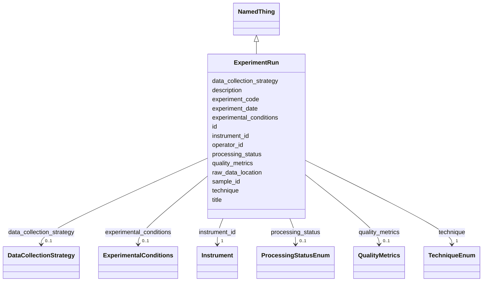

# Class: ExperimentRun 


_An experimental data collection session_


URI: [lambdaber:ExperimentRun](https://w3id.org/lambda-ber-schema/ExperimentRun)





## Inheritance
* [NamedThing](NamedThing.md)
    * **ExperimentRun**


## Slots

| Name | Cardinality and Range | Description | Inheritance |
| ---  | --- | --- | --- |
| [experiment_code](experiment_code.md) | 1 <br/> [String](String.md) | Human-friendly laboratory or facility identifier for the experiment (e | direct |
| [sample_id](sample_id.md) | 1 <br/> [String](String.md) | Reference to the sample being analyzed | direct |
| [instrument_id](instrument_id.md) | 1 <br/> [Instrument](Instrument.md) | Reference to the instrument used | direct |
| [experiment_date](experiment_date.md) | 0..1 <br/> [String](String.md) | Date of the experiment | direct |
| [operator_id](operator_id.md) | 0..1 <br/> [String](String.md) | Identifier or name of the person who performed the experiment data collection... | direct |
| [technique](technique.md) | 1 <br/> [TechniqueEnum](TechniqueEnum.md) | Technique used for data collection | direct |
| [experimental_conditions](experimental_conditions.md) | 0..1 <br/> [ExperimentalConditions](ExperimentalConditions.md) | Environmental and experimental conditions | direct |
| [data_collection_strategy](data_collection_strategy.md) | 0..1 <br/> [DataCollectionStrategy](DataCollectionStrategy.md) | Strategy for data collection | direct |
| [quality_metrics](quality_metrics.md) | 0..1 <br/> [QualityMetrics](QualityMetrics.md) | Quality metrics for the experiment | direct |
| [raw_data_location](raw_data_location.md) | 0..1 <br/> [String](String.md) | Location of raw data files | direct |
| [processing_status](processing_status.md) | 0..1 <br/> [ProcessingStatusEnum](ProcessingStatusEnum.md) | Current processing status | direct |
| [id](id.md) | 1 <br/> [Uriorcurie](Uriorcurie.md) | Globally unique identifier as an IRI or CURIE for machine processing and exte... | [NamedThing](NamedThing.md) |
| [title](title.md) | 0..1 <br/> [String](String.md) |  | [NamedThing](NamedThing.md) |
| [description](description.md) | 0..1 <br/> [String](String.md) |  | [NamedThing](NamedThing.md) |


## Usages

| used by | used in | type | used |
| ---  | --- | --- | --- |
| [Study](Study.md) | [instrument_runs](instrument_runs.md) | range | [ExperimentRun](ExperimentRun.md) |


## Identifier and Mapping Information


### Schema Source


* from schema: https://w3id.org/lambda-ber-schema/


## Mappings

| Mapping Type | Mapped Value |
| ---  | ---  |
| self | lambdaber:ExperimentRun |
| native | lambdaber:ExperimentRun |


## LinkML Source

<!-- TODO: investigate https://stackoverflow.com/questions/37606292/how-to-create-tabbed-code-blocks-in-mkdocs-or-sphinx -->

### Direct

<details>
```yaml
name: ExperimentRun
description: An experimental data collection session
from_schema: https://w3id.org/lambda-ber-schema/
is_a: NamedThing
attributes:
  experiment_code:
    name: experiment_code
    description: Human-friendly laboratory or facility identifier for the experiment
      (e.g., 'SIBYLS-2024-02-01-hetBGL', 'CRYOEM-RUN-240815-001'). Used for local
      tracking and cross-referencing within laboratory systems.
    from_schema: https://w3id.org/lambda-ber-schema/
    rank: 1000
    domain_of:
    - ExperimentRun
    required: true
  sample_id:
    name: sample_id
    description: Reference to the sample being analyzed
    from_schema: https://w3id.org/lambda-ber-schema/
    domain_of:
    - SamplePreparation
    - ExperimentRun
    range: string
    required: true
  instrument_id:
    name: instrument_id
    description: Reference to the instrument used
    from_schema: https://w3id.org/lambda-ber-schema/
    rank: 1000
    domain_of:
    - ExperimentRun
    range: Instrument
    required: true
  experiment_date:
    name: experiment_date
    description: Date of the experiment
    from_schema: https://w3id.org/lambda-ber-schema/
    rank: 1000
    domain_of:
    - ExperimentRun
    range: string
  operator_id:
    name: operator_id
    description: Identifier or name of the person who performed the experiment data
      collection (e.g., 'jsmith', 'John Smith', or personnel ID)
    from_schema: https://w3id.org/lambda-ber-schema/
    domain_of:
    - SamplePreparation
    - ExperimentRun
    range: string
  technique:
    name: technique
    description: Technique used for data collection
    from_schema: https://w3id.org/lambda-ber-schema/
    rank: 1000
    domain_of:
    - ExperimentRun
    range: TechniqueEnum
    required: true
  experimental_conditions:
    name: experimental_conditions
    description: Environmental and experimental conditions
    from_schema: https://w3id.org/lambda-ber-schema/
    rank: 1000
    domain_of:
    - ExperimentRun
    range: ExperimentalConditions
  data_collection_strategy:
    name: data_collection_strategy
    description: Strategy for data collection
    from_schema: https://w3id.org/lambda-ber-schema/
    rank: 1000
    domain_of:
    - ExperimentRun
    range: DataCollectionStrategy
  quality_metrics:
    name: quality_metrics
    description: Quality metrics for the experiment
    from_schema: https://w3id.org/lambda-ber-schema/
    domain_of:
    - Sample
    - ExperimentRun
    range: QualityMetrics
  raw_data_location:
    name: raw_data_location
    description: Location of raw data files
    from_schema: https://w3id.org/lambda-ber-schema/
    rank: 1000
    domain_of:
    - ExperimentRun
  processing_status:
    name: processing_status
    description: Current processing status
    from_schema: https://w3id.org/lambda-ber-schema/
    rank: 1000
    domain_of:
    - ExperimentRun
    range: ProcessingStatusEnum

```
</details>

### Induced

<details>
```yaml
name: ExperimentRun
description: An experimental data collection session
from_schema: https://w3id.org/lambda-ber-schema/
is_a: NamedThing
attributes:
  experiment_code:
    name: experiment_code
    description: Human-friendly laboratory or facility identifier for the experiment
      (e.g., 'SIBYLS-2024-02-01-hetBGL', 'CRYOEM-RUN-240815-001'). Used for local
      tracking and cross-referencing within laboratory systems.
    from_schema: https://w3id.org/lambda-ber-schema/
    rank: 1000
    alias: experiment_code
    owner: ExperimentRun
    domain_of:
    - ExperimentRun
    range: string
    required: true
  sample_id:
    name: sample_id
    description: Reference to the sample being analyzed
    from_schema: https://w3id.org/lambda-ber-schema/
    alias: sample_id
    owner: ExperimentRun
    domain_of:
    - SamplePreparation
    - ExperimentRun
    range: string
    required: true
  instrument_id:
    name: instrument_id
    description: Reference to the instrument used
    from_schema: https://w3id.org/lambda-ber-schema/
    rank: 1000
    alias: instrument_id
    owner: ExperimentRun
    domain_of:
    - ExperimentRun
    range: Instrument
    required: true
  experiment_date:
    name: experiment_date
    description: Date of the experiment
    from_schema: https://w3id.org/lambda-ber-schema/
    rank: 1000
    alias: experiment_date
    owner: ExperimentRun
    domain_of:
    - ExperimentRun
    range: string
  operator_id:
    name: operator_id
    description: Identifier or name of the person who performed the experiment data
      collection (e.g., 'jsmith', 'John Smith', or personnel ID)
    from_schema: https://w3id.org/lambda-ber-schema/
    alias: operator_id
    owner: ExperimentRun
    domain_of:
    - SamplePreparation
    - ExperimentRun
    range: string
  technique:
    name: technique
    description: Technique used for data collection
    from_schema: https://w3id.org/lambda-ber-schema/
    rank: 1000
    alias: technique
    owner: ExperimentRun
    domain_of:
    - ExperimentRun
    range: TechniqueEnum
    required: true
  experimental_conditions:
    name: experimental_conditions
    description: Environmental and experimental conditions
    from_schema: https://w3id.org/lambda-ber-schema/
    rank: 1000
    alias: experimental_conditions
    owner: ExperimentRun
    domain_of:
    - ExperimentRun
    range: ExperimentalConditions
  data_collection_strategy:
    name: data_collection_strategy
    description: Strategy for data collection
    from_schema: https://w3id.org/lambda-ber-schema/
    rank: 1000
    alias: data_collection_strategy
    owner: ExperimentRun
    domain_of:
    - ExperimentRun
    range: DataCollectionStrategy
  quality_metrics:
    name: quality_metrics
    description: Quality metrics for the experiment
    from_schema: https://w3id.org/lambda-ber-schema/
    alias: quality_metrics
    owner: ExperimentRun
    domain_of:
    - Sample
    - ExperimentRun
    range: QualityMetrics
  raw_data_location:
    name: raw_data_location
    description: Location of raw data files
    from_schema: https://w3id.org/lambda-ber-schema/
    rank: 1000
    alias: raw_data_location
    owner: ExperimentRun
    domain_of:
    - ExperimentRun
    range: string
  processing_status:
    name: processing_status
    description: Current processing status
    from_schema: https://w3id.org/lambda-ber-schema/
    rank: 1000
    alias: processing_status
    owner: ExperimentRun
    domain_of:
    - ExperimentRun
    range: ProcessingStatusEnum
  id:
    name: id
    description: Globally unique identifier as an IRI or CURIE for machine processing
      and external references. Used for linking data across systems and semantic web
      integration.
    from_schema: https://w3id.org/lambda-ber-schema/
    rank: 1000
    identifier: true
    alias: id
    owner: ExperimentRun
    domain_of:
    - NamedThing
    range: uriorcurie
    required: true
  title:
    name: title
    from_schema: https://w3id.org/lambda-ber-schema/
    rank: 1000
    slot_uri: dcterms:title
    alias: title
    owner: ExperimentRun
    domain_of:
    - NamedThing
    range: string
  description:
    name: description
    from_schema: https://w3id.org/lambda-ber-schema/
    rank: 1000
    alias: description
    owner: ExperimentRun
    domain_of:
    - NamedThing
    - AttributeGroup
    range: string

```
</details>