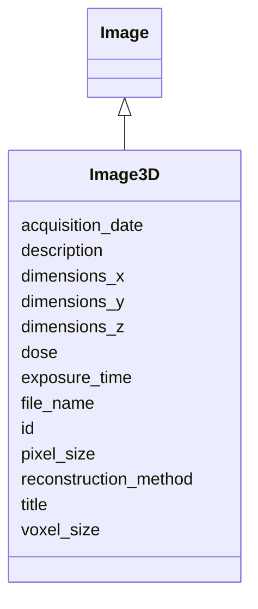

# Class: Image3D 


_A 3D volume or tomogram_


URI: [lambdaber:Image3D](https://w3id.org/lambda-ber-schema/Image3D)





## Inheritance
* [NamedThing](NamedThing.md)
    * [Image](Image.md)
        * **Image3D**


## Slots

| Name | Cardinality and Range | Description | Inheritance |
| ---  | --- | --- | --- |
| [dimensions_z](dimensions_z.md) | 0..1 <br/> [Integer](Integer.md) | Image depth in pixels/slices | direct |
| [voxel_size](voxel_size.md) | 0..1 <br/> [Float](Float.md) | Voxel size in Angstroms | direct |
| [reconstruction_method](reconstruction_method.md) | 0..1 <br/> [String](String.md) | Method used for 3D reconstruction | direct |
| [file_name](file_name.md) | 1 <br/> [String](String.md) | Image file name | [Image](Image.md) |
| [acquisition_date](acquisition_date.md) | 0..1 <br/> [String](String.md) | Date image was acquired | [Image](Image.md) |
| [pixel_size](pixel_size.md) | 0..1 <br/> [Float](Float.md) | Pixel size in Angstroms | [Image](Image.md) |
| [dimensions_x](dimensions_x.md) | 0..1 <br/> [Integer](Integer.md) | Image width in pixels | [Image](Image.md) |
| [dimensions_y](dimensions_y.md) | 0..1 <br/> [Integer](Integer.md) | Image height in pixels | [Image](Image.md) |
| [exposure_time](exposure_time.md) | 0..1 <br/> [Float](Float.md) | Exposure time in seconds | [Image](Image.md) |
| [dose](dose.md) | 0..1 <br/> [Float](Float.md) | Electron dose in e-/Ų | [Image](Image.md) |
| [id](id.md) | 1 <br/> [Uriorcurie](Uriorcurie.md) | Globally unique identifier as an IRI or CURIE for machine processing and exte... | [NamedThing](NamedThing.md) |
| [title](title.md) | 0..1 <br/> [String](String.md) |  | [NamedThing](NamedThing.md) |
| [description](description.md) | 0..1 <br/> [String](String.md) |  | [NamedThing](NamedThing.md) |


## Identifier and Mapping Information


### Schema Source


* from schema: https://w3id.org/lambda-ber-schema/


## Mappings

| Mapping Type | Mapped Value |
| ---  | ---  |
| self | lambdaber:Image3D |
| native | lambdaber:Image3D |


## LinkML Source

<!-- TODO: investigate https://stackoverflow.com/questions/37606292/how-to-create-tabbed-code-blocks-in-mkdocs-or-sphinx -->

### Direct

<details>
```yaml
name: Image3D
description: A 3D volume or tomogram
from_schema: https://w3id.org/lambda-ber-schema/
is_a: Image
attributes:
  dimensions_z:
    name: dimensions_z
    description: Image depth in pixels/slices
    from_schema: https://w3id.org/lambda-ber-schema/
    rank: 1000
    domain_of:
    - Image3D
    range: integer
  voxel_size:
    name: voxel_size
    description: Voxel size in Angstroms
    from_schema: https://w3id.org/lambda-ber-schema/
    rank: 1000
    domain_of:
    - Image3D
    range: float
  reconstruction_method:
    name: reconstruction_method
    description: Method used for 3D reconstruction
    from_schema: https://w3id.org/lambda-ber-schema/
    rank: 1000
    domain_of:
    - Image3D

```
</details>

### Induced

<details>
```yaml
name: Image3D
description: A 3D volume or tomogram
from_schema: https://w3id.org/lambda-ber-schema/
is_a: Image
attributes:
  dimensions_z:
    name: dimensions_z
    description: Image depth in pixels/slices
    from_schema: https://w3id.org/lambda-ber-schema/
    rank: 1000
    alias: dimensions_z
    owner: Image3D
    domain_of:
    - Image3D
    range: integer
  voxel_size:
    name: voxel_size
    description: Voxel size in Angstroms
    from_schema: https://w3id.org/lambda-ber-schema/
    rank: 1000
    alias: voxel_size
    owner: Image3D
    domain_of:
    - Image3D
    range: float
  reconstruction_method:
    name: reconstruction_method
    description: Method used for 3D reconstruction
    from_schema: https://w3id.org/lambda-ber-schema/
    rank: 1000
    alias: reconstruction_method
    owner: Image3D
    domain_of:
    - Image3D
    range: string
  file_name:
    name: file_name
    description: Image file name
    from_schema: https://w3id.org/lambda-ber-schema/
    alias: file_name
    owner: Image3D
    domain_of:
    - DataFile
    - Image
    range: string
    required: true
  acquisition_date:
    name: acquisition_date
    description: Date image was acquired
    from_schema: https://w3id.org/lambda-ber-schema/
    rank: 1000
    alias: acquisition_date
    owner: Image3D
    domain_of:
    - Image
    range: string
  pixel_size:
    name: pixel_size
    description: Pixel size in Angstroms
    from_schema: https://w3id.org/lambda-ber-schema/
    rank: 1000
    alias: pixel_size
    owner: Image3D
    domain_of:
    - Image
    - RefinementParameters
    range: float
  dimensions_x:
    name: dimensions_x
    description: Image width in pixels
    from_schema: https://w3id.org/lambda-ber-schema/
    rank: 1000
    alias: dimensions_x
    owner: Image3D
    domain_of:
    - Image
    range: integer
  dimensions_y:
    name: dimensions_y
    description: Image height in pixels
    from_schema: https://w3id.org/lambda-ber-schema/
    rank: 1000
    alias: dimensions_y
    owner: Image3D
    domain_of:
    - Image
    range: integer
  exposure_time:
    name: exposure_time
    description: Exposure time in seconds
    from_schema: https://w3id.org/lambda-ber-schema/
    rank: 1000
    alias: exposure_time
    owner: Image3D
    domain_of:
    - Image
    - ExperimentalConditions
    range: float
  dose:
    name: dose
    description: Electron dose in e-/Ų
    from_schema: https://w3id.org/lambda-ber-schema/
    rank: 1000
    alias: dose
    owner: Image3D
    domain_of:
    - Image
    - Micrograph
    range: float
  id:
    name: id
    description: Globally unique identifier as an IRI or CURIE for machine processing
      and external references. Used for linking data across systems and semantic web
      integration.
    from_schema: https://w3id.org/lambda-ber-schema/
    rank: 1000
    identifier: true
    alias: id
    owner: Image3D
    domain_of:
    - NamedThing
    range: uriorcurie
    required: true
  title:
    name: title
    from_schema: https://w3id.org/lambda-ber-schema/
    rank: 1000
    slot_uri: dcterms:title
    alias: title
    owner: Image3D
    domain_of:
    - NamedThing
    range: string
  description:
    name: description
    from_schema: https://w3id.org/lambda-ber-schema/
    rank: 1000
    alias: description
    owner: Image3D
    domain_of:
    - NamedThing
    - AttributeGroup
    range: string

```
</details>