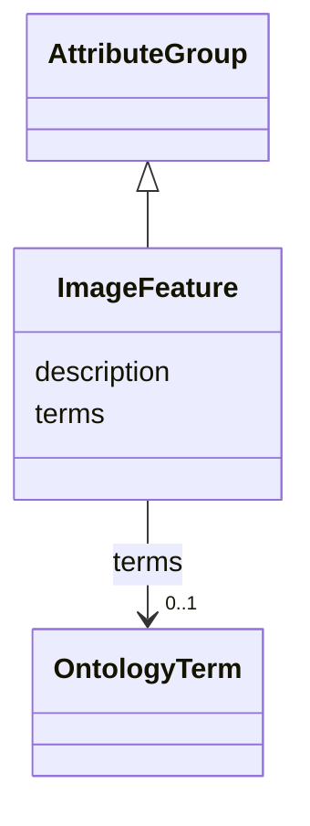

# Class: ImageFeature 


_Semantic annotations describing features identified in images using controlled vocabulary terms_


URI: [lambdaber:ImageFeature](https://w3id.org/lambda-ber-schema/ImageFeature)





## Inheritance
* [AttributeGroup](AttributeGroup.md)
    * **ImageFeature**


## Slots

| Name | Cardinality and Range | Description | Inheritance |
| ---  | --- | --- | --- |
| [terms](terms.md) | 0..1 <br/> [OntologyTerm](OntologyTerm.md) |  | direct |
| [description](description.md) | 0..1 <br/> [String](String.md) |  | [AttributeGroup](AttributeGroup.md) |


## Identifier and Mapping Information


### Schema Source


* from schema: https://w3id.org/lambda-ber-schema/


## Mappings

| Mapping Type | Mapped Value |
| ---  | ---  |
| self | lambdaber:ImageFeature |
| native | lambdaber:ImageFeature |


## LinkML Source

<!-- TODO: investigate https://stackoverflow.com/questions/37606292/how-to-create-tabbed-code-blocks-in-mkdocs-or-sphinx -->

### Direct

<details>
```yaml
name: ImageFeature
description: Semantic annotations describing features identified in images using controlled
  vocabulary terms
from_schema: https://w3id.org/lambda-ber-schema/
is_a: AttributeGroup
attributes:
  terms:
    name: terms
    from_schema: https://w3id.org/lambda-ber-schema/
    rank: 1000
    domain_of:
    - ImageFeature
    range: OntologyTerm

```
</details>

### Induced

<details>
```yaml
name: ImageFeature
description: Semantic annotations describing features identified in images using controlled
  vocabulary terms
from_schema: https://w3id.org/lambda-ber-schema/
is_a: AttributeGroup
attributes:
  terms:
    name: terms
    from_schema: https://w3id.org/lambda-ber-schema/
    rank: 1000
    alias: terms
    owner: ImageFeature
    domain_of:
    - ImageFeature
    range: OntologyTerm
  description:
    name: description
    from_schema: https://w3id.org/lambda-ber-schema/
    alias: description
    owner: ImageFeature
    domain_of:
    - NamedThing
    - AttributeGroup
    range: string

```
</details>