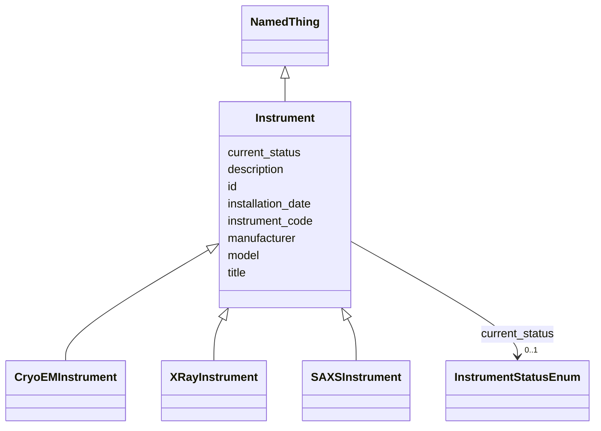

# Class: Instrument 


_An instrument used to collect data_


URI: [lambdaber:Instrument](https://w3id.org/lambda-ber-schema/Instrument)





## Inheritance
* [NamedThing](NamedThing.md)
    * **Instrument**
        * [CryoEMInstrument](CryoEMInstrument.md)
        * [XRayInstrument](XRayInstrument.md)
        * [SAXSInstrument](SAXSInstrument.md)


## Slots

| Name | Cardinality and Range | Description | Inheritance |
| ---  | --- | --- | --- |
| [instrument_code](instrument_code.md) | 1 <br/> [String](String.md) | Human-friendly facility or laboratory identifier for the instrument (e | direct |
| [manufacturer](manufacturer.md) | 0..1 <br/> [String](String.md) | Instrument manufacturer | direct |
| [model](model.md) | 0..1 <br/> [String](String.md) | Instrument model | direct |
| [installation_date](installation_date.md) | 0..1 <br/> [String](String.md) | Date of instrument installation | direct |
| [current_status](current_status.md) | 0..1 <br/> [InstrumentStatusEnum](InstrumentStatusEnum.md) | Current operational status | direct |
| [id](id.md) | 1 <br/> [Uriorcurie](Uriorcurie.md) | Globally unique identifier as an IRI or CURIE for machine processing and exte... | [NamedThing](NamedThing.md) |
| [title](title.md) | 0..1 <br/> [String](String.md) | A human-readable name or title for this entity | [NamedThing](NamedThing.md) |
| [description](description.md) | 0..1 <br/> [String](String.md) | A detailed textual description of this entity | [NamedThing](NamedThing.md) |


## Usages

| used by | used in | type | used |
| ---  | --- | --- | --- |
| [Dataset](Dataset.md) | [instruments](instruments.md) | range | [Instrument](Instrument.md) |
| [ExperimentRun](ExperimentRun.md) | [instrument_id](instrument_id.md) | range | [Instrument](Instrument.md) |


## Identifier and Mapping Information


### Schema Source


* from schema: https://w3id.org/lambda-ber-schema/


## Mappings

| Mapping Type | Mapped Value |
| ---  | ---  |
| self | lambdaber:Instrument |
| native | lambdaber:Instrument |


## LinkML Source

<!-- TODO: investigate https://stackoverflow.com/questions/37606292/how-to-create-tabbed-code-blocks-in-mkdocs-or-sphinx -->

### Direct

<details>
```yaml
name: Instrument
description: An instrument used to collect data
from_schema: https://w3id.org/lambda-ber-schema/
is_a: NamedThing
attributes:
  instrument_code:
    name: instrument_code
    description: Human-friendly facility or laboratory identifier for the instrument
      (e.g., 'TITAN-KRIOS-1', 'ALS-12.3.1-SIBYLS', 'RIGAKU-FR-E'). Used for local
      reference and equipment tracking.
    from_schema: https://w3id.org/lambda-ber-schema/
    rank: 1000
    domain_of:
    - Instrument
    required: true
  manufacturer:
    name: manufacturer
    description: Instrument manufacturer
    from_schema: https://w3id.org/lambda-ber-schema/
    rank: 1000
    domain_of:
    - Instrument
  model:
    name: model
    description: Instrument model
    from_schema: https://w3id.org/lambda-ber-schema/
    rank: 1000
    domain_of:
    - Instrument
  installation_date:
    name: installation_date
    description: Date of instrument installation
    from_schema: https://w3id.org/lambda-ber-schema/
    rank: 1000
    domain_of:
    - Instrument
    range: string
  current_status:
    name: current_status
    description: Current operational status
    from_schema: https://w3id.org/lambda-ber-schema/
    rank: 1000
    domain_of:
    - Instrument
    range: InstrumentStatusEnum

```
</details>

### Induced

<details>
```yaml
name: Instrument
description: An instrument used to collect data
from_schema: https://w3id.org/lambda-ber-schema/
is_a: NamedThing
attributes:
  instrument_code:
    name: instrument_code
    description: Human-friendly facility or laboratory identifier for the instrument
      (e.g., 'TITAN-KRIOS-1', 'ALS-12.3.1-SIBYLS', 'RIGAKU-FR-E'). Used for local
      reference and equipment tracking.
    from_schema: https://w3id.org/lambda-ber-schema/
    rank: 1000
    alias: instrument_code
    owner: Instrument
    domain_of:
    - Instrument
    range: string
    required: true
  manufacturer:
    name: manufacturer
    description: Instrument manufacturer
    from_schema: https://w3id.org/lambda-ber-schema/
    rank: 1000
    alias: manufacturer
    owner: Instrument
    domain_of:
    - Instrument
    range: string
  model:
    name: model
    description: Instrument model
    from_schema: https://w3id.org/lambda-ber-schema/
    rank: 1000
    alias: model
    owner: Instrument
    domain_of:
    - Instrument
    range: string
  installation_date:
    name: installation_date
    description: Date of instrument installation
    from_schema: https://w3id.org/lambda-ber-schema/
    rank: 1000
    alias: installation_date
    owner: Instrument
    domain_of:
    - Instrument
    range: string
  current_status:
    name: current_status
    description: Current operational status
    from_schema: https://w3id.org/lambda-ber-schema/
    rank: 1000
    alias: current_status
    owner: Instrument
    domain_of:
    - Instrument
    range: InstrumentStatusEnum
  id:
    name: id
    description: Globally unique identifier as an IRI or CURIE for machine processing
      and external references. Used for linking data across systems and semantic web
      integration.
    from_schema: https://w3id.org/lambda-ber-schema/
    rank: 1000
    identifier: true
    alias: id
    owner: Instrument
    domain_of:
    - NamedThing
    range: uriorcurie
    required: true
  title:
    name: title
    description: A human-readable name or title for this entity
    from_schema: https://w3id.org/lambda-ber-schema/
    rank: 1000
    slot_uri: dcterms:title
    alias: title
    owner: Instrument
    domain_of:
    - NamedThing
    range: string
  description:
    name: description
    description: A detailed textual description of this entity
    from_schema: https://w3id.org/lambda-ber-schema/
    rank: 1000
    alias: description
    owner: Instrument
    domain_of:
    - NamedThing
    - AttributeGroup
    range: string

```
</details>