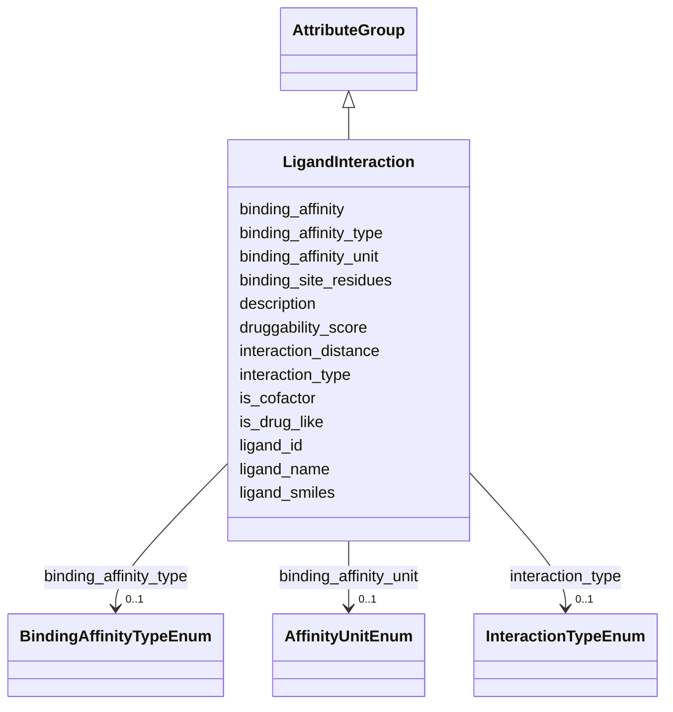

# Class: LigandInteraction 


_Small molecule/ligand interactions with proteins_


URI: [lambdaber:LigandInteraction](https://w3id.org/lambda-ber-schema/LigandInteraction)





## Inheritance
* [AttributeGroup](AttributeGroup.md)
    * **LigandInteraction**


## Slots

| Name | Cardinality and Range | Description | Inheritance |
| ---  | --- | --- | --- |
| [ligand_id](ligand_id.md) | 1 <br/> [Uriorcurie](Uriorcurie.md) | Ligand identifier (ChEMBL, ChEBI, PubChem) | direct |
| [ligand_name](ligand_name.md) | 1 <br/> [String](String.md) | Common name of the ligand | direct |
| [ligand_smiles](ligand_smiles.md) | 0..1 <br/> [SmilesString](SmilesString.md) | SMILES representation of the ligand | direct |
| [binding_affinity](binding_affinity.md) | 0..1 <br/> [Float](Float.md) | Binding affinity value | direct |
| [binding_affinity_type](binding_affinity_type.md) | 0..1 <br/> [BindingAffinityTypeEnum](BindingAffinityTypeEnum.md) | Type of binding measurement (Kd, Ki, IC50) | direct |
| [binding_affinity_unit](binding_affinity_unit.md) | 0..1 <br/> [AffinityUnitEnum](AffinityUnitEnum.md) | Unit of binding affinity | direct |
| [interaction_type](interaction_type.md) | 0..1 <br/> [InteractionTypeEnum](InteractionTypeEnum.md) | Type of interaction | direct |
| [binding_site_residues](binding_site_residues.md) | * <br/> [String](String.md) | Residues involved in ligand binding | direct |
| [is_cofactor](is_cofactor.md) | 0..1 <br/> [Boolean](Boolean.md) | Whether the ligand is a cofactor | direct |
| [is_drug_like](is_drug_like.md) | 0..1 <br/> [Boolean](Boolean.md) | Whether the ligand has drug-like properties | direct |
| [druggability_score](druggability_score.md) | 0..1 <br/> [Float](Float.md) | Druggability score of the binding site | direct |
| [interaction_distance](interaction_distance.md) | 0..1 <br/> [Float](Float.md) | Distance criteria for interaction (Angstroms) | direct |
| [description](description.md) | 0..1 <br/> [String](String.md) |  | [AttributeGroup](AttributeGroup.md) |


## Usages

| used by | used in | type | used |
| ---  | --- | --- | --- |
| [Sample](Sample.md) | [ligand_interactions](ligand_interactions.md) | range | [LigandInteraction](LigandInteraction.md) |
| [FunctionalSite](FunctionalSite.md) | [ligand_interactions](ligand_interactions.md) | range | [LigandInteraction](LigandInteraction.md) |
| [AggregatedProteinView](AggregatedProteinView.md) | [ligand_interactions](ligand_interactions.md) | range | [LigandInteraction](LigandInteraction.md) |


## Identifier and Mapping Information


### Schema Source


* from schema: https://w3id.org/lambda-ber-schema/


## Mappings

| Mapping Type | Mapped Value |
| ---  | ---  |
| self | lambdaber:LigandInteraction |
| native | lambdaber:LigandInteraction |


## LinkML Source

<!-- TODO: investigate https://stackoverflow.com/questions/37606292/how-to-create-tabbed-code-blocks-in-mkdocs-or-sphinx -->

### Direct

<details>
```yaml
name: LigandInteraction
description: Small molecule/ligand interactions with proteins
from_schema: https://w3id.org/lambda-ber-schema/
is_a: AttributeGroup
attributes:
  ligand_id:
    name: ligand_id
    description: Ligand identifier (ChEMBL, ChEBI, PubChem)
    from_schema: https://w3id.org/lambda-ber-schema/functional_annotation
    rank: 1000
    domain_of:
    - LigandInteraction
    range: uriorcurie
    required: true
  ligand_name:
    name: ligand_name
    description: Common name of the ligand
    from_schema: https://w3id.org/lambda-ber-schema/functional_annotation
    rank: 1000
    domain_of:
    - LigandInteraction
    required: true
  ligand_smiles:
    name: ligand_smiles
    description: SMILES representation of the ligand
    from_schema: https://w3id.org/lambda-ber-schema/functional_annotation
    rank: 1000
    domain_of:
    - LigandInteraction
    range: smiles_string
  binding_affinity:
    name: binding_affinity
    description: Binding affinity value
    from_schema: https://w3id.org/lambda-ber-schema/functional_annotation
    rank: 1000
    domain_of:
    - LigandInteraction
    range: float
  binding_affinity_type:
    name: binding_affinity_type
    description: Type of binding measurement (Kd, Ki, IC50)
    from_schema: https://w3id.org/lambda-ber-schema/functional_annotation
    rank: 1000
    domain_of:
    - LigandInteraction
    range: BindingAffinityTypeEnum
  binding_affinity_unit:
    name: binding_affinity_unit
    description: Unit of binding affinity
    from_schema: https://w3id.org/lambda-ber-schema/functional_annotation
    rank: 1000
    domain_of:
    - LigandInteraction
    range: AffinityUnitEnum
  interaction_type:
    name: interaction_type
    description: Type of interaction
    from_schema: https://w3id.org/lambda-ber-schema/functional_annotation
    rank: 1000
    domain_of:
    - LigandInteraction
    range: InteractionTypeEnum
  binding_site_residues:
    name: binding_site_residues
    description: Residues involved in ligand binding
    from_schema: https://w3id.org/lambda-ber-schema/functional_annotation
    rank: 1000
    domain_of:
    - LigandInteraction
    multivalued: true
  is_cofactor:
    name: is_cofactor
    description: Whether the ligand is a cofactor
    from_schema: https://w3id.org/lambda-ber-schema/functional_annotation
    rank: 1000
    domain_of:
    - LigandInteraction
    range: boolean
  is_drug_like:
    name: is_drug_like
    description: Whether the ligand has drug-like properties
    from_schema: https://w3id.org/lambda-ber-schema/functional_annotation
    rank: 1000
    domain_of:
    - LigandInteraction
    range: boolean
  druggability_score:
    name: druggability_score
    description: Druggability score of the binding site
    from_schema: https://w3id.org/lambda-ber-schema/functional_annotation
    rank: 1000
    domain_of:
    - LigandInteraction
    range: float
    minimum_value: 0
    maximum_value: 1
  interaction_distance:
    name: interaction_distance
    description: Distance criteria for interaction (Angstroms)
    from_schema: https://w3id.org/lambda-ber-schema/functional_annotation
    rank: 1000
    domain_of:
    - LigandInteraction
    range: float
    unit:
      ucum_code: Angstrom

```
</details>

### Induced

<details>
```yaml
name: LigandInteraction
description: Small molecule/ligand interactions with proteins
from_schema: https://w3id.org/lambda-ber-schema/
is_a: AttributeGroup
attributes:
  ligand_id:
    name: ligand_id
    description: Ligand identifier (ChEMBL, ChEBI, PubChem)
    from_schema: https://w3id.org/lambda-ber-schema/functional_annotation
    rank: 1000
    alias: ligand_id
    owner: LigandInteraction
    domain_of:
    - LigandInteraction
    range: uriorcurie
    required: true
  ligand_name:
    name: ligand_name
    description: Common name of the ligand
    from_schema: https://w3id.org/lambda-ber-schema/functional_annotation
    rank: 1000
    alias: ligand_name
    owner: LigandInteraction
    domain_of:
    - LigandInteraction
    range: string
    required: true
  ligand_smiles:
    name: ligand_smiles
    description: SMILES representation of the ligand
    from_schema: https://w3id.org/lambda-ber-schema/functional_annotation
    rank: 1000
    alias: ligand_smiles
    owner: LigandInteraction
    domain_of:
    - LigandInteraction
    range: smiles_string
  binding_affinity:
    name: binding_affinity
    description: Binding affinity value
    from_schema: https://w3id.org/lambda-ber-schema/functional_annotation
    rank: 1000
    alias: binding_affinity
    owner: LigandInteraction
    domain_of:
    - LigandInteraction
    range: float
  binding_affinity_type:
    name: binding_affinity_type
    description: Type of binding measurement (Kd, Ki, IC50)
    from_schema: https://w3id.org/lambda-ber-schema/functional_annotation
    rank: 1000
    alias: binding_affinity_type
    owner: LigandInteraction
    domain_of:
    - LigandInteraction
    range: BindingAffinityTypeEnum
  binding_affinity_unit:
    name: binding_affinity_unit
    description: Unit of binding affinity
    from_schema: https://w3id.org/lambda-ber-schema/functional_annotation
    rank: 1000
    alias: binding_affinity_unit
    owner: LigandInteraction
    domain_of:
    - LigandInteraction
    range: AffinityUnitEnum
  interaction_type:
    name: interaction_type
    description: Type of interaction
    from_schema: https://w3id.org/lambda-ber-schema/functional_annotation
    rank: 1000
    alias: interaction_type
    owner: LigandInteraction
    domain_of:
    - LigandInteraction
    range: InteractionTypeEnum
  binding_site_residues:
    name: binding_site_residues
    description: Residues involved in ligand binding
    from_schema: https://w3id.org/lambda-ber-schema/functional_annotation
    rank: 1000
    alias: binding_site_residues
    owner: LigandInteraction
    domain_of:
    - LigandInteraction
    range: string
    multivalued: true
  is_cofactor:
    name: is_cofactor
    description: Whether the ligand is a cofactor
    from_schema: https://w3id.org/lambda-ber-schema/functional_annotation
    rank: 1000
    alias: is_cofactor
    owner: LigandInteraction
    domain_of:
    - LigandInteraction
    range: boolean
  is_drug_like:
    name: is_drug_like
    description: Whether the ligand has drug-like properties
    from_schema: https://w3id.org/lambda-ber-schema/functional_annotation
    rank: 1000
    alias: is_drug_like
    owner: LigandInteraction
    domain_of:
    - LigandInteraction
    range: boolean
  druggability_score:
    name: druggability_score
    description: Druggability score of the binding site
    from_schema: https://w3id.org/lambda-ber-schema/functional_annotation
    rank: 1000
    alias: druggability_score
    owner: LigandInteraction
    domain_of:
    - LigandInteraction
    range: float
    minimum_value: 0
    maximum_value: 1
  interaction_distance:
    name: interaction_distance
    description: Distance criteria for interaction (Angstroms)
    from_schema: https://w3id.org/lambda-ber-schema/functional_annotation
    rank: 1000
    alias: interaction_distance
    owner: LigandInteraction
    domain_of:
    - LigandInteraction
    range: float
    unit:
      ucum_code: Angstrom
  description:
    name: description
    from_schema: https://w3id.org/lambda-ber-schema/
    alias: description
    owner: LigandInteraction
    domain_of:
    - NamedThing
    - AttributeGroup
    range: string

```
</details>