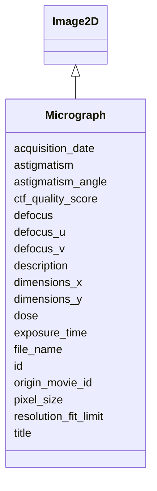

# Class: Micrograph 


_Motion-corrected micrograph derived from movie_


URI: [lambdaber:Micrograph](https://w3id.org/lambda-ber-schema/Micrograph)





## Inheritance
* [NamedThing](NamedThing.md)
    * [Image](Image.md)
        * [Image2D](Image2D.md)
            * **Micrograph**


## Slots

| Name | Cardinality and Range | Description | Inheritance |
| ---  | --- | --- | --- |
| [dose](dose.md) | 0..1 <br/> [Float](Float.md) | Total electron dose in e-/Angstrom^2 | direct |
| [origin_movie_id](origin_movie_id.md) | 0..1 <br/> [String](String.md) | Reference to original movie file | direct |
| [defocus_u](defocus_u.md) | 0..1 <br/> [Float](Float.md) | Defocus U in micrometers | direct |
| [defocus_v](defocus_v.md) | 0..1 <br/> [Float](Float.md) | Defocus V in micrometers | direct |
| [astigmatism_angle](astigmatism_angle.md) | 0..1 <br/> [Float](Float.md) | Astigmatism angle in degrees | direct |
| [resolution_fit_limit](resolution_fit_limit.md) | 0..1 <br/> [Float](Float.md) | Resolution fit limit in Angstroms | direct |
| [ctf_quality_score](ctf_quality_score.md) | 0..1 <br/> [Float](Float.md) | CTF estimation quality score | direct |
| [defocus](defocus.md) | 0..1 <br/> [Float](Float.md) | Measured defocus in micrometers | [Image2D](Image2D.md) |
| [astigmatism](astigmatism.md) | 0..1 <br/> [Float](Float.md) | Astigmatism in Angstroms | [Image2D](Image2D.md) |
| [file_name](file_name.md) | 1 <br/> [String](String.md) | Image file name | [Image](Image.md) |
| [acquisition_date](acquisition_date.md) | 0..1 <br/> [String](String.md) | Date image was acquired | [Image](Image.md) |
| [pixel_size](pixel_size.md) | 0..1 <br/> [Float](Float.md) | Final pixel size in Angstroms per pixel | [Image](Image.md) |
| [dimensions_x](dimensions_x.md) | 0..1 <br/> [Integer](Integer.md) | Image width in pixels | [Image](Image.md) |
| [dimensions_y](dimensions_y.md) | 0..1 <br/> [Integer](Integer.md) | Image height in pixels | [Image](Image.md) |
| [exposure_time](exposure_time.md) | 0..1 <br/> [Float](Float.md) | Exposure time in seconds | [Image](Image.md) |
| [id](id.md) | 1 <br/> [Uriorcurie](Uriorcurie.md) | Globally unique identifier as an IRI or CURIE for machine processing and exte... | [NamedThing](NamedThing.md) |
| [title](title.md) | 0..1 <br/> [String](String.md) | A human-readable name or title for this entity | [NamedThing](NamedThing.md) |
| [description](description.md) | 0..1 <br/> [String](String.md) | A detailed textual description of this entity | [NamedThing](NamedThing.md) |


## Identifier and Mapping Information


### Schema Source


* from schema: https://w3id.org/lambda-ber-schema/


## Mappings

| Mapping Type | Mapped Value |
| ---  | ---  |
| self | lambdaber:Micrograph |
| native | lambdaber:Micrograph |


## LinkML Source

<!-- TODO: investigate https://stackoverflow.com/questions/37606292/how-to-create-tabbed-code-blocks-in-mkdocs-or-sphinx -->

### Direct

<details>
```yaml
name: Micrograph
description: Motion-corrected micrograph derived from movie
from_schema: https://w3id.org/lambda-ber-schema/
is_a: Image2D
slot_usage:
  pixel_size:
    name: pixel_size
    description: Final pixel size in Angstroms per pixel
  defocus:
    name: defocus
    description: Measured defocus in micrometers
  astigmatism:
    name: astigmatism
    description: Astigmatism in Angstroms
attributes:
  dose:
    name: dose
    description: Total electron dose in e-/Angstrom^2
    from_schema: https://w3id.org/lambda-ber-schema/
    domain_of:
    - Image
    - Micrograph
    range: float
  origin_movie_id:
    name: origin_movie_id
    description: Reference to original movie file
    from_schema: https://w3id.org/lambda-ber-schema/
    rank: 1000
    domain_of:
    - Micrograph
    range: string
  defocus_u:
    name: defocus_u
    description: Defocus U in micrometers
    from_schema: https://w3id.org/lambda-ber-schema/
    rank: 1000
    domain_of:
    - Micrograph
    range: float
  defocus_v:
    name: defocus_v
    description: Defocus V in micrometers
    from_schema: https://w3id.org/lambda-ber-schema/
    rank: 1000
    domain_of:
    - Micrograph
    range: float
  astigmatism_angle:
    name: astigmatism_angle
    description: Astigmatism angle in degrees
    from_schema: https://w3id.org/lambda-ber-schema/
    rank: 1000
    domain_of:
    - Micrograph
    range: float
  resolution_fit_limit:
    name: resolution_fit_limit
    description: Resolution fit limit in Angstroms
    from_schema: https://w3id.org/lambda-ber-schema/
    rank: 1000
    domain_of:
    - Micrograph
    range: float
  ctf_quality_score:
    name: ctf_quality_score
    description: CTF estimation quality score
    from_schema: https://w3id.org/lambda-ber-schema/
    rank: 1000
    domain_of:
    - Micrograph
    range: float

```
</details>

### Induced

<details>
```yaml
name: Micrograph
description: Motion-corrected micrograph derived from movie
from_schema: https://w3id.org/lambda-ber-schema/
is_a: Image2D
slot_usage:
  pixel_size:
    name: pixel_size
    description: Final pixel size in Angstroms per pixel
  defocus:
    name: defocus
    description: Measured defocus in micrometers
  astigmatism:
    name: astigmatism
    description: Astigmatism in Angstroms
attributes:
  dose:
    name: dose
    description: Total electron dose in e-/Angstrom^2
    from_schema: https://w3id.org/lambda-ber-schema/
    alias: dose
    owner: Micrograph
    domain_of:
    - Image
    - Micrograph
    range: float
  origin_movie_id:
    name: origin_movie_id
    description: Reference to original movie file
    from_schema: https://w3id.org/lambda-ber-schema/
    rank: 1000
    alias: origin_movie_id
    owner: Micrograph
    domain_of:
    - Micrograph
    range: string
  defocus_u:
    name: defocus_u
    description: Defocus U in micrometers
    from_schema: https://w3id.org/lambda-ber-schema/
    rank: 1000
    alias: defocus_u
    owner: Micrograph
    domain_of:
    - Micrograph
    range: float
  defocus_v:
    name: defocus_v
    description: Defocus V in micrometers
    from_schema: https://w3id.org/lambda-ber-schema/
    rank: 1000
    alias: defocus_v
    owner: Micrograph
    domain_of:
    - Micrograph
    range: float
  astigmatism_angle:
    name: astigmatism_angle
    description: Astigmatism angle in degrees
    from_schema: https://w3id.org/lambda-ber-schema/
    rank: 1000
    alias: astigmatism_angle
    owner: Micrograph
    domain_of:
    - Micrograph
    range: float
  resolution_fit_limit:
    name: resolution_fit_limit
    description: Resolution fit limit in Angstroms
    from_schema: https://w3id.org/lambda-ber-schema/
    rank: 1000
    alias: resolution_fit_limit
    owner: Micrograph
    domain_of:
    - Micrograph
    range: float
  ctf_quality_score:
    name: ctf_quality_score
    description: CTF estimation quality score
    from_schema: https://w3id.org/lambda-ber-schema/
    rank: 1000
    alias: ctf_quality_score
    owner: Micrograph
    domain_of:
    - Micrograph
    range: float
  defocus:
    name: defocus
    description: Measured defocus in micrometers
    from_schema: https://w3id.org/lambda-ber-schema/
    rank: 1000
    alias: defocus
    owner: Micrograph
    domain_of:
    - Image2D
    range: float
  astigmatism:
    name: astigmatism
    description: Astigmatism in Angstroms
    from_schema: https://w3id.org/lambda-ber-schema/
    rank: 1000
    alias: astigmatism
    owner: Micrograph
    domain_of:
    - Image2D
    range: float
  file_name:
    name: file_name
    description: Image file name
    from_schema: https://w3id.org/lambda-ber-schema/
    alias: file_name
    owner: Micrograph
    domain_of:
    - DataFile
    - Image
    range: string
    required: true
  acquisition_date:
    name: acquisition_date
    description: Date image was acquired
    from_schema: https://w3id.org/lambda-ber-schema/
    rank: 1000
    alias: acquisition_date
    owner: Micrograph
    domain_of:
    - Image
    range: string
  pixel_size:
    name: pixel_size
    description: Final pixel size in Angstroms per pixel
    from_schema: https://w3id.org/lambda-ber-schema/
    rank: 1000
    alias: pixel_size
    owner: Micrograph
    domain_of:
    - Image
    - RefinementParameters
    range: float
  dimensions_x:
    name: dimensions_x
    description: Image width in pixels
    from_schema: https://w3id.org/lambda-ber-schema/
    rank: 1000
    alias: dimensions_x
    owner: Micrograph
    domain_of:
    - Image
    range: integer
  dimensions_y:
    name: dimensions_y
    description: Image height in pixels
    from_schema: https://w3id.org/lambda-ber-schema/
    rank: 1000
    alias: dimensions_y
    owner: Micrograph
    domain_of:
    - Image
    range: integer
  exposure_time:
    name: exposure_time
    description: Exposure time in seconds
    from_schema: https://w3id.org/lambda-ber-schema/
    rank: 1000
    alias: exposure_time
    owner: Micrograph
    domain_of:
    - Image
    - ExperimentalConditions
    range: float
  id:
    name: id
    description: Globally unique identifier as an IRI or CURIE for machine processing
      and external references. Used for linking data across systems and semantic web
      integration.
    from_schema: https://w3id.org/lambda-ber-schema/
    rank: 1000
    identifier: true
    alias: id
    owner: Micrograph
    domain_of:
    - NamedThing
    range: uriorcurie
    required: true
  title:
    name: title
    description: A human-readable name or title for this entity
    from_schema: https://w3id.org/lambda-ber-schema/
    rank: 1000
    slot_uri: dcterms:title
    alias: title
    owner: Micrograph
    domain_of:
    - NamedThing
    range: string
  description:
    name: description
    description: A detailed textual description of this entity
    from_schema: https://w3id.org/lambda-ber-schema/
    rank: 1000
    alias: description
    owner: Micrograph
    domain_of:
    - NamedThing
    - AttributeGroup
    range: string

```
</details>