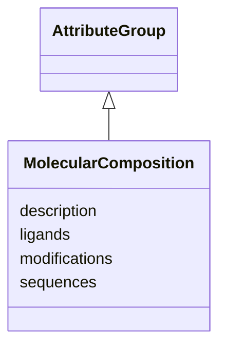

# Class: MolecularComposition 


_Molecular composition of a sample_


URI: [lambdaber:MolecularComposition](https://w3id.org/lambda-ber-schema/MolecularComposition)





## Inheritance
* [AttributeGroup](AttributeGroup.md)
    * **MolecularComposition**


## Slots

| Name | Cardinality and Range | Description | Inheritance |
| ---  | --- | --- | --- |
| [sequences](sequences.md) | * <br/> [String](String.md) | Amino acid or nucleotide sequences | direct |
| [modifications](modifications.md) | * <br/> [String](String.md) | Post-translational modifications or chemical modifications | direct |
| [ligands](ligands.md) | * <br/> [String](String.md) | Bound ligands or cofactors | direct |
| [description](description.md) | 0..1 <br/> [String](String.md) |  | [AttributeGroup](AttributeGroup.md) |


## Usages

| used by | used in | type | used |
| ---  | --- | --- | --- |
| [Sample](Sample.md) | [molecular_composition](molecular_composition.md) | range | [MolecularComposition](MolecularComposition.md) |


## Identifier and Mapping Information


### Schema Source


* from schema: https://w3id.org/lambda-ber-schema/


## Mappings

| Mapping Type | Mapped Value |
| ---  | ---  |
| self | lambdaber:MolecularComposition |
| native | lambdaber:MolecularComposition |


## LinkML Source

<!-- TODO: investigate https://stackoverflow.com/questions/37606292/how-to-create-tabbed-code-blocks-in-mkdocs-or-sphinx -->

### Direct

<details>
```yaml
name: MolecularComposition
description: Molecular composition of a sample
from_schema: https://w3id.org/lambda-ber-schema/
is_a: AttributeGroup
attributes:
  sequences:
    name: sequences
    description: Amino acid or nucleotide sequences
    from_schema: https://w3id.org/lambda-ber-schema/
    rank: 1000
    domain_of:
    - MolecularComposition
    range: string
    multivalued: true
  modifications:
    name: modifications
    description: Post-translational modifications or chemical modifications
    from_schema: https://w3id.org/lambda-ber-schema/
    rank: 1000
    domain_of:
    - MolecularComposition
    range: string
    multivalued: true
  ligands:
    name: ligands
    description: Bound ligands or cofactors
    from_schema: https://w3id.org/lambda-ber-schema/
    rank: 1000
    domain_of:
    - MolecularComposition
    range: string
    multivalued: true

```
</details>

### Induced

<details>
```yaml
name: MolecularComposition
description: Molecular composition of a sample
from_schema: https://w3id.org/lambda-ber-schema/
is_a: AttributeGroup
attributes:
  sequences:
    name: sequences
    description: Amino acid or nucleotide sequences
    from_schema: https://w3id.org/lambda-ber-schema/
    rank: 1000
    alias: sequences
    owner: MolecularComposition
    domain_of:
    - MolecularComposition
    range: string
    multivalued: true
  modifications:
    name: modifications
    description: Post-translational modifications or chemical modifications
    from_schema: https://w3id.org/lambda-ber-schema/
    rank: 1000
    alias: modifications
    owner: MolecularComposition
    domain_of:
    - MolecularComposition
    range: string
    multivalued: true
  ligands:
    name: ligands
    description: Bound ligands or cofactors
    from_schema: https://w3id.org/lambda-ber-schema/
    rank: 1000
    alias: ligands
    owner: MolecularComposition
    domain_of:
    - MolecularComposition
    range: string
    multivalued: true
  description:
    name: description
    from_schema: https://w3id.org/lambda-ber-schema/
    alias: description
    owner: MolecularComposition
    domain_of:
    - NamedThing
    - AttributeGroup
    range: string

```
</details>