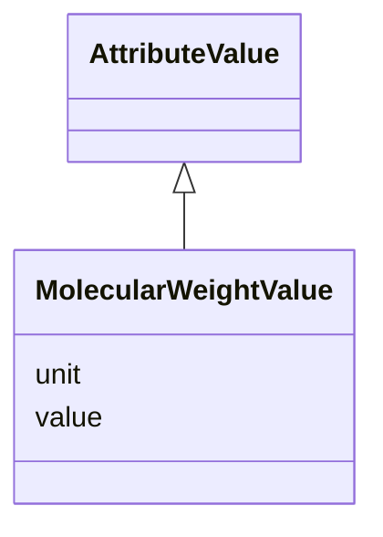

# Class: MolecularWeightValue 


_Molecular weight value. Defaults to kilodaltons (kDa) if no unit is specified._


URI: [lambdaber:MolecularWeightValue](https://w3id.org/lambda-ber-schema/MolecularWeightValue)





## Inheritance
* [AttributeValue](AttributeValue.md)
    * **MolecularWeightValue**


## Slots

| Name | Cardinality and Range | Description | Inheritance |
| ---  | --- | --- | --- |
| [value](value.md) | 0..1 <br/> [Float](Float.md) | The numerical value of the attribute | [AttributeValue](AttributeValue.md) |
| [unit](unit.md) | 0..1 <br/> [String](String.md) | The unit of measurement for the attribute value | [AttributeValue](AttributeValue.md) |


## Usages

| used by | used in | type | used |
| ---  | --- | --- | --- |
| [Sample](Sample.md) | [molecular_weight](molecular_weight.md) | range | [MolecularWeightValue](MolecularWeightValue.md) |


## Identifier and Mapping Information


### Schema Source


* from schema: https://w3id.org/lambda-ber-schema/


## Mappings

| Mapping Type | Mapped Value |
| ---  | ---  |
| self | lambdaber:MolecularWeightValue |
| native | lambdaber:MolecularWeightValue |


## LinkML Source

<!-- TODO: investigate https://stackoverflow.com/questions/37606292/how-to-create-tabbed-code-blocks-in-mkdocs-or-sphinx -->

### Direct

<details>
```yaml
name: MolecularWeightValue
description: Molecular weight value. Defaults to kilodaltons (kDa) if no unit is specified.
from_schema: https://w3id.org/lambda-ber-schema/
is_a: AttributeValue
slot_usage:
  unit:
    name: unit
    ifabsent: string(kDa)

```
</details>

### Induced

<details>
```yaml
name: MolecularWeightValue
description: Molecular weight value. Defaults to kilodaltons (kDa) if no unit is specified.
from_schema: https://w3id.org/lambda-ber-schema/
is_a: AttributeValue
slot_usage:
  unit:
    name: unit
    ifabsent: string(kDa)
attributes:
  value:
    name: value
    description: The numerical value of the attribute
    from_schema: https://w3id.org/lambda-ber-schema/
    rank: 1000
    alias: value
    owner: MolecularWeightValue
    domain_of:
    - AttributeValue
    - BiophysicalProperty
    range: float
  unit:
    name: unit
    description: The unit of measurement for the attribute value
    comments:
    - UCUM code representing the unit (e.g., 'kDa' for kilodaltons, 'Cel' for degrees
      Celsius)
    from_schema: https://w3id.org/lambda-ber-schema/
    rank: 1000
    ifabsent: string(kDa)
    alias: unit
    owner: MolecularWeightValue
    domain_of:
    - AttributeValue
    - BiophysicalProperty
    range: string

```
</details>