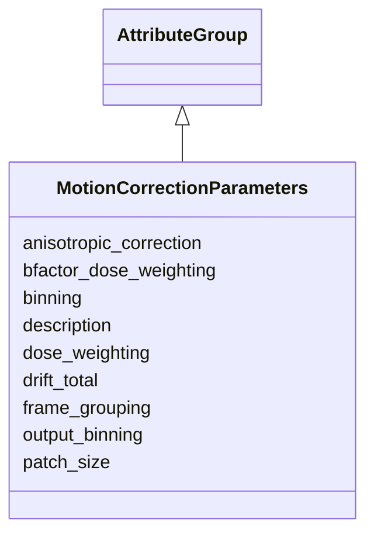

# Class: MotionCorrectionParameters 


_Parameters specific to motion correction workflows_


URI: [lambdaber:MotionCorrectionParameters](https://w3id.org/lambda-ber-schema/MotionCorrectionParameters)





## Inheritance
* [AttributeGroup](AttributeGroup.md)
    * **MotionCorrectionParameters**


## Slots

| Name | Cardinality and Range | Description | Inheritance |
| ---  | --- | --- | --- |
| [patch_size](patch_size.md) | 0..1 <br/> [Integer](Integer.md) | Patch size for local motion correction | direct |
| [binning](binning.md) | 0..1 <br/> [Integer](Integer.md) | Binning factor applied during motion correction | direct |
| [dose_weighting](dose_weighting.md) | 0..1 <br/> [Boolean](Boolean.md) | Whether dose weighting was applied | direct |
| [bfactor_dose_weighting](bfactor_dose_weighting.md) | 0..1 <br/> [Float](Float.md) | B-factor for dose weighting | direct |
| [anisotropic_correction](anisotropic_correction.md) | 0..1 <br/> [Boolean](Boolean.md) | Whether anisotropic motion correction was applied | direct |
| [frame_grouping](frame_grouping.md) | 0..1 <br/> [Integer](Integer.md) | Number of frames grouped together | direct |
| [output_binning](output_binning.md) | 0..1 <br/> [Integer](Integer.md) | Output binning factor | direct |
| [drift_total](drift_total.md) | 0..1 <br/> [Float](Float.md) | Total drift in Angstroms | direct |
| [description](description.md) | 0..1 <br/> [String](String.md) |  | [AttributeGroup](AttributeGroup.md) |


## Usages

| used by | used in | type | used |
| ---  | --- | --- | --- |
| [WorkflowRun](WorkflowRun.md) | [motion_correction_params](motion_correction_params.md) | range | [MotionCorrectionParameters](MotionCorrectionParameters.md) |


## Identifier and Mapping Information


### Schema Source


* from schema: https://w3id.org/lambda-ber-schema/


## Mappings

| Mapping Type | Mapped Value |
| ---  | ---  |
| self | lambdaber:MotionCorrectionParameters |
| native | lambdaber:MotionCorrectionParameters |


## LinkML Source

<!-- TODO: investigate https://stackoverflow.com/questions/37606292/how-to-create-tabbed-code-blocks-in-mkdocs-or-sphinx -->

### Direct

<details>
```yaml
name: MotionCorrectionParameters
description: Parameters specific to motion correction workflows
from_schema: https://w3id.org/lambda-ber-schema/
is_a: AttributeGroup
attributes:
  patch_size:
    name: patch_size
    description: Patch size for local motion correction
    from_schema: https://w3id.org/lambda-ber-schema/
    rank: 1000
    domain_of:
    - MotionCorrectionParameters
    range: integer
  binning:
    name: binning
    description: Binning factor applied during motion correction
    from_schema: https://w3id.org/lambda-ber-schema/
    rank: 1000
    domain_of:
    - MotionCorrectionParameters
    range: integer
  dose_weighting:
    name: dose_weighting
    description: Whether dose weighting was applied
    from_schema: https://w3id.org/lambda-ber-schema/
    rank: 1000
    domain_of:
    - MotionCorrectionParameters
    range: boolean
  bfactor_dose_weighting:
    name: bfactor_dose_weighting
    description: B-factor for dose weighting
    from_schema: https://w3id.org/lambda-ber-schema/
    rank: 1000
    domain_of:
    - MotionCorrectionParameters
    range: float
  anisotropic_correction:
    name: anisotropic_correction
    description: Whether anisotropic motion correction was applied
    from_schema: https://w3id.org/lambda-ber-schema/
    rank: 1000
    domain_of:
    - MotionCorrectionParameters
    range: boolean
  frame_grouping:
    name: frame_grouping
    description: Number of frames grouped together
    from_schema: https://w3id.org/lambda-ber-schema/
    rank: 1000
    domain_of:
    - MotionCorrectionParameters
    range: integer
  output_binning:
    name: output_binning
    description: Output binning factor
    from_schema: https://w3id.org/lambda-ber-schema/
    rank: 1000
    domain_of:
    - MotionCorrectionParameters
    range: integer
  drift_total:
    name: drift_total
    description: Total drift in Angstroms
    from_schema: https://w3id.org/lambda-ber-schema/
    rank: 1000
    domain_of:
    - MotionCorrectionParameters
    range: float

```
</details>

### Induced

<details>
```yaml
name: MotionCorrectionParameters
description: Parameters specific to motion correction workflows
from_schema: https://w3id.org/lambda-ber-schema/
is_a: AttributeGroup
attributes:
  patch_size:
    name: patch_size
    description: Patch size for local motion correction
    from_schema: https://w3id.org/lambda-ber-schema/
    rank: 1000
    alias: patch_size
    owner: MotionCorrectionParameters
    domain_of:
    - MotionCorrectionParameters
    range: integer
  binning:
    name: binning
    description: Binning factor applied during motion correction
    from_schema: https://w3id.org/lambda-ber-schema/
    rank: 1000
    alias: binning
    owner: MotionCorrectionParameters
    domain_of:
    - MotionCorrectionParameters
    range: integer
  dose_weighting:
    name: dose_weighting
    description: Whether dose weighting was applied
    from_schema: https://w3id.org/lambda-ber-schema/
    rank: 1000
    alias: dose_weighting
    owner: MotionCorrectionParameters
    domain_of:
    - MotionCorrectionParameters
    range: boolean
  bfactor_dose_weighting:
    name: bfactor_dose_weighting
    description: B-factor for dose weighting
    from_schema: https://w3id.org/lambda-ber-schema/
    rank: 1000
    alias: bfactor_dose_weighting
    owner: MotionCorrectionParameters
    domain_of:
    - MotionCorrectionParameters
    range: float
  anisotropic_correction:
    name: anisotropic_correction
    description: Whether anisotropic motion correction was applied
    from_schema: https://w3id.org/lambda-ber-schema/
    rank: 1000
    alias: anisotropic_correction
    owner: MotionCorrectionParameters
    domain_of:
    - MotionCorrectionParameters
    range: boolean
  frame_grouping:
    name: frame_grouping
    description: Number of frames grouped together
    from_schema: https://w3id.org/lambda-ber-schema/
    rank: 1000
    alias: frame_grouping
    owner: MotionCorrectionParameters
    domain_of:
    - MotionCorrectionParameters
    range: integer
  output_binning:
    name: output_binning
    description: Output binning factor
    from_schema: https://w3id.org/lambda-ber-schema/
    rank: 1000
    alias: output_binning
    owner: MotionCorrectionParameters
    domain_of:
    - MotionCorrectionParameters
    range: integer
  drift_total:
    name: drift_total
    description: Total drift in Angstroms
    from_schema: https://w3id.org/lambda-ber-schema/
    rank: 1000
    alias: drift_total
    owner: MotionCorrectionParameters
    domain_of:
    - MotionCorrectionParameters
    range: float
  description:
    name: description
    from_schema: https://w3id.org/lambda-ber-schema/
    alias: description
    owner: MotionCorrectionParameters
    domain_of:
    - NamedThing
    - AttributeGroup
    range: string

```
</details>