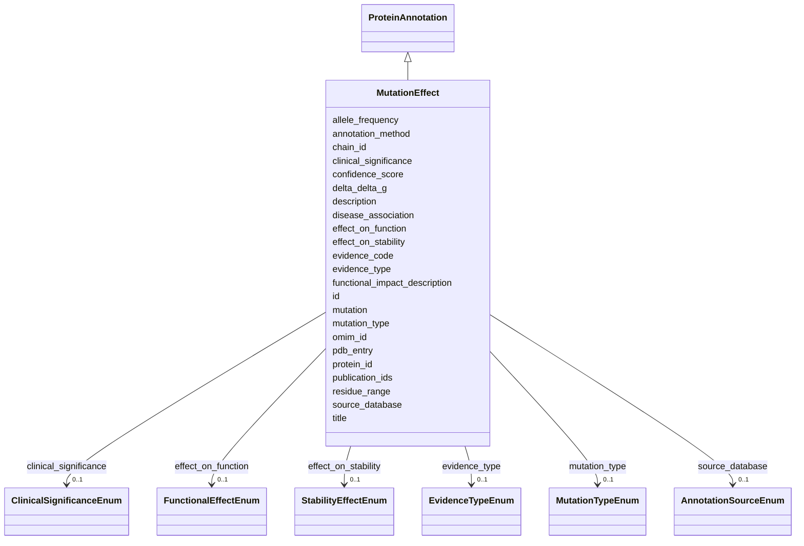

# Class: MutationEffect 


_Effects of mutations and variants on protein structure and function_


URI: [lambdaber:MutationEffect](https://w3id.org/lambda-ber-schema/MutationEffect)





## Inheritance
* [NamedThing](NamedThing.md)
    * [ProteinAnnotation](ProteinAnnotation.md)
        * **MutationEffect**


## Slots

| Name | Cardinality and Range | Description | Inheritance |
| ---  | --- | --- | --- |
| [mutation](mutation.md) | 1 <br/> [String](String.md) | Mutation in standard notation (e | direct |
| [mutation_type](mutation_type.md) | 0..1 <br/> [MutationTypeEnum](MutationTypeEnum.md) | Type of mutation | direct |
| [effect_on_stability](effect_on_stability.md) | 0..1 <br/> [StabilityEffectEnum](StabilityEffectEnum.md) | Effect on protein stability | direct |
| [delta_delta_g](delta_delta_g.md) | 0..1 <br/> [Float](Float.md) | Change in folding free energy (kcal/mol) | direct |
| [effect_on_function](effect_on_function.md) | 0..1 <br/> [FunctionalEffectEnum](FunctionalEffectEnum.md) | Effect on protein function | direct |
| [functional_impact_description](functional_impact_description.md) | 0..1 <br/> [String](String.md) | Description of functional impact | direct |
| [disease_association](disease_association.md) | 0..1 <br/> [String](String.md) | Associated disease or phenotype | direct |
| [omim_id](omim_id.md) | 0..1 <br/> [String](String.md) | OMIM database identifier | direct |
| [clinical_significance](clinical_significance.md) | 0..1 <br/> [ClinicalSignificanceEnum](ClinicalSignificanceEnum.md) | Clinical significance | direct |
| [allele_frequency](allele_frequency.md) | 0..1 <br/> [Float](Float.md) | Population allele frequency | direct |
| [protein_id](protein_id.md) | 1 <br/> [String](String.md) | UniProt accession number | [ProteinAnnotation](ProteinAnnotation.md) |
| [pdb_entry](pdb_entry.md) | 0..1 <br/> [String](String.md) | PDB identifier | [ProteinAnnotation](ProteinAnnotation.md) |
| [chain_id](chain_id.md) | 0..1 <br/> [String](String.md) | Chain identifier in the PDB structure | [ProteinAnnotation](ProteinAnnotation.md) |
| [residue_range](residue_range.md) | 0..1 <br/> [String](String.md) | Range of residues (e | [ProteinAnnotation](ProteinAnnotation.md) |
| [confidence_score](confidence_score.md) | 0..1 <br/> [Float](Float.md) | Confidence score for the annotation (0-1) | [ProteinAnnotation](ProteinAnnotation.md) |
| [evidence_type](evidence_type.md) | 0..1 <br/> [EvidenceTypeEnum](EvidenceTypeEnum.md) | Type of evidence supporting this annotation | [ProteinAnnotation](ProteinAnnotation.md) |
| [evidence_code](evidence_code.md) | 0..1 <br/> [Uriorcurie](Uriorcurie.md) | Evidence and Conclusion Ontology (ECO) code | [ProteinAnnotation](ProteinAnnotation.md) |
| [source_database](source_database.md) | 0..1 <br/> [AnnotationSourceEnum](AnnotationSourceEnum.md) | Source database or resource that provided this annotation | [ProteinAnnotation](ProteinAnnotation.md) |
| [annotation_method](annotation_method.md) | 0..1 <br/> [String](String.md) | Computational or experimental method used | [ProteinAnnotation](ProteinAnnotation.md) |
| [publication_ids](publication_ids.md) | * <br/> [String](String.md) | IDs of one or more publications supporting this annotation | [ProteinAnnotation](ProteinAnnotation.md) |
| [id](id.md) | 1 <br/> [Uriorcurie](Uriorcurie.md) | Globally unique identifier as an IRI or CURIE for machine processing and exte... | [NamedThing](NamedThing.md) |
| [title](title.md) | 0..1 <br/> [String](String.md) |  | [NamedThing](NamedThing.md) |
| [description](description.md) | 0..1 <br/> [String](String.md) |  | [NamedThing](NamedThing.md) |


## Usages

| used by | used in | type | used |
| ---  | --- | --- | --- |
| [Sample](Sample.md) | [mutation_effects](mutation_effects.md) | range | [MutationEffect](MutationEffect.md) |
| [AggregatedProteinView](AggregatedProteinView.md) | [mutations](mutations.md) | range | [MutationEffect](MutationEffect.md) |


## Identifier and Mapping Information


### Schema Source


* from schema: https://w3id.org/lambda-ber-schema/


## Mappings

| Mapping Type | Mapped Value |
| ---  | ---  |
| self | lambdaber:MutationEffect |
| native | lambdaber:MutationEffect |


## LinkML Source

<!-- TODO: investigate https://stackoverflow.com/questions/37606292/how-to-create-tabbed-code-blocks-in-mkdocs-or-sphinx -->

### Direct

<details>
```yaml
name: MutationEffect
description: Effects of mutations and variants on protein structure and function
from_schema: https://w3id.org/lambda-ber-schema/
is_a: ProteinAnnotation
attributes:
  mutation:
    name: mutation
    description: Mutation in standard notation (e.g., 'A123V')
    from_schema: https://w3id.org/lambda-ber-schema/functional_annotation
    rank: 1000
    domain_of:
    - MutationEffect
    required: true
    pattern: ^[A-Z][0-9]+[A-Z]$
  mutation_type:
    name: mutation_type
    description: Type of mutation
    from_schema: https://w3id.org/lambda-ber-schema/functional_annotation
    rank: 1000
    domain_of:
    - MutationEffect
    range: MutationTypeEnum
  effect_on_stability:
    name: effect_on_stability
    description: Effect on protein stability
    from_schema: https://w3id.org/lambda-ber-schema/functional_annotation
    rank: 1000
    domain_of:
    - MutationEffect
    range: StabilityEffectEnum
  delta_delta_g:
    name: delta_delta_g
    description: Change in folding free energy (kcal/mol)
    from_schema: https://w3id.org/lambda-ber-schema/functional_annotation
    rank: 1000
    domain_of:
    - MutationEffect
    range: float
    unit:
      ucum_code: kcal/mol
  effect_on_function:
    name: effect_on_function
    description: Effect on protein function
    from_schema: https://w3id.org/lambda-ber-schema/functional_annotation
    rank: 1000
    domain_of:
    - MutationEffect
    range: FunctionalEffectEnum
  functional_impact_description:
    name: functional_impact_description
    description: Description of functional impact
    from_schema: https://w3id.org/lambda-ber-schema/functional_annotation
    rank: 1000
    domain_of:
    - MutationEffect
  disease_association:
    name: disease_association
    description: Associated disease or phenotype
    from_schema: https://w3id.org/lambda-ber-schema/functional_annotation
    rank: 1000
    domain_of:
    - MutationEffect
  omim_id:
    name: omim_id
    description: OMIM database identifier
    from_schema: https://w3id.org/lambda-ber-schema/functional_annotation
    rank: 1000
    domain_of:
    - MutationEffect
    pattern: ^[0-9]{6}$
  clinical_significance:
    name: clinical_significance
    description: Clinical significance
    from_schema: https://w3id.org/lambda-ber-schema/functional_annotation
    rank: 1000
    domain_of:
    - MutationEffect
    range: ClinicalSignificanceEnum
  allele_frequency:
    name: allele_frequency
    description: Population allele frequency
    from_schema: https://w3id.org/lambda-ber-schema/functional_annotation
    rank: 1000
    domain_of:
    - MutationEffect
    range: float
    minimum_value: 0
    maximum_value: 1

```
</details>

### Induced

<details>
```yaml
name: MutationEffect
description: Effects of mutations and variants on protein structure and function
from_schema: https://w3id.org/lambda-ber-schema/
is_a: ProteinAnnotation
attributes:
  mutation:
    name: mutation
    description: Mutation in standard notation (e.g., 'A123V')
    from_schema: https://w3id.org/lambda-ber-schema/functional_annotation
    rank: 1000
    alias: mutation
    owner: MutationEffect
    domain_of:
    - MutationEffect
    range: string
    required: true
    pattern: ^[A-Z][0-9]+[A-Z]$
  mutation_type:
    name: mutation_type
    description: Type of mutation
    from_schema: https://w3id.org/lambda-ber-schema/functional_annotation
    rank: 1000
    alias: mutation_type
    owner: MutationEffect
    domain_of:
    - MutationEffect
    range: MutationTypeEnum
  effect_on_stability:
    name: effect_on_stability
    description: Effect on protein stability
    from_schema: https://w3id.org/lambda-ber-schema/functional_annotation
    rank: 1000
    alias: effect_on_stability
    owner: MutationEffect
    domain_of:
    - MutationEffect
    range: StabilityEffectEnum
  delta_delta_g:
    name: delta_delta_g
    description: Change in folding free energy (kcal/mol)
    from_schema: https://w3id.org/lambda-ber-schema/functional_annotation
    rank: 1000
    alias: delta_delta_g
    owner: MutationEffect
    domain_of:
    - MutationEffect
    range: float
    unit:
      ucum_code: kcal/mol
  effect_on_function:
    name: effect_on_function
    description: Effect on protein function
    from_schema: https://w3id.org/lambda-ber-schema/functional_annotation
    rank: 1000
    alias: effect_on_function
    owner: MutationEffect
    domain_of:
    - MutationEffect
    range: FunctionalEffectEnum
  functional_impact_description:
    name: functional_impact_description
    description: Description of functional impact
    from_schema: https://w3id.org/lambda-ber-schema/functional_annotation
    rank: 1000
    alias: functional_impact_description
    owner: MutationEffect
    domain_of:
    - MutationEffect
    range: string
  disease_association:
    name: disease_association
    description: Associated disease or phenotype
    from_schema: https://w3id.org/lambda-ber-schema/functional_annotation
    rank: 1000
    alias: disease_association
    owner: MutationEffect
    domain_of:
    - MutationEffect
    range: string
  omim_id:
    name: omim_id
    description: OMIM database identifier
    from_schema: https://w3id.org/lambda-ber-schema/functional_annotation
    rank: 1000
    alias: omim_id
    owner: MutationEffect
    domain_of:
    - MutationEffect
    range: string
    pattern: ^[0-9]{6}$
  clinical_significance:
    name: clinical_significance
    description: Clinical significance
    from_schema: https://w3id.org/lambda-ber-schema/functional_annotation
    rank: 1000
    alias: clinical_significance
    owner: MutationEffect
    domain_of:
    - MutationEffect
    range: ClinicalSignificanceEnum
  allele_frequency:
    name: allele_frequency
    description: Population allele frequency
    from_schema: https://w3id.org/lambda-ber-schema/functional_annotation
    rank: 1000
    alias: allele_frequency
    owner: MutationEffect
    domain_of:
    - MutationEffect
    range: float
    minimum_value: 0
    maximum_value: 1
  protein_id:
    name: protein_id
    description: UniProt accession number
    from_schema: https://w3id.org/lambda-ber-schema/functional_annotation
    rank: 1000
    alias: protein_id
    owner: MutationEffect
    domain_of:
    - ProteinAnnotation
    - ConformationalEnsemble
    range: string
    required: true
    pattern: ^[A-Z][0-9][A-Z0-9]{3}[0-9]|[A-Z][0-9][A-Z0-9]{3}[0-9]-[0-9]+$
  pdb_entry:
    name: pdb_entry
    description: PDB identifier
    from_schema: https://w3id.org/lambda-ber-schema/functional_annotation
    rank: 1000
    alias: pdb_entry
    owner: MutationEffect
    domain_of:
    - ProteinAnnotation
    range: string
    pattern: ^[0-9][A-Za-z0-9]{3}$
  chain_id:
    name: chain_id
    description: Chain identifier in the PDB structure
    from_schema: https://w3id.org/lambda-ber-schema/functional_annotation
    rank: 1000
    alias: chain_id
    owner: MutationEffect
    domain_of:
    - ProteinAnnotation
    range: string
    pattern: ^[A-Za-z0-9]+$
  residue_range:
    name: residue_range
    description: Range of residues (e.g., '1-100', '25,27,30-35')
    from_schema: https://w3id.org/lambda-ber-schema/functional_annotation
    rank: 1000
    alias: residue_range
    owner: MutationEffect
    domain_of:
    - ProteinAnnotation
    range: string
    pattern: ^[0-9,\-]+$
  confidence_score:
    name: confidence_score
    description: Confidence score for the annotation (0-1)
    from_schema: https://w3id.org/lambda-ber-schema/functional_annotation
    rank: 1000
    alias: confidence_score
    owner: MutationEffect
    domain_of:
    - ProteinAnnotation
    range: float
    minimum_value: 0
    maximum_value: 1
  evidence_type:
    name: evidence_type
    description: Type of evidence supporting this annotation
    from_schema: https://w3id.org/lambda-ber-schema/functional_annotation
    rank: 1000
    alias: evidence_type
    owner: MutationEffect
    domain_of:
    - ProteinAnnotation
    range: EvidenceTypeEnum
  evidence_code:
    name: evidence_code
    description: Evidence and Conclusion Ontology (ECO) code
    from_schema: https://w3id.org/lambda-ber-schema/functional_annotation
    rank: 1000
    alias: evidence_code
    owner: MutationEffect
    domain_of:
    - ProteinAnnotation
    range: uriorcurie
  source_database:
    name: source_database
    description: Source database or resource that provided this annotation
    from_schema: https://w3id.org/lambda-ber-schema/functional_annotation
    rank: 1000
    alias: source_database
    owner: MutationEffect
    domain_of:
    - ProteinAnnotation
    range: AnnotationSourceEnum
  annotation_method:
    name: annotation_method
    description: Computational or experimental method used
    from_schema: https://w3id.org/lambda-ber-schema/functional_annotation
    rank: 1000
    alias: annotation_method
    owner: MutationEffect
    domain_of:
    - ProteinAnnotation
    range: string
  publication_ids:
    name: publication_ids
    description: IDs of one or more publications supporting this annotation. Use PubMed
      IDs in the format 'PMID:XXXXXXX' or DOIs with 'DOI:' prefix.
    from_schema: https://w3id.org/lambda-ber-schema/functional_annotation
    rank: 1000
    alias: publication_ids
    owner: MutationEffect
    domain_of:
    - ProteinAnnotation
    range: string
    multivalued: true
    pattern: ^(PMID:[0-9]+|DOI:10\.[0-9]{4,}/[-._;()/:A-Za-z0-9]+)$
  id:
    name: id
    description: Globally unique identifier as an IRI or CURIE for machine processing
      and external references. Used for linking data across systems and semantic web
      integration.
    from_schema: https://w3id.org/lambda-ber-schema/
    rank: 1000
    identifier: true
    alias: id
    owner: MutationEffect
    domain_of:
    - NamedThing
    range: uriorcurie
    required: true
  title:
    name: title
    from_schema: https://w3id.org/lambda-ber-schema/
    rank: 1000
    slot_uri: dcterms:title
    alias: title
    owner: MutationEffect
    domain_of:
    - NamedThing
    range: string
  description:
    name: description
    from_schema: https://w3id.org/lambda-ber-schema/
    rank: 1000
    alias: description
    owner: MutationEffect
    domain_of:
    - NamedThing
    - AttributeGroup
    range: string

```
</details>