# Class: NamedThing 


_A named thing_


* __NOTE__: this is an abstract class and should not be instantiated directly


URI: [lambdaber:NamedThing](https://w3id.org/lambda-ber-schema/NamedThing)

```mermaid
 classDiagram
    class NamedThing
    click NamedThing href "../NamedThing/"
      NamedThing <|-- Dataset
        click Dataset href "../Dataset/"
      NamedThing <|-- Study
        click Study href "../Study/"
      NamedThing <|-- Sample
        click Sample href "../Sample/"
      NamedThing <|-- ProteinConstruct
        click ProteinConstruct href "../ProteinConstruct/"
      NamedThing <|-- SamplePreparation
        click SamplePreparation href "../SamplePreparation/"
      NamedThing <|-- Instrument
        click Instrument href "../Instrument/"
      NamedThing <|-- ExperimentRun
        click ExperimentRun href "../ExperimentRun/"
      NamedThing <|-- WorkflowRun
        click WorkflowRun href "../WorkflowRun/"
      NamedThing <|-- DataFile
        click DataFile href "../DataFile/"
      NamedThing <|-- Image
        click Image href "../Image/"
      NamedThing <|-- OntologyTerm
        click OntologyTerm href "../OntologyTerm/"
      NamedThing <|-- ProteinAnnotation
        click ProteinAnnotation href "../ProteinAnnotation/"
      NamedThing <|-- ConformationalEnsemble
        click ConformationalEnsemble href "../ConformationalEnsemble/"
      NamedThing <|-- AggregatedProteinView
        click AggregatedProteinView href "../AggregatedProteinView/"
      NamedThing <|-- MeasurementConditions
        click MeasurementConditions href "../MeasurementConditions/"
      
      NamedThing : description
        
      NamedThing : id
        
      NamedThing : title
        
      
```





## Inheritance
* **NamedThing**
    * [Dataset](Dataset.md)
    * [Study](Study.md)
    * [Sample](Sample.md)
    * [ProteinConstruct](ProteinConstruct.md)
    * [SamplePreparation](SamplePreparation.md)
    * [Instrument](Instrument.md)
    * [ExperimentRun](ExperimentRun.md)
    * [WorkflowRun](WorkflowRun.md)
    * [DataFile](DataFile.md)
    * [Image](Image.md)
    * [OntologyTerm](OntologyTerm.md)
    * [ProteinAnnotation](ProteinAnnotation.md)
    * [ConformationalEnsemble](ConformationalEnsemble.md)
    * [AggregatedProteinView](AggregatedProteinView.md)
    * [MeasurementConditions](MeasurementConditions.md)


## Slots

| Name | Cardinality and Range | Description | Inheritance |
| ---  | --- | --- | --- |
| [id](id.md) | 1 <br/> [Uriorcurie](Uriorcurie.md) | Globally unique identifier as an IRI or CURIE for machine processing and exte... | direct |
| [title](title.md) | 0..1 <br/> [String](String.md) |  | direct |
| [description](description.md) | 0..1 <br/> [String](String.md) |  | direct |


## Identifier and Mapping Information


### Schema Source


* from schema: https://w3id.org/lambda-ber-schema/


## Mappings

| Mapping Type | Mapped Value |
| ---  | ---  |
| self | lambdaber:NamedThing |
| native | lambdaber:NamedThing |


## LinkML Source

<!-- TODO: investigate https://stackoverflow.com/questions/37606292/how-to-create-tabbed-code-blocks-in-mkdocs-or-sphinx -->

### Direct

<details>
```yaml
name: NamedThing
description: A named thing
from_schema: https://w3id.org/lambda-ber-schema/
abstract: true
attributes:
  id:
    name: id
    description: Globally unique identifier as an IRI or CURIE for machine processing
      and external references. Used for linking data across systems and semantic web
      integration.
    from_schema: https://w3id.org/lambda-ber-schema/
    rank: 1000
    identifier: true
    domain_of:
    - NamedThing
    range: uriorcurie
    required: true
  title:
    name: title
    from_schema: https://w3id.org/lambda-ber-schema/
    rank: 1000
    slot_uri: dcterms:title
    domain_of:
    - NamedThing
  description:
    name: description
    from_schema: https://w3id.org/lambda-ber-schema/
    rank: 1000
    domain_of:
    - NamedThing
    - AttributeGroup
    range: string

```
</details>

### Induced

<details>
```yaml
name: NamedThing
description: A named thing
from_schema: https://w3id.org/lambda-ber-schema/
abstract: true
attributes:
  id:
    name: id
    description: Globally unique identifier as an IRI or CURIE for machine processing
      and external references. Used for linking data across systems and semantic web
      integration.
    from_schema: https://w3id.org/lambda-ber-schema/
    rank: 1000
    identifier: true
    alias: id
    owner: NamedThing
    domain_of:
    - NamedThing
    range: uriorcurie
  title:
    name: title
    from_schema: https://w3id.org/lambda-ber-schema/
    rank: 1000
    slot_uri: dcterms:title
    alias: title
    owner: NamedThing
    domain_of:
    - NamedThing
    range: string
  description:
    name: description
    from_schema: https://w3id.org/lambda-ber-schema/
    rank: 1000
    alias: description
    owner: NamedThing
    domain_of:
    - NamedThing
    - AttributeGroup
    range: string

```
</details>