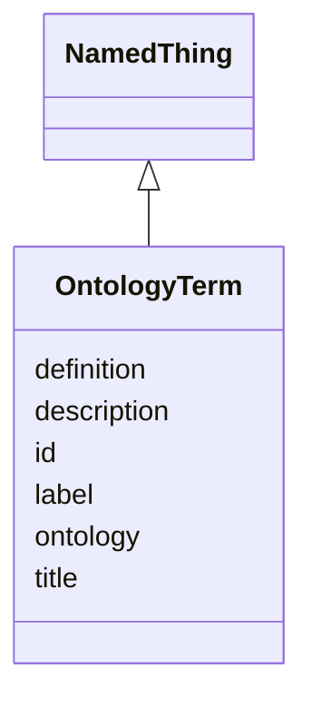

# Class: OntologyTerm 


URI: [lambdaber:OntologyTerm](https://w3id.org/lambda-ber-schema/OntologyTerm)





## Inheritance
* [NamedThing](NamedThing.md)
    * **OntologyTerm**


## Slots

| Name | Cardinality and Range | Description | Inheritance |
| ---  | --- | --- | --- |
| [label](label.md) | 0..1 <br/> [String](String.md) |  | direct |
| [definition](definition.md) | 0..1 <br/> [String](String.md) |  | direct |
| [ontology](ontology.md) | 0..1 <br/> [String](String.md) |  | direct |
| [id](id.md) | 1 <br/> [Uriorcurie](Uriorcurie.md) | Globally unique identifier as an IRI or CURIE for machine processing and exte... | [NamedThing](NamedThing.md) |
| [title](title.md) | 0..1 <br/> [String](String.md) |  | [NamedThing](NamedThing.md) |
| [description](description.md) | 0..1 <br/> [String](String.md) |  | [NamedThing](NamedThing.md) |


## Usages

| used by | used in | type | used |
| ---  | --- | --- | --- |
| [Sample](Sample.md) | [organism](organism.md) | range | [OntologyTerm](OntologyTerm.md) |
| [Sample](Sample.md) | [anatomy](anatomy.md) | range | [OntologyTerm](OntologyTerm.md) |
| [Sample](Sample.md) | [cell_type](cell_type.md) | range | [OntologyTerm](OntologyTerm.md) |
| [ImageFeature](ImageFeature.md) | [terms](terms.md) | range | [OntologyTerm](OntologyTerm.md) |


## Identifier and Mapping Information


### Schema Source


* from schema: https://w3id.org/lambda-ber-schema/


## Mappings

| Mapping Type | Mapped Value |
| ---  | ---  |
| self | lambdaber:OntologyTerm |
| native | lambdaber:OntologyTerm |


## LinkML Source

<!-- TODO: investigate https://stackoverflow.com/questions/37606292/how-to-create-tabbed-code-blocks-in-mkdocs-or-sphinx -->

### Direct

<details>
```yaml
name: OntologyTerm
from_schema: https://w3id.org/lambda-ber-schema/
is_a: NamedThing
attributes:
  label:
    name: label
    from_schema: https://w3id.org/lambda-ber-schema/
    rank: 1000
    domain_of:
    - OntologyTerm
    range: string
  definition:
    name: definition
    from_schema: https://w3id.org/lambda-ber-schema/
    rank: 1000
    domain_of:
    - OntologyTerm
    range: string
  ontology:
    name: ontology
    from_schema: https://w3id.org/lambda-ber-schema/
    rank: 1000
    domain_of:
    - OntologyTerm
    range: string

```
</details>

### Induced

<details>
```yaml
name: OntologyTerm
from_schema: https://w3id.org/lambda-ber-schema/
is_a: NamedThing
attributes:
  label:
    name: label
    from_schema: https://w3id.org/lambda-ber-schema/
    rank: 1000
    alias: label
    owner: OntologyTerm
    domain_of:
    - OntologyTerm
    range: string
  definition:
    name: definition
    from_schema: https://w3id.org/lambda-ber-schema/
    rank: 1000
    alias: definition
    owner: OntologyTerm
    domain_of:
    - OntologyTerm
    range: string
  ontology:
    name: ontology
    from_schema: https://w3id.org/lambda-ber-schema/
    rank: 1000
    alias: ontology
    owner: OntologyTerm
    domain_of:
    - OntologyTerm
    range: string
  id:
    name: id
    description: Globally unique identifier as an IRI or CURIE for machine processing
      and external references. Used for linking data across systems and semantic web
      integration.
    from_schema: https://w3id.org/lambda-ber-schema/
    rank: 1000
    identifier: true
    alias: id
    owner: OntologyTerm
    domain_of:
    - NamedThing
    range: uriorcurie
    required: true
  title:
    name: title
    from_schema: https://w3id.org/lambda-ber-schema/
    rank: 1000
    slot_uri: dcterms:title
    alias: title
    owner: OntologyTerm
    domain_of:
    - NamedThing
    range: string
  description:
    name: description
    from_schema: https://w3id.org/lambda-ber-schema/
    rank: 1000
    alias: description
    owner: OntologyTerm
    domain_of:
    - NamedThing
    - AttributeGroup
    range: string

```
</details>