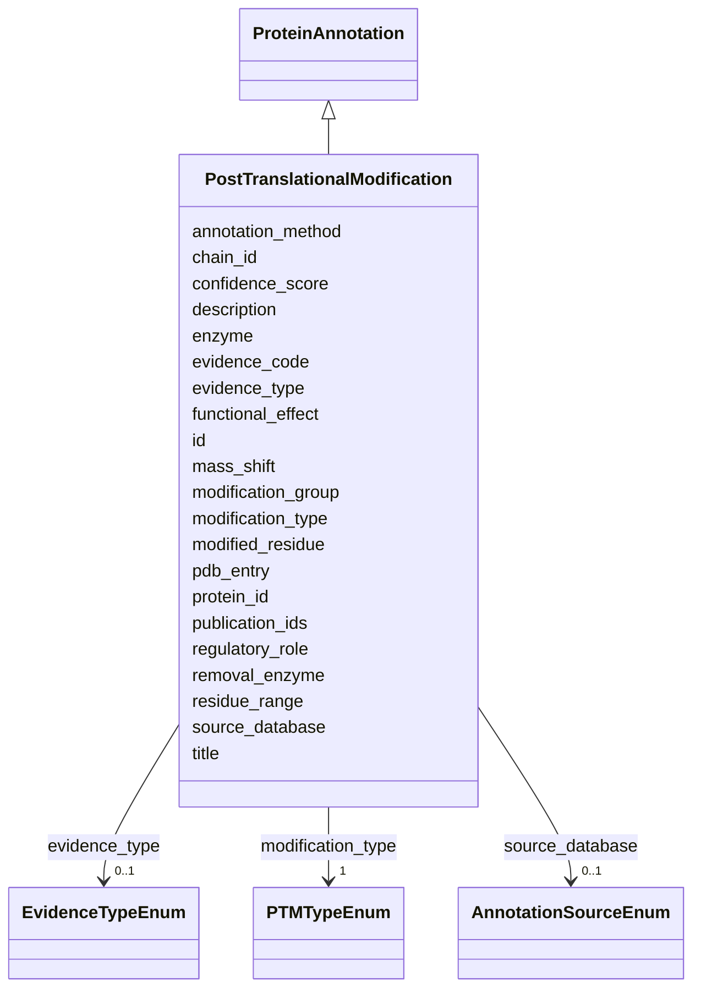

# Class: PostTranslationalModification 


_Post-translational modifications observed or predicted_


URI: [lambdaber:PostTranslationalModification](https://w3id.org/lambda-ber-schema/PostTranslationalModification)





## Inheritance
* [NamedThing](NamedThing.md)
    * [ProteinAnnotation](ProteinAnnotation.md)
        * **PostTranslationalModification**


## Slots

| Name | Cardinality and Range | Description | Inheritance |
| ---  | --- | --- | --- |
| [modification_type](modification_type.md) | 1 <br/> [PTMTypeEnum](PTMTypeEnum.md) | Type of PTM | direct |
| [modified_residue](modified_residue.md) | 1 <br/> [String](String.md) | Residue that is modified | direct |
| [modification_group](modification_group.md) | 0..1 <br/> [String](String.md) | Chemical group added (e | direct |
| [mass_shift](mass_shift.md) | 0..1 <br/> [Float](Float.md) | Mass change due to modification (Da) | direct |
| [functional_effect](functional_effect.md) | 0..1 <br/> [String](String.md) | Known functional effect of this PTM | direct |
| [regulatory_role](regulatory_role.md) | 0..1 <br/> [String](String.md) | Role in regulation | direct |
| [enzyme](enzyme.md) | 0..1 <br/> [String](String.md) | Enzyme responsible for modification | direct |
| [removal_enzyme](removal_enzyme.md) | 0..1 <br/> [String](String.md) | Enzyme that removes modification | direct |
| [protein_id](protein_id.md) | 1 <br/> [String](String.md) | UniProt accession number | [ProteinAnnotation](ProteinAnnotation.md) |
| [pdb_entry](pdb_entry.md) | 0..1 <br/> [String](String.md) | PDB identifier | [ProteinAnnotation](ProteinAnnotation.md) |
| [chain_id](chain_id.md) | 0..1 <br/> [String](String.md) | Chain identifier in the PDB structure | [ProteinAnnotation](ProteinAnnotation.md) |
| [residue_range](residue_range.md) | 0..1 <br/> [String](String.md) | Range of residues (e | [ProteinAnnotation](ProteinAnnotation.md) |
| [confidence_score](confidence_score.md) | 0..1 <br/> [Float](Float.md) | Confidence score for the annotation (0-1) | [ProteinAnnotation](ProteinAnnotation.md) |
| [evidence_type](evidence_type.md) | 0..1 <br/> [EvidenceTypeEnum](EvidenceTypeEnum.md) | Type of evidence supporting this annotation | [ProteinAnnotation](ProteinAnnotation.md) |
| [evidence_code](evidence_code.md) | 0..1 <br/> [Uriorcurie](Uriorcurie.md) | Evidence and Conclusion Ontology (ECO) code | [ProteinAnnotation](ProteinAnnotation.md) |
| [source_database](source_database.md) | 0..1 <br/> [AnnotationSourceEnum](AnnotationSourceEnum.md) | Source database or resource that provided this annotation | [ProteinAnnotation](ProteinAnnotation.md) |
| [annotation_method](annotation_method.md) | 0..1 <br/> [String](String.md) | Computational or experimental method used | [ProteinAnnotation](ProteinAnnotation.md) |
| [publication_ids](publication_ids.md) | * <br/> [String](String.md) | PubMed IDs supporting this annotation | [ProteinAnnotation](ProteinAnnotation.md) |
| [id](id.md) | 1 <br/> [Uriorcurie](Uriorcurie.md) | Globally unique identifier as an IRI or CURIE for machine processing and exte... | [NamedThing](NamedThing.md) |
| [title](title.md) | 0..1 <br/> [String](String.md) |  | [NamedThing](NamedThing.md) |
| [description](description.md) | 0..1 <br/> [String](String.md) |  | [NamedThing](NamedThing.md) |


## Usages

| used by | used in | type | used |
| ---  | --- | --- | --- |
| [Sample](Sample.md) | [ptm_annotations](ptm_annotations.md) | range | [PostTranslationalModification](PostTranslationalModification.md) |
| [AggregatedProteinView](AggregatedProteinView.md) | [ptms](ptms.md) | range | [PostTranslationalModification](PostTranslationalModification.md) |


## Identifier and Mapping Information


### Schema Source


* from schema: https://w3id.org/lambda-ber-schema/


## Mappings

| Mapping Type | Mapped Value |
| ---  | ---  |
| self | lambdaber:PostTranslationalModification |
| native | lambdaber:PostTranslationalModification |


## LinkML Source

<!-- TODO: investigate https://stackoverflow.com/questions/37606292/how-to-create-tabbed-code-blocks-in-mkdocs-or-sphinx -->

### Direct

<details>
```yaml
name: PostTranslationalModification
description: Post-translational modifications observed or predicted
from_schema: https://w3id.org/lambda-ber-schema/
is_a: ProteinAnnotation
attributes:
  modification_type:
    name: modification_type
    description: Type of PTM
    from_schema: https://w3id.org/lambda-ber-schema/functional_annotation
    rank: 1000
    domain_of:
    - PostTranslationalModification
    range: PTMTypeEnum
    required: true
  modified_residue:
    name: modified_residue
    description: Residue that is modified
    from_schema: https://w3id.org/lambda-ber-schema/functional_annotation
    rank: 1000
    domain_of:
    - PostTranslationalModification
    required: true
  modification_group:
    name: modification_group
    description: Chemical group added (e.g., 'phosphate', 'methyl')
    from_schema: https://w3id.org/lambda-ber-schema/functional_annotation
    rank: 1000
    domain_of:
    - PostTranslationalModification
  mass_shift:
    name: mass_shift
    description: Mass change due to modification (Da)
    from_schema: https://w3id.org/lambda-ber-schema/functional_annotation
    rank: 1000
    domain_of:
    - PostTranslationalModification
    range: float
    unit:
      ucum_code: Da
  functional_effect:
    name: functional_effect
    description: Known functional effect of this PTM
    from_schema: https://w3id.org/lambda-ber-schema/functional_annotation
    rank: 1000
    domain_of:
    - PostTranslationalModification
  regulatory_role:
    name: regulatory_role
    description: Role in regulation
    from_schema: https://w3id.org/lambda-ber-schema/functional_annotation
    rank: 1000
    domain_of:
    - PostTranslationalModification
  enzyme:
    name: enzyme
    description: Enzyme responsible for modification
    from_schema: https://w3id.org/lambda-ber-schema/functional_annotation
    rank: 1000
    domain_of:
    - PostTranslationalModification
  removal_enzyme:
    name: removal_enzyme
    description: Enzyme that removes modification
    from_schema: https://w3id.org/lambda-ber-schema/functional_annotation
    rank: 1000
    domain_of:
    - PostTranslationalModification

```
</details>

### Induced

<details>
```yaml
name: PostTranslationalModification
description: Post-translational modifications observed or predicted
from_schema: https://w3id.org/lambda-ber-schema/
is_a: ProteinAnnotation
attributes:
  modification_type:
    name: modification_type
    description: Type of PTM
    from_schema: https://w3id.org/lambda-ber-schema/functional_annotation
    rank: 1000
    alias: modification_type
    owner: PostTranslationalModification
    domain_of:
    - PostTranslationalModification
    range: PTMTypeEnum
    required: true
  modified_residue:
    name: modified_residue
    description: Residue that is modified
    from_schema: https://w3id.org/lambda-ber-schema/functional_annotation
    rank: 1000
    alias: modified_residue
    owner: PostTranslationalModification
    domain_of:
    - PostTranslationalModification
    range: string
    required: true
  modification_group:
    name: modification_group
    description: Chemical group added (e.g., 'phosphate', 'methyl')
    from_schema: https://w3id.org/lambda-ber-schema/functional_annotation
    rank: 1000
    alias: modification_group
    owner: PostTranslationalModification
    domain_of:
    - PostTranslationalModification
    range: string
  mass_shift:
    name: mass_shift
    description: Mass change due to modification (Da)
    from_schema: https://w3id.org/lambda-ber-schema/functional_annotation
    rank: 1000
    alias: mass_shift
    owner: PostTranslationalModification
    domain_of:
    - PostTranslationalModification
    range: float
    unit:
      ucum_code: Da
  functional_effect:
    name: functional_effect
    description: Known functional effect of this PTM
    from_schema: https://w3id.org/lambda-ber-schema/functional_annotation
    rank: 1000
    alias: functional_effect
    owner: PostTranslationalModification
    domain_of:
    - PostTranslationalModification
    range: string
  regulatory_role:
    name: regulatory_role
    description: Role in regulation
    from_schema: https://w3id.org/lambda-ber-schema/functional_annotation
    rank: 1000
    alias: regulatory_role
    owner: PostTranslationalModification
    domain_of:
    - PostTranslationalModification
    range: string
  enzyme:
    name: enzyme
    description: Enzyme responsible for modification
    from_schema: https://w3id.org/lambda-ber-schema/functional_annotation
    rank: 1000
    alias: enzyme
    owner: PostTranslationalModification
    domain_of:
    - PostTranslationalModification
    range: string
  removal_enzyme:
    name: removal_enzyme
    description: Enzyme that removes modification
    from_schema: https://w3id.org/lambda-ber-schema/functional_annotation
    rank: 1000
    alias: removal_enzyme
    owner: PostTranslationalModification
    domain_of:
    - PostTranslationalModification
    range: string
  protein_id:
    name: protein_id
    description: UniProt accession number
    from_schema: https://w3id.org/lambda-ber-schema/functional_annotation
    rank: 1000
    alias: protein_id
    owner: PostTranslationalModification
    domain_of:
    - ProteinAnnotation
    - ConformationalEnsemble
    range: string
    required: true
    pattern: ^[A-Z][0-9][A-Z0-9]{3}[0-9]|[A-Z][0-9][A-Z0-9]{3}[0-9]-[0-9]+$
  pdb_entry:
    name: pdb_entry
    description: PDB identifier
    from_schema: https://w3id.org/lambda-ber-schema/functional_annotation
    rank: 1000
    alias: pdb_entry
    owner: PostTranslationalModification
    domain_of:
    - ProteinAnnotation
    range: string
    pattern: ^[0-9][A-Za-z0-9]{3}$
  chain_id:
    name: chain_id
    description: Chain identifier in the PDB structure
    from_schema: https://w3id.org/lambda-ber-schema/functional_annotation
    rank: 1000
    alias: chain_id
    owner: PostTranslationalModification
    domain_of:
    - ProteinAnnotation
    range: string
    pattern: ^[A-Za-z0-9]+$
  residue_range:
    name: residue_range
    description: Range of residues (e.g., '1-100', '25,27,30-35')
    from_schema: https://w3id.org/lambda-ber-schema/functional_annotation
    rank: 1000
    alias: residue_range
    owner: PostTranslationalModification
    domain_of:
    - ProteinAnnotation
    range: string
  confidence_score:
    name: confidence_score
    description: Confidence score for the annotation (0-1)
    from_schema: https://w3id.org/lambda-ber-schema/functional_annotation
    rank: 1000
    alias: confidence_score
    owner: PostTranslationalModification
    domain_of:
    - ProteinAnnotation
    range: float
    minimum_value: 0
    maximum_value: 1
  evidence_type:
    name: evidence_type
    description: Type of evidence supporting this annotation
    from_schema: https://w3id.org/lambda-ber-schema/functional_annotation
    rank: 1000
    alias: evidence_type
    owner: PostTranslationalModification
    domain_of:
    - ProteinAnnotation
    range: EvidenceTypeEnum
  evidence_code:
    name: evidence_code
    description: Evidence and Conclusion Ontology (ECO) code
    from_schema: https://w3id.org/lambda-ber-schema/functional_annotation
    rank: 1000
    alias: evidence_code
    owner: PostTranslationalModification
    domain_of:
    - ProteinAnnotation
    range: uriorcurie
  source_database:
    name: source_database
    description: Source database or resource that provided this annotation
    from_schema: https://w3id.org/lambda-ber-schema/functional_annotation
    rank: 1000
    alias: source_database
    owner: PostTranslationalModification
    domain_of:
    - ProteinAnnotation
    range: AnnotationSourceEnum
  annotation_method:
    name: annotation_method
    description: Computational or experimental method used
    from_schema: https://w3id.org/lambda-ber-schema/functional_annotation
    rank: 1000
    alias: annotation_method
    owner: PostTranslationalModification
    domain_of:
    - ProteinAnnotation
    range: string
  publication_ids:
    name: publication_ids
    description: PubMed IDs supporting this annotation
    from_schema: https://w3id.org/lambda-ber-schema/functional_annotation
    rank: 1000
    alias: publication_ids
    owner: PostTranslationalModification
    domain_of:
    - ProteinAnnotation
    range: string
    multivalued: true
    pattern: ^PMID:[0-9]+$
  id:
    name: id
    description: Globally unique identifier as an IRI or CURIE for machine processing
      and external references. Used for linking data across systems and semantic web
      integration.
    from_schema: https://w3id.org/lambda-ber-schema/
    rank: 1000
    identifier: true
    alias: id
    owner: PostTranslationalModification
    domain_of:
    - NamedThing
    range: uriorcurie
    required: true
  title:
    name: title
    from_schema: https://w3id.org/lambda-ber-schema/
    rank: 1000
    slot_uri: dcterms:title
    alias: title
    owner: PostTranslationalModification
    domain_of:
    - NamedThing
    range: string
  description:
    name: description
    from_schema: https://w3id.org/lambda-ber-schema/
    rank: 1000
    alias: description
    owner: PostTranslationalModification
    domain_of:
    - NamedThing
    - AttributeGroup
    range: string

```
</details>