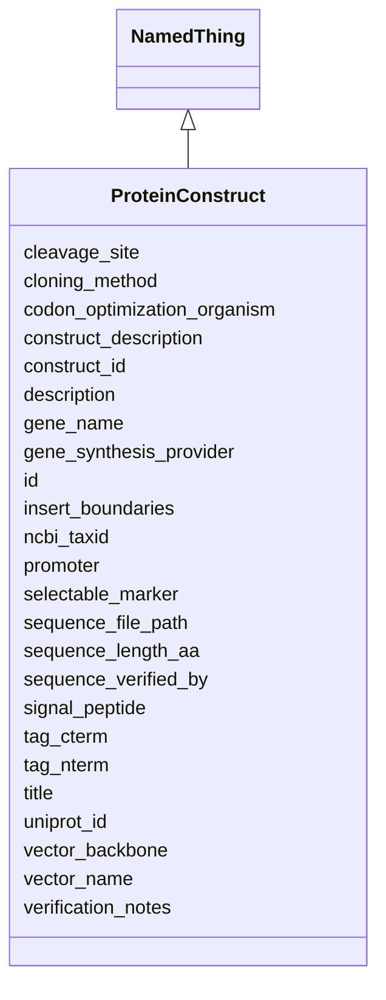

# Class: ProteinConstruct 


_Detailed information about a protein construct including cloning and sequence design_


URI: [lambdaber:ProteinConstruct](https://w3id.org/lambda-ber-schema/ProteinConstruct)





## Inheritance
* [NamedThing](NamedThing.md)
    * **ProteinConstruct**


## Slots

| Name | Cardinality and Range | Description | Inheritance |
| ---  | --- | --- | --- |
| [construct_id](construct_id.md) | 1 <br/> [String](String.md) | Unique identifier for this construct | direct |
| [uniprot_id](uniprot_id.md) | 0..1 <br/> [String](String.md) | UniProt accession for the target protein | direct |
| [gene_name](gene_name.md) | 0..1 <br/> [String](String.md) | Gene name | direct |
| [ncbi_taxid](ncbi_taxid.md) | 0..1 <br/> [String](String.md) | NCBI Taxonomy ID for source organism | direct |
| [sequence_length_aa](sequence_length_aa.md) | 0..1 <br/> [Integer](Integer.md) | Length of the protein sequence in amino acids | direct |
| [construct_description](construct_description.md) | 0..1 <br/> [String](String.md) | Human-readable description of the construct | direct |
| [gene_synthesis_provider](gene_synthesis_provider.md) | 0..1 <br/> [String](String.md) | Company or facility that synthesized the gene | direct |
| [codon_optimization_organism](codon_optimization_organism.md) | 0..1 <br/> [String](String.md) | Organism for which codons were optimized | direct |
| [vector_backbone](vector_backbone.md) | 0..1 <br/> [String](String.md) | Base plasmid backbone used | direct |
| [vector_name](vector_name.md) | 0..1 <br/> [String](String.md) | Complete vector name | direct |
| [promoter](promoter.md) | 0..1 <br/> [String](String.md) | Promoter used for expression | direct |
| [tag_nterm](tag_nterm.md) | 0..1 <br/> [String](String.md) | N-terminal tag (e | direct |
| [tag_cterm](tag_cterm.md) | 0..1 <br/> [String](String.md) | C-terminal tag | direct |
| [cleavage_site](cleavage_site.md) | 0..1 <br/> [String](String.md) | Protease cleavage site sequence | direct |
| [signal_peptide](signal_peptide.md) | 0..1 <br/> [String](String.md) | Signal peptide sequence if present | direct |
| [selectable_marker](selectable_marker.md) | 0..1 <br/> [String](String.md) | Antibiotic resistance or other selectable marker | direct |
| [cloning_method](cloning_method.md) | 0..1 <br/> [String](String.md) | Method used for cloning (e | direct |
| [insert_boundaries](insert_boundaries.md) | 0..1 <br/> [String](String.md) | Start and end positions of insert in vector | direct |
| [sequence_file_path](sequence_file_path.md) | 0..1 <br/> [String](String.md) | Path to sequence file | direct |
| [sequence_verified_by](sequence_verified_by.md) | 0..1 <br/> [String](String.md) | Method or person who verified the sequence | direct |
| [verification_notes](verification_notes.md) | 0..1 <br/> [String](String.md) | Notes from sequence verification | direct |
| [id](id.md) | 1 <br/> [Uriorcurie](Uriorcurie.md) | Globally unique identifier as an IRI or CURIE for machine processing and exte... | [NamedThing](NamedThing.md) |
| [title](title.md) | 0..1 <br/> [String](String.md) |  | [NamedThing](NamedThing.md) |
| [description](description.md) | 0..1 <br/> [String](String.md) |  | [NamedThing](NamedThing.md) |


## Usages

| used by | used in | type | used |
| ---  | --- | --- | --- |
| [Study](Study.md) | [protein_constructs](protein_constructs.md) | range | [ProteinConstruct](ProteinConstruct.md) |


## Identifier and Mapping Information


### Schema Source


* from schema: https://w3id.org/lambda-ber-schema/


## Mappings

| Mapping Type | Mapped Value |
| ---  | ---  |
| self | lambdaber:ProteinConstruct |
| native | lambdaber:ProteinConstruct |


## LinkML Source

<!-- TODO: investigate https://stackoverflow.com/questions/37606292/how-to-create-tabbed-code-blocks-in-mkdocs-or-sphinx -->

### Direct

<details>
```yaml
name: ProteinConstruct
description: Detailed information about a protein construct including cloning and
  sequence design
from_schema: https://w3id.org/lambda-ber-schema/
is_a: NamedThing
attributes:
  construct_id:
    name: construct_id
    description: Unique identifier for this construct
    from_schema: https://w3id.org/lambda-ber-schema/
    rank: 1000
    domain_of:
    - ProteinConstruct
    required: true
  uniprot_id:
    name: uniprot_id
    description: UniProt accession for the target protein
    from_schema: https://w3id.org/lambda-ber-schema/
    rank: 1000
    domain_of:
    - ProteinConstruct
    - AggregatedProteinView
  gene_name:
    name: gene_name
    description: Gene name
    from_schema: https://w3id.org/lambda-ber-schema/
    rank: 1000
    domain_of:
    - ProteinConstruct
  ncbi_taxid:
    name: ncbi_taxid
    description: NCBI Taxonomy ID for source organism
    from_schema: https://w3id.org/lambda-ber-schema/
    rank: 1000
    domain_of:
    - ProteinConstruct
  sequence_length_aa:
    name: sequence_length_aa
    description: Length of the protein sequence in amino acids
    from_schema: https://w3id.org/lambda-ber-schema/
    rank: 1000
    domain_of:
    - ProteinConstruct
    range: integer
  construct_description:
    name: construct_description
    description: Human-readable description of the construct
    from_schema: https://w3id.org/lambda-ber-schema/
    rank: 1000
    domain_of:
    - ProteinConstruct
  gene_synthesis_provider:
    name: gene_synthesis_provider
    description: Company or facility that synthesized the gene
    from_schema: https://w3id.org/lambda-ber-schema/
    rank: 1000
    domain_of:
    - ProteinConstruct
  codon_optimization_organism:
    name: codon_optimization_organism
    description: Organism for which codons were optimized
    from_schema: https://w3id.org/lambda-ber-schema/
    rank: 1000
    domain_of:
    - ProteinConstruct
  vector_backbone:
    name: vector_backbone
    description: Base plasmid backbone used
    from_schema: https://w3id.org/lambda-ber-schema/
    rank: 1000
    domain_of:
    - ProteinConstruct
  vector_name:
    name: vector_name
    description: Complete vector name
    from_schema: https://w3id.org/lambda-ber-schema/
    rank: 1000
    domain_of:
    - ProteinConstruct
  promoter:
    name: promoter
    description: Promoter used for expression
    from_schema: https://w3id.org/lambda-ber-schema/
    rank: 1000
    domain_of:
    - ProteinConstruct
  tag_nterm:
    name: tag_nterm
    description: N-terminal tag (e.g., His6, MBP, GST)
    from_schema: https://w3id.org/lambda-ber-schema/
    rank: 1000
    domain_of:
    - ProteinConstruct
  tag_cterm:
    name: tag_cterm
    description: C-terminal tag
    from_schema: https://w3id.org/lambda-ber-schema/
    rank: 1000
    domain_of:
    - ProteinConstruct
  cleavage_site:
    name: cleavage_site
    description: Protease cleavage site sequence
    from_schema: https://w3id.org/lambda-ber-schema/
    rank: 1000
    domain_of:
    - ProteinConstruct
  signal_peptide:
    name: signal_peptide
    description: Signal peptide sequence if present
    from_schema: https://w3id.org/lambda-ber-schema/
    rank: 1000
    domain_of:
    - ProteinConstruct
  selectable_marker:
    name: selectable_marker
    description: Antibiotic resistance or other selectable marker
    from_schema: https://w3id.org/lambda-ber-schema/
    rank: 1000
    domain_of:
    - ProteinConstruct
  cloning_method:
    name: cloning_method
    description: Method used for cloning (e.g., restriction digest, Gibson, InFusion)
    from_schema: https://w3id.org/lambda-ber-schema/
    rank: 1000
    domain_of:
    - ProteinConstruct
  insert_boundaries:
    name: insert_boundaries
    description: Start and end positions of insert in vector
    from_schema: https://w3id.org/lambda-ber-schema/
    rank: 1000
    domain_of:
    - ProteinConstruct
  sequence_file_path:
    name: sequence_file_path
    description: Path to sequence file
    from_schema: https://w3id.org/lambda-ber-schema/
    rank: 1000
    domain_of:
    - ProteinConstruct
  sequence_verified_by:
    name: sequence_verified_by
    description: Method or person who verified the sequence
    from_schema: https://w3id.org/lambda-ber-schema/
    rank: 1000
    domain_of:
    - ProteinConstruct
  verification_notes:
    name: verification_notes
    description: Notes from sequence verification
    from_schema: https://w3id.org/lambda-ber-schema/
    rank: 1000
    domain_of:
    - ProteinConstruct

```
</details>

### Induced

<details>
```yaml
name: ProteinConstruct
description: Detailed information about a protein construct including cloning and
  sequence design
from_schema: https://w3id.org/lambda-ber-schema/
is_a: NamedThing
attributes:
  construct_id:
    name: construct_id
    description: Unique identifier for this construct
    from_schema: https://w3id.org/lambda-ber-schema/
    rank: 1000
    alias: construct_id
    owner: ProteinConstruct
    domain_of:
    - ProteinConstruct
    range: string
    required: true
  uniprot_id:
    name: uniprot_id
    description: UniProt accession for the target protein
    from_schema: https://w3id.org/lambda-ber-schema/
    rank: 1000
    alias: uniprot_id
    owner: ProteinConstruct
    domain_of:
    - ProteinConstruct
    - AggregatedProteinView
    range: string
  gene_name:
    name: gene_name
    description: Gene name
    from_schema: https://w3id.org/lambda-ber-schema/
    rank: 1000
    alias: gene_name
    owner: ProteinConstruct
    domain_of:
    - ProteinConstruct
    range: string
  ncbi_taxid:
    name: ncbi_taxid
    description: NCBI Taxonomy ID for source organism
    from_schema: https://w3id.org/lambda-ber-schema/
    rank: 1000
    alias: ncbi_taxid
    owner: ProteinConstruct
    domain_of:
    - ProteinConstruct
    range: string
  sequence_length_aa:
    name: sequence_length_aa
    description: Length of the protein sequence in amino acids
    from_schema: https://w3id.org/lambda-ber-schema/
    rank: 1000
    alias: sequence_length_aa
    owner: ProteinConstruct
    domain_of:
    - ProteinConstruct
    range: integer
  construct_description:
    name: construct_description
    description: Human-readable description of the construct
    from_schema: https://w3id.org/lambda-ber-schema/
    rank: 1000
    alias: construct_description
    owner: ProteinConstruct
    domain_of:
    - ProteinConstruct
    range: string
  gene_synthesis_provider:
    name: gene_synthesis_provider
    description: Company or facility that synthesized the gene
    from_schema: https://w3id.org/lambda-ber-schema/
    rank: 1000
    alias: gene_synthesis_provider
    owner: ProteinConstruct
    domain_of:
    - ProteinConstruct
    range: string
  codon_optimization_organism:
    name: codon_optimization_organism
    description: Organism for which codons were optimized
    from_schema: https://w3id.org/lambda-ber-schema/
    rank: 1000
    alias: codon_optimization_organism
    owner: ProteinConstruct
    domain_of:
    - ProteinConstruct
    range: string
  vector_backbone:
    name: vector_backbone
    description: Base plasmid backbone used
    from_schema: https://w3id.org/lambda-ber-schema/
    rank: 1000
    alias: vector_backbone
    owner: ProteinConstruct
    domain_of:
    - ProteinConstruct
    range: string
  vector_name:
    name: vector_name
    description: Complete vector name
    from_schema: https://w3id.org/lambda-ber-schema/
    rank: 1000
    alias: vector_name
    owner: ProteinConstruct
    domain_of:
    - ProteinConstruct
    range: string
  promoter:
    name: promoter
    description: Promoter used for expression
    from_schema: https://w3id.org/lambda-ber-schema/
    rank: 1000
    alias: promoter
    owner: ProteinConstruct
    domain_of:
    - ProteinConstruct
    range: string
  tag_nterm:
    name: tag_nterm
    description: N-terminal tag (e.g., His6, MBP, GST)
    from_schema: https://w3id.org/lambda-ber-schema/
    rank: 1000
    alias: tag_nterm
    owner: ProteinConstruct
    domain_of:
    - ProteinConstruct
    range: string
  tag_cterm:
    name: tag_cterm
    description: C-terminal tag
    from_schema: https://w3id.org/lambda-ber-schema/
    rank: 1000
    alias: tag_cterm
    owner: ProteinConstruct
    domain_of:
    - ProteinConstruct
    range: string
  cleavage_site:
    name: cleavage_site
    description: Protease cleavage site sequence
    from_schema: https://w3id.org/lambda-ber-schema/
    rank: 1000
    alias: cleavage_site
    owner: ProteinConstruct
    domain_of:
    - ProteinConstruct
    range: string
  signal_peptide:
    name: signal_peptide
    description: Signal peptide sequence if present
    from_schema: https://w3id.org/lambda-ber-schema/
    rank: 1000
    alias: signal_peptide
    owner: ProteinConstruct
    domain_of:
    - ProteinConstruct
    range: string
  selectable_marker:
    name: selectable_marker
    description: Antibiotic resistance or other selectable marker
    from_schema: https://w3id.org/lambda-ber-schema/
    rank: 1000
    alias: selectable_marker
    owner: ProteinConstruct
    domain_of:
    - ProteinConstruct
    range: string
  cloning_method:
    name: cloning_method
    description: Method used for cloning (e.g., restriction digest, Gibson, InFusion)
    from_schema: https://w3id.org/lambda-ber-schema/
    rank: 1000
    alias: cloning_method
    owner: ProteinConstruct
    domain_of:
    - ProteinConstruct
    range: string
  insert_boundaries:
    name: insert_boundaries
    description: Start and end positions of insert in vector
    from_schema: https://w3id.org/lambda-ber-schema/
    rank: 1000
    alias: insert_boundaries
    owner: ProteinConstruct
    domain_of:
    - ProteinConstruct
    range: string
  sequence_file_path:
    name: sequence_file_path
    description: Path to sequence file
    from_schema: https://w3id.org/lambda-ber-schema/
    rank: 1000
    alias: sequence_file_path
    owner: ProteinConstruct
    domain_of:
    - ProteinConstruct
    range: string
  sequence_verified_by:
    name: sequence_verified_by
    description: Method or person who verified the sequence
    from_schema: https://w3id.org/lambda-ber-schema/
    rank: 1000
    alias: sequence_verified_by
    owner: ProteinConstruct
    domain_of:
    - ProteinConstruct
    range: string
  verification_notes:
    name: verification_notes
    description: Notes from sequence verification
    from_schema: https://w3id.org/lambda-ber-schema/
    rank: 1000
    alias: verification_notes
    owner: ProteinConstruct
    domain_of:
    - ProteinConstruct
    range: string
  id:
    name: id
    description: Globally unique identifier as an IRI or CURIE for machine processing
      and external references. Used for linking data across systems and semantic web
      integration.
    from_schema: https://w3id.org/lambda-ber-schema/
    rank: 1000
    identifier: true
    alias: id
    owner: ProteinConstruct
    domain_of:
    - NamedThing
    range: uriorcurie
    required: true
  title:
    name: title
    from_schema: https://w3id.org/lambda-ber-schema/
    rank: 1000
    slot_uri: dcterms:title
    alias: title
    owner: ProteinConstruct
    domain_of:
    - NamedThing
    range: string
  description:
    name: description
    from_schema: https://w3id.org/lambda-ber-schema/
    rank: 1000
    alias: description
    owner: ProteinConstruct
    domain_of:
    - NamedThing
    - AttributeGroup
    range: string

```
</details>