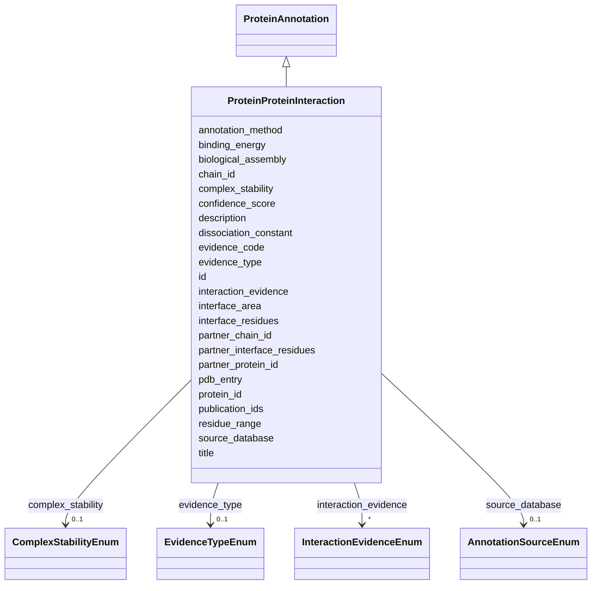

# Class: ProteinProteinInteraction 


_Protein-protein interactions and interfaces_


URI: [lambdaber:ProteinProteinInteraction](https://w3id.org/lambda-ber-schema/ProteinProteinInteraction)





## Inheritance
* [NamedThing](NamedThing.md)
    * [ProteinAnnotation](ProteinAnnotation.md)
        * **ProteinProteinInteraction**


## Slots

| Name | Cardinality and Range | Description | Inheritance |
| ---  | --- | --- | --- |
| [partner_protein_id](partner_protein_id.md) | 1 <br/> [String](String.md) | UniProt ID of interacting partner | direct |
| [partner_chain_id](partner_chain_id.md) | 0..1 <br/> [String](String.md) | Chain ID of interacting partner | direct |
| [interface_residues](interface_residues.md) | * <br/> [String](String.md) | Residues at the interaction interface | direct |
| [partner_interface_residues](partner_interface_residues.md) | * <br/> [String](String.md) | Partner residues at the interaction interface | direct |
| [interface_area](interface_area.md) | 0..1 <br/> [Float](Float.md) | Buried surface area at interface (Ų) | direct |
| [binding_energy](binding_energy.md) | 0..1 <br/> [Float](Float.md) | Calculated binding energy (kcal/mol) | direct |
| [dissociation_constant](dissociation_constant.md) | 0..1 <br/> [Float](Float.md) | Experimental Kd if available | direct |
| [complex_stability](complex_stability.md) | 0..1 <br/> [ComplexStabilityEnum](ComplexStabilityEnum.md) | Stability assessment of the complex | direct |
| [biological_assembly](biological_assembly.md) | 0..1 <br/> [Boolean](Boolean.md) | Whether this represents a biological assembly | direct |
| [interaction_evidence](interaction_evidence.md) | * <br/> [InteractionEvidenceEnum](InteractionEvidenceEnum.md) | Evidence for this interaction | direct |
| [protein_id](protein_id.md) | 1 <br/> [String](String.md) | UniProt accession number | [ProteinAnnotation](ProteinAnnotation.md) |
| [pdb_entry](pdb_entry.md) | 0..1 <br/> [String](String.md) | PDB identifier | [ProteinAnnotation](ProteinAnnotation.md) |
| [chain_id](chain_id.md) | 0..1 <br/> [String](String.md) | Chain identifier in the PDB structure | [ProteinAnnotation](ProteinAnnotation.md) |
| [residue_range](residue_range.md) | 0..1 <br/> [String](String.md) | Range of residues (e | [ProteinAnnotation](ProteinAnnotation.md) |
| [confidence_score](confidence_score.md) | 0..1 <br/> [Float](Float.md) | Confidence score for the annotation (range: 0-1) | [ProteinAnnotation](ProteinAnnotation.md) |
| [evidence_type](evidence_type.md) | 0..1 <br/> [EvidenceTypeEnum](EvidenceTypeEnum.md) | Type of evidence supporting this annotation | [ProteinAnnotation](ProteinAnnotation.md) |
| [evidence_code](evidence_code.md) | 0..1 <br/> [Uriorcurie](Uriorcurie.md) | Evidence and Conclusion Ontology (ECO) code | [ProteinAnnotation](ProteinAnnotation.md) |
| [source_database](source_database.md) | 0..1 <br/> [AnnotationSourceEnum](AnnotationSourceEnum.md) | Source database or resource that provided this annotation | [ProteinAnnotation](ProteinAnnotation.md) |
| [annotation_method](annotation_method.md) | 0..1 <br/> [String](String.md) | Computational or experimental method used | [ProteinAnnotation](ProteinAnnotation.md) |
| [publication_ids](publication_ids.md) | * <br/> [String](String.md) | IDs of one or more publications supporting this annotation | [ProteinAnnotation](ProteinAnnotation.md) |
| [id](id.md) | 1 <br/> [Uriorcurie](Uriorcurie.md) | Globally unique identifier as an IRI or CURIE for machine processing and exte... | [NamedThing](NamedThing.md) |
| [title](title.md) | 0..1 <br/> [String](String.md) | A human-readable name or title for this entity | [NamedThing](NamedThing.md) |
| [description](description.md) | 0..1 <br/> [String](String.md) | A detailed textual description of this entity | [NamedThing](NamedThing.md) |


## Usages

| used by | used in | type | used |
| ---  | --- | --- | --- |
| [Sample](Sample.md) | [protein_interactions](protein_interactions.md) | range | [ProteinProteinInteraction](ProteinProteinInteraction.md) |
| [AggregatedProteinView](AggregatedProteinView.md) | [protein_interactions](protein_interactions.md) | range | [ProteinProteinInteraction](ProteinProteinInteraction.md) |


## Identifier and Mapping Information


### Schema Source


* from schema: https://w3id.org/lambda-ber-schema/


## Mappings

| Mapping Type | Mapped Value |
| ---  | ---  |
| self | lambdaber:ProteinProteinInteraction |
| native | lambdaber:ProteinProteinInteraction |


## LinkML Source

<!-- TODO: investigate https://stackoverflow.com/questions/37606292/how-to-create-tabbed-code-blocks-in-mkdocs-or-sphinx -->

### Direct

<details>
```yaml
name: ProteinProteinInteraction
description: Protein-protein interactions and interfaces
from_schema: https://w3id.org/lambda-ber-schema/
is_a: ProteinAnnotation
attributes:
  partner_protein_id:
    name: partner_protein_id
    description: UniProt ID of interacting partner
    from_schema: https://w3id.org/lambda-ber-schema/functional_annotation
    rank: 1000
    domain_of:
    - ProteinProteinInteraction
    required: true
  partner_chain_id:
    name: partner_chain_id
    description: Chain ID of interacting partner
    from_schema: https://w3id.org/lambda-ber-schema/functional_annotation
    rank: 1000
    domain_of:
    - ProteinProteinInteraction
  interface_residues:
    name: interface_residues
    description: Residues at the interaction interface
    from_schema: https://w3id.org/lambda-ber-schema/functional_annotation
    rank: 1000
    domain_of:
    - ProteinProteinInteraction
    multivalued: true
  partner_interface_residues:
    name: partner_interface_residues
    description: Partner residues at the interaction interface
    from_schema: https://w3id.org/lambda-ber-schema/functional_annotation
    rank: 1000
    domain_of:
    - ProteinProteinInteraction
    multivalued: true
  interface_area:
    name: interface_area
    description: Buried surface area at interface (Ų)
    from_schema: https://w3id.org/lambda-ber-schema/functional_annotation
    rank: 1000
    domain_of:
    - ProteinProteinInteraction
    range: float
    unit:
      ucum_code: Angstrom2
  binding_energy:
    name: binding_energy
    description: Calculated binding energy (kcal/mol)
    from_schema: https://w3id.org/lambda-ber-schema/functional_annotation
    rank: 1000
    domain_of:
    - ProteinProteinInteraction
    range: float
    unit:
      ucum_code: kcal/mol
  dissociation_constant:
    name: dissociation_constant
    description: Experimental Kd if available
    from_schema: https://w3id.org/lambda-ber-schema/functional_annotation
    rank: 1000
    domain_of:
    - ProteinProteinInteraction
    range: float
  complex_stability:
    name: complex_stability
    description: Stability assessment of the complex
    from_schema: https://w3id.org/lambda-ber-schema/functional_annotation
    rank: 1000
    domain_of:
    - ProteinProteinInteraction
    range: ComplexStabilityEnum
  biological_assembly:
    name: biological_assembly
    description: Whether this represents a biological assembly
    from_schema: https://w3id.org/lambda-ber-schema/functional_annotation
    rank: 1000
    domain_of:
    - ProteinProteinInteraction
    range: boolean
  interaction_evidence:
    name: interaction_evidence
    description: Evidence for this interaction
    from_schema: https://w3id.org/lambda-ber-schema/functional_annotation
    rank: 1000
    domain_of:
    - ProteinProteinInteraction
    range: InteractionEvidenceEnum
    multivalued: true

```
</details>

### Induced

<details>
```yaml
name: ProteinProteinInteraction
description: Protein-protein interactions and interfaces
from_schema: https://w3id.org/lambda-ber-schema/
is_a: ProteinAnnotation
attributes:
  partner_protein_id:
    name: partner_protein_id
    description: UniProt ID of interacting partner
    from_schema: https://w3id.org/lambda-ber-schema/functional_annotation
    rank: 1000
    alias: partner_protein_id
    owner: ProteinProteinInteraction
    domain_of:
    - ProteinProteinInteraction
    range: string
    required: true
  partner_chain_id:
    name: partner_chain_id
    description: Chain ID of interacting partner
    from_schema: https://w3id.org/lambda-ber-schema/functional_annotation
    rank: 1000
    alias: partner_chain_id
    owner: ProteinProteinInteraction
    domain_of:
    - ProteinProteinInteraction
    range: string
  interface_residues:
    name: interface_residues
    description: Residues at the interaction interface
    from_schema: https://w3id.org/lambda-ber-schema/functional_annotation
    rank: 1000
    alias: interface_residues
    owner: ProteinProteinInteraction
    domain_of:
    - ProteinProteinInteraction
    range: string
    multivalued: true
  partner_interface_residues:
    name: partner_interface_residues
    description: Partner residues at the interaction interface
    from_schema: https://w3id.org/lambda-ber-schema/functional_annotation
    rank: 1000
    alias: partner_interface_residues
    owner: ProteinProteinInteraction
    domain_of:
    - ProteinProteinInteraction
    range: string
    multivalued: true
  interface_area:
    name: interface_area
    description: Buried surface area at interface (Ų)
    from_schema: https://w3id.org/lambda-ber-schema/functional_annotation
    rank: 1000
    alias: interface_area
    owner: ProteinProteinInteraction
    domain_of:
    - ProteinProteinInteraction
    range: float
    unit:
      ucum_code: Angstrom2
  binding_energy:
    name: binding_energy
    description: Calculated binding energy (kcal/mol)
    from_schema: https://w3id.org/lambda-ber-schema/functional_annotation
    rank: 1000
    alias: binding_energy
    owner: ProteinProteinInteraction
    domain_of:
    - ProteinProteinInteraction
    range: float
    unit:
      ucum_code: kcal/mol
  dissociation_constant:
    name: dissociation_constant
    description: Experimental Kd if available
    from_schema: https://w3id.org/lambda-ber-schema/functional_annotation
    rank: 1000
    alias: dissociation_constant
    owner: ProteinProteinInteraction
    domain_of:
    - ProteinProteinInteraction
    range: float
  complex_stability:
    name: complex_stability
    description: Stability assessment of the complex
    from_schema: https://w3id.org/lambda-ber-schema/functional_annotation
    rank: 1000
    alias: complex_stability
    owner: ProteinProteinInteraction
    domain_of:
    - ProteinProteinInteraction
    range: ComplexStabilityEnum
  biological_assembly:
    name: biological_assembly
    description: Whether this represents a biological assembly
    from_schema: https://w3id.org/lambda-ber-schema/functional_annotation
    rank: 1000
    alias: biological_assembly
    owner: ProteinProteinInteraction
    domain_of:
    - ProteinProteinInteraction
    range: boolean
  interaction_evidence:
    name: interaction_evidence
    description: Evidence for this interaction
    from_schema: https://w3id.org/lambda-ber-schema/functional_annotation
    rank: 1000
    alias: interaction_evidence
    owner: ProteinProteinInteraction
    domain_of:
    - ProteinProteinInteraction
    range: InteractionEvidenceEnum
    multivalued: true
  protein_id:
    name: protein_id
    description: UniProt accession number
    from_schema: https://w3id.org/lambda-ber-schema/functional_annotation
    rank: 1000
    alias: protein_id
    owner: ProteinProteinInteraction
    domain_of:
    - ProteinAnnotation
    - ConformationalEnsemble
    range: string
    required: true
    pattern: ^[A-Z][0-9][A-Z0-9]{3}[0-9]|[A-Z][0-9][A-Z0-9]{3}[0-9]-[0-9]+$
  pdb_entry:
    name: pdb_entry
    description: PDB identifier
    from_schema: https://w3id.org/lambda-ber-schema/functional_annotation
    rank: 1000
    alias: pdb_entry
    owner: ProteinProteinInteraction
    domain_of:
    - ProteinAnnotation
    range: string
    pattern: ^[0-9][A-Za-z0-9]{3}$
  chain_id:
    name: chain_id
    description: Chain identifier in the PDB structure
    from_schema: https://w3id.org/lambda-ber-schema/functional_annotation
    rank: 1000
    alias: chain_id
    owner: ProteinProteinInteraction
    domain_of:
    - ProteinAnnotation
    range: string
    pattern: ^[A-Za-z0-9]+$
  residue_range:
    name: residue_range
    description: Range of residues (e.g., '1-100', '25,27,30-35')
    from_schema: https://w3id.org/lambda-ber-schema/functional_annotation
    rank: 1000
    alias: residue_range
    owner: ProteinProteinInteraction
    domain_of:
    - ProteinAnnotation
    range: string
    pattern: ^[0-9,\-]+$
  confidence_score:
    name: confidence_score
    description: 'Confidence score for the annotation (range: 0-1)'
    from_schema: https://w3id.org/lambda-ber-schema/functional_annotation
    rank: 1000
    alias: confidence_score
    owner: ProteinProteinInteraction
    domain_of:
    - ProteinAnnotation
    range: float
    minimum_value: 0
    maximum_value: 1
  evidence_type:
    name: evidence_type
    description: Type of evidence supporting this annotation
    from_schema: https://w3id.org/lambda-ber-schema/functional_annotation
    rank: 1000
    alias: evidence_type
    owner: ProteinProteinInteraction
    domain_of:
    - ProteinAnnotation
    range: EvidenceTypeEnum
  evidence_code:
    name: evidence_code
    description: Evidence and Conclusion Ontology (ECO) code
    from_schema: https://w3id.org/lambda-ber-schema/functional_annotation
    rank: 1000
    alias: evidence_code
    owner: ProteinProteinInteraction
    domain_of:
    - ProteinAnnotation
    range: uriorcurie
  source_database:
    name: source_database
    description: Source database or resource that provided this annotation
    from_schema: https://w3id.org/lambda-ber-schema/functional_annotation
    rank: 1000
    alias: source_database
    owner: ProteinProteinInteraction
    domain_of:
    - ProteinAnnotation
    range: AnnotationSourceEnum
  annotation_method:
    name: annotation_method
    description: Computational or experimental method used
    from_schema: https://w3id.org/lambda-ber-schema/functional_annotation
    rank: 1000
    alias: annotation_method
    owner: ProteinProteinInteraction
    domain_of:
    - ProteinAnnotation
    range: string
  publication_ids:
    name: publication_ids
    description: IDs of one or more publications supporting this annotation. Use PubMed
      IDs in the format 'PMID:XXXXXXX' or DOIs with 'DOI:' prefix.
    from_schema: https://w3id.org/lambda-ber-schema/functional_annotation
    rank: 1000
    alias: publication_ids
    owner: ProteinProteinInteraction
    domain_of:
    - ProteinAnnotation
    range: string
    multivalued: true
    pattern: ^(PMID:[0-9]+|DOI:10\.[0-9]{4,}/[-._;()/:A-Za-z0-9]+)$
  id:
    name: id
    description: Globally unique identifier as an IRI or CURIE for machine processing
      and external references. Used for linking data across systems and semantic web
      integration.
    from_schema: https://w3id.org/lambda-ber-schema/
    rank: 1000
    identifier: true
    alias: id
    owner: ProteinProteinInteraction
    domain_of:
    - NamedThing
    range: uriorcurie
    required: true
  title:
    name: title
    description: A human-readable name or title for this entity
    from_schema: https://w3id.org/lambda-ber-schema/
    rank: 1000
    slot_uri: dcterms:title
    alias: title
    owner: ProteinProteinInteraction
    domain_of:
    - NamedThing
    range: string
  description:
    name: description
    description: A detailed textual description of this entity
    from_schema: https://w3id.org/lambda-ber-schema/
    rank: 1000
    alias: description
    owner: ProteinProteinInteraction
    domain_of:
    - NamedThing
    - AttributeGroup
    range: string

```
</details>