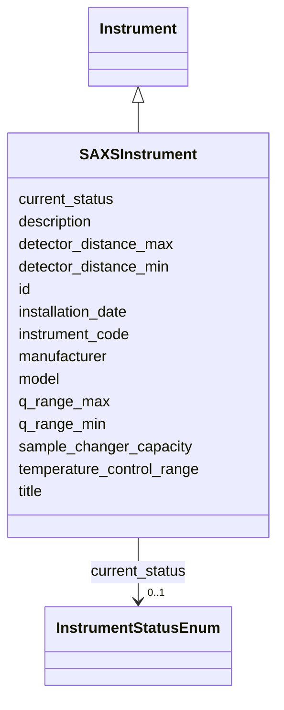

# Class: SAXSInstrument 


_SAXS/WAXS instrument specifications_


URI: [lambdaber:SAXSInstrument](https://w3id.org/lambda-ber-schema/SAXSInstrument)





## Inheritance
* [NamedThing](NamedThing.md)
    * [Instrument](Instrument.md)
        * **SAXSInstrument**


## Slots

| Name | Cardinality and Range | Description | Inheritance |
| ---  | --- | --- | --- |
| [q_range_min](q_range_min.md) | 0..1 <br/> [Float](Float.md) | Minimum q value in inverse Angstroms | direct |
| [q_range_max](q_range_max.md) | 0..1 <br/> [Float](Float.md) | Maximum q value in inverse Angstroms | direct |
| [detector_distance_min](detector_distance_min.md) | 0..1 <br/> [Float](Float.md) | Minimum detector distance in mm | direct |
| [detector_distance_max](detector_distance_max.md) | 0..1 <br/> [Float](Float.md) | Maximum detector distance in mm | direct |
| [sample_changer_capacity](sample_changer_capacity.md) | 0..1 <br/> [Integer](Integer.md) | Number of samples in automatic sample changer | direct |
| [temperature_control_range](temperature_control_range.md) | 0..1 <br/> [String](String.md) | Temperature control range in Celsius | direct |
| [instrument_code](instrument_code.md) | 1 <br/> [String](String.md) | Human-friendly facility or laboratory identifier for the instrument (e | [Instrument](Instrument.md) |
| [manufacturer](manufacturer.md) | 0..1 <br/> [String](String.md) | Instrument manufacturer | [Instrument](Instrument.md) |
| [model](model.md) | 0..1 <br/> [String](String.md) | Instrument model | [Instrument](Instrument.md) |
| [installation_date](installation_date.md) | 0..1 <br/> [String](String.md) | Date of instrument installation | [Instrument](Instrument.md) |
| [current_status](current_status.md) | 0..1 <br/> [InstrumentStatusEnum](InstrumentStatusEnum.md) | Current operational status | [Instrument](Instrument.md) |
| [id](id.md) | 1 <br/> [Uriorcurie](Uriorcurie.md) | Globally unique identifier as an IRI or CURIE for machine processing and exte... | [NamedThing](NamedThing.md) |
| [title](title.md) | 0..1 <br/> [String](String.md) |  | [NamedThing](NamedThing.md) |
| [description](description.md) | 0..1 <br/> [String](String.md) |  | [NamedThing](NamedThing.md) |


## Identifier and Mapping Information


### Schema Source


* from schema: https://w3id.org/lambda-ber-schema/


## Mappings

| Mapping Type | Mapped Value |
| ---  | ---  |
| self | lambdaber:SAXSInstrument |
| native | lambdaber:SAXSInstrument |


## LinkML Source

<!-- TODO: investigate https://stackoverflow.com/questions/37606292/how-to-create-tabbed-code-blocks-in-mkdocs-or-sphinx -->

### Direct

<details>
```yaml
name: SAXSInstrument
description: SAXS/WAXS instrument specifications
from_schema: https://w3id.org/lambda-ber-schema/
is_a: Instrument
attributes:
  q_range_min:
    name: q_range_min
    description: Minimum q value in inverse Angstroms
    from_schema: https://w3id.org/lambda-ber-schema/
    rank: 1000
    domain_of:
    - SAXSInstrument
    range: float
  q_range_max:
    name: q_range_max
    description: Maximum q value in inverse Angstroms
    from_schema: https://w3id.org/lambda-ber-schema/
    rank: 1000
    domain_of:
    - SAXSInstrument
    range: float
  detector_distance_min:
    name: detector_distance_min
    description: Minimum detector distance in mm
    from_schema: https://w3id.org/lambda-ber-schema/
    rank: 1000
    domain_of:
    - SAXSInstrument
    range: float
  detector_distance_max:
    name: detector_distance_max
    description: Maximum detector distance in mm
    from_schema: https://w3id.org/lambda-ber-schema/
    rank: 1000
    domain_of:
    - SAXSInstrument
    range: float
  sample_changer_capacity:
    name: sample_changer_capacity
    description: Number of samples in automatic sample changer
    from_schema: https://w3id.org/lambda-ber-schema/
    rank: 1000
    domain_of:
    - SAXSInstrument
    range: integer
  temperature_control_range:
    name: temperature_control_range
    description: Temperature control range in Celsius
    from_schema: https://w3id.org/lambda-ber-schema/
    rank: 1000
    domain_of:
    - SAXSInstrument

```
</details>

### Induced

<details>
```yaml
name: SAXSInstrument
description: SAXS/WAXS instrument specifications
from_schema: https://w3id.org/lambda-ber-schema/
is_a: Instrument
attributes:
  q_range_min:
    name: q_range_min
    description: Minimum q value in inverse Angstroms
    from_schema: https://w3id.org/lambda-ber-schema/
    rank: 1000
    alias: q_range_min
    owner: SAXSInstrument
    domain_of:
    - SAXSInstrument
    range: float
  q_range_max:
    name: q_range_max
    description: Maximum q value in inverse Angstroms
    from_schema: https://w3id.org/lambda-ber-schema/
    rank: 1000
    alias: q_range_max
    owner: SAXSInstrument
    domain_of:
    - SAXSInstrument
    range: float
  detector_distance_min:
    name: detector_distance_min
    description: Minimum detector distance in mm
    from_schema: https://w3id.org/lambda-ber-schema/
    rank: 1000
    alias: detector_distance_min
    owner: SAXSInstrument
    domain_of:
    - SAXSInstrument
    range: float
  detector_distance_max:
    name: detector_distance_max
    description: Maximum detector distance in mm
    from_schema: https://w3id.org/lambda-ber-schema/
    rank: 1000
    alias: detector_distance_max
    owner: SAXSInstrument
    domain_of:
    - SAXSInstrument
    range: float
  sample_changer_capacity:
    name: sample_changer_capacity
    description: Number of samples in automatic sample changer
    from_schema: https://w3id.org/lambda-ber-schema/
    rank: 1000
    alias: sample_changer_capacity
    owner: SAXSInstrument
    domain_of:
    - SAXSInstrument
    range: integer
  temperature_control_range:
    name: temperature_control_range
    description: Temperature control range in Celsius
    from_schema: https://w3id.org/lambda-ber-schema/
    rank: 1000
    alias: temperature_control_range
    owner: SAXSInstrument
    domain_of:
    - SAXSInstrument
    range: string
  instrument_code:
    name: instrument_code
    description: Human-friendly facility or laboratory identifier for the instrument
      (e.g., 'TITAN-KRIOS-1', 'ALS-12.3.1-SIBYLS', 'RIGAKU-FR-E'). Used for local
      reference and equipment tracking.
    from_schema: https://w3id.org/lambda-ber-schema/
    rank: 1000
    alias: instrument_code
    owner: SAXSInstrument
    domain_of:
    - Instrument
    range: string
    required: true
  manufacturer:
    name: manufacturer
    description: Instrument manufacturer
    from_schema: https://w3id.org/lambda-ber-schema/
    rank: 1000
    alias: manufacturer
    owner: SAXSInstrument
    domain_of:
    - Instrument
    range: string
  model:
    name: model
    description: Instrument model
    from_schema: https://w3id.org/lambda-ber-schema/
    rank: 1000
    alias: model
    owner: SAXSInstrument
    domain_of:
    - Instrument
    range: string
  installation_date:
    name: installation_date
    description: Date of instrument installation
    from_schema: https://w3id.org/lambda-ber-schema/
    rank: 1000
    alias: installation_date
    owner: SAXSInstrument
    domain_of:
    - Instrument
    range: string
  current_status:
    name: current_status
    description: Current operational status
    from_schema: https://w3id.org/lambda-ber-schema/
    rank: 1000
    alias: current_status
    owner: SAXSInstrument
    domain_of:
    - Instrument
    range: InstrumentStatusEnum
  id:
    name: id
    description: Globally unique identifier as an IRI or CURIE for machine processing
      and external references. Used for linking data across systems and semantic web
      integration.
    from_schema: https://w3id.org/lambda-ber-schema/
    rank: 1000
    identifier: true
    alias: id
    owner: SAXSInstrument
    domain_of:
    - NamedThing
    range: uriorcurie
    required: true
  title:
    name: title
    from_schema: https://w3id.org/lambda-ber-schema/
    rank: 1000
    slot_uri: dcterms:title
    alias: title
    owner: SAXSInstrument
    domain_of:
    - NamedThing
    range: string
  description:
    name: description
    from_schema: https://w3id.org/lambda-ber-schema/
    rank: 1000
    alias: description
    owner: SAXSInstrument
    domain_of:
    - NamedThing
    - AttributeGroup
    range: string

```
</details>