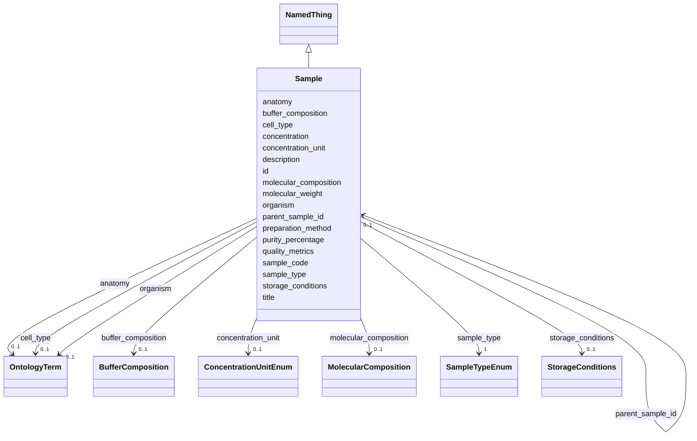

# Class: Sample 


_A biological sample used in structural biology experiments_


URI: [lambdaber:Sample](https://w3id.org/lambda-ber-schema/Sample)





## Inheritance
* [NamedThing](NamedThing.md)
    * **Sample**


## Slots

| Name | Cardinality and Range | Description | Inheritance |
| ---  | --- | --- | --- |
| [sample_code](sample_code.md) | 1 <br/> [String](String.md) | Human-friendly laboratory identifier or facility code for the sample (e | direct |
| [sample_type](sample_type.md) | 1 <br/> [SampleTypeEnum](SampleTypeEnum.md) | Type of biological sample | direct |
| [molecular_composition](molecular_composition.md) | 0..1 <br/> [MolecularComposition](MolecularComposition.md) | Description of molecular composition including sequences, modifications, liga... | direct |
| [molecular_weight](molecular_weight.md) | 0..1 <br/> [Float](Float.md) | Molecular weight in kDa | direct |
| [concentration](concentration.md) | 0..1 <br/> [Float](Float.md) | Sample concentration in mg/mL or µM | direct |
| [concentration_unit](concentration_unit.md) | 0..1 <br/> [ConcentrationUnitEnum](ConcentrationUnitEnum.md) | Unit of concentration measurement | direct |
| [buffer_composition](buffer_composition.md) | 0..1 <br/> [BufferComposition](BufferComposition.md) | Buffer composition including pH, salts, additives | direct |
| [preparation_method](preparation_method.md) | 0..1 <br/> [String](String.md) | Method used to prepare the sample | direct |
| [storage_conditions](storage_conditions.md) | 0..1 <br/> [StorageConditions](StorageConditions.md) | Storage conditions for the sample | direct |
| [organism](organism.md) | 0..1 <br/> [OntologyTerm](OntologyTerm.md) | Source organism for the sample (e | direct |
| [anatomy](anatomy.md) | 0..1 <br/> [OntologyTerm](OntologyTerm.md) | Anatomical part or tissue (e | direct |
| [cell_type](cell_type.md) | 0..1 <br/> [OntologyTerm](OntologyTerm.md) | Cell type if applicable (e | direct |
| [parent_sample_id](parent_sample_id.md) | 0..1 <br/> [Sample](Sample.md) | Reference to parent sample for derivation tracking | direct |
| [purity_percentage](purity_percentage.md) | 0..1 <br/> [Float](Float.md) | Sample purity as percentage | direct |
| [quality_metrics](quality_metrics.md) | 0..1 <br/> [String](String.md) | Quality control metrics for the sample | direct |
| [id](id.md) | 1 <br/> [Uriorcurie](Uriorcurie.md) | Globally unique identifier as an IRI or CURIE for machine processing and exte... | [NamedThing](NamedThing.md) |
| [title](title.md) | 0..1 <br/> [String](String.md) |  | [NamedThing](NamedThing.md) |
| [description](description.md) | 0..1 <br/> [String](String.md) |  | [NamedThing](NamedThing.md) |


## Usages

| used by | used in | type | used |
| ---  | --- | --- | --- |
| [Study](Study.md) | [samples](samples.md) | range | [Sample](Sample.md) |
| [Sample](Sample.md) | [parent_sample_id](parent_sample_id.md) | range | [Sample](Sample.md) |


## Identifier and Mapping Information


### Schema Source


* from schema: https://w3id.org/lambda-ber-schema/


## Mappings

| Mapping Type | Mapped Value |
| ---  | ---  |
| self | lambdaber:Sample |
| native | lambdaber:Sample |


## LinkML Source

<!-- TODO: investigate https://stackoverflow.com/questions/37606292/how-to-create-tabbed-code-blocks-in-mkdocs-or-sphinx -->

### Direct

<details>
```yaml
name: Sample
description: A biological sample used in structural biology experiments
from_schema: https://w3id.org/lambda-ber-schema/
is_a: NamedThing
attributes:
  sample_code:
    name: sample_code
    description: Human-friendly laboratory identifier or facility code for the sample
      (e.g., 'ALS-12.3.1-SAMPLE-001', 'LAB-PROT-2024-01'). Used for local reference
      and tracking within laboratory workflows.
    from_schema: https://w3id.org/lambda-ber-schema/
    rank: 1000
    domain_of:
    - Sample
    required: true
  sample_type:
    name: sample_type
    description: Type of biological sample
    from_schema: https://w3id.org/lambda-ber-schema/
    rank: 1000
    domain_of:
    - Sample
    range: SampleTypeEnum
    required: true
  molecular_composition:
    name: molecular_composition
    description: Description of molecular composition including sequences, modifications,
      ligands
    from_schema: https://w3id.org/lambda-ber-schema/
    rank: 1000
    domain_of:
    - Sample
    range: MolecularComposition
  molecular_weight:
    name: molecular_weight
    description: Molecular weight in kDa
    from_schema: https://w3id.org/lambda-ber-schema/
    rank: 1000
    domain_of:
    - Sample
    range: float
    unit:
      ucum_code: kDa
  concentration:
    name: concentration
    description: Sample concentration in mg/mL or µM
    from_schema: https://w3id.org/lambda-ber-schema/
    rank: 1000
    domain_of:
    - Sample
    range: float
  concentration_unit:
    name: concentration_unit
    description: Unit of concentration measurement
    from_schema: https://w3id.org/lambda-ber-schema/
    rank: 1000
    domain_of:
    - Sample
    range: ConcentrationUnitEnum
  buffer_composition:
    name: buffer_composition
    description: Buffer composition including pH, salts, additives
    from_schema: https://w3id.org/lambda-ber-schema/
    rank: 1000
    domain_of:
    - Sample
    range: BufferComposition
  preparation_method:
    name: preparation_method
    description: Method used to prepare the sample
    from_schema: https://w3id.org/lambda-ber-schema/
    rank: 1000
    domain_of:
    - Sample
  storage_conditions:
    name: storage_conditions
    description: Storage conditions for the sample
    from_schema: https://w3id.org/lambda-ber-schema/
    rank: 1000
    domain_of:
    - Sample
    range: StorageConditions
  organism:
    name: organism
    description: Source organism for the sample (e.g., NCBITaxon:3702 for Arabidopsis
      thaliana)
    from_schema: https://w3id.org/lambda-ber-schema/
    rank: 1000
    domain_of:
    - Sample
    range: OntologyTerm
  anatomy:
    name: anatomy
    description: Anatomical part or tissue (e.g., UBERON:0008945 for leaf)
    from_schema: https://w3id.org/lambda-ber-schema/
    rank: 1000
    domain_of:
    - Sample
    range: OntologyTerm
  cell_type:
    name: cell_type
    description: Cell type if applicable (e.g., CL:0000057 for fibroblast)
    from_schema: https://w3id.org/lambda-ber-schema/
    rank: 1000
    domain_of:
    - Sample
    range: OntologyTerm
  parent_sample_id:
    name: parent_sample_id
    description: Reference to parent sample for derivation tracking
    from_schema: https://w3id.org/lambda-ber-schema/
    rank: 1000
    domain_of:
    - Sample
    range: Sample
  purity_percentage:
    name: purity_percentage
    description: Sample purity as percentage
    from_schema: https://w3id.org/lambda-ber-schema/
    rank: 1000
    domain_of:
    - Sample
    range: float
    minimum_value: 0
    maximum_value: 100
  quality_metrics:
    name: quality_metrics
    description: Quality control metrics for the sample
    from_schema: https://w3id.org/lambda-ber-schema/
    rank: 1000
    domain_of:
    - Sample
    - ExperimentRun

```
</details>

### Induced

<details>
```yaml
name: Sample
description: A biological sample used in structural biology experiments
from_schema: https://w3id.org/lambda-ber-schema/
is_a: NamedThing
attributes:
  sample_code:
    name: sample_code
    description: Human-friendly laboratory identifier or facility code for the sample
      (e.g., 'ALS-12.3.1-SAMPLE-001', 'LAB-PROT-2024-01'). Used for local reference
      and tracking within laboratory workflows.
    from_schema: https://w3id.org/lambda-ber-schema/
    rank: 1000
    alias: sample_code
    owner: Sample
    domain_of:
    - Sample
    range: string
    required: true
  sample_type:
    name: sample_type
    description: Type of biological sample
    from_schema: https://w3id.org/lambda-ber-schema/
    rank: 1000
    alias: sample_type
    owner: Sample
    domain_of:
    - Sample
    range: SampleTypeEnum
    required: true
  molecular_composition:
    name: molecular_composition
    description: Description of molecular composition including sequences, modifications,
      ligands
    from_schema: https://w3id.org/lambda-ber-schema/
    rank: 1000
    alias: molecular_composition
    owner: Sample
    domain_of:
    - Sample
    range: MolecularComposition
  molecular_weight:
    name: molecular_weight
    description: Molecular weight in kDa
    from_schema: https://w3id.org/lambda-ber-schema/
    rank: 1000
    alias: molecular_weight
    owner: Sample
    domain_of:
    - Sample
    range: float
    unit:
      ucum_code: kDa
  concentration:
    name: concentration
    description: Sample concentration in mg/mL or µM
    from_schema: https://w3id.org/lambda-ber-schema/
    rank: 1000
    alias: concentration
    owner: Sample
    domain_of:
    - Sample
    range: float
  concentration_unit:
    name: concentration_unit
    description: Unit of concentration measurement
    from_schema: https://w3id.org/lambda-ber-schema/
    rank: 1000
    alias: concentration_unit
    owner: Sample
    domain_of:
    - Sample
    range: ConcentrationUnitEnum
  buffer_composition:
    name: buffer_composition
    description: Buffer composition including pH, salts, additives
    from_schema: https://w3id.org/lambda-ber-schema/
    rank: 1000
    alias: buffer_composition
    owner: Sample
    domain_of:
    - Sample
    range: BufferComposition
  preparation_method:
    name: preparation_method
    description: Method used to prepare the sample
    from_schema: https://w3id.org/lambda-ber-schema/
    rank: 1000
    alias: preparation_method
    owner: Sample
    domain_of:
    - Sample
    range: string
  storage_conditions:
    name: storage_conditions
    description: Storage conditions for the sample
    from_schema: https://w3id.org/lambda-ber-schema/
    rank: 1000
    alias: storage_conditions
    owner: Sample
    domain_of:
    - Sample
    range: StorageConditions
  organism:
    name: organism
    description: Source organism for the sample (e.g., NCBITaxon:3702 for Arabidopsis
      thaliana)
    from_schema: https://w3id.org/lambda-ber-schema/
    rank: 1000
    alias: organism
    owner: Sample
    domain_of:
    - Sample
    range: OntologyTerm
  anatomy:
    name: anatomy
    description: Anatomical part or tissue (e.g., UBERON:0008945 for leaf)
    from_schema: https://w3id.org/lambda-ber-schema/
    rank: 1000
    alias: anatomy
    owner: Sample
    domain_of:
    - Sample
    range: OntologyTerm
  cell_type:
    name: cell_type
    description: Cell type if applicable (e.g., CL:0000057 for fibroblast)
    from_schema: https://w3id.org/lambda-ber-schema/
    rank: 1000
    alias: cell_type
    owner: Sample
    domain_of:
    - Sample
    range: OntologyTerm
  parent_sample_id:
    name: parent_sample_id
    description: Reference to parent sample for derivation tracking
    from_schema: https://w3id.org/lambda-ber-schema/
    rank: 1000
    alias: parent_sample_id
    owner: Sample
    domain_of:
    - Sample
    range: Sample
  purity_percentage:
    name: purity_percentage
    description: Sample purity as percentage
    from_schema: https://w3id.org/lambda-ber-schema/
    rank: 1000
    alias: purity_percentage
    owner: Sample
    domain_of:
    - Sample
    range: float
    minimum_value: 0
    maximum_value: 100
  quality_metrics:
    name: quality_metrics
    description: Quality control metrics for the sample
    from_schema: https://w3id.org/lambda-ber-schema/
    rank: 1000
    alias: quality_metrics
    owner: Sample
    domain_of:
    - Sample
    - ExperimentRun
    range: string
  id:
    name: id
    description: Globally unique identifier as an IRI or CURIE for machine processing
      and external references. Used for linking data across systems and semantic web
      integration.
    from_schema: https://w3id.org/lambda-ber-schema/
    rank: 1000
    identifier: true
    alias: id
    owner: Sample
    domain_of:
    - NamedThing
    range: uriorcurie
    required: true
  title:
    name: title
    from_schema: https://w3id.org/lambda-ber-schema/
    rank: 1000
    slot_uri: dcterms:title
    alias: title
    owner: Sample
    domain_of:
    - NamedThing
    range: string
  description:
    name: description
    from_schema: https://w3id.org/lambda-ber-schema/
    rank: 1000
    alias: description
    owner: Sample
    domain_of:
    - NamedThing
    - AttributeGroup
    range: string

```
</details>