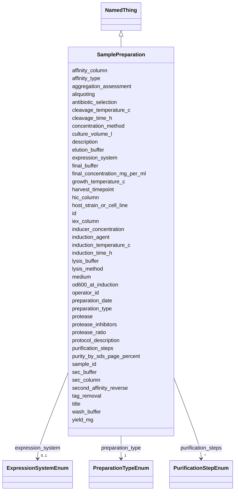

# Class: SamplePreparation 


_A process that prepares a sample for imaging_


URI: [lambdaber:SamplePreparation](https://w3id.org/lambda-ber-schema/SamplePreparation)





## Inheritance
* [NamedThing](NamedThing.md)
    * **SamplePreparation**


## Slots

| Name | Cardinality and Range | Description | Inheritance |
| ---  | --- | --- | --- |
| [preparation_type](preparation_type.md) | 1 <br/> [PreparationTypeEnum](PreparationTypeEnum.md) | Type of sample preparation | direct |
| [sample_id](sample_id.md) | 1 <br/> [String](String.md) | Reference to the sample being prepared | direct |
| [preparation_date](preparation_date.md) | 0..1 <br/> [String](String.md) | Date of sample preparation | direct |
| [operator_id](operator_id.md) | 0..1 <br/> [String](String.md) | Identifier or name of the person who performed the sample preparation (e | direct |
| [protocol_description](protocol_description.md) | 0..1 <br/> [String](String.md) | Detailed protocol description | direct |
| [expression_system](expression_system.md) | 0..1 <br/> [ExpressionSystemEnum](ExpressionSystemEnum.md) | Expression system used for recombinant protein production | direct |
| [host_strain_or_cell_line](host_strain_or_cell_line.md) | 0..1 <br/> [String](String.md) | Specific strain or cell line used (e | direct |
| [culture_volume_l](culture_volume_l.md) | 0..1 <br/> [Float](Float.md) | Culture volume in liters | direct |
| [medium](medium.md) | 0..1 <br/> [String](String.md) | Growth medium used | direct |
| [antibiotic_selection](antibiotic_selection.md) | 0..1 <br/> [String](String.md) | Antibiotic or selection agent used | direct |
| [growth_temperature_c](growth_temperature_c.md) | 0..1 <br/> [Float](Float.md) | Growth temperature in Celsius | direct |
| [induction_agent](induction_agent.md) | 0..1 <br/> [String](String.md) | Agent used to induce expression (e | direct |
| [inducer_concentration](inducer_concentration.md) | 0..1 <br/> [String](String.md) | Concentration of induction agent | direct |
| [induction_temperature_c](induction_temperature_c.md) | 0..1 <br/> [Float](Float.md) | Temperature during induction in Celsius | direct |
| [induction_time_h](induction_time_h.md) | 0..1 <br/> [Float](Float.md) | Duration of induction in hours | direct |
| [od600_at_induction](od600_at_induction.md) | 0..1 <br/> [Float](Float.md) | Optical density at 600nm when induction was started | direct |
| [harvest_timepoint](harvest_timepoint.md) | 0..1 <br/> [String](String.md) | Time point when cells were harvested | direct |
| [lysis_method](lysis_method.md) | 0..1 <br/> [String](String.md) | Method used for cell lysis | direct |
| [protease_inhibitors](protease_inhibitors.md) | 0..1 <br/> [String](String.md) | Protease inhibitors added | direct |
| [purification_steps](purification_steps.md) | * <br/> [PurificationStepEnum](PurificationStepEnum.md) | Ordered list of purification steps performed | direct |
| [affinity_type](affinity_type.md) | 0..1 <br/> [String](String.md) | Type of affinity chromatography | direct |
| [affinity_column](affinity_column.md) | 0..1 <br/> [String](String.md) | Affinity column specifications | direct |
| [lysis_buffer](lysis_buffer.md) | 0..1 <br/> [String](String.md) | Buffer composition for lysis | direct |
| [wash_buffer](wash_buffer.md) | 0..1 <br/> [String](String.md) | Buffer composition for washing | direct |
| [elution_buffer](elution_buffer.md) | 0..1 <br/> [String](String.md) | Buffer composition for elution | direct |
| [tag_removal](tag_removal.md) | 0..1 <br/> [Boolean](Boolean.md) | Whether and how affinity tag was removed | direct |
| [protease](protease.md) | 0..1 <br/> [String](String.md) | Protease used for tag cleavage | direct |
| [protease_ratio](protease_ratio.md) | 0..1 <br/> [String](String.md) | Ratio of protease to protein | direct |
| [cleavage_time_h](cleavage_time_h.md) | 0..1 <br/> [Float](Float.md) | Duration of protease cleavage in hours | direct |
| [cleavage_temperature_c](cleavage_temperature_c.md) | 0..1 <br/> [Float](Float.md) | Temperature during cleavage in Celsius | direct |
| [second_affinity_reverse](second_affinity_reverse.md) | 0..1 <br/> [String](String.md) | Second affinity or reverse affinity step | direct |
| [iex_column](iex_column.md) | 0..1 <br/> [String](String.md) | Ion-exchange column used | direct |
| [hic_column](hic_column.md) | 0..1 <br/> [String](String.md) | Hydrophobic interaction column used | direct |
| [sec_column](sec_column.md) | 0..1 <br/> [String](String.md) | Size-exclusion column used | direct |
| [sec_buffer](sec_buffer.md) | 0..1 <br/> [String](String.md) | Buffer for size-exclusion chromatography | direct |
| [concentration_method](concentration_method.md) | 0..1 <br/> [String](String.md) | Method used to concentrate protein | direct |
| [final_buffer](final_buffer.md) | 0..1 <br/> [String](String.md) | Final buffer composition after purification | direct |
| [final_concentration_mg_per_ml](final_concentration_mg_per_ml.md) | 0..1 <br/> [Float](Float.md) | Final protein concentration in mg/mL | direct |
| [yield_mg](yield_mg.md) | 0..1 <br/> [Float](Float.md) | Total yield in milligrams | direct |
| [purity_by_sds_page_percent](purity_by_sds_page_percent.md) | 0..1 <br/> [Float](Float.md) | Purity percentage by SDS-PAGE | direct |
| [aggregation_assessment](aggregation_assessment.md) | 0..1 <br/> [String](String.md) | Assessment of protein aggregation state | direct |
| [aliquoting](aliquoting.md) | 0..1 <br/> [String](String.md) | How the protein was aliquoted for storage | direct |
| [id](id.md) | 1 <br/> [Uriorcurie](Uriorcurie.md) | Globally unique identifier as an IRI or CURIE for machine processing and exte... | [NamedThing](NamedThing.md) |
| [title](title.md) | 0..1 <br/> [String](String.md) |  | [NamedThing](NamedThing.md) |
| [description](description.md) | 0..1 <br/> [String](String.md) |  | [NamedThing](NamedThing.md) |


## Usages

| used by | used in | type | used |
| ---  | --- | --- | --- |
| [Study](Study.md) | [sample_preparations](sample_preparations.md) | range | [SamplePreparation](SamplePreparation.md) |


## Identifier and Mapping Information


### Schema Source


* from schema: https://w3id.org/lambda-ber-schema/


## Mappings

| Mapping Type | Mapped Value |
| ---  | ---  |
| self | lambdaber:SamplePreparation |
| native | lambdaber:SamplePreparation |


## LinkML Source

<!-- TODO: investigate https://stackoverflow.com/questions/37606292/how-to-create-tabbed-code-blocks-in-mkdocs-or-sphinx -->

### Direct

<details>
```yaml
name: SamplePreparation
description: A process that prepares a sample for imaging
from_schema: https://w3id.org/lambda-ber-schema/
is_a: NamedThing
attributes:
  preparation_type:
    name: preparation_type
    description: Type of sample preparation
    from_schema: https://w3id.org/lambda-ber-schema/
    rank: 1000
    domain_of:
    - SamplePreparation
    range: PreparationTypeEnum
    required: true
  sample_id:
    name: sample_id
    description: Reference to the sample being prepared
    from_schema: https://w3id.org/lambda-ber-schema/
    rank: 1000
    domain_of:
    - SamplePreparation
    - ExperimentRun
    range: string
    required: true
  preparation_date:
    name: preparation_date
    description: Date of sample preparation
    from_schema: https://w3id.org/lambda-ber-schema/
    rank: 1000
    domain_of:
    - SamplePreparation
  operator_id:
    name: operator_id
    description: Identifier or name of the person who performed the sample preparation
      (e.g., 'jsmith', 'John Smith', or personnel ID)
    from_schema: https://w3id.org/lambda-ber-schema/
    rank: 1000
    domain_of:
    - SamplePreparation
    - ExperimentRun
    range: string
  protocol_description:
    name: protocol_description
    description: Detailed protocol description
    from_schema: https://w3id.org/lambda-ber-schema/
    rank: 1000
    domain_of:
    - SamplePreparation
  expression_system:
    name: expression_system
    description: Expression system used for recombinant protein production
    from_schema: https://w3id.org/lambda-ber-schema/
    domain_of:
    - Sample
    - SamplePreparation
    range: ExpressionSystemEnum
  host_strain_or_cell_line:
    name: host_strain_or_cell_line
    description: Specific strain or cell line used (e.g., BL21(DE3), Sf9, HEK293F)
    from_schema: https://w3id.org/lambda-ber-schema/
    rank: 1000
    domain_of:
    - SamplePreparation
  culture_volume_l:
    name: culture_volume_l
    description: Culture volume in liters
    from_schema: https://w3id.org/lambda-ber-schema/
    rank: 1000
    domain_of:
    - SamplePreparation
    range: float
    unit:
      ucum_code: L
  medium:
    name: medium
    description: Growth medium used
    from_schema: https://w3id.org/lambda-ber-schema/
    rank: 1000
    domain_of:
    - SamplePreparation
  antibiotic_selection:
    name: antibiotic_selection
    description: Antibiotic or selection agent used
    from_schema: https://w3id.org/lambda-ber-schema/
    rank: 1000
    domain_of:
    - SamplePreparation
  growth_temperature_c:
    name: growth_temperature_c
    description: Growth temperature in Celsius
    from_schema: https://w3id.org/lambda-ber-schema/
    rank: 1000
    domain_of:
    - SamplePreparation
    range: float
    unit:
      ucum_code: Cel
  induction_agent:
    name: induction_agent
    description: Agent used to induce expression (e.g., IPTG, tetracycline)
    from_schema: https://w3id.org/lambda-ber-schema/
    rank: 1000
    domain_of:
    - SamplePreparation
  inducer_concentration:
    name: inducer_concentration
    description: Concentration of induction agent
    from_schema: https://w3id.org/lambda-ber-schema/
    rank: 1000
    domain_of:
    - SamplePreparation
  induction_temperature_c:
    name: induction_temperature_c
    description: Temperature during induction in Celsius
    from_schema: https://w3id.org/lambda-ber-schema/
    rank: 1000
    domain_of:
    - SamplePreparation
    range: float
  induction_time_h:
    name: induction_time_h
    description: Duration of induction in hours
    from_schema: https://w3id.org/lambda-ber-schema/
    rank: 1000
    domain_of:
    - SamplePreparation
    range: float
  od600_at_induction:
    name: od600_at_induction
    description: Optical density at 600nm when induction was started
    from_schema: https://w3id.org/lambda-ber-schema/
    rank: 1000
    domain_of:
    - SamplePreparation
    range: float
  harvest_timepoint:
    name: harvest_timepoint
    description: Time point when cells were harvested
    from_schema: https://w3id.org/lambda-ber-schema/
    rank: 1000
    domain_of:
    - SamplePreparation
  lysis_method:
    name: lysis_method
    description: Method used for cell lysis
    from_schema: https://w3id.org/lambda-ber-schema/
    rank: 1000
    domain_of:
    - SamplePreparation
  protease_inhibitors:
    name: protease_inhibitors
    description: Protease inhibitors added
    from_schema: https://w3id.org/lambda-ber-schema/
    rank: 1000
    domain_of:
    - SamplePreparation
  purification_steps:
    name: purification_steps
    description: Ordered list of purification steps performed
    from_schema: https://w3id.org/lambda-ber-schema/
    rank: 1000
    domain_of:
    - SamplePreparation
    range: PurificationStepEnum
    multivalued: true
  affinity_type:
    name: affinity_type
    description: Type of affinity chromatography
    from_schema: https://w3id.org/lambda-ber-schema/
    rank: 1000
    domain_of:
    - SamplePreparation
  affinity_column:
    name: affinity_column
    description: Affinity column specifications
    from_schema: https://w3id.org/lambda-ber-schema/
    rank: 1000
    domain_of:
    - SamplePreparation
  lysis_buffer:
    name: lysis_buffer
    description: Buffer composition for lysis
    from_schema: https://w3id.org/lambda-ber-schema/
    rank: 1000
    domain_of:
    - SamplePreparation
  wash_buffer:
    name: wash_buffer
    description: Buffer composition for washing
    from_schema: https://w3id.org/lambda-ber-schema/
    rank: 1000
    domain_of:
    - SamplePreparation
  elution_buffer:
    name: elution_buffer
    description: Buffer composition for elution
    from_schema: https://w3id.org/lambda-ber-schema/
    rank: 1000
    domain_of:
    - SamplePreparation
  tag_removal:
    name: tag_removal
    description: Whether and how affinity tag was removed
    from_schema: https://w3id.org/lambda-ber-schema/
    rank: 1000
    domain_of:
    - SamplePreparation
    range: boolean
  protease:
    name: protease
    description: Protease used for tag cleavage
    from_schema: https://w3id.org/lambda-ber-schema/
    rank: 1000
    domain_of:
    - SamplePreparation
  protease_ratio:
    name: protease_ratio
    description: Ratio of protease to protein
    from_schema: https://w3id.org/lambda-ber-schema/
    rank: 1000
    domain_of:
    - SamplePreparation
  cleavage_time_h:
    name: cleavage_time_h
    description: Duration of protease cleavage in hours
    from_schema: https://w3id.org/lambda-ber-schema/
    rank: 1000
    domain_of:
    - SamplePreparation
    range: float
  cleavage_temperature_c:
    name: cleavage_temperature_c
    description: Temperature during cleavage in Celsius
    from_schema: https://w3id.org/lambda-ber-schema/
    rank: 1000
    domain_of:
    - SamplePreparation
    range: float
  second_affinity_reverse:
    name: second_affinity_reverse
    description: Second affinity or reverse affinity step
    from_schema: https://w3id.org/lambda-ber-schema/
    rank: 1000
    domain_of:
    - SamplePreparation
  iex_column:
    name: iex_column
    description: Ion-exchange column used
    from_schema: https://w3id.org/lambda-ber-schema/
    rank: 1000
    domain_of:
    - SamplePreparation
  hic_column:
    name: hic_column
    description: Hydrophobic interaction column used
    from_schema: https://w3id.org/lambda-ber-schema/
    rank: 1000
    domain_of:
    - SamplePreparation
  sec_column:
    name: sec_column
    description: Size-exclusion column used
    from_schema: https://w3id.org/lambda-ber-schema/
    rank: 1000
    domain_of:
    - SamplePreparation
  sec_buffer:
    name: sec_buffer
    description: Buffer for size-exclusion chromatography
    from_schema: https://w3id.org/lambda-ber-schema/
    rank: 1000
    domain_of:
    - SamplePreparation
  concentration_method:
    name: concentration_method
    description: Method used to concentrate protein
    from_schema: https://w3id.org/lambda-ber-schema/
    rank: 1000
    domain_of:
    - SamplePreparation
  final_buffer:
    name: final_buffer
    description: Final buffer composition after purification
    from_schema: https://w3id.org/lambda-ber-schema/
    rank: 1000
    domain_of:
    - SamplePreparation
  final_concentration_mg_per_ml:
    name: final_concentration_mg_per_ml
    description: Final protein concentration in mg/mL
    from_schema: https://w3id.org/lambda-ber-schema/
    rank: 1000
    domain_of:
    - SamplePreparation
    range: float
  yield_mg:
    name: yield_mg
    description: Total yield in milligrams
    from_schema: https://w3id.org/lambda-ber-schema/
    rank: 1000
    domain_of:
    - SamplePreparation
    range: float
  purity_by_sds_page_percent:
    name: purity_by_sds_page_percent
    description: Purity percentage by SDS-PAGE
    from_schema: https://w3id.org/lambda-ber-schema/
    rank: 1000
    domain_of:
    - SamplePreparation
    range: float
  aggregation_assessment:
    name: aggregation_assessment
    description: Assessment of protein aggregation state
    from_schema: https://w3id.org/lambda-ber-schema/
    rank: 1000
    domain_of:
    - SamplePreparation
  aliquoting:
    name: aliquoting
    description: How the protein was aliquoted for storage
    from_schema: https://w3id.org/lambda-ber-schema/
    rank: 1000
    domain_of:
    - SamplePreparation

```
</details>

### Induced

<details>
```yaml
name: SamplePreparation
description: A process that prepares a sample for imaging
from_schema: https://w3id.org/lambda-ber-schema/
is_a: NamedThing
attributes:
  preparation_type:
    name: preparation_type
    description: Type of sample preparation
    from_schema: https://w3id.org/lambda-ber-schema/
    rank: 1000
    alias: preparation_type
    owner: SamplePreparation
    domain_of:
    - SamplePreparation
    range: PreparationTypeEnum
    required: true
  sample_id:
    name: sample_id
    description: Reference to the sample being prepared
    from_schema: https://w3id.org/lambda-ber-schema/
    rank: 1000
    alias: sample_id
    owner: SamplePreparation
    domain_of:
    - SamplePreparation
    - ExperimentRun
    range: string
    required: true
  preparation_date:
    name: preparation_date
    description: Date of sample preparation
    from_schema: https://w3id.org/lambda-ber-schema/
    rank: 1000
    alias: preparation_date
    owner: SamplePreparation
    domain_of:
    - SamplePreparation
    range: string
  operator_id:
    name: operator_id
    description: Identifier or name of the person who performed the sample preparation
      (e.g., 'jsmith', 'John Smith', or personnel ID)
    from_schema: https://w3id.org/lambda-ber-schema/
    rank: 1000
    alias: operator_id
    owner: SamplePreparation
    domain_of:
    - SamplePreparation
    - ExperimentRun
    range: string
  protocol_description:
    name: protocol_description
    description: Detailed protocol description
    from_schema: https://w3id.org/lambda-ber-schema/
    rank: 1000
    alias: protocol_description
    owner: SamplePreparation
    domain_of:
    - SamplePreparation
    range: string
  expression_system:
    name: expression_system
    description: Expression system used for recombinant protein production
    from_schema: https://w3id.org/lambda-ber-schema/
    alias: expression_system
    owner: SamplePreparation
    domain_of:
    - Sample
    - SamplePreparation
    range: ExpressionSystemEnum
  host_strain_or_cell_line:
    name: host_strain_or_cell_line
    description: Specific strain or cell line used (e.g., BL21(DE3), Sf9, HEK293F)
    from_schema: https://w3id.org/lambda-ber-schema/
    rank: 1000
    alias: host_strain_or_cell_line
    owner: SamplePreparation
    domain_of:
    - SamplePreparation
    range: string
  culture_volume_l:
    name: culture_volume_l
    description: Culture volume in liters
    from_schema: https://w3id.org/lambda-ber-schema/
    rank: 1000
    alias: culture_volume_l
    owner: SamplePreparation
    domain_of:
    - SamplePreparation
    range: float
    unit:
      ucum_code: L
  medium:
    name: medium
    description: Growth medium used
    from_schema: https://w3id.org/lambda-ber-schema/
    rank: 1000
    alias: medium
    owner: SamplePreparation
    domain_of:
    - SamplePreparation
    range: string
  antibiotic_selection:
    name: antibiotic_selection
    description: Antibiotic or selection agent used
    from_schema: https://w3id.org/lambda-ber-schema/
    rank: 1000
    alias: antibiotic_selection
    owner: SamplePreparation
    domain_of:
    - SamplePreparation
    range: string
  growth_temperature_c:
    name: growth_temperature_c
    description: Growth temperature in Celsius
    from_schema: https://w3id.org/lambda-ber-schema/
    rank: 1000
    alias: growth_temperature_c
    owner: SamplePreparation
    domain_of:
    - SamplePreparation
    range: float
    unit:
      ucum_code: Cel
  induction_agent:
    name: induction_agent
    description: Agent used to induce expression (e.g., IPTG, tetracycline)
    from_schema: https://w3id.org/lambda-ber-schema/
    rank: 1000
    alias: induction_agent
    owner: SamplePreparation
    domain_of:
    - SamplePreparation
    range: string
  inducer_concentration:
    name: inducer_concentration
    description: Concentration of induction agent
    from_schema: https://w3id.org/lambda-ber-schema/
    rank: 1000
    alias: inducer_concentration
    owner: SamplePreparation
    domain_of:
    - SamplePreparation
    range: string
  induction_temperature_c:
    name: induction_temperature_c
    description: Temperature during induction in Celsius
    from_schema: https://w3id.org/lambda-ber-schema/
    rank: 1000
    alias: induction_temperature_c
    owner: SamplePreparation
    domain_of:
    - SamplePreparation
    range: float
  induction_time_h:
    name: induction_time_h
    description: Duration of induction in hours
    from_schema: https://w3id.org/lambda-ber-schema/
    rank: 1000
    alias: induction_time_h
    owner: SamplePreparation
    domain_of:
    - SamplePreparation
    range: float
  od600_at_induction:
    name: od600_at_induction
    description: Optical density at 600nm when induction was started
    from_schema: https://w3id.org/lambda-ber-schema/
    rank: 1000
    alias: od600_at_induction
    owner: SamplePreparation
    domain_of:
    - SamplePreparation
    range: float
  harvest_timepoint:
    name: harvest_timepoint
    description: Time point when cells were harvested
    from_schema: https://w3id.org/lambda-ber-schema/
    rank: 1000
    alias: harvest_timepoint
    owner: SamplePreparation
    domain_of:
    - SamplePreparation
    range: string
  lysis_method:
    name: lysis_method
    description: Method used for cell lysis
    from_schema: https://w3id.org/lambda-ber-schema/
    rank: 1000
    alias: lysis_method
    owner: SamplePreparation
    domain_of:
    - SamplePreparation
    range: string
  protease_inhibitors:
    name: protease_inhibitors
    description: Protease inhibitors added
    from_schema: https://w3id.org/lambda-ber-schema/
    rank: 1000
    alias: protease_inhibitors
    owner: SamplePreparation
    domain_of:
    - SamplePreparation
    range: string
  purification_steps:
    name: purification_steps
    description: Ordered list of purification steps performed
    from_schema: https://w3id.org/lambda-ber-schema/
    rank: 1000
    alias: purification_steps
    owner: SamplePreparation
    domain_of:
    - SamplePreparation
    range: PurificationStepEnum
    multivalued: true
  affinity_type:
    name: affinity_type
    description: Type of affinity chromatography
    from_schema: https://w3id.org/lambda-ber-schema/
    rank: 1000
    alias: affinity_type
    owner: SamplePreparation
    domain_of:
    - SamplePreparation
    range: string
  affinity_column:
    name: affinity_column
    description: Affinity column specifications
    from_schema: https://w3id.org/lambda-ber-schema/
    rank: 1000
    alias: affinity_column
    owner: SamplePreparation
    domain_of:
    - SamplePreparation
    range: string
  lysis_buffer:
    name: lysis_buffer
    description: Buffer composition for lysis
    from_schema: https://w3id.org/lambda-ber-schema/
    rank: 1000
    alias: lysis_buffer
    owner: SamplePreparation
    domain_of:
    - SamplePreparation
    range: string
  wash_buffer:
    name: wash_buffer
    description: Buffer composition for washing
    from_schema: https://w3id.org/lambda-ber-schema/
    rank: 1000
    alias: wash_buffer
    owner: SamplePreparation
    domain_of:
    - SamplePreparation
    range: string
  elution_buffer:
    name: elution_buffer
    description: Buffer composition for elution
    from_schema: https://w3id.org/lambda-ber-schema/
    rank: 1000
    alias: elution_buffer
    owner: SamplePreparation
    domain_of:
    - SamplePreparation
    range: string
  tag_removal:
    name: tag_removal
    description: Whether and how affinity tag was removed
    from_schema: https://w3id.org/lambda-ber-schema/
    rank: 1000
    alias: tag_removal
    owner: SamplePreparation
    domain_of:
    - SamplePreparation
    range: boolean
  protease:
    name: protease
    description: Protease used for tag cleavage
    from_schema: https://w3id.org/lambda-ber-schema/
    rank: 1000
    alias: protease
    owner: SamplePreparation
    domain_of:
    - SamplePreparation
    range: string
  protease_ratio:
    name: protease_ratio
    description: Ratio of protease to protein
    from_schema: https://w3id.org/lambda-ber-schema/
    rank: 1000
    alias: protease_ratio
    owner: SamplePreparation
    domain_of:
    - SamplePreparation
    range: string
  cleavage_time_h:
    name: cleavage_time_h
    description: Duration of protease cleavage in hours
    from_schema: https://w3id.org/lambda-ber-schema/
    rank: 1000
    alias: cleavage_time_h
    owner: SamplePreparation
    domain_of:
    - SamplePreparation
    range: float
  cleavage_temperature_c:
    name: cleavage_temperature_c
    description: Temperature during cleavage in Celsius
    from_schema: https://w3id.org/lambda-ber-schema/
    rank: 1000
    alias: cleavage_temperature_c
    owner: SamplePreparation
    domain_of:
    - SamplePreparation
    range: float
  second_affinity_reverse:
    name: second_affinity_reverse
    description: Second affinity or reverse affinity step
    from_schema: https://w3id.org/lambda-ber-schema/
    rank: 1000
    alias: second_affinity_reverse
    owner: SamplePreparation
    domain_of:
    - SamplePreparation
    range: string
  iex_column:
    name: iex_column
    description: Ion-exchange column used
    from_schema: https://w3id.org/lambda-ber-schema/
    rank: 1000
    alias: iex_column
    owner: SamplePreparation
    domain_of:
    - SamplePreparation
    range: string
  hic_column:
    name: hic_column
    description: Hydrophobic interaction column used
    from_schema: https://w3id.org/lambda-ber-schema/
    rank: 1000
    alias: hic_column
    owner: SamplePreparation
    domain_of:
    - SamplePreparation
    range: string
  sec_column:
    name: sec_column
    description: Size-exclusion column used
    from_schema: https://w3id.org/lambda-ber-schema/
    rank: 1000
    alias: sec_column
    owner: SamplePreparation
    domain_of:
    - SamplePreparation
    range: string
  sec_buffer:
    name: sec_buffer
    description: Buffer for size-exclusion chromatography
    from_schema: https://w3id.org/lambda-ber-schema/
    rank: 1000
    alias: sec_buffer
    owner: SamplePreparation
    domain_of:
    - SamplePreparation
    range: string
  concentration_method:
    name: concentration_method
    description: Method used to concentrate protein
    from_schema: https://w3id.org/lambda-ber-schema/
    rank: 1000
    alias: concentration_method
    owner: SamplePreparation
    domain_of:
    - SamplePreparation
    range: string
  final_buffer:
    name: final_buffer
    description: Final buffer composition after purification
    from_schema: https://w3id.org/lambda-ber-schema/
    rank: 1000
    alias: final_buffer
    owner: SamplePreparation
    domain_of:
    - SamplePreparation
    range: string
  final_concentration_mg_per_ml:
    name: final_concentration_mg_per_ml
    description: Final protein concentration in mg/mL
    from_schema: https://w3id.org/lambda-ber-schema/
    rank: 1000
    alias: final_concentration_mg_per_ml
    owner: SamplePreparation
    domain_of:
    - SamplePreparation
    range: float
  yield_mg:
    name: yield_mg
    description: Total yield in milligrams
    from_schema: https://w3id.org/lambda-ber-schema/
    rank: 1000
    alias: yield_mg
    owner: SamplePreparation
    domain_of:
    - SamplePreparation
    range: float
  purity_by_sds_page_percent:
    name: purity_by_sds_page_percent
    description: Purity percentage by SDS-PAGE
    from_schema: https://w3id.org/lambda-ber-schema/
    rank: 1000
    alias: purity_by_sds_page_percent
    owner: SamplePreparation
    domain_of:
    - SamplePreparation
    range: float
  aggregation_assessment:
    name: aggregation_assessment
    description: Assessment of protein aggregation state
    from_schema: https://w3id.org/lambda-ber-schema/
    rank: 1000
    alias: aggregation_assessment
    owner: SamplePreparation
    domain_of:
    - SamplePreparation
    range: string
  aliquoting:
    name: aliquoting
    description: How the protein was aliquoted for storage
    from_schema: https://w3id.org/lambda-ber-schema/
    rank: 1000
    alias: aliquoting
    owner: SamplePreparation
    domain_of:
    - SamplePreparation
    range: string
  id:
    name: id
    description: Globally unique identifier as an IRI or CURIE for machine processing
      and external references. Used for linking data across systems and semantic web
      integration.
    from_schema: https://w3id.org/lambda-ber-schema/
    rank: 1000
    identifier: true
    alias: id
    owner: SamplePreparation
    domain_of:
    - NamedThing
    range: uriorcurie
    required: true
  title:
    name: title
    from_schema: https://w3id.org/lambda-ber-schema/
    rank: 1000
    slot_uri: dcterms:title
    alias: title
    owner: SamplePreparation
    domain_of:
    - NamedThing
    range: string
  description:
    name: description
    from_schema: https://w3id.org/lambda-ber-schema/
    rank: 1000
    alias: description
    owner: SamplePreparation
    domain_of:
    - NamedThing
    - AttributeGroup
    range: string

```
</details>