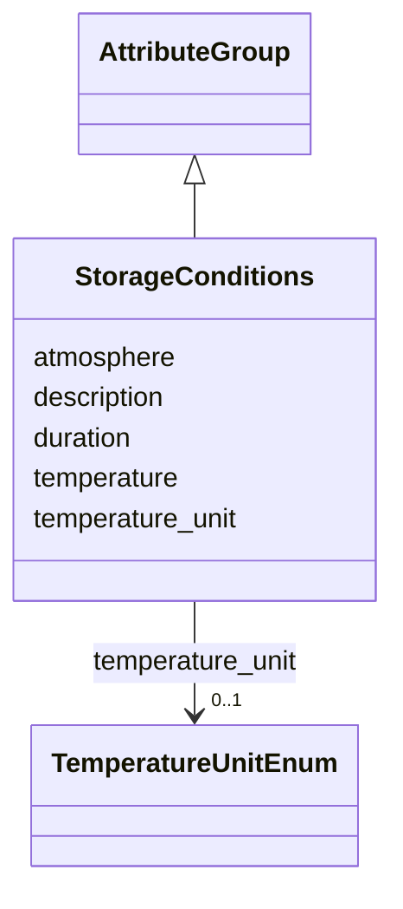

# Class: StorageConditions 


_Storage conditions for samples_


URI: [lambdaber:StorageConditions](https://w3id.org/lambda-ber-schema/StorageConditions)





## Inheritance
* [AttributeGroup](AttributeGroup.md)
    * **StorageConditions**


## Slots

| Name | Cardinality and Range | Description | Inheritance |
| ---  | --- | --- | --- |
| [temperature](temperature.md) | 0..1 <br/> [Float](Float.md) | Storage temperature in Celsius | direct |
| [temperature_unit](temperature_unit.md) | 0..1 <br/> [TemperatureUnitEnum](TemperatureUnitEnum.md) | Temperature unit | direct |
| [duration](duration.md) | 0..1 <br/> [String](String.md) | Storage duration | direct |
| [atmosphere](atmosphere.md) | 0..1 <br/> [String](String.md) | Storage atmosphere conditions | direct |
| [description](description.md) | 0..1 <br/> [String](String.md) |  | [AttributeGroup](AttributeGroup.md) |


## Usages

| used by | used in | type | used |
| ---  | --- | --- | --- |
| [Sample](Sample.md) | [storage_conditions](storage_conditions.md) | range | [StorageConditions](StorageConditions.md) |


## Identifier and Mapping Information


### Schema Source


* from schema: https://w3id.org/lambda-ber-schema/


## Mappings

| Mapping Type | Mapped Value |
| ---  | ---  |
| self | lambdaber:StorageConditions |
| native | lambdaber:StorageConditions |


## LinkML Source

<!-- TODO: investigate https://stackoverflow.com/questions/37606292/how-to-create-tabbed-code-blocks-in-mkdocs-or-sphinx -->

### Direct

<details>
```yaml
name: StorageConditions
description: Storage conditions for samples
from_schema: https://w3id.org/lambda-ber-schema/
is_a: AttributeGroup
attributes:
  temperature:
    name: temperature
    description: Storage temperature in Celsius
    from_schema: https://w3id.org/lambda-ber-schema/
    rank: 1000
    domain_of:
    - StorageConditions
    - ExperimentalConditions
    - MeasurementConditions
    range: float
  temperature_unit:
    name: temperature_unit
    description: Temperature unit
    from_schema: https://w3id.org/lambda-ber-schema/
    rank: 1000
    domain_of:
    - StorageConditions
    range: TemperatureUnitEnum
  duration:
    name: duration
    description: Storage duration
    from_schema: https://w3id.org/lambda-ber-schema/
    rank: 1000
    domain_of:
    - StorageConditions
    range: string
  atmosphere:
    name: atmosphere
    description: Storage atmosphere conditions
    from_schema: https://w3id.org/lambda-ber-schema/
    rank: 1000
    domain_of:
    - StorageConditions
    - ExperimentalConditions
    range: string

```
</details>

### Induced

<details>
```yaml
name: StorageConditions
description: Storage conditions for samples
from_schema: https://w3id.org/lambda-ber-schema/
is_a: AttributeGroup
attributes:
  temperature:
    name: temperature
    description: Storage temperature in Celsius
    from_schema: https://w3id.org/lambda-ber-schema/
    rank: 1000
    alias: temperature
    owner: StorageConditions
    domain_of:
    - StorageConditions
    - ExperimentalConditions
    - MeasurementConditions
    range: float
  temperature_unit:
    name: temperature_unit
    description: Temperature unit
    from_schema: https://w3id.org/lambda-ber-schema/
    rank: 1000
    alias: temperature_unit
    owner: StorageConditions
    domain_of:
    - StorageConditions
    range: TemperatureUnitEnum
  duration:
    name: duration
    description: Storage duration
    from_schema: https://w3id.org/lambda-ber-schema/
    rank: 1000
    alias: duration
    owner: StorageConditions
    domain_of:
    - StorageConditions
    range: string
  atmosphere:
    name: atmosphere
    description: Storage atmosphere conditions
    from_schema: https://w3id.org/lambda-ber-schema/
    rank: 1000
    alias: atmosphere
    owner: StorageConditions
    domain_of:
    - StorageConditions
    - ExperimentalConditions
    range: string
  description:
    name: description
    from_schema: https://w3id.org/lambda-ber-schema/
    alias: description
    owner: StorageConditions
    domain_of:
    - NamedThing
    - AttributeGroup
    range: string

```
</details>