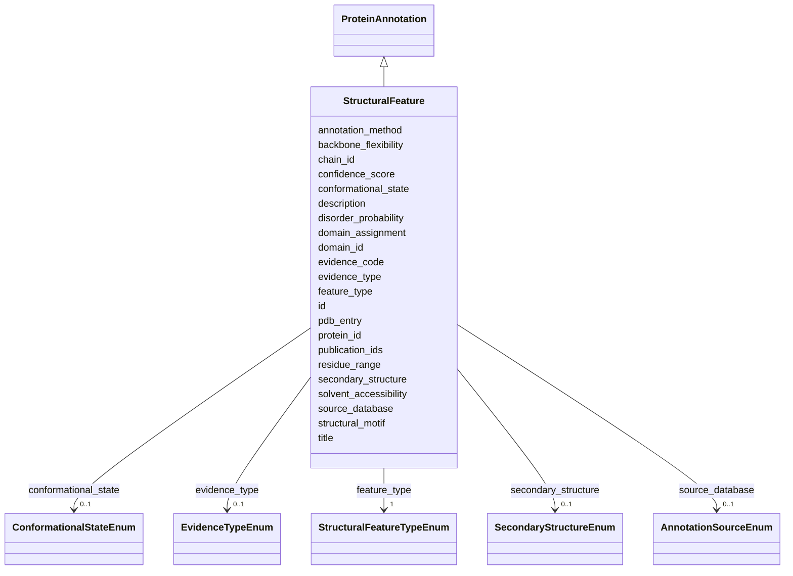

# Class: StructuralFeature 


_Structural features and properties of protein regions_


URI: [lambdaber:StructuralFeature](https://w3id.org/lambda-ber-schema/StructuralFeature)





## Inheritance
* [NamedThing](NamedThing.md)
    * [ProteinAnnotation](ProteinAnnotation.md)
        * **StructuralFeature**


## Slots

| Name | Cardinality and Range | Description | Inheritance |
| ---  | --- | --- | --- |
| [feature_type](feature_type.md) | 1 <br/> [StructuralFeatureTypeEnum](StructuralFeatureTypeEnum.md) | Type of structural feature | direct |
| [secondary_structure](secondary_structure.md) | 0..1 <br/> [SecondaryStructureEnum](SecondaryStructureEnum.md) | Secondary structure assignment | direct |
| [solvent_accessibility](solvent_accessibility.md) | 0..1 <br/> [Float](Float.md) | Relative solvent accessible surface area | direct |
| [backbone_flexibility](backbone_flexibility.md) | 0..1 <br/> [Float](Float.md) | B-factor or flexibility measure | direct |
| [disorder_probability](disorder_probability.md) | 0..1 <br/> [Float](Float.md) | Probability of disorder (0-1) | direct |
| [conformational_state](conformational_state.md) | 0..1 <br/> [ConformationalStateEnum](ConformationalStateEnum.md) | Conformational state descriptor | direct |
| [structural_motif](structural_motif.md) | 0..1 <br/> [String](String.md) | Known structural motif | direct |
| [domain_assignment](domain_assignment.md) | 0..1 <br/> [String](String.md) | Domain database assignment (CATH, SCOP, Pfam) | direct |
| [domain_id](domain_id.md) | 0..1 <br/> [String](String.md) | Domain identifier from domain database | direct |
| [protein_id](protein_id.md) | 1 <br/> [String](String.md) | UniProt accession number | [ProteinAnnotation](ProteinAnnotation.md) |
| [pdb_entry](pdb_entry.md) | 0..1 <br/> [String](String.md) | PDB identifier | [ProteinAnnotation](ProteinAnnotation.md) |
| [chain_id](chain_id.md) | 0..1 <br/> [String](String.md) | Chain identifier in the PDB structure | [ProteinAnnotation](ProteinAnnotation.md) |
| [residue_range](residue_range.md) | 0..1 <br/> [String](String.md) | Range of residues (e | [ProteinAnnotation](ProteinAnnotation.md) |
| [confidence_score](confidence_score.md) | 0..1 <br/> [Float](Float.md) | Confidence score for the annotation (0-1) | [ProteinAnnotation](ProteinAnnotation.md) |
| [evidence_type](evidence_type.md) | 0..1 <br/> [EvidenceTypeEnum](EvidenceTypeEnum.md) | Type of evidence supporting this annotation | [ProteinAnnotation](ProteinAnnotation.md) |
| [evidence_code](evidence_code.md) | 0..1 <br/> [Uriorcurie](Uriorcurie.md) | Evidence and Conclusion Ontology (ECO) code | [ProteinAnnotation](ProteinAnnotation.md) |
| [source_database](source_database.md) | 0..1 <br/> [AnnotationSourceEnum](AnnotationSourceEnum.md) | Source database or resource that provided this annotation | [ProteinAnnotation](ProteinAnnotation.md) |
| [annotation_method](annotation_method.md) | 0..1 <br/> [String](String.md) | Computational or experimental method used | [ProteinAnnotation](ProteinAnnotation.md) |
| [publication_ids](publication_ids.md) | * <br/> [String](String.md) | PubMed IDs supporting this annotation | [ProteinAnnotation](ProteinAnnotation.md) |
| [id](id.md) | 1 <br/> [Uriorcurie](Uriorcurie.md) | Globally unique identifier as an IRI or CURIE for machine processing and exte... | [NamedThing](NamedThing.md) |
| [title](title.md) | 0..1 <br/> [String](String.md) |  | [NamedThing](NamedThing.md) |
| [description](description.md) | 0..1 <br/> [String](String.md) |  | [NamedThing](NamedThing.md) |


## Usages

| used by | used in | type | used |
| ---  | --- | --- | --- |
| [Sample](Sample.md) | [structural_features](structural_features.md) | range | [StructuralFeature](StructuralFeature.md) |
| [AggregatedProteinView](AggregatedProteinView.md) | [structural_features](structural_features.md) | range | [StructuralFeature](StructuralFeature.md) |


## Identifier and Mapping Information


### Schema Source


* from schema: https://w3id.org/lambda-ber-schema/


## Mappings

| Mapping Type | Mapped Value |
| ---  | ---  |
| self | lambdaber:StructuralFeature |
| native | lambdaber:StructuralFeature |


## LinkML Source

<!-- TODO: investigate https://stackoverflow.com/questions/37606292/how-to-create-tabbed-code-blocks-in-mkdocs-or-sphinx -->

### Direct

<details>
```yaml
name: StructuralFeature
description: Structural features and properties of protein regions
from_schema: https://w3id.org/lambda-ber-schema/
is_a: ProteinAnnotation
attributes:
  feature_type:
    name: feature_type
    description: Type of structural feature
    from_schema: https://w3id.org/lambda-ber-schema/functional_annotation
    rank: 1000
    domain_of:
    - StructuralFeature
    range: StructuralFeatureTypeEnum
    required: true
  secondary_structure:
    name: secondary_structure
    description: Secondary structure assignment
    from_schema: https://w3id.org/lambda-ber-schema/functional_annotation
    rank: 1000
    domain_of:
    - StructuralFeature
    range: SecondaryStructureEnum
  solvent_accessibility:
    name: solvent_accessibility
    description: Relative solvent accessible surface area
    from_schema: https://w3id.org/lambda-ber-schema/functional_annotation
    rank: 1000
    domain_of:
    - StructuralFeature
    range: float
    minimum_value: 0
    maximum_value: 1
  backbone_flexibility:
    name: backbone_flexibility
    description: B-factor or flexibility measure
    from_schema: https://w3id.org/lambda-ber-schema/functional_annotation
    rank: 1000
    domain_of:
    - StructuralFeature
    range: float
  disorder_probability:
    name: disorder_probability
    description: Probability of disorder (0-1)
    from_schema: https://w3id.org/lambda-ber-schema/functional_annotation
    rank: 1000
    domain_of:
    - StructuralFeature
    range: float
    minimum_value: 0
    maximum_value: 1
  conformational_state:
    name: conformational_state
    description: Conformational state descriptor
    from_schema: https://w3id.org/lambda-ber-schema/functional_annotation
    rank: 1000
    domain_of:
    - StructuralFeature
    range: ConformationalStateEnum
  structural_motif:
    name: structural_motif
    description: Known structural motif
    from_schema: https://w3id.org/lambda-ber-schema/functional_annotation
    rank: 1000
    domain_of:
    - StructuralFeature
  domain_assignment:
    name: domain_assignment
    description: Domain database assignment (CATH, SCOP, Pfam)
    from_schema: https://w3id.org/lambda-ber-schema/functional_annotation
    rank: 1000
    domain_of:
    - StructuralFeature
  domain_id:
    name: domain_id
    description: Domain identifier from domain database
    from_schema: https://w3id.org/lambda-ber-schema/functional_annotation
    rank: 1000
    domain_of:
    - StructuralFeature

```
</details>

### Induced

<details>
```yaml
name: StructuralFeature
description: Structural features and properties of protein regions
from_schema: https://w3id.org/lambda-ber-schema/
is_a: ProteinAnnotation
attributes:
  feature_type:
    name: feature_type
    description: Type of structural feature
    from_schema: https://w3id.org/lambda-ber-schema/functional_annotation
    rank: 1000
    alias: feature_type
    owner: StructuralFeature
    domain_of:
    - StructuralFeature
    range: StructuralFeatureTypeEnum
    required: true
  secondary_structure:
    name: secondary_structure
    description: Secondary structure assignment
    from_schema: https://w3id.org/lambda-ber-schema/functional_annotation
    rank: 1000
    alias: secondary_structure
    owner: StructuralFeature
    domain_of:
    - StructuralFeature
    range: SecondaryStructureEnum
  solvent_accessibility:
    name: solvent_accessibility
    description: Relative solvent accessible surface area
    from_schema: https://w3id.org/lambda-ber-schema/functional_annotation
    rank: 1000
    alias: solvent_accessibility
    owner: StructuralFeature
    domain_of:
    - StructuralFeature
    range: float
    minimum_value: 0
    maximum_value: 1
  backbone_flexibility:
    name: backbone_flexibility
    description: B-factor or flexibility measure
    from_schema: https://w3id.org/lambda-ber-schema/functional_annotation
    rank: 1000
    alias: backbone_flexibility
    owner: StructuralFeature
    domain_of:
    - StructuralFeature
    range: float
  disorder_probability:
    name: disorder_probability
    description: Probability of disorder (0-1)
    from_schema: https://w3id.org/lambda-ber-schema/functional_annotation
    rank: 1000
    alias: disorder_probability
    owner: StructuralFeature
    domain_of:
    - StructuralFeature
    range: float
    minimum_value: 0
    maximum_value: 1
  conformational_state:
    name: conformational_state
    description: Conformational state descriptor
    from_schema: https://w3id.org/lambda-ber-schema/functional_annotation
    rank: 1000
    alias: conformational_state
    owner: StructuralFeature
    domain_of:
    - StructuralFeature
    range: ConformationalStateEnum
  structural_motif:
    name: structural_motif
    description: Known structural motif
    from_schema: https://w3id.org/lambda-ber-schema/functional_annotation
    rank: 1000
    alias: structural_motif
    owner: StructuralFeature
    domain_of:
    - StructuralFeature
    range: string
  domain_assignment:
    name: domain_assignment
    description: Domain database assignment (CATH, SCOP, Pfam)
    from_schema: https://w3id.org/lambda-ber-schema/functional_annotation
    rank: 1000
    alias: domain_assignment
    owner: StructuralFeature
    domain_of:
    - StructuralFeature
    range: string
  domain_id:
    name: domain_id
    description: Domain identifier from domain database
    from_schema: https://w3id.org/lambda-ber-schema/functional_annotation
    rank: 1000
    alias: domain_id
    owner: StructuralFeature
    domain_of:
    - StructuralFeature
    range: string
  protein_id:
    name: protein_id
    description: UniProt accession number
    from_schema: https://w3id.org/lambda-ber-schema/functional_annotation
    rank: 1000
    alias: protein_id
    owner: StructuralFeature
    domain_of:
    - ProteinAnnotation
    - ConformationalEnsemble
    range: string
    required: true
    pattern: ^[A-Z][0-9][A-Z0-9]{3}[0-9]|[A-Z][0-9][A-Z0-9]{3}[0-9]-[0-9]+$
  pdb_entry:
    name: pdb_entry
    description: PDB identifier
    from_schema: https://w3id.org/lambda-ber-schema/functional_annotation
    rank: 1000
    alias: pdb_entry
    owner: StructuralFeature
    domain_of:
    - ProteinAnnotation
    range: string
    pattern: ^[0-9][A-Za-z0-9]{3}$
  chain_id:
    name: chain_id
    description: Chain identifier in the PDB structure
    from_schema: https://w3id.org/lambda-ber-schema/functional_annotation
    rank: 1000
    alias: chain_id
    owner: StructuralFeature
    domain_of:
    - ProteinAnnotation
    range: string
    pattern: ^[A-Za-z0-9]+$
  residue_range:
    name: residue_range
    description: Range of residues (e.g., '1-100', '25,27,30-35')
    from_schema: https://w3id.org/lambda-ber-schema/functional_annotation
    rank: 1000
    alias: residue_range
    owner: StructuralFeature
    domain_of:
    - ProteinAnnotation
    range: string
  confidence_score:
    name: confidence_score
    description: Confidence score for the annotation (0-1)
    from_schema: https://w3id.org/lambda-ber-schema/functional_annotation
    rank: 1000
    alias: confidence_score
    owner: StructuralFeature
    domain_of:
    - ProteinAnnotation
    range: float
    minimum_value: 0
    maximum_value: 1
  evidence_type:
    name: evidence_type
    description: Type of evidence supporting this annotation
    from_schema: https://w3id.org/lambda-ber-schema/functional_annotation
    rank: 1000
    alias: evidence_type
    owner: StructuralFeature
    domain_of:
    - ProteinAnnotation
    range: EvidenceTypeEnum
  evidence_code:
    name: evidence_code
    description: Evidence and Conclusion Ontology (ECO) code
    from_schema: https://w3id.org/lambda-ber-schema/functional_annotation
    rank: 1000
    alias: evidence_code
    owner: StructuralFeature
    domain_of:
    - ProteinAnnotation
    range: uriorcurie
  source_database:
    name: source_database
    description: Source database or resource that provided this annotation
    from_schema: https://w3id.org/lambda-ber-schema/functional_annotation
    rank: 1000
    alias: source_database
    owner: StructuralFeature
    domain_of:
    - ProteinAnnotation
    range: AnnotationSourceEnum
  annotation_method:
    name: annotation_method
    description: Computational or experimental method used
    from_schema: https://w3id.org/lambda-ber-schema/functional_annotation
    rank: 1000
    alias: annotation_method
    owner: StructuralFeature
    domain_of:
    - ProteinAnnotation
    range: string
  publication_ids:
    name: publication_ids
    description: PubMed IDs supporting this annotation
    from_schema: https://w3id.org/lambda-ber-schema/functional_annotation
    rank: 1000
    alias: publication_ids
    owner: StructuralFeature
    domain_of:
    - ProteinAnnotation
    range: string
    multivalued: true
    pattern: ^PMID:[0-9]+$
  id:
    name: id
    description: Globally unique identifier as an IRI or CURIE for machine processing
      and external references. Used for linking data across systems and semantic web
      integration.
    from_schema: https://w3id.org/lambda-ber-schema/
    rank: 1000
    identifier: true
    alias: id
    owner: StructuralFeature
    domain_of:
    - NamedThing
    range: uriorcurie
    required: true
  title:
    name: title
    from_schema: https://w3id.org/lambda-ber-schema/
    rank: 1000
    slot_uri: dcterms:title
    alias: title
    owner: StructuralFeature
    domain_of:
    - NamedThing
    range: string
  description:
    name: description
    from_schema: https://w3id.org/lambda-ber-schema/
    rank: 1000
    alias: description
    owner: StructuralFeature
    domain_of:
    - NamedThing
    - AttributeGroup
    range: string

```
</details>