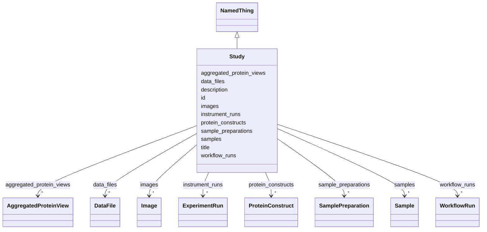

# Class: Study 


_A focused research investigation that groups related samples, experiments, and data collection around a specific biological question or hypothesis_


URI: [lambdaber:Study](https://w3id.org/lambda-ber-schema/Study)





## Inheritance
* [NamedThing](NamedThing.md)
    * **Study**


## Slots

| Name | Cardinality and Range | Description | Inheritance |
| ---  | --- | --- | --- |
| [protein_constructs](protein_constructs.md) | * <br/> [ProteinConstruct](ProteinConstruct.md) | Protein constructs and cloning information | direct |
| [samples](samples.md) | * <br/> [Sample](Sample.md) | Experimental samples used in this study, including biological samples  | direct |
| [sample_preparations](sample_preparations.md) | * <br/> [SamplePreparation](SamplePreparation.md) | Sample preparation procedures performed in this study | direct |
| [instrument_runs](instrument_runs.md) | * <br/> [ExperimentRun](ExperimentRun.md) | Experimental data collection runs performed in this study | direct |
| [workflow_runs](workflow_runs.md) | * <br/> [WorkflowRun](WorkflowRun.md) | Computational workflow executions for data processing in this study | direct |
| [data_files](data_files.md) | * <br/> [DataFile](DataFile.md) | Data files generated or used in this study | direct |
| [images](images.md) | * <br/> [Image](Image.md) | Images acquired or generated in this study | direct |
| [aggregated_protein_views](aggregated_protein_views.md) | * <br/> [AggregatedProteinView](AggregatedProteinView.md) | Aggregated functional and structural annotations for proteins in this study | direct |
| [id](id.md) | 1 <br/> [Uriorcurie](Uriorcurie.md) | Globally unique identifier as an IRI or CURIE for machine processing and exte... | [NamedThing](NamedThing.md) |
| [title](title.md) | 0..1 <br/> [String](String.md) | A human-readable name or title for this entity | [NamedThing](NamedThing.md) |
| [description](description.md) | 0..1 <br/> [String](String.md) | A detailed textual description of this entity | [NamedThing](NamedThing.md) |


## Usages

| used by | used in | type | used |
| ---  | --- | --- | --- |
| [Dataset](Dataset.md) | [studies](studies.md) | range | [Study](Study.md) |


## Identifier and Mapping Information


### Schema Source


* from schema: https://w3id.org/lambda-ber-schema/


## Mappings

| Mapping Type | Mapped Value |
| ---  | ---  |
| self | lambdaber:Study |
| native | lambdaber:Study |


## LinkML Source

<!-- TODO: investigate https://stackoverflow.com/questions/37606292/how-to-create-tabbed-code-blocks-in-mkdocs-or-sphinx -->

### Direct

<details>
```yaml
name: Study
description: A focused research investigation that groups related samples, experiments,
  and data collection around a specific biological question or hypothesis
from_schema: https://w3id.org/lambda-ber-schema/
is_a: NamedThing
attributes:
  protein_constructs:
    name: protein_constructs
    description: Protein constructs and cloning information
    from_schema: https://w3id.org/lambda-ber-schema/
    rank: 1000
    domain_of:
    - Study
    range: ProteinConstruct
    multivalued: true
    inlined: true
    inlined_as_list: true
  samples:
    name: samples
    description: 'Experimental samples used in this study, including biological samples '
    from_schema: https://w3id.org/lambda-ber-schema/
    rank: 1000
    domain_of:
    - Study
    range: Sample
    multivalued: true
    inlined: true
    inlined_as_list: true
  sample_preparations:
    name: sample_preparations
    description: Sample preparation procedures performed in this study
    from_schema: https://w3id.org/lambda-ber-schema/
    rank: 1000
    domain_of:
    - Study
    range: SamplePreparation
    multivalued: true
    inlined: true
    inlined_as_list: true
  instrument_runs:
    name: instrument_runs
    description: Experimental data collection runs performed in this study
    from_schema: https://w3id.org/lambda-ber-schema/
    rank: 1000
    domain_of:
    - Study
    range: ExperimentRun
    multivalued: true
    inlined: true
    inlined_as_list: true
  workflow_runs:
    name: workflow_runs
    description: Computational workflow executions for data processing in this study
    from_schema: https://w3id.org/lambda-ber-schema/
    rank: 1000
    domain_of:
    - Study
    range: WorkflowRun
    multivalued: true
    inlined: true
    inlined_as_list: true
  data_files:
    name: data_files
    description: Data files generated or used in this study
    from_schema: https://w3id.org/lambda-ber-schema/
    rank: 1000
    domain_of:
    - Study
    range: DataFile
    multivalued: true
    inlined: true
    inlined_as_list: true
  images:
    name: images
    description: Images acquired or generated in this study
    from_schema: https://w3id.org/lambda-ber-schema/
    rank: 1000
    domain_of:
    - Study
    range: Image
    multivalued: true
    inlined: true
    inlined_as_list: true
  aggregated_protein_views:
    name: aggregated_protein_views
    description: Aggregated functional and structural annotations for proteins in
      this study
    from_schema: https://w3id.org/lambda-ber-schema/
    rank: 1000
    domain_of:
    - Study
    range: AggregatedProteinView
    multivalued: true
    inlined: true
    inlined_as_list: true

```
</details>

### Induced

<details>
```yaml
name: Study
description: A focused research investigation that groups related samples, experiments,
  and data collection around a specific biological question or hypothesis
from_schema: https://w3id.org/lambda-ber-schema/
is_a: NamedThing
attributes:
  protein_constructs:
    name: protein_constructs
    description: Protein constructs and cloning information
    from_schema: https://w3id.org/lambda-ber-schema/
    rank: 1000
    alias: protein_constructs
    owner: Study
    domain_of:
    - Study
    range: ProteinConstruct
    multivalued: true
    inlined: true
    inlined_as_list: true
  samples:
    name: samples
    description: 'Experimental samples used in this study, including biological samples '
    from_schema: https://w3id.org/lambda-ber-schema/
    rank: 1000
    alias: samples
    owner: Study
    domain_of:
    - Study
    range: Sample
    multivalued: true
    inlined: true
    inlined_as_list: true
  sample_preparations:
    name: sample_preparations
    description: Sample preparation procedures performed in this study
    from_schema: https://w3id.org/lambda-ber-schema/
    rank: 1000
    alias: sample_preparations
    owner: Study
    domain_of:
    - Study
    range: SamplePreparation
    multivalued: true
    inlined: true
    inlined_as_list: true
  instrument_runs:
    name: instrument_runs
    description: Experimental data collection runs performed in this study
    from_schema: https://w3id.org/lambda-ber-schema/
    rank: 1000
    alias: instrument_runs
    owner: Study
    domain_of:
    - Study
    range: ExperimentRun
    multivalued: true
    inlined: true
    inlined_as_list: true
  workflow_runs:
    name: workflow_runs
    description: Computational workflow executions for data processing in this study
    from_schema: https://w3id.org/lambda-ber-schema/
    rank: 1000
    alias: workflow_runs
    owner: Study
    domain_of:
    - Study
    range: WorkflowRun
    multivalued: true
    inlined: true
    inlined_as_list: true
  data_files:
    name: data_files
    description: Data files generated or used in this study
    from_schema: https://w3id.org/lambda-ber-schema/
    rank: 1000
    alias: data_files
    owner: Study
    domain_of:
    - Study
    range: DataFile
    multivalued: true
    inlined: true
    inlined_as_list: true
  images:
    name: images
    description: Images acquired or generated in this study
    from_schema: https://w3id.org/lambda-ber-schema/
    rank: 1000
    alias: images
    owner: Study
    domain_of:
    - Study
    range: Image
    multivalued: true
    inlined: true
    inlined_as_list: true
  aggregated_protein_views:
    name: aggregated_protein_views
    description: Aggregated functional and structural annotations for proteins in
      this study
    from_schema: https://w3id.org/lambda-ber-schema/
    rank: 1000
    alias: aggregated_protein_views
    owner: Study
    domain_of:
    - Study
    range: AggregatedProteinView
    multivalued: true
    inlined: true
    inlined_as_list: true
  id:
    name: id
    description: Globally unique identifier as an IRI or CURIE for machine processing
      and external references. Used for linking data across systems and semantic web
      integration.
    from_schema: https://w3id.org/lambda-ber-schema/
    rank: 1000
    identifier: true
    alias: id
    owner: Study
    domain_of:
    - NamedThing
    range: uriorcurie
    required: true
  title:
    name: title
    description: A human-readable name or title for this entity
    from_schema: https://w3id.org/lambda-ber-schema/
    rank: 1000
    slot_uri: dcterms:title
    alias: title
    owner: Study
    domain_of:
    - NamedThing
    range: string
  description:
    name: description
    description: A detailed textual description of this entity
    from_schema: https://w3id.org/lambda-ber-schema/
    rank: 1000
    alias: description
    owner: Study
    domain_of:
    - NamedThing
    - AttributeGroup
    range: string

```
</details>