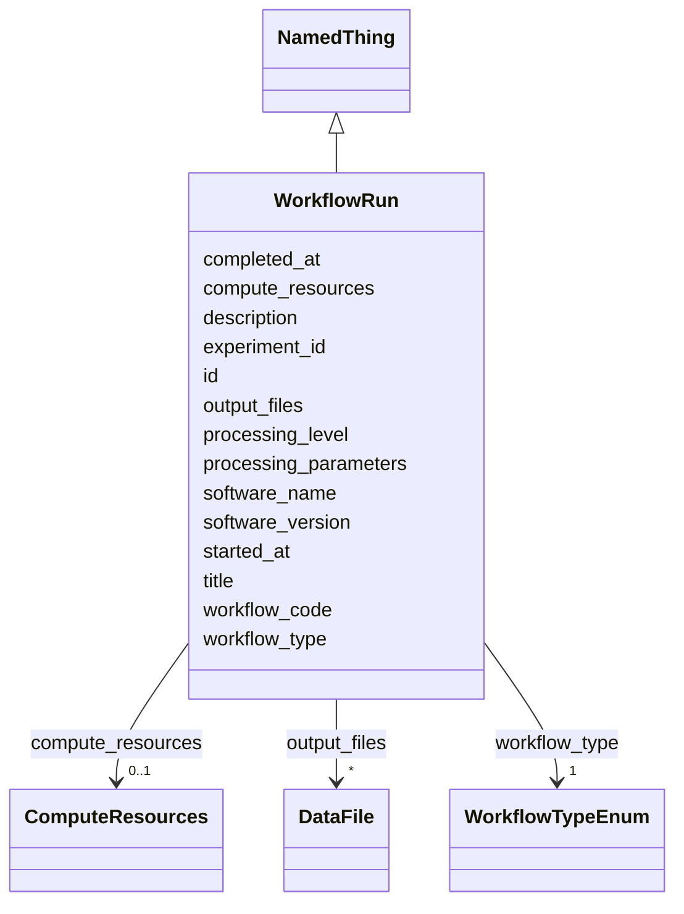

# Class: WorkflowRun 


_A computational processing workflow execution_


URI: [lambdaber:WorkflowRun](https://w3id.org/lambda-ber-schema/WorkflowRun)





## Inheritance
* [NamedThing](NamedThing.md)
    * **WorkflowRun**


## Slots

| Name | Cardinality and Range | Description | Inheritance |
| ---  | --- | --- | --- |
| [workflow_code](workflow_code.md) | 1 <br/> [String](String.md) | Human-friendly identifier for the computational workflow run (e | direct |
| [workflow_type](workflow_type.md) | 1 <br/> [WorkflowTypeEnum](WorkflowTypeEnum.md) | Type of processing workflow | direct |
| [experiment_id](experiment_id.md) | 1 <br/> [String](String.md) | Reference to the source experiment | direct |
| [processing_level](processing_level.md) | 0..1 <br/> [Integer](Integer.md) | Processing level (0=raw, 1=corrected, 2=derived, 3=model) | direct |
| [software_name](software_name.md) | 1 <br/> [String](String.md) | Software used for processing | direct |
| [software_version](software_version.md) | 0..1 <br/> [String](String.md) | Software version | direct |
| [processing_parameters](processing_parameters.md) | 0..1 <br/> [String](String.md) | Parameters used in processing | direct |
| [compute_resources](compute_resources.md) | 0..1 <br/> [ComputeResources](ComputeResources.md) | Computational resources used | direct |
| [started_at](started_at.md) | 0..1 <br/> [String](String.md) | Workflow start time | direct |
| [completed_at](completed_at.md) | 0..1 <br/> [String](String.md) | Workflow completion time | direct |
| [output_files](output_files.md) | * <br/> [DataFile](DataFile.md) | Output files generated | direct |
| [id](id.md) | 1 <br/> [Uriorcurie](Uriorcurie.md) | Globally unique identifier as an IRI or CURIE for machine processing and exte... | [NamedThing](NamedThing.md) |
| [title](title.md) | 0..1 <br/> [String](String.md) |  | [NamedThing](NamedThing.md) |
| [description](description.md) | 0..1 <br/> [String](String.md) |  | [NamedThing](NamedThing.md) |


## Usages

| used by | used in | type | used |
| ---  | --- | --- | --- |
| [Study](Study.md) | [workflow_runs](workflow_runs.md) | range | [WorkflowRun](WorkflowRun.md) |


## Identifier and Mapping Information


### Schema Source


* from schema: https://w3id.org/lambda-ber-schema/


## Mappings

| Mapping Type | Mapped Value |
| ---  | ---  |
| self | lambdaber:WorkflowRun |
| native | lambdaber:WorkflowRun |


## LinkML Source

<!-- TODO: investigate https://stackoverflow.com/questions/37606292/how-to-create-tabbed-code-blocks-in-mkdocs-or-sphinx -->

### Direct

<details>
```yaml
name: WorkflowRun
description: A computational processing workflow execution
from_schema: https://w3id.org/lambda-ber-schema/
is_a: NamedThing
attributes:
  workflow_code:
    name: workflow_code
    description: Human-friendly identifier for the computational workflow run (e.g.,
      'MOTION-CORR-RUN-001', 'RELION-REFINE-240815'). Used for tracking processing
      pipelines and computational provenance.
    from_schema: https://w3id.org/lambda-ber-schema/
    rank: 1000
    domain_of:
    - WorkflowRun
    required: true
  workflow_type:
    name: workflow_type
    description: Type of processing workflow
    from_schema: https://w3id.org/lambda-ber-schema/
    rank: 1000
    domain_of:
    - WorkflowRun
    range: WorkflowTypeEnum
    required: true
  experiment_id:
    name: experiment_id
    description: Reference to the source experiment
    from_schema: https://w3id.org/lambda-ber-schema/
    rank: 1000
    domain_of:
    - WorkflowRun
    range: string
    required: true
  processing_level:
    name: processing_level
    description: Processing level (0=raw, 1=corrected, 2=derived, 3=model)
    from_schema: https://w3id.org/lambda-ber-schema/
    rank: 1000
    domain_of:
    - WorkflowRun
    range: integer
    minimum_value: 0
    maximum_value: 4
  software_name:
    name: software_name
    description: Software used for processing
    from_schema: https://w3id.org/lambda-ber-schema/
    rank: 1000
    domain_of:
    - WorkflowRun
    required: true
  software_version:
    name: software_version
    description: Software version
    from_schema: https://w3id.org/lambda-ber-schema/
    rank: 1000
    domain_of:
    - WorkflowRun
  processing_parameters:
    name: processing_parameters
    description: Parameters used in processing
    from_schema: https://w3id.org/lambda-ber-schema/
    rank: 1000
    domain_of:
    - WorkflowRun
  compute_resources:
    name: compute_resources
    description: Computational resources used
    from_schema: https://w3id.org/lambda-ber-schema/
    rank: 1000
    domain_of:
    - WorkflowRun
    range: ComputeResources
  started_at:
    name: started_at
    description: Workflow start time
    from_schema: https://w3id.org/lambda-ber-schema/
    rank: 1000
    domain_of:
    - WorkflowRun
    range: string
  completed_at:
    name: completed_at
    description: Workflow completion time
    from_schema: https://w3id.org/lambda-ber-schema/
    rank: 1000
    domain_of:
    - WorkflowRun
    range: string
  output_files:
    name: output_files
    description: Output files generated
    from_schema: https://w3id.org/lambda-ber-schema/
    rank: 1000
    domain_of:
    - WorkflowRun
    range: DataFile
    multivalued: true

```
</details>

### Induced

<details>
```yaml
name: WorkflowRun
description: A computational processing workflow execution
from_schema: https://w3id.org/lambda-ber-schema/
is_a: NamedThing
attributes:
  workflow_code:
    name: workflow_code
    description: Human-friendly identifier for the computational workflow run (e.g.,
      'MOTION-CORR-RUN-001', 'RELION-REFINE-240815'). Used for tracking processing
      pipelines and computational provenance.
    from_schema: https://w3id.org/lambda-ber-schema/
    rank: 1000
    alias: workflow_code
    owner: WorkflowRun
    domain_of:
    - WorkflowRun
    range: string
    required: true
  workflow_type:
    name: workflow_type
    description: Type of processing workflow
    from_schema: https://w3id.org/lambda-ber-schema/
    rank: 1000
    alias: workflow_type
    owner: WorkflowRun
    domain_of:
    - WorkflowRun
    range: WorkflowTypeEnum
    required: true
  experiment_id:
    name: experiment_id
    description: Reference to the source experiment
    from_schema: https://w3id.org/lambda-ber-schema/
    rank: 1000
    alias: experiment_id
    owner: WorkflowRun
    domain_of:
    - WorkflowRun
    range: string
    required: true
  processing_level:
    name: processing_level
    description: Processing level (0=raw, 1=corrected, 2=derived, 3=model)
    from_schema: https://w3id.org/lambda-ber-schema/
    rank: 1000
    alias: processing_level
    owner: WorkflowRun
    domain_of:
    - WorkflowRun
    range: integer
    minimum_value: 0
    maximum_value: 4
  software_name:
    name: software_name
    description: Software used for processing
    from_schema: https://w3id.org/lambda-ber-schema/
    rank: 1000
    alias: software_name
    owner: WorkflowRun
    domain_of:
    - WorkflowRun
    range: string
    required: true
  software_version:
    name: software_version
    description: Software version
    from_schema: https://w3id.org/lambda-ber-schema/
    rank: 1000
    alias: software_version
    owner: WorkflowRun
    domain_of:
    - WorkflowRun
    range: string
  processing_parameters:
    name: processing_parameters
    description: Parameters used in processing
    from_schema: https://w3id.org/lambda-ber-schema/
    rank: 1000
    alias: processing_parameters
    owner: WorkflowRun
    domain_of:
    - WorkflowRun
    range: string
  compute_resources:
    name: compute_resources
    description: Computational resources used
    from_schema: https://w3id.org/lambda-ber-schema/
    rank: 1000
    alias: compute_resources
    owner: WorkflowRun
    domain_of:
    - WorkflowRun
    range: ComputeResources
  started_at:
    name: started_at
    description: Workflow start time
    from_schema: https://w3id.org/lambda-ber-schema/
    rank: 1000
    alias: started_at
    owner: WorkflowRun
    domain_of:
    - WorkflowRun
    range: string
  completed_at:
    name: completed_at
    description: Workflow completion time
    from_schema: https://w3id.org/lambda-ber-schema/
    rank: 1000
    alias: completed_at
    owner: WorkflowRun
    domain_of:
    - WorkflowRun
    range: string
  output_files:
    name: output_files
    description: Output files generated
    from_schema: https://w3id.org/lambda-ber-schema/
    rank: 1000
    alias: output_files
    owner: WorkflowRun
    domain_of:
    - WorkflowRun
    range: DataFile
    multivalued: true
  id:
    name: id
    description: Globally unique identifier as an IRI or CURIE for machine processing
      and external references. Used for linking data across systems and semantic web
      integration.
    from_schema: https://w3id.org/lambda-ber-schema/
    rank: 1000
    identifier: true
    alias: id
    owner: WorkflowRun
    domain_of:
    - NamedThing
    range: uriorcurie
    required: true
  title:
    name: title
    from_schema: https://w3id.org/lambda-ber-schema/
    rank: 1000
    slot_uri: dcterms:title
    alias: title
    owner: WorkflowRun
    domain_of:
    - NamedThing
    range: string
  description:
    name: description
    from_schema: https://w3id.org/lambda-ber-schema/
    rank: 1000
    alias: description
    owner: WorkflowRun
    domain_of:
    - NamedThing
    - AttributeGroup
    range: string

```
</details>