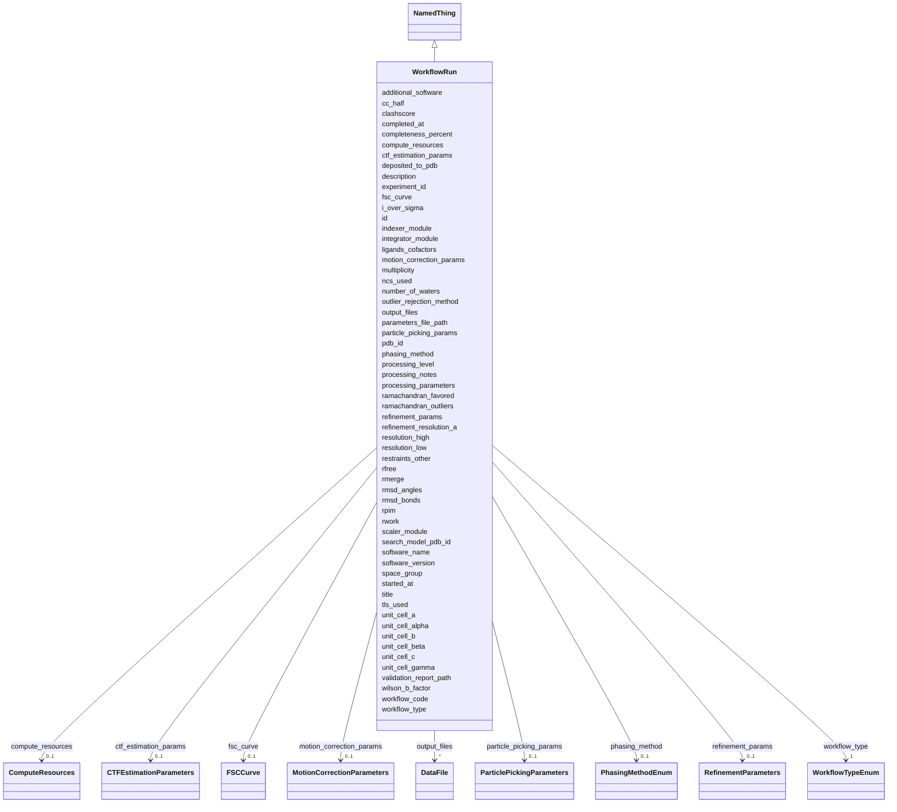

# Class: WorkflowRun 


_A computational processing workflow execution_


URI: [lambdaber:WorkflowRun](https://w3id.org/lambda-ber-schema/WorkflowRun)





## Inheritance
* [NamedThing](NamedThing.md)
    * **WorkflowRun**


## Slots

| Name | Cardinality and Range | Description | Inheritance |
| ---  | --- | --- | --- |
| [workflow_code](workflow_code.md) | 1 <br/> [String](String.md) | Human-friendly identifier for the computational workflow run (e | direct |
| [workflow_type](workflow_type.md) | 1 <br/> [WorkflowTypeEnum](WorkflowTypeEnum.md) | Type of processing workflow | direct |
| [experiment_id](experiment_id.md) | 1 <br/> [String](String.md) | Reference to the source experiment | direct |
| [processing_level](processing_level.md) | 0..1 <br/> [Integer](Integer.md) | Processing level (0=raw, 1=corrected, 2=derived, 3=model) | direct |
| [software_name](software_name.md) | 1 <br/> [String](String.md) | Software used for processing | direct |
| [software_version](software_version.md) | 0..1 <br/> [String](String.md) | Software version | direct |
| [additional_software](additional_software.md) | 0..1 <br/> [String](String.md) | Additional software used in pipeline | direct |
| [processing_parameters](processing_parameters.md) | 0..1 <br/> [String](String.md) | Parameters used in processing | direct |
| [parameters_file_path](parameters_file_path.md) | 0..1 <br/> [String](String.md) | Path to parameters file or text of key parameters | direct |
| [indexer_module](indexer_module.md) | 0..1 <br/> [String](String.md) | Indexing module used (e | direct |
| [integrator_module](integrator_module.md) | 0..1 <br/> [String](String.md) | Integration module used | direct |
| [scaler_module](scaler_module.md) | 0..1 <br/> [String](String.md) | Scaling module used (e | direct |
| [outlier_rejection_method](outlier_rejection_method.md) | 0..1 <br/> [String](String.md) | Method for rejecting outlier reflections | direct |
| [phasing_method](phasing_method.md) | 0..1 <br/> [PhasingMethodEnum](PhasingMethodEnum.md) | Phasing method used for X-ray crystallography structure determination | direct |
| [search_model_pdb_id](search_model_pdb_id.md) | 0..1 <br/> [String](String.md) | PDB ID of search model for molecular replacement | direct |
| [tls_used](tls_used.md) | 0..1 <br/> [Boolean](Boolean.md) | Whether TLS (Translation/Libration/Screw) refinement was used | direct |
| [ncs_used](ncs_used.md) | 0..1 <br/> [Boolean](Boolean.md) | Whether Non-Crystallographic Symmetry restraints were used | direct |
| [restraints_other](restraints_other.md) | 0..1 <br/> [String](String.md) | Other restraints applied during refinement | direct |
| [ligands_cofactors](ligands_cofactors.md) | 0..1 <br/> [String](String.md) | Ligands or cofactors modeled in the structure | direct |
| [number_of_waters](number_of_waters.md) | 0..1 <br/> [Integer](Integer.md) | Number of water molecules modeled | direct |
| [refinement_resolution_a](refinement_resolution_a.md) | 0..1 <br/> [Float](Float.md) | Resolution cutoff used for refinement in Angstroms | direct |
| [deposited_to_pdb](deposited_to_pdb.md) | 0..1 <br/> [Boolean](Boolean.md) | Whether structure was deposited to PDB | direct |
| [pdb_id](pdb_id.md) | 0..1 <br/> [String](String.md) | PDB accession code if deposited | direct |
| [validation_report_path](validation_report_path.md) | 0..1 <br/> [String](String.md) | Path to validation report | direct |
| [space_group](space_group.md) | 0..1 <br/> [String](String.md) | Crystallographic space group | direct |
| [unit_cell_a](unit_cell_a.md) | 0..1 <br/> [Float](Float.md) | Unit cell parameter a | direct |
| [unit_cell_b](unit_cell_b.md) | 0..1 <br/> [Float](Float.md) | Unit cell parameter b | direct |
| [unit_cell_c](unit_cell_c.md) | 0..1 <br/> [Float](Float.md) | Unit cell parameter c | direct |
| [unit_cell_alpha](unit_cell_alpha.md) | 0..1 <br/> [Float](Float.md) | Unit cell angle alpha | direct |
| [unit_cell_beta](unit_cell_beta.md) | 0..1 <br/> [Float](Float.md) | Unit cell angle beta | direct |
| [unit_cell_gamma](unit_cell_gamma.md) | 0..1 <br/> [Float](Float.md) | Unit cell angle gamma | direct |
| [resolution_high](resolution_high.md) | 0..1 <br/> [Float](Float.md) | High resolution limit | direct |
| [resolution_low](resolution_low.md) | 0..1 <br/> [Float](Float.md) | Low resolution limit | direct |
| [rmerge](rmerge.md) | 0..1 <br/> [Float](Float.md) | Rmerge - merge R-factor | direct |
| [rpim](rpim.md) | 0..1 <br/> [Float](Float.md) | Rpim - precision-indicating merging R-factor | direct |
| [cc_half](cc_half.md) | 0..1 <br/> [Float](Float.md) | Half-set correlation coefficient CC(1/2) | direct |
| [completeness_percent](completeness_percent.md) | 0..1 <br/> [Float](Float.md) | Data completeness percentage | direct |
| [i_over_sigma](i_over_sigma.md) | 0..1 <br/> [Float](Float.md) | Mean I/sigma(I) - signal to noise ratio | direct |
| [wilson_b_factor](wilson_b_factor.md) | 0..1 <br/> [Float](Float.md) | Wilson B-factor | direct |
| [multiplicity](multiplicity.md) | 0..1 <br/> [Float](Float.md) | Data multiplicity (redundancy) | direct |
| [rwork](rwork.md) | 0..1 <br/> [Float](Float.md) | Refinement R-factor (working set) | direct |
| [rfree](rfree.md) | 0..1 <br/> [Float](Float.md) | R-free (test set) | direct |
| [rmsd_bonds](rmsd_bonds.md) | 0..1 <br/> [Float](Float.md) | RMSD from ideal bond lengths | direct |
| [rmsd_angles](rmsd_angles.md) | 0..1 <br/> [Float](Float.md) | RMSD from ideal bond angles | direct |
| [ramachandran_favored](ramachandran_favored.md) | 0..1 <br/> [Float](Float.md) | Percentage of residues in favored Ramachandran regions | direct |
| [ramachandran_outliers](ramachandran_outliers.md) | 0..1 <br/> [Float](Float.md) | Percentage of Ramachandran outliers | direct |
| [clashscore](clashscore.md) | 0..1 <br/> [Float](Float.md) | MolProbity clashscore | direct |
| [processing_notes](processing_notes.md) | 0..1 <br/> [String](String.md) | Additional notes about processing | direct |
| [compute_resources](compute_resources.md) | 0..1 <br/> [ComputeResources](ComputeResources.md) | Computational resources used | direct |
| [started_at](started_at.md) | 0..1 <br/> [String](String.md) | Workflow start time | direct |
| [completed_at](completed_at.md) | 0..1 <br/> [String](String.md) | Workflow completion time | direct |
| [motion_correction_params](motion_correction_params.md) | 0..1 <br/> [MotionCorrectionParameters](MotionCorrectionParameters.md) | Motion correction specific parameters | direct |
| [ctf_estimation_params](ctf_estimation_params.md) | 0..1 <br/> [CTFEstimationParameters](CTFEstimationParameters.md) | CTF estimation specific parameters | direct |
| [particle_picking_params](particle_picking_params.md) | 0..1 <br/> [ParticlePickingParameters](ParticlePickingParameters.md) | Particle picking specific parameters | direct |
| [refinement_params](refinement_params.md) | 0..1 <br/> [RefinementParameters](RefinementParameters.md) | 3D refinement specific parameters | direct |
| [fsc_curve](fsc_curve.md) | 0..1 <br/> [FSCCurve](FSCCurve.md) | Fourier Shell Correlation curve data | direct |
| [output_files](output_files.md) | * <br/> [DataFile](DataFile.md) | Output files generated | direct |
| [id](id.md) | 1 <br/> [Uriorcurie](Uriorcurie.md) | Globally unique identifier as an IRI or CURIE for machine processing and exte... | [NamedThing](NamedThing.md) |
| [title](title.md) | 0..1 <br/> [String](String.md) | A human-readable name or title for this entity | [NamedThing](NamedThing.md) |
| [description](description.md) | 0..1 <br/> [String](String.md) | A detailed textual description of this entity | [NamedThing](NamedThing.md) |


## Usages

| used by | used in | type | used |
| ---  | --- | --- | --- |
| [Study](Study.md) | [workflow_runs](workflow_runs.md) | range | [WorkflowRun](WorkflowRun.md) |


## Identifier and Mapping Information


### Schema Source


* from schema: https://w3id.org/lambda-ber-schema/


## Mappings

| Mapping Type | Mapped Value |
| ---  | ---  |
| self | lambdaber:WorkflowRun |
| native | lambdaber:WorkflowRun |


## LinkML Source

<!-- TODO: investigate https://stackoverflow.com/questions/37606292/how-to-create-tabbed-code-blocks-in-mkdocs-or-sphinx -->

### Direct

<details>
```yaml
name: WorkflowRun
description: A computational processing workflow execution
from_schema: https://w3id.org/lambda-ber-schema/
is_a: NamedThing
attributes:
  workflow_code:
    name: workflow_code
    description: Human-friendly identifier for the computational workflow run (e.g.,
      'MOTION-CORR-RUN-001', 'RELION-REFINE-240815'). Used for tracking processing
      pipelines and computational provenance.
    from_schema: https://w3id.org/lambda-ber-schema/
    rank: 1000
    domain_of:
    - WorkflowRun
    required: true
  workflow_type:
    name: workflow_type
    description: Type of processing workflow
    from_schema: https://w3id.org/lambda-ber-schema/
    rank: 1000
    domain_of:
    - WorkflowRun
    range: WorkflowTypeEnum
    required: true
  experiment_id:
    name: experiment_id
    description: Reference to the source experiment
    from_schema: https://w3id.org/lambda-ber-schema/
    rank: 1000
    domain_of:
    - WorkflowRun
    range: string
    required: true
  processing_level:
    name: processing_level
    description: Processing level (0=raw, 1=corrected, 2=derived, 3=model)
    from_schema: https://w3id.org/lambda-ber-schema/
    rank: 1000
    domain_of:
    - WorkflowRun
    range: integer
    minimum_value: 0
    maximum_value: 4
  software_name:
    name: software_name
    description: Software used for processing
    from_schema: https://w3id.org/lambda-ber-schema/
    rank: 1000
    domain_of:
    - WorkflowRun
    required: true
  software_version:
    name: software_version
    description: Software version
    from_schema: https://w3id.org/lambda-ber-schema/
    rank: 1000
    domain_of:
    - WorkflowRun
  additional_software:
    name: additional_software
    description: Additional software used in pipeline
    from_schema: https://w3id.org/lambda-ber-schema/
    rank: 1000
    domain_of:
    - WorkflowRun
  processing_parameters:
    name: processing_parameters
    description: Parameters used in processing
    from_schema: https://w3id.org/lambda-ber-schema/
    rank: 1000
    domain_of:
    - WorkflowRun
  parameters_file_path:
    name: parameters_file_path
    description: Path to parameters file or text of key parameters
    from_schema: https://w3id.org/lambda-ber-schema/
    rank: 1000
    domain_of:
    - WorkflowRun
  indexer_module:
    name: indexer_module
    description: Indexing module used (e.g., MOSFLM, XDS)
    from_schema: https://w3id.org/lambda-ber-schema/
    rank: 1000
    domain_of:
    - WorkflowRun
  integrator_module:
    name: integrator_module
    description: Integration module used
    from_schema: https://w3id.org/lambda-ber-schema/
    rank: 1000
    domain_of:
    - WorkflowRun
  scaler_module:
    name: scaler_module
    description: Scaling module used (e.g., AIMLESS, SCALA)
    from_schema: https://w3id.org/lambda-ber-schema/
    rank: 1000
    domain_of:
    - WorkflowRun
  outlier_rejection_method:
    name: outlier_rejection_method
    description: Method for rejecting outlier reflections
    from_schema: https://w3id.org/lambda-ber-schema/
    rank: 1000
    domain_of:
    - WorkflowRun
  phasing_method:
    name: phasing_method
    description: Phasing method used for X-ray crystallography structure determination
    from_schema: https://w3id.org/lambda-ber-schema/
    rank: 1000
    domain_of:
    - WorkflowRun
    range: PhasingMethodEnum
  search_model_pdb_id:
    name: search_model_pdb_id
    description: PDB ID of search model for molecular replacement
    from_schema: https://w3id.org/lambda-ber-schema/
    rank: 1000
    domain_of:
    - WorkflowRun
  tls_used:
    name: tls_used
    description: Whether TLS (Translation/Libration/Screw) refinement was used
    from_schema: https://w3id.org/lambda-ber-schema/
    rank: 1000
    domain_of:
    - WorkflowRun
    range: boolean
  ncs_used:
    name: ncs_used
    description: Whether Non-Crystallographic Symmetry restraints were used
    from_schema: https://w3id.org/lambda-ber-schema/
    rank: 1000
    domain_of:
    - WorkflowRun
    range: boolean
  restraints_other:
    name: restraints_other
    description: Other restraints applied during refinement
    from_schema: https://w3id.org/lambda-ber-schema/
    rank: 1000
    domain_of:
    - WorkflowRun
  ligands_cofactors:
    name: ligands_cofactors
    description: Ligands or cofactors modeled in the structure
    from_schema: https://w3id.org/lambda-ber-schema/
    rank: 1000
    domain_of:
    - WorkflowRun
  number_of_waters:
    name: number_of_waters
    description: Number of water molecules modeled
    from_schema: https://w3id.org/lambda-ber-schema/
    rank: 1000
    domain_of:
    - WorkflowRun
    range: integer
  refinement_resolution_a:
    name: refinement_resolution_a
    description: Resolution cutoff used for refinement in Angstroms
    from_schema: https://w3id.org/lambda-ber-schema/
    rank: 1000
    domain_of:
    - WorkflowRun
    range: float
  deposited_to_pdb:
    name: deposited_to_pdb
    description: Whether structure was deposited to PDB
    from_schema: https://w3id.org/lambda-ber-schema/
    rank: 1000
    domain_of:
    - WorkflowRun
    range: boolean
  pdb_id:
    name: pdb_id
    description: PDB accession code if deposited
    from_schema: https://w3id.org/lambda-ber-schema/
    rank: 1000
    domain_of:
    - WorkflowRun
  validation_report_path:
    name: validation_report_path
    description: Path to validation report
    from_schema: https://w3id.org/lambda-ber-schema/
    rank: 1000
    domain_of:
    - WorkflowRun
  space_group:
    name: space_group
    description: Crystallographic space group
    from_schema: https://w3id.org/lambda-ber-schema/
    exact_mappings:
    - nsls2:Space_Group
    - mmCIF:_symmetry.space_group_name_H-M
    rank: 1000
    domain_of:
    - WorkflowRun
    - QualityMetrics
    range: string
  unit_cell_a:
    name: unit_cell_a
    description: Unit cell parameter a
    from_schema: https://w3id.org/lambda-ber-schema/
    exact_mappings:
    - nsls2:Unit_Cell_a
    - mmCIF:_cell.length_a
    rank: 1000
    domain_of:
    - WorkflowRun
    - QualityMetrics
    range: float
    unit:
      ucum_code: Ao
  unit_cell_b:
    name: unit_cell_b
    description: Unit cell parameter b
    from_schema: https://w3id.org/lambda-ber-schema/
    exact_mappings:
    - nsls2:Unit_Cell_b
    - mmCIF:_cell.length_b
    rank: 1000
    domain_of:
    - WorkflowRun
    - QualityMetrics
    range: float
    unit:
      ucum_code: Ao
  unit_cell_c:
    name: unit_cell_c
    description: Unit cell parameter c
    from_schema: https://w3id.org/lambda-ber-schema/
    exact_mappings:
    - nsls2:Unit_Cell_c
    - mmCIF:_cell.length_c
    rank: 1000
    domain_of:
    - WorkflowRun
    - QualityMetrics
    range: float
    unit:
      ucum_code: Ao
  unit_cell_alpha:
    name: unit_cell_alpha
    description: Unit cell angle alpha
    from_schema: https://w3id.org/lambda-ber-schema/
    exact_mappings:
    - nsls2:Unit_Cell_alpha
    - mmCIF:_cell.angle_alpha
    rank: 1000
    domain_of:
    - WorkflowRun
    - QualityMetrics
    range: float
    unit:
      ucum_code: deg
  unit_cell_beta:
    name: unit_cell_beta
    description: Unit cell angle beta
    from_schema: https://w3id.org/lambda-ber-schema/
    exact_mappings:
    - nsls2:Unit_Cell_beta
    - mmCIF:_cell.angle_beta
    rank: 1000
    domain_of:
    - WorkflowRun
    - QualityMetrics
    range: float
    unit:
      ucum_code: deg
  unit_cell_gamma:
    name: unit_cell_gamma
    description: Unit cell angle gamma
    from_schema: https://w3id.org/lambda-ber-schema/
    exact_mappings:
    - nsls2:Unit_Cell_gamma
    - mmCIF:_cell.angle_gamma
    rank: 1000
    domain_of:
    - WorkflowRun
    - QualityMetrics
    range: float
    unit:
      ucum_code: deg
  resolution_high:
    name: resolution_high
    description: High resolution limit
    from_schema: https://w3id.org/lambda-ber-schema/
    exact_mappings:
    - nsls2:Resolution_High_A
    - mmCIF:_reflns.d_resolution_high
    rank: 1000
    domain_of:
    - WorkflowRun
    range: float
    unit:
      ucum_code: Ao
  resolution_low:
    name: resolution_low
    description: Low resolution limit
    from_schema: https://w3id.org/lambda-ber-schema/
    exact_mappings:
    - nsls2:Resolution_Low_A
    - mmCIF:_reflns.d_resolution_low
    rank: 1000
    domain_of:
    - WorkflowRun
    range: float
    unit:
      ucum_code: Ao
  rmerge:
    name: rmerge
    description: Rmerge - merge R-factor
    from_schema: https://w3id.org/lambda-ber-schema/
    exact_mappings:
    - nsls2:Rmerge
    - mmCIF:_reflns.pdbx_Rmerge_I_obs
    rank: 1000
    domain_of:
    - WorkflowRun
    range: float
  rpim:
    name: rpim
    description: Rpim - precision-indicating merging R-factor
    from_schema: https://w3id.org/lambda-ber-schema/
    exact_mappings:
    - nsls2:Rpim
    - mmCIF:_reflns.pdbx_Rpim_I_all
    rank: 1000
    domain_of:
    - WorkflowRun
    range: float
  cc_half:
    name: cc_half
    description: Half-set correlation coefficient CC(1/2)
    from_schema: https://w3id.org/lambda-ber-schema/
    exact_mappings:
    - nsls2:CC_half
    - mmCIF:_reflns.pdbx_CC_half
    rank: 1000
    domain_of:
    - WorkflowRun
    - QualityMetrics
    range: float
  completeness_percent:
    name: completeness_percent
    description: Data completeness percentage
    from_schema: https://w3id.org/lambda-ber-schema/
    exact_mappings:
    - nsls2:Completeness
    - mmCIF:_reflns.percent_possible_obs
    rank: 1000
    domain_of:
    - WorkflowRun
    range: float
    unit:
      ucum_code: '%'
  i_over_sigma:
    name: i_over_sigma
    description: Mean I/sigma(I) - signal to noise ratio
    from_schema: https://w3id.org/lambda-ber-schema/
    exact_mappings:
    - nsls2:I_over_sigma
    - mmCIF:_reflns.pdbx_netI_over_sigmaI
    rank: 1000
    domain_of:
    - WorkflowRun
    range: float
  wilson_b_factor:
    name: wilson_b_factor
    description: Wilson B-factor
    from_schema: https://w3id.org/lambda-ber-schema/
    exact_mappings:
    - nsls2:Wilson_B
    - mmCIF:_reflns.B_iso_Wilson_estimate
    rank: 1000
    domain_of:
    - WorkflowRun
    range: float
    unit:
      ucum_code: Ao2
  multiplicity:
    name: multiplicity
    description: Data multiplicity (redundancy)
    from_schema: https://w3id.org/lambda-ber-schema/
    exact_mappings:
    - nsls2:Multiplicity
    - mmCIF:_reflns.pdbx_redundancy
    rank: 1000
    domain_of:
    - WorkflowRun
    - QualityMetrics
    range: float
  rwork:
    name: rwork
    description: Refinement R-factor (working set)
    from_schema: https://w3id.org/lambda-ber-schema/
    exact_mappings:
    - nsls2:Rwork
    - mmCIF:_refine.ls_R_factor_R_work
    rank: 1000
    domain_of:
    - WorkflowRun
    range: float
  rfree:
    name: rfree
    description: R-free (test set)
    from_schema: https://w3id.org/lambda-ber-schema/
    exact_mappings:
    - nsls2:Rfree
    - mmCIF:_refine.ls_R_factor_R_free
    rank: 1000
    domain_of:
    - WorkflowRun
    range: float
  rmsd_bonds:
    name: rmsd_bonds
    description: RMSD from ideal bond lengths
    from_schema: https://w3id.org/lambda-ber-schema/
    exact_mappings:
    - nsls2:RMSD_bonds
    - mmCIF:_refine.ls_d_res_high
    rank: 1000
    domain_of:
    - WorkflowRun
    range: float
    unit:
      ucum_code: Ao
  rmsd_angles:
    name: rmsd_angles
    description: RMSD from ideal bond angles
    from_schema: https://w3id.org/lambda-ber-schema/
    exact_mappings:
    - nsls2:RMSD_angles
    - mmCIF:_refine.ls_d_res_low
    rank: 1000
    domain_of:
    - WorkflowRun
    range: float
    unit:
      ucum_code: deg
  ramachandran_favored:
    name: ramachandran_favored
    description: Percentage of residues in favored Ramachandran regions
    from_schema: https://w3id.org/lambda-ber-schema/
    exact_mappings:
    - nsls2:Ramachandran_Favored
    - mmCIF:_refine.pdbx_overall_ESU_R
    rank: 1000
    domain_of:
    - WorkflowRun
    range: float
    unit:
      ucum_code: '%'
  ramachandran_outliers:
    name: ramachandran_outliers
    description: Percentage of Ramachandran outliers
    from_schema: https://w3id.org/lambda-ber-schema/
    exact_mappings:
    - nsls2:Ramachandran_Outliers
    - mmCIF:_refine.pdbx_overall_ESU_R_Free
    rank: 1000
    domain_of:
    - WorkflowRun
    range: float
    unit:
      ucum_code: '%'
  clashscore:
    name: clashscore
    description: MolProbity clashscore
    from_schema: https://w3id.org/lambda-ber-schema/
    exact_mappings:
    - nsls2:Clashscore
    rank: 1000
    domain_of:
    - WorkflowRun
    - QualityMetrics
    range: float
  processing_notes:
    name: processing_notes
    description: Additional notes about processing
    from_schema: https://w3id.org/lambda-ber-schema/
    rank: 1000
    domain_of:
    - WorkflowRun
  compute_resources:
    name: compute_resources
    description: Computational resources used
    from_schema: https://w3id.org/lambda-ber-schema/
    rank: 1000
    domain_of:
    - WorkflowRun
    range: ComputeResources
  started_at:
    name: started_at
    description: Workflow start time
    from_schema: https://w3id.org/lambda-ber-schema/
    rank: 1000
    domain_of:
    - WorkflowRun
    range: string
  completed_at:
    name: completed_at
    description: Workflow completion time
    from_schema: https://w3id.org/lambda-ber-schema/
    rank: 1000
    domain_of:
    - WorkflowRun
    range: string
  motion_correction_params:
    name: motion_correction_params
    description: Motion correction specific parameters
    from_schema: https://w3id.org/lambda-ber-schema/
    rank: 1000
    domain_of:
    - WorkflowRun
    range: MotionCorrectionParameters
  ctf_estimation_params:
    name: ctf_estimation_params
    description: CTF estimation specific parameters
    from_schema: https://w3id.org/lambda-ber-schema/
    rank: 1000
    domain_of:
    - WorkflowRun
    range: CTFEstimationParameters
  particle_picking_params:
    name: particle_picking_params
    description: Particle picking specific parameters
    from_schema: https://w3id.org/lambda-ber-schema/
    rank: 1000
    domain_of:
    - WorkflowRun
    range: ParticlePickingParameters
  refinement_params:
    name: refinement_params
    description: 3D refinement specific parameters
    from_schema: https://w3id.org/lambda-ber-schema/
    rank: 1000
    domain_of:
    - WorkflowRun
    range: RefinementParameters
  fsc_curve:
    name: fsc_curve
    description: Fourier Shell Correlation curve data
    from_schema: https://w3id.org/lambda-ber-schema/
    rank: 1000
    domain_of:
    - WorkflowRun
    range: FSCCurve
  output_files:
    name: output_files
    description: Output files generated
    from_schema: https://w3id.org/lambda-ber-schema/
    rank: 1000
    domain_of:
    - WorkflowRun
    range: DataFile
    multivalued: true

```
</details>

### Induced

<details>
```yaml
name: WorkflowRun
description: A computational processing workflow execution
from_schema: https://w3id.org/lambda-ber-schema/
is_a: NamedThing
attributes:
  workflow_code:
    name: workflow_code
    description: Human-friendly identifier for the computational workflow run (e.g.,
      'MOTION-CORR-RUN-001', 'RELION-REFINE-240815'). Used for tracking processing
      pipelines and computational provenance.
    from_schema: https://w3id.org/lambda-ber-schema/
    rank: 1000
    alias: workflow_code
    owner: WorkflowRun
    domain_of:
    - WorkflowRun
    range: string
    required: true
  workflow_type:
    name: workflow_type
    description: Type of processing workflow
    from_schema: https://w3id.org/lambda-ber-schema/
    rank: 1000
    alias: workflow_type
    owner: WorkflowRun
    domain_of:
    - WorkflowRun
    range: WorkflowTypeEnum
    required: true
  experiment_id:
    name: experiment_id
    description: Reference to the source experiment
    from_schema: https://w3id.org/lambda-ber-schema/
    rank: 1000
    alias: experiment_id
    owner: WorkflowRun
    domain_of:
    - WorkflowRun
    range: string
    required: true
  processing_level:
    name: processing_level
    description: Processing level (0=raw, 1=corrected, 2=derived, 3=model)
    from_schema: https://w3id.org/lambda-ber-schema/
    rank: 1000
    alias: processing_level
    owner: WorkflowRun
    domain_of:
    - WorkflowRun
    range: integer
    minimum_value: 0
    maximum_value: 4
  software_name:
    name: software_name
    description: Software used for processing
    from_schema: https://w3id.org/lambda-ber-schema/
    rank: 1000
    alias: software_name
    owner: WorkflowRun
    domain_of:
    - WorkflowRun
    range: string
    required: true
  software_version:
    name: software_version
    description: Software version
    from_schema: https://w3id.org/lambda-ber-schema/
    rank: 1000
    alias: software_version
    owner: WorkflowRun
    domain_of:
    - WorkflowRun
    range: string
  additional_software:
    name: additional_software
    description: Additional software used in pipeline
    from_schema: https://w3id.org/lambda-ber-schema/
    rank: 1000
    alias: additional_software
    owner: WorkflowRun
    domain_of:
    - WorkflowRun
    range: string
  processing_parameters:
    name: processing_parameters
    description: Parameters used in processing
    from_schema: https://w3id.org/lambda-ber-schema/
    rank: 1000
    alias: processing_parameters
    owner: WorkflowRun
    domain_of:
    - WorkflowRun
    range: string
  parameters_file_path:
    name: parameters_file_path
    description: Path to parameters file or text of key parameters
    from_schema: https://w3id.org/lambda-ber-schema/
    rank: 1000
    alias: parameters_file_path
    owner: WorkflowRun
    domain_of:
    - WorkflowRun
    range: string
  indexer_module:
    name: indexer_module
    description: Indexing module used (e.g., MOSFLM, XDS)
    from_schema: https://w3id.org/lambda-ber-schema/
    rank: 1000
    alias: indexer_module
    owner: WorkflowRun
    domain_of:
    - WorkflowRun
    range: string
  integrator_module:
    name: integrator_module
    description: Integration module used
    from_schema: https://w3id.org/lambda-ber-schema/
    rank: 1000
    alias: integrator_module
    owner: WorkflowRun
    domain_of:
    - WorkflowRun
    range: string
  scaler_module:
    name: scaler_module
    description: Scaling module used (e.g., AIMLESS, SCALA)
    from_schema: https://w3id.org/lambda-ber-schema/
    rank: 1000
    alias: scaler_module
    owner: WorkflowRun
    domain_of:
    - WorkflowRun
    range: string
  outlier_rejection_method:
    name: outlier_rejection_method
    description: Method for rejecting outlier reflections
    from_schema: https://w3id.org/lambda-ber-schema/
    rank: 1000
    alias: outlier_rejection_method
    owner: WorkflowRun
    domain_of:
    - WorkflowRun
    range: string
  phasing_method:
    name: phasing_method
    description: Phasing method used for X-ray crystallography structure determination
    from_schema: https://w3id.org/lambda-ber-schema/
    rank: 1000
    alias: phasing_method
    owner: WorkflowRun
    domain_of:
    - WorkflowRun
    range: PhasingMethodEnum
  search_model_pdb_id:
    name: search_model_pdb_id
    description: PDB ID of search model for molecular replacement
    from_schema: https://w3id.org/lambda-ber-schema/
    rank: 1000
    alias: search_model_pdb_id
    owner: WorkflowRun
    domain_of:
    - WorkflowRun
    range: string
  tls_used:
    name: tls_used
    description: Whether TLS (Translation/Libration/Screw) refinement was used
    from_schema: https://w3id.org/lambda-ber-schema/
    rank: 1000
    alias: tls_used
    owner: WorkflowRun
    domain_of:
    - WorkflowRun
    range: boolean
  ncs_used:
    name: ncs_used
    description: Whether Non-Crystallographic Symmetry restraints were used
    from_schema: https://w3id.org/lambda-ber-schema/
    rank: 1000
    alias: ncs_used
    owner: WorkflowRun
    domain_of:
    - WorkflowRun
    range: boolean
  restraints_other:
    name: restraints_other
    description: Other restraints applied during refinement
    from_schema: https://w3id.org/lambda-ber-schema/
    rank: 1000
    alias: restraints_other
    owner: WorkflowRun
    domain_of:
    - WorkflowRun
    range: string
  ligands_cofactors:
    name: ligands_cofactors
    description: Ligands or cofactors modeled in the structure
    from_schema: https://w3id.org/lambda-ber-schema/
    rank: 1000
    alias: ligands_cofactors
    owner: WorkflowRun
    domain_of:
    - WorkflowRun
    range: string
  number_of_waters:
    name: number_of_waters
    description: Number of water molecules modeled
    from_schema: https://w3id.org/lambda-ber-schema/
    rank: 1000
    alias: number_of_waters
    owner: WorkflowRun
    domain_of:
    - WorkflowRun
    range: integer
  refinement_resolution_a:
    name: refinement_resolution_a
    description: Resolution cutoff used for refinement in Angstroms
    from_schema: https://w3id.org/lambda-ber-schema/
    rank: 1000
    alias: refinement_resolution_a
    owner: WorkflowRun
    domain_of:
    - WorkflowRun
    range: float
  deposited_to_pdb:
    name: deposited_to_pdb
    description: Whether structure was deposited to PDB
    from_schema: https://w3id.org/lambda-ber-schema/
    rank: 1000
    alias: deposited_to_pdb
    owner: WorkflowRun
    domain_of:
    - WorkflowRun
    range: boolean
  pdb_id:
    name: pdb_id
    description: PDB accession code if deposited
    from_schema: https://w3id.org/lambda-ber-schema/
    rank: 1000
    alias: pdb_id
    owner: WorkflowRun
    domain_of:
    - WorkflowRun
    range: string
  validation_report_path:
    name: validation_report_path
    description: Path to validation report
    from_schema: https://w3id.org/lambda-ber-schema/
    rank: 1000
    alias: validation_report_path
    owner: WorkflowRun
    domain_of:
    - WorkflowRun
    range: string
  space_group:
    name: space_group
    description: Crystallographic space group
    from_schema: https://w3id.org/lambda-ber-schema/
    exact_mappings:
    - nsls2:Space_Group
    - mmCIF:_symmetry.space_group_name_H-M
    rank: 1000
    alias: space_group
    owner: WorkflowRun
    domain_of:
    - WorkflowRun
    - QualityMetrics
    range: string
  unit_cell_a:
    name: unit_cell_a
    description: Unit cell parameter a
    from_schema: https://w3id.org/lambda-ber-schema/
    exact_mappings:
    - nsls2:Unit_Cell_a
    - mmCIF:_cell.length_a
    rank: 1000
    alias: unit_cell_a
    owner: WorkflowRun
    domain_of:
    - WorkflowRun
    - QualityMetrics
    range: float
    unit:
      ucum_code: Ao
  unit_cell_b:
    name: unit_cell_b
    description: Unit cell parameter b
    from_schema: https://w3id.org/lambda-ber-schema/
    exact_mappings:
    - nsls2:Unit_Cell_b
    - mmCIF:_cell.length_b
    rank: 1000
    alias: unit_cell_b
    owner: WorkflowRun
    domain_of:
    - WorkflowRun
    - QualityMetrics
    range: float
    unit:
      ucum_code: Ao
  unit_cell_c:
    name: unit_cell_c
    description: Unit cell parameter c
    from_schema: https://w3id.org/lambda-ber-schema/
    exact_mappings:
    - nsls2:Unit_Cell_c
    - mmCIF:_cell.length_c
    rank: 1000
    alias: unit_cell_c
    owner: WorkflowRun
    domain_of:
    - WorkflowRun
    - QualityMetrics
    range: float
    unit:
      ucum_code: Ao
  unit_cell_alpha:
    name: unit_cell_alpha
    description: Unit cell angle alpha
    from_schema: https://w3id.org/lambda-ber-schema/
    exact_mappings:
    - nsls2:Unit_Cell_alpha
    - mmCIF:_cell.angle_alpha
    rank: 1000
    alias: unit_cell_alpha
    owner: WorkflowRun
    domain_of:
    - WorkflowRun
    - QualityMetrics
    range: float
    unit:
      ucum_code: deg
  unit_cell_beta:
    name: unit_cell_beta
    description: Unit cell angle beta
    from_schema: https://w3id.org/lambda-ber-schema/
    exact_mappings:
    - nsls2:Unit_Cell_beta
    - mmCIF:_cell.angle_beta
    rank: 1000
    alias: unit_cell_beta
    owner: WorkflowRun
    domain_of:
    - WorkflowRun
    - QualityMetrics
    range: float
    unit:
      ucum_code: deg
  unit_cell_gamma:
    name: unit_cell_gamma
    description: Unit cell angle gamma
    from_schema: https://w3id.org/lambda-ber-schema/
    exact_mappings:
    - nsls2:Unit_Cell_gamma
    - mmCIF:_cell.angle_gamma
    rank: 1000
    alias: unit_cell_gamma
    owner: WorkflowRun
    domain_of:
    - WorkflowRun
    - QualityMetrics
    range: float
    unit:
      ucum_code: deg
  resolution_high:
    name: resolution_high
    description: High resolution limit
    from_schema: https://w3id.org/lambda-ber-schema/
    exact_mappings:
    - nsls2:Resolution_High_A
    - mmCIF:_reflns.d_resolution_high
    rank: 1000
    alias: resolution_high
    owner: WorkflowRun
    domain_of:
    - WorkflowRun
    range: float
    unit:
      ucum_code: Ao
  resolution_low:
    name: resolution_low
    description: Low resolution limit
    from_schema: https://w3id.org/lambda-ber-schema/
    exact_mappings:
    - nsls2:Resolution_Low_A
    - mmCIF:_reflns.d_resolution_low
    rank: 1000
    alias: resolution_low
    owner: WorkflowRun
    domain_of:
    - WorkflowRun
    range: float
    unit:
      ucum_code: Ao
  rmerge:
    name: rmerge
    description: Rmerge - merge R-factor
    from_schema: https://w3id.org/lambda-ber-schema/
    exact_mappings:
    - nsls2:Rmerge
    - mmCIF:_reflns.pdbx_Rmerge_I_obs
    rank: 1000
    alias: rmerge
    owner: WorkflowRun
    domain_of:
    - WorkflowRun
    range: float
  rpim:
    name: rpim
    description: Rpim - precision-indicating merging R-factor
    from_schema: https://w3id.org/lambda-ber-schema/
    exact_mappings:
    - nsls2:Rpim
    - mmCIF:_reflns.pdbx_Rpim_I_all
    rank: 1000
    alias: rpim
    owner: WorkflowRun
    domain_of:
    - WorkflowRun
    range: float
  cc_half:
    name: cc_half
    description: Half-set correlation coefficient CC(1/2)
    from_schema: https://w3id.org/lambda-ber-schema/
    exact_mappings:
    - nsls2:CC_half
    - mmCIF:_reflns.pdbx_CC_half
    rank: 1000
    alias: cc_half
    owner: WorkflowRun
    domain_of:
    - WorkflowRun
    - QualityMetrics
    range: float
  completeness_percent:
    name: completeness_percent
    description: Data completeness percentage
    from_schema: https://w3id.org/lambda-ber-schema/
    exact_mappings:
    - nsls2:Completeness
    - mmCIF:_reflns.percent_possible_obs
    rank: 1000
    alias: completeness_percent
    owner: WorkflowRun
    domain_of:
    - WorkflowRun
    range: float
    unit:
      ucum_code: '%'
  i_over_sigma:
    name: i_over_sigma
    description: Mean I/sigma(I) - signal to noise ratio
    from_schema: https://w3id.org/lambda-ber-schema/
    exact_mappings:
    - nsls2:I_over_sigma
    - mmCIF:_reflns.pdbx_netI_over_sigmaI
    rank: 1000
    alias: i_over_sigma
    owner: WorkflowRun
    domain_of:
    - WorkflowRun
    range: float
  wilson_b_factor:
    name: wilson_b_factor
    description: Wilson B-factor
    from_schema: https://w3id.org/lambda-ber-schema/
    exact_mappings:
    - nsls2:Wilson_B
    - mmCIF:_reflns.B_iso_Wilson_estimate
    rank: 1000
    alias: wilson_b_factor
    owner: WorkflowRun
    domain_of:
    - WorkflowRun
    range: float
    unit:
      ucum_code: Ao2
  multiplicity:
    name: multiplicity
    description: Data multiplicity (redundancy)
    from_schema: https://w3id.org/lambda-ber-schema/
    exact_mappings:
    - nsls2:Multiplicity
    - mmCIF:_reflns.pdbx_redundancy
    rank: 1000
    alias: multiplicity
    owner: WorkflowRun
    domain_of:
    - WorkflowRun
    - QualityMetrics
    range: float
  rwork:
    name: rwork
    description: Refinement R-factor (working set)
    from_schema: https://w3id.org/lambda-ber-schema/
    exact_mappings:
    - nsls2:Rwork
    - mmCIF:_refine.ls_R_factor_R_work
    rank: 1000
    alias: rwork
    owner: WorkflowRun
    domain_of:
    - WorkflowRun
    range: float
  rfree:
    name: rfree
    description: R-free (test set)
    from_schema: https://w3id.org/lambda-ber-schema/
    exact_mappings:
    - nsls2:Rfree
    - mmCIF:_refine.ls_R_factor_R_free
    rank: 1000
    alias: rfree
    owner: WorkflowRun
    domain_of:
    - WorkflowRun
    range: float
  rmsd_bonds:
    name: rmsd_bonds
    description: RMSD from ideal bond lengths
    from_schema: https://w3id.org/lambda-ber-schema/
    exact_mappings:
    - nsls2:RMSD_bonds
    - mmCIF:_refine.ls_d_res_high
    rank: 1000
    alias: rmsd_bonds
    owner: WorkflowRun
    domain_of:
    - WorkflowRun
    range: float
    unit:
      ucum_code: Ao
  rmsd_angles:
    name: rmsd_angles
    description: RMSD from ideal bond angles
    from_schema: https://w3id.org/lambda-ber-schema/
    exact_mappings:
    - nsls2:RMSD_angles
    - mmCIF:_refine.ls_d_res_low
    rank: 1000
    alias: rmsd_angles
    owner: WorkflowRun
    domain_of:
    - WorkflowRun
    range: float
    unit:
      ucum_code: deg
  ramachandran_favored:
    name: ramachandran_favored
    description: Percentage of residues in favored Ramachandran regions
    from_schema: https://w3id.org/lambda-ber-schema/
    exact_mappings:
    - nsls2:Ramachandran_Favored
    - mmCIF:_refine.pdbx_overall_ESU_R
    rank: 1000
    alias: ramachandran_favored
    owner: WorkflowRun
    domain_of:
    - WorkflowRun
    range: float
    unit:
      ucum_code: '%'
  ramachandran_outliers:
    name: ramachandran_outliers
    description: Percentage of Ramachandran outliers
    from_schema: https://w3id.org/lambda-ber-schema/
    exact_mappings:
    - nsls2:Ramachandran_Outliers
    - mmCIF:_refine.pdbx_overall_ESU_R_Free
    rank: 1000
    alias: ramachandran_outliers
    owner: WorkflowRun
    domain_of:
    - WorkflowRun
    range: float
    unit:
      ucum_code: '%'
  clashscore:
    name: clashscore
    description: MolProbity clashscore
    from_schema: https://w3id.org/lambda-ber-schema/
    exact_mappings:
    - nsls2:Clashscore
    rank: 1000
    alias: clashscore
    owner: WorkflowRun
    domain_of:
    - WorkflowRun
    - QualityMetrics
    range: float
  processing_notes:
    name: processing_notes
    description: Additional notes about processing
    from_schema: https://w3id.org/lambda-ber-schema/
    rank: 1000
    alias: processing_notes
    owner: WorkflowRun
    domain_of:
    - WorkflowRun
    range: string
  compute_resources:
    name: compute_resources
    description: Computational resources used
    from_schema: https://w3id.org/lambda-ber-schema/
    rank: 1000
    alias: compute_resources
    owner: WorkflowRun
    domain_of:
    - WorkflowRun
    range: ComputeResources
  started_at:
    name: started_at
    description: Workflow start time
    from_schema: https://w3id.org/lambda-ber-schema/
    rank: 1000
    alias: started_at
    owner: WorkflowRun
    domain_of:
    - WorkflowRun
    range: string
  completed_at:
    name: completed_at
    description: Workflow completion time
    from_schema: https://w3id.org/lambda-ber-schema/
    rank: 1000
    alias: completed_at
    owner: WorkflowRun
    domain_of:
    - WorkflowRun
    range: string
  motion_correction_params:
    name: motion_correction_params
    description: Motion correction specific parameters
    from_schema: https://w3id.org/lambda-ber-schema/
    rank: 1000
    alias: motion_correction_params
    owner: WorkflowRun
    domain_of:
    - WorkflowRun
    range: MotionCorrectionParameters
  ctf_estimation_params:
    name: ctf_estimation_params
    description: CTF estimation specific parameters
    from_schema: https://w3id.org/lambda-ber-schema/
    rank: 1000
    alias: ctf_estimation_params
    owner: WorkflowRun
    domain_of:
    - WorkflowRun
    range: CTFEstimationParameters
  particle_picking_params:
    name: particle_picking_params
    description: Particle picking specific parameters
    from_schema: https://w3id.org/lambda-ber-schema/
    rank: 1000
    alias: particle_picking_params
    owner: WorkflowRun
    domain_of:
    - WorkflowRun
    range: ParticlePickingParameters
  refinement_params:
    name: refinement_params
    description: 3D refinement specific parameters
    from_schema: https://w3id.org/lambda-ber-schema/
    rank: 1000
    alias: refinement_params
    owner: WorkflowRun
    domain_of:
    - WorkflowRun
    range: RefinementParameters
  fsc_curve:
    name: fsc_curve
    description: Fourier Shell Correlation curve data
    from_schema: https://w3id.org/lambda-ber-schema/
    rank: 1000
    alias: fsc_curve
    owner: WorkflowRun
    domain_of:
    - WorkflowRun
    range: FSCCurve
  output_files:
    name: output_files
    description: Output files generated
    from_schema: https://w3id.org/lambda-ber-schema/
    rank: 1000
    alias: output_files
    owner: WorkflowRun
    domain_of:
    - WorkflowRun
    range: DataFile
    multivalued: true
  id:
    name: id
    description: Globally unique identifier as an IRI or CURIE for machine processing
      and external references. Used for linking data across systems and semantic web
      integration.
    from_schema: https://w3id.org/lambda-ber-schema/
    rank: 1000
    identifier: true
    alias: id
    owner: WorkflowRun
    domain_of:
    - NamedThing
    range: uriorcurie
    required: true
  title:
    name: title
    description: A human-readable name or title for this entity
    from_schema: https://w3id.org/lambda-ber-schema/
    rank: 1000
    slot_uri: dcterms:title
    alias: title
    owner: WorkflowRun
    domain_of:
    - NamedThing
    range: string
  description:
    name: description
    description: A detailed textual description of this entity
    from_schema: https://w3id.org/lambda-ber-schema/
    rank: 1000
    alias: description
    owner: WorkflowRun
    domain_of:
    - NamedThing
    - AttributeGroup
    range: string

```
</details>