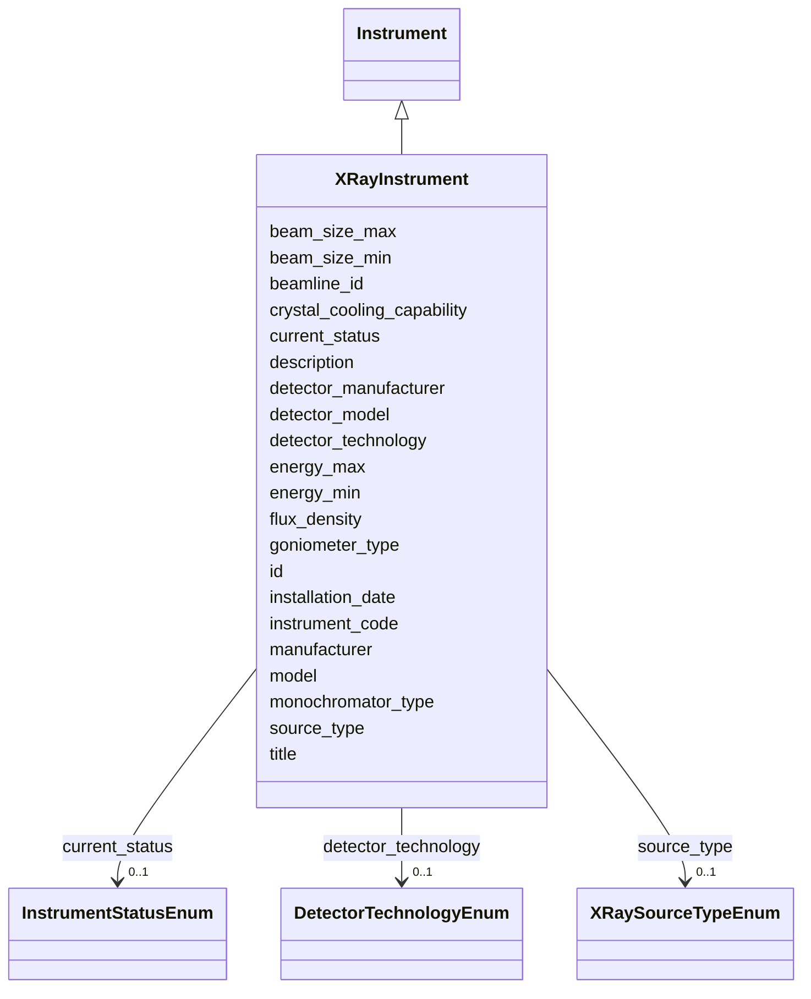

# Class: XRayInstrument 


_X-ray diffractometer or synchrotron beamline specifications_


URI: [lambdaber:XRayInstrument](https://w3id.org/lambda-ber-schema/XRayInstrument)





## Inheritance
* [NamedThing](NamedThing.md)
    * [Instrument](Instrument.md)
        * **XRayInstrument**


## Slots

| Name | Cardinality and Range | Description | Inheritance |
| ---  | --- | --- | --- |
| [source_type](source_type.md) | 0..1 <br/> [XRaySourceTypeEnum](XRaySourceTypeEnum.md) | Type of X-ray source | direct |
| [detector_technology](detector_technology.md) | 0..1 <br/> [DetectorTechnologyEnum](DetectorTechnologyEnum.md) | Generic detector technology type | direct |
| [detector_manufacturer](detector_manufacturer.md) | 0..1 <br/> [String](String.md) | Detector manufacturer (e | direct |
| [detector_model](detector_model.md) | 0..1 <br/> [String](String.md) | Detector model (e | direct |
| [beamline_id](beamline_id.md) | 0..1 <br/> [String](String.md) | Beamline identifier at synchrotron facility | direct |
| [energy_min](energy_min.md) | 0..1 <br/> [Float](Float.md) | Minimum X-ray energy in keV | direct |
| [energy_max](energy_max.md) | 0..1 <br/> [Float](Float.md) | Maximum X-ray energy in keV | direct |
| [beam_size_min](beam_size_min.md) | 0..1 <br/> [Float](Float.md) | Minimum beam size in micrometers | direct |
| [beam_size_max](beam_size_max.md) | 0..1 <br/> [Float](Float.md) | Maximum beam size in micrometers | direct |
| [flux_density](flux_density.md) | 0..1 <br/> [Float](Float.md) | Photon flux density in photons/s/mm² | direct |
| [monochromator_type](monochromator_type.md) | 0..1 <br/> [String](String.md) | Type of monochromator | direct |
| [goniometer_type](goniometer_type.md) | 0..1 <br/> [String](String.md) | Type of goniometer | direct |
| [crystal_cooling_capability](crystal_cooling_capability.md) | 0..1 <br/> [Boolean](Boolean.md) | Crystal cooling system available | direct |
| [instrument_code](instrument_code.md) | 1 <br/> [String](String.md) | Human-friendly facility or laboratory identifier for the instrument (e | [Instrument](Instrument.md) |
| [manufacturer](manufacturer.md) | 0..1 <br/> [String](String.md) | Instrument manufacturer | [Instrument](Instrument.md) |
| [model](model.md) | 0..1 <br/> [String](String.md) | Instrument model | [Instrument](Instrument.md) |
| [installation_date](installation_date.md) | 0..1 <br/> [String](String.md) | Date of instrument installation | [Instrument](Instrument.md) |
| [current_status](current_status.md) | 0..1 <br/> [InstrumentStatusEnum](InstrumentStatusEnum.md) | Current operational status | [Instrument](Instrument.md) |
| [id](id.md) | 1 <br/> [Uriorcurie](Uriorcurie.md) | Globally unique identifier as an IRI or CURIE for machine processing and exte... | [NamedThing](NamedThing.md) |
| [title](title.md) | 0..1 <br/> [String](String.md) |  | [NamedThing](NamedThing.md) |
| [description](description.md) | 0..1 <br/> [String](String.md) |  | [NamedThing](NamedThing.md) |


## Identifier and Mapping Information


### Schema Source


* from schema: https://w3id.org/lambda-ber-schema/


## Mappings

| Mapping Type | Mapped Value |
| ---  | ---  |
| self | lambdaber:XRayInstrument |
| native | lambdaber:XRayInstrument |


## LinkML Source

<!-- TODO: investigate https://stackoverflow.com/questions/37606292/how-to-create-tabbed-code-blocks-in-mkdocs-or-sphinx -->

### Direct

<details>
```yaml
name: XRayInstrument
description: X-ray diffractometer or synchrotron beamline specifications
from_schema: https://w3id.org/lambda-ber-schema/
is_a: Instrument
attributes:
  source_type:
    name: source_type
    description: Type of X-ray source
    from_schema: https://w3id.org/lambda-ber-schema/
    rank: 1000
    domain_of:
    - XRayInstrument
    - XRFImage
    range: XRaySourceTypeEnum
  detector_technology:
    name: detector_technology
    description: Generic detector technology type
    comments:
    - Use this for technology classification (e.g., hybrid_photon_counting, ccd)
    - 'Maps to CBF: Detector (may contain model name)'
    - 'Maps to PDB: _diffrn_detector.type'
    - See detector_manufacturer and detector_model for specific equipment details
    from_schema: https://w3id.org/lambda-ber-schema/
    slot_uri: nsls2:Detector
    domain_of:
    - CryoEMInstrument
    - XRayInstrument
    - XRFImage
    range: DetectorTechnologyEnum
  detector_manufacturer:
    name: detector_manufacturer
    description: Detector manufacturer (e.g., Dectris, Bruker, Rigaku, Rayonix)
    comments:
    - 'Examples: Dectris, Bruker, Rigaku, Rayonix, ADSC, MAR Research'
    from_schema: https://w3id.org/lambda-ber-schema/
    domain_of:
    - CryoEMInstrument
    - XRayInstrument
    range: string
  detector_model:
    name: detector_model
    description: Detector model (e.g., EIGER2 X 16M, PILATUS3 X 6M, PHOTON III)
    comments:
    - 'Examples: EIGER2 X 16M, PILATUS3 X 6M, PHOTON III, HyPix-6000HE'
    from_schema: https://w3id.org/lambda-ber-schema/
    domain_of:
    - CryoEMInstrument
    - XRayInstrument
    - XRFImage
    range: string
  beamline_id:
    name: beamline_id
    description: Beamline identifier at synchrotron facility
    from_schema: https://w3id.org/lambda-ber-schema/
    rank: 1000
    slot_uri: nsls2:Beamline
    domain_of:
    - XRayInstrument
    range: string
  energy_min:
    name: energy_min
    description: Minimum X-ray energy in keV
    from_schema: https://w3id.org/lambda-ber-schema/
    rank: 1000
    domain_of:
    - XRayInstrument
    range: float
  energy_max:
    name: energy_max
    description: Maximum X-ray energy in keV
    from_schema: https://w3id.org/lambda-ber-schema/
    rank: 1000
    domain_of:
    - XRayInstrument
    range: float
  beam_size_min:
    name: beam_size_min
    description: Minimum beam size in micrometers
    from_schema: https://w3id.org/lambda-ber-schema/
    rank: 1000
    domain_of:
    - XRayInstrument
    range: float
  beam_size_max:
    name: beam_size_max
    description: Maximum beam size in micrometers
    from_schema: https://w3id.org/lambda-ber-schema/
    rank: 1000
    domain_of:
    - XRayInstrument
    range: float
  flux_density:
    name: flux_density
    description: Photon flux density in photons/s/mm²
    from_schema: https://w3id.org/lambda-ber-schema/
    rank: 1000
    domain_of:
    - XRayInstrument
    range: float
  monochromator_type:
    name: monochromator_type
    description: Type of monochromator
    from_schema: https://w3id.org/lambda-ber-schema/
    rank: 1000
    domain_of:
    - XRayInstrument
  goniometer_type:
    name: goniometer_type
    description: Type of goniometer
    from_schema: https://w3id.org/lambda-ber-schema/
    rank: 1000
    domain_of:
    - XRayInstrument
  crystal_cooling_capability:
    name: crystal_cooling_capability
    description: Crystal cooling system available
    from_schema: https://w3id.org/lambda-ber-schema/
    rank: 1000
    domain_of:
    - XRayInstrument
    range: boolean

```
</details>

### Induced

<details>
```yaml
name: XRayInstrument
description: X-ray diffractometer or synchrotron beamline specifications
from_schema: https://w3id.org/lambda-ber-schema/
is_a: Instrument
attributes:
  source_type:
    name: source_type
    description: Type of X-ray source
    from_schema: https://w3id.org/lambda-ber-schema/
    rank: 1000
    alias: source_type
    owner: XRayInstrument
    domain_of:
    - XRayInstrument
    - XRFImage
    range: XRaySourceTypeEnum
  detector_technology:
    name: detector_technology
    description: Generic detector technology type
    comments:
    - Use this for technology classification (e.g., hybrid_photon_counting, ccd)
    - 'Maps to CBF: Detector (may contain model name)'
    - 'Maps to PDB: _diffrn_detector.type'
    - See detector_manufacturer and detector_model for specific equipment details
    from_schema: https://w3id.org/lambda-ber-schema/
    slot_uri: nsls2:Detector
    alias: detector_technology
    owner: XRayInstrument
    domain_of:
    - CryoEMInstrument
    - XRayInstrument
    - XRFImage
    range: DetectorTechnologyEnum
  detector_manufacturer:
    name: detector_manufacturer
    description: Detector manufacturer (e.g., Dectris, Bruker, Rigaku, Rayonix)
    comments:
    - 'Examples: Dectris, Bruker, Rigaku, Rayonix, ADSC, MAR Research'
    from_schema: https://w3id.org/lambda-ber-schema/
    alias: detector_manufacturer
    owner: XRayInstrument
    domain_of:
    - CryoEMInstrument
    - XRayInstrument
    range: string
  detector_model:
    name: detector_model
    description: Detector model (e.g., EIGER2 X 16M, PILATUS3 X 6M, PHOTON III)
    comments:
    - 'Examples: EIGER2 X 16M, PILATUS3 X 6M, PHOTON III, HyPix-6000HE'
    from_schema: https://w3id.org/lambda-ber-schema/
    alias: detector_model
    owner: XRayInstrument
    domain_of:
    - CryoEMInstrument
    - XRayInstrument
    - XRFImage
    range: string
  beamline_id:
    name: beamline_id
    description: Beamline identifier at synchrotron facility
    from_schema: https://w3id.org/lambda-ber-schema/
    rank: 1000
    slot_uri: nsls2:Beamline
    alias: beamline_id
    owner: XRayInstrument
    domain_of:
    - XRayInstrument
    range: string
  energy_min:
    name: energy_min
    description: Minimum X-ray energy in keV
    from_schema: https://w3id.org/lambda-ber-schema/
    rank: 1000
    alias: energy_min
    owner: XRayInstrument
    domain_of:
    - XRayInstrument
    range: float
  energy_max:
    name: energy_max
    description: Maximum X-ray energy in keV
    from_schema: https://w3id.org/lambda-ber-schema/
    rank: 1000
    alias: energy_max
    owner: XRayInstrument
    domain_of:
    - XRayInstrument
    range: float
  beam_size_min:
    name: beam_size_min
    description: Minimum beam size in micrometers
    from_schema: https://w3id.org/lambda-ber-schema/
    rank: 1000
    alias: beam_size_min
    owner: XRayInstrument
    domain_of:
    - XRayInstrument
    range: float
  beam_size_max:
    name: beam_size_max
    description: Maximum beam size in micrometers
    from_schema: https://w3id.org/lambda-ber-schema/
    rank: 1000
    alias: beam_size_max
    owner: XRayInstrument
    domain_of:
    - XRayInstrument
    range: float
  flux_density:
    name: flux_density
    description: Photon flux density in photons/s/mm²
    from_schema: https://w3id.org/lambda-ber-schema/
    rank: 1000
    alias: flux_density
    owner: XRayInstrument
    domain_of:
    - XRayInstrument
    range: float
  monochromator_type:
    name: monochromator_type
    description: Type of monochromator
    from_schema: https://w3id.org/lambda-ber-schema/
    rank: 1000
    alias: monochromator_type
    owner: XRayInstrument
    domain_of:
    - XRayInstrument
    range: string
  goniometer_type:
    name: goniometer_type
    description: Type of goniometer
    from_schema: https://w3id.org/lambda-ber-schema/
    rank: 1000
    alias: goniometer_type
    owner: XRayInstrument
    domain_of:
    - XRayInstrument
    range: string
  crystal_cooling_capability:
    name: crystal_cooling_capability
    description: Crystal cooling system available
    from_schema: https://w3id.org/lambda-ber-schema/
    rank: 1000
    alias: crystal_cooling_capability
    owner: XRayInstrument
    domain_of:
    - XRayInstrument
    range: boolean
  instrument_code:
    name: instrument_code
    description: Human-friendly facility or laboratory identifier for the instrument
      (e.g., 'TITAN-KRIOS-1', 'ALS-12.3.1-SIBYLS', 'RIGAKU-FR-E'). Used for local
      reference and equipment tracking.
    from_schema: https://w3id.org/lambda-ber-schema/
    rank: 1000
    alias: instrument_code
    owner: XRayInstrument
    domain_of:
    - Instrument
    range: string
    required: true
  manufacturer:
    name: manufacturer
    description: Instrument manufacturer
    from_schema: https://w3id.org/lambda-ber-schema/
    rank: 1000
    alias: manufacturer
    owner: XRayInstrument
    domain_of:
    - Instrument
    range: string
  model:
    name: model
    description: Instrument model
    from_schema: https://w3id.org/lambda-ber-schema/
    rank: 1000
    alias: model
    owner: XRayInstrument
    domain_of:
    - Instrument
    range: string
  installation_date:
    name: installation_date
    description: Date of instrument installation
    from_schema: https://w3id.org/lambda-ber-schema/
    rank: 1000
    alias: installation_date
    owner: XRayInstrument
    domain_of:
    - Instrument
    range: string
  current_status:
    name: current_status
    description: Current operational status
    from_schema: https://w3id.org/lambda-ber-schema/
    rank: 1000
    alias: current_status
    owner: XRayInstrument
    domain_of:
    - Instrument
    range: InstrumentStatusEnum
  id:
    name: id
    description: Globally unique identifier as an IRI or CURIE for machine processing
      and external references. Used for linking data across systems and semantic web
      integration.
    from_schema: https://w3id.org/lambda-ber-schema/
    rank: 1000
    identifier: true
    alias: id
    owner: XRayInstrument
    domain_of:
    - NamedThing
    range: uriorcurie
    required: true
  title:
    name: title
    from_schema: https://w3id.org/lambda-ber-schema/
    rank: 1000
    slot_uri: dcterms:title
    alias: title
    owner: XRayInstrument
    domain_of:
    - NamedThing
    range: string
  description:
    name: description
    from_schema: https://w3id.org/lambda-ber-schema/
    rank: 1000
    alias: description
    owner: XRayInstrument
    domain_of:
    - NamedThing
    - AttributeGroup
    range: string

```
</details>